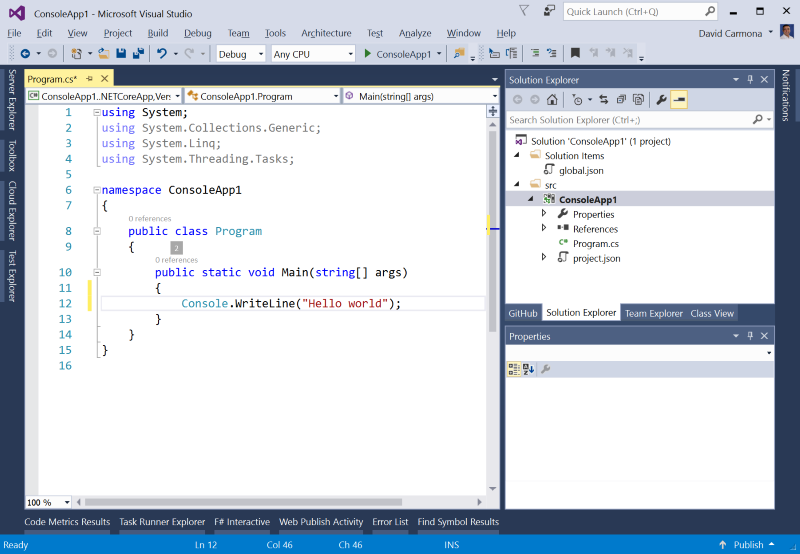

# Install for Docker - Visual Studio 2017 RC
## 1. Download Visual Studio 2017 RC
- .NET Core tools for Visual Studio are included in Visual Studio 2017 RC, which can be downloaded for free.

## [Download Visual Studio 2017 RC](https://www.visualstudio.com/vs/visual-studio-2017-rc/)

## 2. Install the .NET Core tools preview workload
- Make sure you installed the workload ".NET Core and Docker (Preview)". You can check and install workloads by launching the Visual Studio Setup Manager.

  

## 3. Create a new .NET Core project
- Click on File / New project and select the project template C# / .NET Core / .NET Core Console application.

  

## 4. Add some code
- Write some code in your Main method.

  

## 5. Run your application
- Click on the menu item Debug / Start debugging to launch and debug your new .NET Core application from Visual Studio.

  

## And you're ready!
- You now have .NET core running on your machine!
