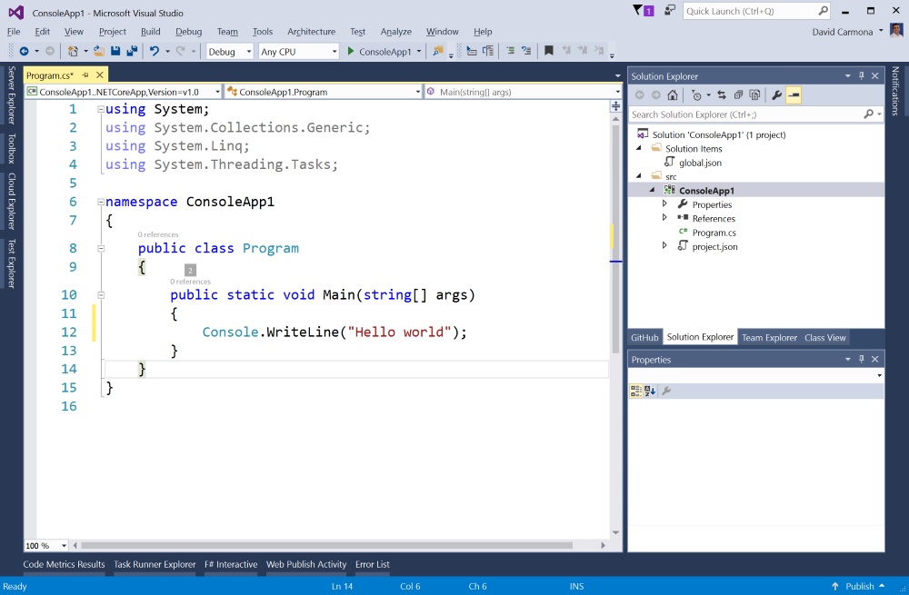

# Install for Windows - Visual Studio 2015
## 1. Download Visual Studio 2015
- Make sure you have Visual Studio 2015 Update 3 installed.
  ## [Download Visual Studio 2015 with Update 3](https://go.microsoft.com/fwlink/?LinkId=691978)
- Or just download [Visual Studio 2015 Update 3](https://go.microsoft.com/fwlink/?LinkId=691129) if you already have Visual Studio 2015 installed.

[!TIP] [Video: Installing .NET Core and Visual Studio 2015 Update 3 in Windows](https://sec.ch9.ms/ch9/3737/765bacd2-f9d6-4582-81da-d177574d3737/VSCoreTutorial_high.mp4)

## 2. Install the .NET Core tools preview for Visual Studio
- .NET Core tools add support for .NET Core projects in Visual Studio 2015.
  ## [Download .NET Core 1.0.1 tools Preview 2](https://go.microsoft.com/fwlink/?LinkID=827546)
## 3. Create a new .NET Core project
- Click on File / New project and select the project template C# / .NET Core / Console application (.NET Core).

  

## 4. Add some code
- Write some code in your Main method.

  

## 5. Run your application
- Click on the menu item Debug / Start debugging to launch and debug your new .NET Core application from Visual Studio.

  

## And you're ready!
You now have .NET core running on your machine!