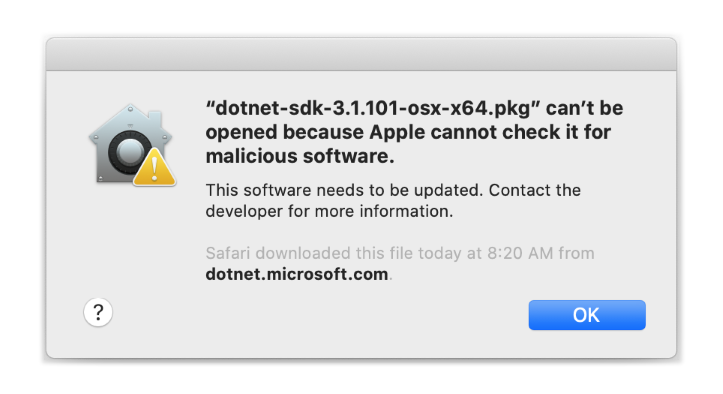

# Install .NET on macOS

> [!div class="op_single_selector"]
>
> - [Install on Windows](windows.md)
> - [Install on macOS](macos.md)
> - [Install on Linux](linux.md)

In this article, you'll learn how to install .NET on macOS. .NET is made up of the runtime and the SDK. The runtime is used to run a .NET app and may or may not be included with the app. The SDK is used to create .NET apps and libraries. The .NET runtime is always installed with the SDK.

The latest version of .NET is 6.0.

> [!div class="button"]
> [Download .NET Core](https://dotnet.microsoft.com/download/dotnet)

## Supported releases

The following table is a list of currently supported .NET releases and the versions of macOS they're supported on. These versions remain supported until the version of .NET reaches [end-of-support](https://dotnet.microsoft.com/platform/support/policy/dotnet-core).

- A ✔️ indicates that the version of .NET is still supported.
- A ❌ indicates that the version of .NET isn't supported.

| Operating System          | .NET Core 3.1 | .NET 5         | .NET 6         |
|---------------------------|---------------|----------------|----------------|
| macOS 12.0 "Monterey"     | ✔️ 3.1        | ✔️ 5.0         | ✔️ 6.0         |
| macOS 11.0 "Big Sur"      | ✔️ 3.1        | ✔️ 5.0         | ✔️ 6.0         |
| macOS 10.15 "Catalina"    | ✔️ 3.1        | ✔️ 5.0         | ✔️ 6.0         |

For more information about the life cycle of .NET releases, see [.NET and .NET Core Support Policy](https://dotnet.microsoft.com/platform/support/policy/dotnet-core).

## Unsupported releases

[!INCLUDE [versions-not-supported](includes/versions-not-supported.md)]

## Runtime information

The runtime is used to run apps created with .NET. When an app author publishes an app, they can include the runtime with their app. If they don't include the runtime, it's up to the user to install the runtime.

There are two different runtimes you can install on macOS:

- *ASP.NET Core runtime*\
  Runs ASP.NET Core apps. Includes the .NET runtime.

- *.NET runtime*\
  This runtime is the simplest runtime and doesn't include any other runtime. It's highly recommended that you install *ASP.NET Core runtime* for the best compatibility with .NET apps.

> [!div class="button"]
> [Download .NET Runtime](https://dotnet.microsoft.com/download/dotnet)

## SDK information

The SDK is used to build and publish .NET apps and libraries. Installing the SDK includes both [runtimes](#runtime-information): ASP.NET Core and .NET.

## Notarization

Beginning with macOS Catalina (version 10.15), all software built after June 1, 2019 that is distributed with Developer ID, must be notarized. This requirement applies to the .NET runtime, .NET SDK, and software created with .NET.

The runtime and SDK installers for .NET have been notarized since February 18, 2020. Prior released versions aren't notarized. If you run a non-notarized app, you'll see an error similar to the following image:



For more information about how enforced-notarization affects .NET (and your .NET apps), see [Working with macOS Catalina Notarization](macos-notarization-issues.md).

## libgdiplus

.NET applications that use the *System.Drawing.Common* assembly require libgdiplus to be installed.

An easy way to obtain libgdiplus is by using the [Homebrew ("brew")](https://brew.sh/) package manager for macOS. After installing *brew*, install libgdiplus by executing the following commands at a Terminal (command) prompt:

```console
brew update
brew install mono-libgdiplus
```

## Install with an installer

macOS has standalone installers that can be used to install the .NET 6 SDK:

- [x64 and Arm64 CPUs](https://dotnet.microsoft.com/download/dotnet/6.0)

## Download and manually install

<!-- Note, this content is taken from linux-scripted-manual.md but changed for macOS. Any fixes should be applied there too, though content may be different -->

As an alternative to the macOS installers for .NET, you can download and manually install the SDK and runtime. Manual installation is usually performed as part of continuous integration testing. For a developer or user, it's generally better to use an [installer](https://dotnet.microsoft.com/download/dotnet).

First, download a **binary** release for either the SDK or the runtime from one of the following sites. If you install the .NET SDK, you will not need to install the corresponding runtime:

- ✔️ [.NET 6 downloads](https://dotnet.microsoft.com/download/dotnet/6.0)
- ✔️ [.NET 5 downloads](https://dotnet.microsoft.com/download/dotnet/5.0)
- ✔️ [.NET Core 3.1 downloads](https://dotnet.microsoft.com/download/dotnet/3.1)
- [All .NET downloads](https://dotnet.microsoft.com/download/dotnet)

Next, extract the downloaded file and use the `export` command to set `DOTNET_ROOT` to the extracted folder's location and then ensure .NET is in PATH. This should make the .NET CLI commands available at the terminal.

Alternatively, after downloading the .NET binary, the following commands may be run from the directory where the file is saved to extract the runtime. This will also make the .NET CLI commands available at the terminal and set the required environment variables. **Remember to change the `DOTNET_FILE` value to the name of the downloaded binary**:

```bash
DOTNET_FILE=dotnet-sdk-6.0.100-osx-x64.tar.gz
export DOTNET_ROOT=$(pwd)/dotnet

mkdir -p "$DOTNET_ROOT" && tar zxf "$DOTNET_FILE" -C "$DOTNET_ROOT"

export PATH=$PATH:$DOTNET_ROOT
```

> [!TIP]
> The preceding `export` commands only make the .NET CLI commands available for the terminal session in which it was run.
>
> You can edit your shell profile to permanently add the commands. There are a number of different shells available for Linux and each has a different profile. For example:
>
> - **Bash Shell**: *~/.bash_profile*, *~/.bashrc*
> - **Korn Shell**: *~/.kshrc* or *.profile*
> - **Z Shell**: *~/.zshrc* or *.zprofile*
>
> Edit the appropriate source file for your shell and add `:$HOME/dotnet` to the end of the existing `PATH` statement. If no `PATH` statement is included, add a new line with `export PATH=$PATH:$HOME/dotnet`.
>
> Also, add `export DOTNET_ROOT=$HOME/dotnet` to the end of the file.

This approach lets you install different versions into separate locations and choose explicitly which one to use by which application.

## Arm-based Macs

The following sections describe things you should consider when installing .NET on an Arm-based Mac.

<!-- This section is mirrored in the windows.md file. Changes here should be applied there -->

### What's supported

The following table describes which versions of .NET are supported on an Arm-based Mac:

| .NET Version | Architecture | SDK | Runtime | [Path conflict](#path-conflicts) |
|--------------|--------------|-----|---------|----------------------------------|
| 6.0          | Arm64        | Yes | Yes     | No                               |
| 6.0          | x64          | Yes | Yes     | No                               |
| 5.0          | Arm64        | No  | No      | N/A                              |
| 5.0          | x64          | No  | Yes     | [Yes](#path-conflicts)           |
| 3.1          | Arm64        | No  | No      | N/A                              |
| 3.1          | x64          | No  | Yes     | [Yes](#path-conflicts)           |

The x64 and Arm64 versions of the .NET 6 SDK exist independently from each other. If a new version is released, each install needs to be upgraded.

### Path differences

On an Arm-based Mac, all Arm64 versions of .NET are installed to the normal _/usr/local/share/dotnet/_ folder. However, when you install the **x64** version of .NET 6 SDK, it's installed to the _/usr/local/share/dotnet/x64/dotnet/_ folder.

### Path conflicts

The **x64** .NET 6 SDK installs to its own directory, as described in the previous section. This allows the Arm64 and x64 versions of the .NET 6 SDK to exist on the same machine. However, any **x64** SDK prior to 6.0 isn't supported and installs to the same location as the Arm64 version, the _/usr/local/share/dotnet/_ folder. If you want to install an unsupported x64 SDK, you'll need to first uninstall the Arm64 version. The opposite is also true, you'll need to uninstall the unsupported x64 SDK to install the Arm64 version.

### Path variables

Environment variables that add .NET to system path, such as the `PATH` variable, may need to be changed if you have both the x64 and Arm64 versions of the .NET 6 SDK installed. Additionally, some tools rely on the `DOTNET_ROOT` environment variable, which would also need to be updated to point to the appropriate .NET 6 SDK installation folder.

## Install with Visual Studio for Mac

Visual Studio for Mac installs the .NET SDK when the **.NET** workload is selected. To get started with .NET development on macOS, see [Install Visual Studio 2019 for Mac](/visualstudio/mac/installation).

| .NET SDK version      | Visual Studio version                                |
| --------------------- | ---------------------------------------------------- |
| 6.0                   | Visual Studio 2022 for Mac Preview 3 17.0 or higher. |
| 5.0                   | Visual Studio 2019 for Mac version 8.8 or higher.    |
| 3.1                   | Visual Studio 2019 for Mac version 8.4 or higher.    |

:::image type="content" source="media/install-sdk/mac-install-selection.png" alt-text="macOS Visual Studio 2019 for Mac with the .NET workload selected." lightbox="media/install-sdk/mac-install-selection.png":::

## Install alongside Visual Studio Code

Visual Studio Code is a powerful and lightweight source code editor that runs on your desktop. Visual Studio Code is available for Windows, macOS, and Linux.

While Visual Studio Code doesn't come with an automated .NET installer like Visual Studio does, adding .NET support is simple.

01. [Download and install Visual Studio Code](https://code.visualstudio.com/Download).
01. [Download and install the .NET SDK](https://dotnet.microsoft.com/download/dotnet).
01. [Install the C# extension from the Visual Studio Code marketplace](https://marketplace.visualstudio.com/items?itemName=ms-dotnettools.csharp).

## Install with bash automation

The [dotnet-install scripts](../tools/dotnet-install-script.md) are used for automation and non-admin installs of the runtime. You can download the script from the [dotnet-install script reference page](../tools/dotnet-install-script.md).

The script defaults to installing the latest [long term support (LTS)](https://dotnet.microsoft.com/platform/support/policy/dotnet-core) version, which is .NET 6.0. You can choose a specific release by specifying the `current` switch. Include the `runtime` switch to install a runtime. Otherwise, the script installs the [SDK](./windows.md).

```bash
./dotnet-install.sh --channel 6.0 --runtime aspnetcore
```

> [!NOTE]
> The previous command installs the ASP.NET Core runtime for maximum compatability. The ASP.NET Core runtime also includes the standard .NET runtime.

## Docker

Containers provide a lightweight way to isolate your application from the rest of the host system. Containers on the same machine share just the kernel and use resources given to your application.

.NET can run in a Docker container. Official .NET Docker images are published to the Microsoft Container Registry (MCR) and are discoverable at the [Microsoft .NET Docker Hub repository](https://hub.docker.com/_/microsoft-dotnet/). Each repository contains images for different combinations of the .NET (SDK or Runtime) and OS that you can use.

Microsoft provides images that are tailored for specific scenarios. For example, the [ASP.NET Core repository](https://hub.docker.com/_/microsoft-dotnet-aspnet) provides images that are built for running ASP.NET Core apps in production.

For more information about using .NET in a Docker container, see [Introduction to .NET and Docker](../docker/introduction.md) and [Samples](https://github.com/dotnet/dotnet-docker/blob/main/samples/README.md).

## Next steps

- [How to check if .NET is already installed](how-to-detect-installed-versions.md?pivots=os-macos).
- [Working with macOS Catalina notarization](macos-notarization-issues.md).
- [Tutorial: Get started on macOS](../tutorials/with-visual-studio-mac.md).
- [Tutorial: Create a new app with Visual Studio Code](../tutorials/with-visual-studio-code.md).
- [Tutorial: Containerize a .NET app](../docker/build-container.md).

[release-notes-60]: https://github.com/dotnet/core/blob/main/release-notes/6.0/6.0-supported-os.md
[release-notes-50]: https://github.com/dotnet/core/blob/main/release-notes/5.0/5.0-supported-os.md
[release-notes-31]: https://github.com/dotnet/core/blob/main/release-notes/3.1/3.1-supported-os.md
[release-notes-30]: https://github.com/dotnet/core/blob/main/release-notes/3.0/3.0-supported-os.md
[release-notes-21]: https://github.com/dotnet/core/blob/main/release-notes/2.1/2.1-supported-os.md
[release-notes-22]: https://github.com/dotnet/core/blob/main/release-notes/2.2/2.2-supported-os.md
[release-notes-20]: https://github.com/dotnet/core/blob/main/release-notes/2.0/2.0-supported-os.md
