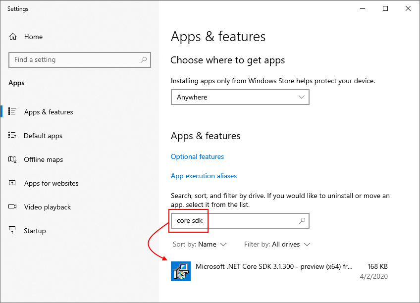

# How to remove the .NET Runtime and SDK

Over time, as you install updated versions of the .NET runtime and SDK, you may want to remove outdated versions of .NET from your machine. Removing older versions of the runtime may change the runtime chosen to run shared framework applications, as detailed in the article on [.NET version selection](../versions/selection.md).

## Should I remove a version?

The [.NET version selection](../versions/selection.md) behaviors and the runtime compatibility of .NET across updates enables safe removal of previous versions. .NET runtime updates are compatible within a major version **band** such as 6.x and 5.x. Additionally, newer releases of the .NET SDK generally maintain the ability to build applications that target previous versions of the runtime in a compatible manner.

In general, you only need the latest SDK and latest patch version of the runtimes required for your application. Instances where you might want to keep older SDK or runtime versions include maintaining *project.json*-based applications. Unless your application has specific reasons for earlier SDKs or runtimes, you may safely remove older versions.

## Determine what is installed

The .NET CLI has options you can use to list the versions of the SDK and runtime that are installed on your computer. Use [`dotnet --list-sdks`](../tools/dotnet.md#options) to see the list of installed SDKs and [`dotnet --list-runtimes`](../tools/dotnet.md#options) for the list of runtimes. For more information, see [How to check that .NET is already installed](how-to-detect-installed-versions.md).

## Uninstall .NET

::: zone pivot="os-windows"

.NET uses the Windows **Apps & features** dialog to remove versions of the .NET runtime and SDK. The following figure shows the **Apps & features** dialog. You can search for **core** or **.net** to filter and show installed versions of .NET.



Select any versions you want to remove from your computer and click **Uninstall**.

::: zone-end

::: zone pivot="os-linux"

The best way for you to uninstall .NET is to mirror the action you used to install .NET. The specifics depend on your chosen Linux distribution and the installation method.

> [!IMPORTANT]
> For Red Hat installations, consult the [Red Hat Product Documentation for .NET](https://access.redhat.com/documentation/en-us/net/5.0/).

There's no need to first uninstall the .NET SDK when upgrading it using a package manager, unless you're upgrading from a preview version that was manually installed. The package manager `update` or `refresh` commands will automatically remove the older version upon the successful installation of a newer version. If you have a preview version installed, uninstall it.

If you installed .NET using a package manager, use that same package manager to uninstall the .NET SDK or runtime. .NET installations support most popular package managers. Consult the documentation for your distribution's package manager for the precise syntax in your environment:

- [apt-get(8)](https://linux.die.net/man/8/apt-get) is used by Debian based systems, including Ubuntu.
- [yum(8)](https://linux.die.net/man/8/yum) is used on Fedora, CentOS, and Oracle Linux.
- [zypper(8)](https://en.opensuse.org/SDB:Zypper_manual_(plain)) is used on openSUSE and SUSE Linux Enterprise System (SLES).
- [dnf(8)](https://dnf.readthedocs.io/en/latest/command_ref.html) is used on Fedora.

In almost all cases, the command to remove a package is `remove`.

The package name for the .NET SDK installation for most package managers is `dotnet-sdk`, followed by the version number. Starting with the version 2.1.300 of the .NET SDK and version `2.1` of the runtime, only the major and minor version numbers are necessary: for example, the .NET SDK version 2.1.300 can be referenced as the package `dotnet-sdk-2.1`. Prior versions require the entire version string: for example, `dotnet-sdk-2.1.200` would be required for version 2.1.200 of the .NET SDK.

For machines that have installed only the runtime, and not the SDK, the package name is `dotnet-runtime-<version>` for the .NET runtime, and `aspnetcore-runtime-<version>` for the entire runtime stack.

> [!TIP]
> .NET Core installations earlier than 2.0 didn't uninstall the host application when the SDK was uninstalled using the package manager. Using `apt-get`, the command is:
>
> ```bash
> apt-get remove dotnet-host
> ```
>
> There's no version attached to `dotnet-host`.

If you installed using a tarball, you must remove .NET using the manual method.

On Linux, you must remove the SDKs and runtimes separately, by removing the versioned directories. These directories may vary depending on your Linux distribution. Removing them deletes the SDK and runtime from disk. For example, to remove the 1.0.1 SDK and runtime, you would use the following bash commands:

```bash
version="1.0.1"
sudo rm -rf /usr/share/dotnet/sdk/$version
sudo rm -rf /usr/share/dotnet/shared/Microsoft.NETCore.App/$version
sudo rm -rf /usr/share/dotnet/shared/Microsoft.AspNetCore.All/$version
sudo rm -rf /usr/share/dotnet/shared/Microsoft.AspNetCore.App/$version
sudo rm -rf /usr/share/dotnet/host/fxr/$version
```

> [!IMPORTANT]
> The version folders may not match the "version" you're uninstalling. The individual runtimes and SDKs that are installed with a single .NET release may have different versions. For example, you may have installed ASP.NET Core 5 Runtime, which installed the 5.0.2 ASP.NET Core runtime and the 5.0.8 .NET runtime. Each has a different versioned folder. For more information, see [Overview of how .NET is versioned](../versions/index.md).

The parent directories for the SDK and runtime are listed in the output from the `dotnet --list-sdks` and `dotnet --list-runtimes` command, as shown in the earlier table.

::: zone-end

::: zone pivot="os-macos"

On Mac, you must remove the SDKs and runtimes separately, by removing the versioned directories. Removing them deletes the SDK and runtime from disk. For example, to remove the 1.0.1 SDK and runtime, you would use the following bash commands:

```bash
version="1.0.1"
sudo rm -rf /usr/local/share/dotnet/sdk/$version
sudo rm -rf /usr/local/share/dotnet/shared/Microsoft.NETCore.App/$version
sudo rm -rf /usr/local/share/dotnet/shared/Microsoft.AspNetCore.All/$version
sudo rm -rf /usr/local/share/dotnet/shared/Microsoft.AspNetCore.App/$version
sudo rm -rf /usr/local/share/dotnet/host/fxr/$version
```

> [!IMPORTANT]
> The version folders may not match the "version" you're uninstalling. The individual runtimes and SDKs that are installed with .NET may have different versions. For example, you may have installed .NET 5 Runtime, which installed the 5.0.2 ASP.NET Core runtime and the 5.0.8 .NET runtime. For more information, see [Overview of how .NET is versioned](../versions/index.md).

> [!IMPORTANT]
> If you're using an Arm-based Mac, such as one with an M1 chip, review the folder paths described in [Install .NET on Arm-based Macs](macos.md#arm-based-macs).

The parent directories for the SDK and runtime are listed in the output from the `dotnet --list-sdks` and `dotnet --list-runtimes` command, as shown in the earlier table.

::: zone-end

## .NET Uninstall Tool

The [.NET Uninstall Tool](../additional-tools/uninstall-tool.md) (`dotnet-core-uninstall`) lets you remove .NET SDKs and runtimes from a system. A collection of options is available to specify which versions should be uninstalled.

::: zone pivot="os-windows"

## Visual Studio dependency on .NET SDK versions

Before Visual Studio 2019 version 16.3, Visual Studio installers called the standalone SDK installer for .NET Core version 2.1 or 2.2. As a result, the SDK versions appear in the Windows **Apps & features** dialog. Removing .NET SDKs that were installed by Visual Studio using the standalone installer may break Visual Studio. If Visual Studio has problems after you uninstall SDKs, run Repair on that specific version of Visual Studio. The following table shows some of the Visual Studio dependencies on .NET Core SDK versions:

| Visual Studio version           | .NET Core SDK version          |
|---------------------------------|--------------------------------|
| Visual Studio 2019 version 16.2 | .NET Core SDK 2.2.4xx, 2.1.8xx |
| Visual Studio 2019 version 16.1 | .NET Core SDK 2.2.3xx, 2.1.7xx |
| Visual Studio 2019 version 16.0 | .NET Core SDK 2.2.2xx, 2.1.6xx |
| Visual Studio 2017 version 15.9 | .NET Core SDK 2.2.1xx, 2.1.5xx |
| Visual Studio 2017 version 15.8 | .NET Core SDK 2.1.4xx          |

Starting with Visual Studio 2019 version 16.3, Visual Studio is in charge of its own copy of the .NET SDK. For that reason, you no longer see those SDK versions in the **Apps & features** dialog.

::: zone-end

## Remove the NuGet fallback folder

Before .NET Core 3.0 SDK, the .NET Core SDK installers used a folder named *NuGetFallbackFolder* to store a cache of NuGet packages. This cache was used during operations such as `dotnet restore` or `dotnet build /t:Restore`. The *NuGetFallbackFolder* is located at *C:\Program Files\dotnet\sdk* on Windows and at */usr/local/share/dotnet/sdk* on macOS.

You may want to remove this folder, if:

- You're only developing using .NET Core 3.0 SDK or .NET 5 or later versions.
- You're developing using .NET Core SDK versions earlier than 3.0, but you can work online.

If you want to remove the NuGet fallback folder, you can delete it, but you'll need administrative privileges to do so.

It's not recommended to delete the *dotnet* folder. Doing so would remove any global tools you've previously installed. Also, on Windows:

- You'll break Visual Studio 2019 version 16.3 and later versions. You can run **Repair** to recover.
- If there are .NET Core SDK entries in the **Apps & features** dialog, they'll be orphaned.
