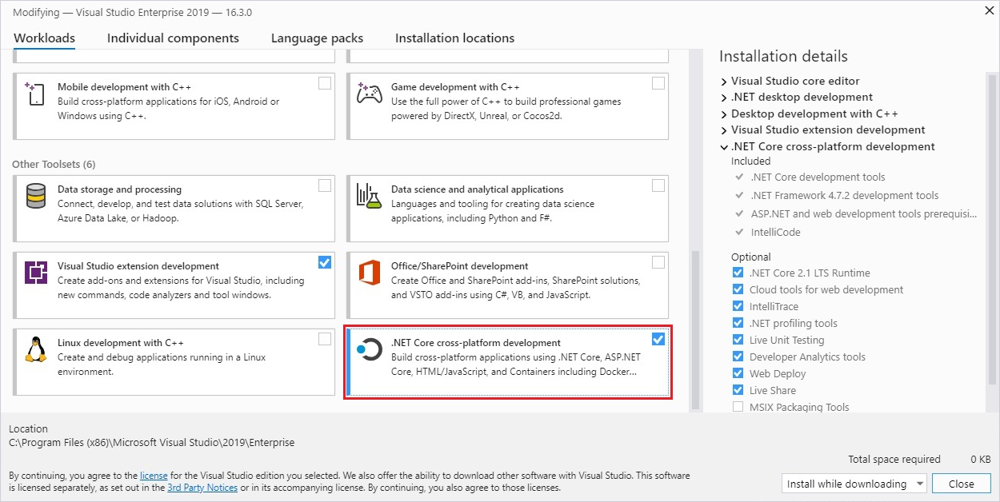

# Install .NET on Windows

> [!div class="op_single_selector"]
>
> - [Install on Windows](windows.md)
> - [Install on macOS](macos.md)
> - [Install on Linux](linux.md)

In this article, you'll learn how to install .NET on Windows. .NET is made up of the runtime and the SDK. The runtime is used to run a .NET app and may or may not be included with the app. The SDK is used to create .NET apps and libraries. The .NET runtime is always installed with the SDK.

The latest version of .NET is 6.

> [!div class="button"]
> [Download .NET](https://dotnet.microsoft.com/download/dotnet)

## Supported releases

The following table is a list of currently supported .NET releases and the versions of Windows they're supported on. These versions remain supported until either the version of [.NET reaches end-of-support](https://dotnet.microsoft.com/platform/support/policy/dotnet-core) or the version of [Windows reaches end-of-life](https://support.microsoft.com/help/13853/windows-lifecycle-fact-sheet).

Windows 10 versions end-of-service dates are segmented by edition. Only **Home**, **Pro**, **Pro Education**, and **Pro for Workstations** editions are considered in the following table. Check the [Windows lifecycle fact sheet](https://support.microsoft.com/help/13853/windows-lifecycle-fact-sheet) for specific details.

> [!TIP]
> A `+` symbol represents the minimum version.

| Operating System                             | .NET Core 3.1 | .NET 5 | .NET 6 |
|----------------------------------------------|---------------|--------|--------|
| Windows 11                                   | ✔️            | ✔️    | ✔️    |
| Windows Server 2022                          | ✔️            | ✔️    | ✔️    |
| Windows 10 Version 21H1                      | ✔️            | ✔️    | ✔️    |
| Windows 10 / Windows Server, Version 20H2    | ✔️            | ✔️    | ✔️    |
| Windows 10 / Windows Server, Version 2004    | ✔️            | ✔️    | ✔️    |
| Windows 10 / Windows Server, Version 1909    | ✔️            | ✔️    | ✔️    |
| Windows 10 / Windows Server, Version 1903    | ✔️            | ✔️    | ✔️    |
| Windows 10, Version 1809                     | ✔️            | ✔️    | ✔️    |
| Windows 10, Version 1803                     | ✔️            | ✔️    | ✔️    |
| Windows 10, Version 1709                     | ✔️            | ✔️    | ✔️    |
| Windows 10, Version 1607                     | ✔️            | ✔️    | ✔️    |
| Windows 8.1                                  | ✔️            | ✔️    | ✔️    |
| Windows 7 SP1 [ESU][esu]                     | ✔️            | ✔️    | ✔️    |
| Windows Server 2019<br>Windows Server 2016<br>Windows Server 2012 R2<br>Windows Server 2012| ✔️            | ✔️    | ✔️    |
| Windows Server Core 2012 R2                  | ✔️            | ✔️    | ✔️    |
| Windows Server Core 2012                     | ✔️            | ✔️    | ✔️    |
| Nano Server, Version 1809+                   | ✔️            | ✔️    | ✔️    |
| Nano Server, Version 1803                    | ✔️            | ❌    | ❌    |

For more information about .NET 6 supported operating systems, distributions, and lifecycle policy, see [.NET 6 Supported OS Versions](https://github.com/dotnet/core/blob/main/release-notes/6.0/supported-os.md).

## Unsupported releases

[!INCLUDE [versions-not-supported](includes/versions-not-supported.md)]

## Runtime information

The runtime is used to run apps created with .NET. When an app author publishes an app, they can include the runtime with their app. If they don't include the runtime, it's up to the user to install the runtime.

There are three different runtimes you can install on Windows:

- *ASP.NET Core runtime*\
  Runs ASP.NET Core apps. Includes the .NET runtime.

- *Desktop runtime*\
  Runs .NET WPF and Windows Forms desktop apps for Windows. Includes the .NET runtime.

- *.NET runtime*\
  This runtime is the simplest runtime and doesn't include any other runtime. It's highly recommended that you install both *ASP.NET Core runtime* and *Desktop runtime* for the best compatibility with .NET apps.

> [!div class="button"]
> [Download .NET Runtime](https://dotnet.microsoft.com/download/dotnet)

## SDK information

The SDK is used to build and publish .NET apps and libraries. Installing the SDK includes all three [runtimes](#runtime-information): ASP.NET Core, Desktop, and .NET.

> [!div class="button"]
> [Download .NET SDK](https://dotnet.microsoft.com/download/dotnet)

## Arm-based Windows PCs

The following sections describe things you should consider when installing .NET on an Arm-based Windows PC.

<!-- This section is mirrored in the macos.md file. Changes here should be applied there -->

### What's supported

The following table describes which versions of .NET are supported on an Arm-based Windows PC:

| .NET Version | Architecture | SDK | Runtime | [Path conflict](#path-conflicts) |
|--------------|--------------|-----|---------|----------------------------------|
| 6.0          | Arm64        | Yes | Yes     | No                               |
| 6.0          | x64          | Yes | Yes     | No                               |
| 5.0          | Arm64        | Yes | Yes     | [Yes](#path-conflicts)           |
| 5.0          | x64          | No  | Yes     | [Yes](#path-conflicts)           |
| 3.1          | Arm64        | No  | No      | N/A                              |
| 3.1          | x64          | No  | Yes     | [Yes](#path-conflicts)           |

The x64 and Arm64 versions of the .NET 6 SDK exist independently from each other. If a new version is released, each install needs to be upgraded.

### Path differences

On an Arm-based Windows PC, all Arm64 versions of .NET are installed to the normal _C:\\Program Files\\dotnet\\_ folder. However, when you install the **x64** version of .NET 6 SDK, it's installed to the _C:\\Program Files\\dotnet\\x64\\_ folder.

### Path conflicts

The **x64** .NET 6 SDK installs to its own directory, as described in the previous section. This allows the Arm64 and x64 versions of the .NET 6 SDK to exist on the same machine. However, any **x64** SDK prior to 6.0 isn't supported and installs to the same location as the Arm64 version, the _C:\\Program Files\\dotnet\\_ folder. If you want to install an unsupported x64 SDK, you'll need to first uninstall the Arm64 version. The opposite is also true, you'll need to uninstall the unsupported x64 SDK to install the Arm64 version.

### Path variables

Environment variables that add .NET to system path, such as the `PATH` variable, may need to be changed if you have both the x64 and Arm64 versions of the .NET 6 SDK installed. Additionally, some tools rely on the `DOTNET_ROOT` environment variable, which would also need to be updated to point to the appropriate .NET 6 SDK installation folder.

## Dependencies

<!-- markdownlint-disable MD025 -->
<!-- markdownlint-disable MD024 -->

# [.NET 6](#tab/net60)

The following Windows versions are supported with .NET 6:

> [!NOTE]
> A `+` symbol represents the minimum version.

| OS                  | Version       | Architectures   |
|---------------------|---------------|-----------------|
| Windows 11          | 21H2          | x64, Arm64      |
| Windows 10 Client   | 1607+         | x64, x86, Arm64 |
| Windows Client      | 7 SP1+, 8.1   | x64, x86        |
| Windows Server      | 2012+         | x64, x86        |
| Windows Server Core | 2012+         | x64, x86        |
| Nano Server         | 1809+         | x64             |

For more information about .NET 6 supported operating systems, distributions, and lifecycle policy, see [.NET 6 Supported OS Versions](https://github.com/dotnet/core/blob/main/release-notes/6.0/6.0-supported-os.md).

# [.NET 5](#tab/net50)

The following Windows versions are supported with .NET 5:

> [!NOTE]
> A `+` symbol represents the minimum version.

| OS                  | Version       | Architectures   |
|---------------------|---------------|-----------------|
| Windows 11          | 21H2          | x64, Arm64      |
| Windows 10 Client   | 1607+         | x64, x86, Arm64 |
| Windows Client      | 7 SP1+, 8.1   | x64, x86        |
| Windows Server      | 2012+         | x64, x86        |
| Windows Server Core | 2012+         | x64, x86        |
| Nano Server         | 1809+         | x64             |

For more information about .NET 5 supported operating systems, distributions, and lifecycle policy, see [.NET 5 Supported OS Versions](https://github.com/dotnet/core/blob/main/release-notes/5.0/5.0-supported-os.md).

# [.NET Core 3.1](#tab/netcore31)

The following Windows versions are supported with .NET Core 3.1:

> [!NOTE]
> A `+` symbol represents a minimum version. For specific OS version requirements, see the [Supported releases](#supported-releases) section.

| OS                            | Version                        | Architectures   |
| ----------------------------- | ------------------------------ | --------------- |
| Windows 11                    | 21H2                           | x64, Arm64      |
| Windows 10 Client             | 1607+                          | x64, x86        |
| Windows Client                | 7 SP1+, 8.1                    | x64, x86        |
| Windows Server                | 2012+                          | x64, x86        |
| Nano Server                   | 1803+                          | x64, Arm32      |

For more information about .NET Core 3.1 supported operating systems, distributions, and lifecycle policy, see [.NET Core 3.1 Supported OS Versions](https://github.com/dotnet/core/blob/main/release-notes/3.1/3.1-supported-os.md).

# [.NET Core 3.0](#tab/netcore30)

_.NET Core 3.0 is currently ❌ out of support. For more information, see the [.NET Core Support Policy](https://dotnet.microsoft.com/platform/support/policy/dotnet-core)._

The following Windows versions are supported with .NET Core 3.0:

> [!NOTE]
> A `+` symbol represents the minimum version.

| OS                            | Version                        | Architectures   |
| ----------------------------- | ------------------------------ | --------------- |
| Windows Client                | 7 SP1+, 8.1                    | x64, x86        |
| Windows 10 Client             | Version 1607+                  | x64, x86        |
| Windows Server                | 2012 R2+                       | x64, x86        |
| Nano Server                   | Version 1803+                  | x64, Arm32      |

For more information about .NET Core 3.0 supported operating systems, distributions, and lifecycle policy, see [.NET Core 3.0 Supported OS Versions](https://github.com/dotnet/core/blob/main/release-notes/3.0/3.0-supported-os.md).

# [.NET Core 2.2](#tab/netcore22)

_.NET Core 2.2 is currently ❌ out of support. For more information, see the [.NET Core Support Policy](https://dotnet.microsoft.com/platform/support/policy/dotnet-core)._

The following Windows versions are supported with .NET Core 2.2:

> [!NOTE]
> A `+` symbol represents the minimum version.

| OS                            | Version                        | Architectures   |
| ----------------------------- | ------------------------------ | --------------- |
| Windows Client                | 7 SP1+, 8.1                    | x64, x86        |
| Windows 10 Client             | Version 1607+                  | x64, x86        |
| Windows Server                | 2008 R2 SP1+                   | x64, x86        |
| Nano Server                   | Version 1803+                   | x64, Arm32      |

For more information about .NET Core 2.2 supported operating systems, distributions, and lifecycle policy, see [.NET Core 2.2 Supported OS Versions](https://github.com/dotnet/core/blob/main/release-notes/2.2/2.2-supported-os.md).

# [.NET Core 2.1](#tab/netcore21)

_.NET Core 2.1 is currently ❌ out of support. For more information, see the [.NET Core Support Policy](https://dotnet.microsoft.com/platform/support/policy/dotnet-core)._

The following Windows versions are supported with .NET Core 2.1:

> [!NOTE]
> A `+` symbol represents the minimum version.

| OS                            | Version                        | Architectures   |
| ----------------------------- | ------------------------------ | --------------- |
| Windows Client                | 7 SP1+, 8.1                    | x64, x86        |
| Windows 10 Client             | Version 1607+                  | x64, x86        |
| Windows Server                | 2008 R2 SP1+                   | x64, x86        |
| Nano Server                   | Version 1803+                  | x64,            |

For more information about .NET Core 2.1 supported operating systems, distributions, and lifecycle policy, see [.NET Core 2.1 Supported OS Versions](https://github.com/dotnet/core/blob/main/release-notes/2.1/2.1-supported-os.md).

### Offline install for Windows 7

When doing an offline install for .NET Core 2.1 on Windows 7, you'll first need to make sure that the latest [Microsoft Root Certificate Authority 2011](https://www.microsoft.com/pkiops/Docs/Repository.htm) has been installed on the target machine.

The _certmgr.exe_ tool can automate installing a certificate and is obtained from Visual Studio or the Windows SDK. The following command is used to install the certificate before running the .NET Core 2.1 installer:

```console
certmgr.exe /add MicRooCerAut2011_2011_03_22.crt /s /r localMachine root
```

Be sure to review the dependencies required for [Windows 7 below](#additional-deps).

---

<!-- markdownlint-disable MD001 -->

### <a name="additional-deps"></a> Windows 7 / Vista / 8.1 / Server 2008 R2 / Server 2012 R2

More dependencies are required if you're installing the .NET SDK or runtime on the following Windows versions:

| Operating System         | Prerequisites                                                                    |
|--------------------------|----------------------------------------------------------------------------------|
| Windows 7 SP1 [ESU][esu] | - Microsoft Visual C++ 2015-2019 Redistributable [64-bit][vcc64] / [32-bit][vcc32] <br> - KB3063858 [64-bit][kb64] / [32-bit][kb32] <br> - [Microsoft Root Certificate Authority 2011](https://www.microsoft.com/pkiops/Docs/Repository.htm) (.NET Core 2.1 offline installer only) |
| Windows Vista SP 2       | Microsoft Visual C++ 2015-2019 Redistributable [64-bit][vcc64] / [32-bit][vcc32] |
| Windows 8.1              | Microsoft Visual C++ 2015-2019 Redistributable [64-bit][vcc64] / [32-bit][vcc32] |
| Windows Server 2008 R2   | Microsoft Visual C++ 2015-2019 Redistributable [64-bit][vcc64] / [32-bit][vcc32] |
| Windows Server 2012      | Microsoft Visual C++ 2015-2019 Redistributable [64-bit][vcc64] / [32-bit][vcc32] |
| Windows Server 2012 R2   | Microsoft Visual C++ 2015-2019 Redistributable [64-bit][vcc64] / [32-bit][vcc32] |

The previous requirements are also required if you receive an error related to either of the following dlls:

- *api-ms-win-crt-runtime-l1-1-0.dll*
- *api-ms-win-cor-timezone-l1-1-0.dll*
- *hostfxr.dll*

## Install with PowerShell automation

The [dotnet-install scripts](../tools/dotnet-install-script.md) are used for CI automation and non-admin installs of the runtime. You can download the script from the [dotnet-install script reference page](../tools/dotnet-install-script.md).

The script defaults to installing the latest [long term support (LTS)](https://dotnet.microsoft.com/platform/support/policy/dotnet-core) version, which is .NET 6. You can choose a specific release by specifying the `Channel` switch. Include the `Runtime` switch to install a runtime. Otherwise, the script installs the SDK.

```powershell
dotnet-install.ps1 -Channel 6.0 -Runtime aspnetcore
```

Install the SDK by omitting the `-Runtime` switch. The `-Channel` switch is set in this example to `Current`, which installs the latest supported version.

```powershell
dotnet-install.ps1 -Channel Current
```

## Install with Visual Studio

If you're using Visual Studio to develop .NET apps, the following table describes the minimum required version of Visual Studio based on the target .NET SDK version.

| .NET SDK version      | Visual Studio version                      |
| --------------------- | ------------------------------------------ |
| 6.0                   | Visual Studio 2022 version 17.0 or higher. |
| 5.0                   | Visual Studio 2019 version 16.8 or higher. |
| 3.1                   | Visual Studio 2019 version 16.4 or higher. |
| 3.0                   | Visual Studio 2019 version 16.3 or higher. |
| 2.2                   | Visual Studio 2017 version 15.9 or higher. |
| 2.1                   | Visual Studio 2017 version 15.7 or higher. |

If you already have Visual Studio installed, you can check your version with the following steps.

01. Open Visual Studio.
01. Select **Help** > **About Microsoft Visual Studio**.
01. Read the version number from the **About** dialog.

Visual Studio can install the latest .NET SDK and runtime.

> [!div class="button"]
> [Download Visual Studio](https://www.visualstudio.com/downloads/?utm_medium=microsoft&utm_source=docs.microsoft.com&utm_campaign=button+cta&utm_content=download+vs2019).

### Select a workload

When installing or modifying Visual Studio, select one or more of the following workloads, depending on the kind of application you're building:

- The **.NET Core cross-platform development** workload in the **Other Toolsets** section.
- The **ASP.NET and web development** workload in the **Web & Cloud** section.
- The **Azure development** workload in the **Web & Cloud** section.
- The **.NET desktop development** workload in the **Desktop & Mobile** section.

[](media/install-sdk/windows-install-visual-studio-2019.png#lightbox)

## Install alongside Visual Studio Code

Visual Studio Code is a powerful and lightweight source code editor that runs on your desktop. Visual Studio Code is available for Windows, macOS, and Linux.

While Visual Studio Code doesn't come with an automated .NET Core installer like Visual Studio does, adding .NET Core support is simple.

01. [Download and install Visual Studio Code](https://code.visualstudio.com/Download).
01. [Download and install the .NET SDK](https://dotnet.microsoft.com/download/dotnet).
01. [Install the C# extension from the Visual Studio Code marketplace](https://marketplace.visualstudio.com/items?itemName=ms-dotnettools.csharp).

## Windows Installer

The [download page](https://dotnet.microsoft.com/download/dotnet) for .NET provides Windows Installer executables.

When you use the Windows installers to install .NET, you can customize the installation path by setting the `DOTNETHOME_X64` and `DOTNETHOME_X86` parameters:

```console
dotnet-sdk-3.1.301-win-x64.exe DOTNETHOME_X64="F:\dotnet\x64" DOTNETHOME_X86="F:\dotnet\x86"
```

If you want to install .NET silently, such as in a production environment or to support continuous integration, use the following switches:

- `/install`\
Installs .NET.

- `/quiet`\
Prevents any UI and prompts from displaying.

- `norestart`\
Suppresses any attempts to restart.

```console
dotnet-sdk-3.1.301-win-x64.exe /install /quiet /norestart
```

For more information, see [Standard Installer Command-Line Options](/windows/win32/msi/standard-installer-command-line-options).

> [!TIP]
> The installer returns an exit code of 0 for success and an exit code of 3010 to indicate that a restart is required. Any other value is generally an error code.

## Download and manually install

As an alternative to the Windows installers for .NET, you can download and manually install the SDK or runtime. Manual install is usually done as part of continuous integration testing. For a developer or user, it's generally better to use an [installer](https://dotnet.microsoft.com/download/dotnet).

Both .NET SDK and .NET Runtime can be manually installed after they've been downloaded. If you install .NET SDK, you don't need to install the corresponding runtime. First, download a binary release for either the SDK or the runtime from one of the following sites:

- [.NET 6 downloads](https://dotnet.microsoft.com/download/dotnet/6.0)
- [.NET 5 downloads](https://dotnet.microsoft.com/download/dotnet/5.0)
- [.NET Core 3.1 downloads](https://dotnet.microsoft.com/download/dotnet/3.1)
- [All .NET Core downloads](https://dotnet.microsoft.com/download/dotnet)

Create a directory to extract .NET to, for example `%USERPROFILE%\dotnet`. Then, extract the downloaded zip file into that directory.

By default, .NET CLI commands and apps won't use .NET installed in this way and you must explicitly choose to use it. To do so, change the environment variables with which an application is started:

```console
set DOTNET_ROOT=%USERPROFILE%\dotnet
set PATH=%USERPROFILE%\dotnet;%PATH%
set DOTNET_MULTILEVEL_LOOKUP=0
```

This approach lets you install multiple versions into separate locations, then explicitly choose which install location an application should use by running the application with environment variables pointing at that location.

When `DOTNET_MULTILEVEL_LOOKUP` is set to `0`, .NET ignores any globally installed .NET version. Remove that environment setting to let .NET consider the default global install location when selecting the best framework for running the application. The default is typically `C:\Program Files\dotnet`, which is where the installers install .NET.

## Docker

Containers provide a lightweight way to isolate your application from the rest of the host system. Containers on the same machine share just the kernel and use resources given to your application.

.NET can run in a Docker container. Official .NET Docker images are published to the Microsoft Container Registry (MCR) and are discoverable at the [Microsoft .NET Docker Hub repository](https://hub.docker.com/_/microsoft-dotnet). Each repository contains images for different combinations of the .NET (SDK or Runtime) and OS that you can use.

Microsoft provides images that are tailored for specific scenarios. For example, the [ASP.NET Core repository](https://hub.docker.com/_/microsoft-dotnet-aspnet) provides images that are built for running ASP.NET Core apps in production.

For more information about using .NET in a Docker container, see [Introduction to .NET and Docker](../docker/introduction.md) and [Samples](https://github.com/dotnet/dotnet-docker/blob/main/samples/README.md).

## Next steps

- [How to check if .NET is already installed](how-to-detect-installed-versions.md?pivots=os-windows).
- [Tutorial: Hello World tutorial](../tutorials/with-visual-studio.md).
- [Tutorial: Create a new app with Visual Studio Code](../tutorials/with-visual-studio-code.md).
- [Tutorial: Containerize a .NET Core app](../docker/build-container.md).

[esu]: /troubleshoot/windows-client/windows-7-eos-faq/windows-7-extended-security-updates-faq
[vcc64]: https://aka.ms/vs/16/release/vc_redist.x64.exe
[vcc32]: https://aka.ms/vs/16/release/vc_redist.x86.exe
[kb64]: https://www.microsoft.com/download/details.aspx?id=47442
[kb32]: https://www.microsoft.com/download/details.aspx?id=47409
