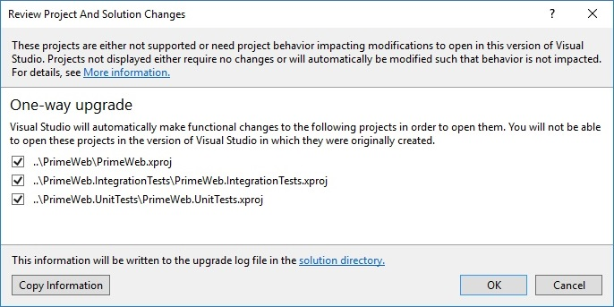

# Migrating .NET Core projects to the .csproj format

This document will cover migration scenarios for .NET Core projects and will go over the following three migration scenarios:

1. [Migration from a valid latest schema of *project.json* to *csproj*](#migration-from-projectjson-to-csproj)
2. [Migration from DNX to csproj](#migration-from-dnx-to-csproj)
3. [Migration from RC3 and previous .NET Core csproj projects to the final format](#migration-from-earlier-net-core-csproj-formats-to-rtm-csproj)

## Migration from project.json to csproj
Migration from *project.json* to *.csproj* can be done using one of the following methods:

- [Visual Studio 2017](#visual-studio-2017)
- [dotnet migrate command-line tool](#dotnet-migrate)
 
Both methods use the same underlying engine to migrate the projects, so the results will be the same for both. In most cases, using one of these two ways to migrate the *project.json* to *csproj* is the only thing that is needed and no further manual editing of the project file is necessary. The resulting *.csproj* file will be named the same as the containing directory name.

### Visual Studio 2017

When you open a *.xproj* file or a solution file which references *.xproj* files, the **One-way upgrade** dialog appears. The dialog displays the projects to be migrated. 
If you open a solution file, all the projects specified in the solution file will be listed. Review the list of projects to be migrated and select **OK**.

Visual Studio will migrate the projects chosen automatically. When migrating a solution, if you don't choose all projects, the same dialog will appear asking you to upgrade the remaining projects from that solution. After the project is migrated, you can see and modify its contents by right-clicking the project in the **Solution Explorer** window and selecting **Edit \<project name>.csproj**.

Files that were migrated (*project.json*, *global.json*, *.xproj* and solution file) will be moved to a *Backup* folder. The solution file that is migrated will be upgraded to Visual Studio 2017 and you won't be able to open that solution file in previous versions of Visual Studio. 
A file named *UpgradeLog.htm* is also saved and automatically opened that contains a migration report.

> [!IMPORTANT]
> The new tooling is not available in Visual Studio 2015, so you cannot migrate your projects using that version of Visual Studio.

### dotnet migrate

In the command-line scenario, you can use the [`dotnet migrate`](../tools/dotnet-migrate.md) command. It will migrate a project, a solution or a set of folders in that order, depending on which ones were found. 
When you migrate a project, the project and all its dependencies are migrated.

Files that were migrated (*project.json*, *global.json* and *.xproj*) will be moved to a *backup* folder.

> [!NOTE]
> If you are using Visual Studio Code, the `dotnet migrate` command will not modify Visual Studio Code-specific files such as `tasks.json`. These files need to be changed manually. 
> This is also true if you are using Project Ryder or any editor or Integrated Development Environment (IDE) other than Visual Studio. 

See [A mapping between project.json and csproj properties](../tools/project-json-to-csproj.md) for a comparison of project.json and csproj formats.

### Common issues

- If you get an error: "No executable found matching command dotnet-migrate":

Run `dotnet --version` to see which version you are using. [`dotnet migrate`](../tools/dotnet-migrate.md) requires .NET Core CLI RC3 or higher.
You’ll get this error if you have a *global.json* file in the current or parent directory and the `sdk` version is set to an older version.

## Migration from DNX to csproj
If you are still using DNX for .NET Core development, your migration process should be done in two stages:

1. Use the [existing DNX migration guidance](from-dnx.md) to migrate from DNX to project-json enabled CLI.
2. Follow the steps from the previous section to migrate from *project.json* to *.csproj*.  

> [!NOTE]
> DNX has become officially deprecated during the Preview 1 release of the .NET Core CLI. 

## Migration from earlier .NET Core csproj formats to RTM csproj
The .NET Core csproj format has been changing and evolving with each new pre-release version of the tooling. There is no tool that will migrate your project file from earlier versions of csproj to the latest, so you need to manually edit the project file. The actual steps depend on the version of the project file you are migrating. The following is some guidance to consider based on the changes that happened between versions:

* Remove the tools version property from the `<Project>` element, if it exists. 
* Remove the XML namespace (`xmlns`) from the `<Project>` element.
* If it doesn't exist, add the `Sdk` attribute to the `<Project>` element and set it to `Microsoft.NET.Sdk` or `Microsoft.NET.Sdk.Web`. This attribute specifies that the project uses the SDK to be used. `Microsoft.NET.Sdk.Web` is used for web apps.
* Remove the `<Import Project="$(MSBuildExtensionsPath)\$(MSBuildToolsVersion)\Microsoft.Common.props" />` and `<Import Project="$(MSBuildToolsPath)\Microsoft.CSharp.targets" />` statements from the top and bottom of the project. These import statements are implied by the SDK, so there is no need for them to be in the project. 
* If you have `Microsoft.NETCore.App` or `NETStandard.Library` `<PackageReference>` items in your project, you should remove them. These package references are [implied by the SDK](https://aka.ms/sdkimplicitrefs). 
* Remove the `Microsoft.NET.Sdk` `<PackageReference>` element, if it exists. The SDK reference comes through the `Sdk` attribute on the `<Project>` element. 
* Remove the [globs](https://en.wikipedia.org/wiki/Glob_(programming)) that are [implied by the SDK](../tools/csproj.md#default-compilation-includes-in-net-core-projects). Leaving these globs in your project will cause an error on build because compile items will be duplicated. 

After these steps your project should be fully compatible with the RTM .NET Core csproj format. 

For examples of before and after the migration from old csproj format to the new one, see the [Updating Visual Studio 2017 RC – .NET Core Tooling improvements](https://blogs.msdn.microsoft.com/dotnet/2016/12/12/updating-visual-studio-2017-rc-net-core-tooling-improvements/) article on the .NET blog.

## See also
[Port, Migrate, and Upgrade Visual Studio Projects](/visualstudio/porting/port-migrate-and-upgrade-visual-studio-projects)
