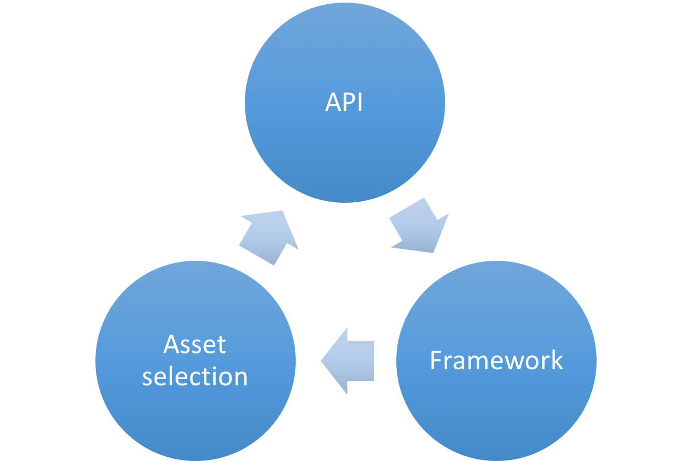

# Packages, metapackages and frameworks

.NET Core is a platform made of NuGet packages. Some product experiences benefit from fine-grained definition of packages while others from coarse-grained. To accommodate this duality, the product is distributed as a fine-grained set of packages and then described in coarser chunks with a package type informally called a "metapackage".

Each of the .NET Core packages support being run on multiple .NET implementations, represented as
frameworks. Some of those frameworks are traditional frameworks, like `net46`, representing the .NET Framework. Another set is new frameworks that can be thought of as "package-based frameworks", which establish a new model for defining frameworks. These package-based frameworks are entirely formed and defined as packages, forming a strong relationship between packages and frameworks.

## Packages

.NET Core is split into a set of packages, which provide primitives, higher-level data types, app composition types and common utilities. Each of these packages represent a single assembly of the same name. For example, [System.Runtime](https://www.nuget.org/packages/System.Runtime) contains System.Runtime.dll. 

There are advantages to defining packages in a fine-grained manner:

- Fine-grained packages can ship on their own schedule with relatively limited testing of other packages.
- Fine-grained packages can provide differing OS and CPU support.
- Fine-grained packages can have dependencies specific to only one library.
- Apps are smaller because unreferenced packages don't become part of the app distribution.

Some of these benefits are only used in certain circumstances. For example, NET Core packages will typically ship on the same schedule with the same platform support. In the case of servicing, fixes can be distributed and installed as small single package updates. Due to the narrow scope of change, the validation and time to make a fix available is limited to what is needed for a single library.

The following is a list of the key NuGet packages for .NET Core:

- [System.Runtime](https://www.nuget.org/packages/System.Runtime) - The most fundamental .NET Core package, including <xref:System.Object>, <xref:System.String>, <xref:System.Array>, <xref:System.Action>, and <xref:System.Collections.Generic.IList%601>.
- [System.Collections](https://www.nuget.org/packages/System.Collections) - A set of (primarily) generic collections, including <xref:System.Collections.Generic.List%601> and <xref:System.Collections.Generic.Dictionary%602>.
- [System.Net.Http](https://www.nuget.org/packages/System.Net.Http) - A set of types for HTTP network communication, including <xref:System.Net.Http.HttpClient> and <xref:System.Net.Http.HttpResponseMessage>.
- [System.IO.FileSystem](https://www.nuget.org/packages/System.IO.FileSystem) - A set of types for reading and writing to local or networked disk-based storage, including <xref:System.IO.File> and <xref:System.IO.Directory>.
- [System.Linq](https://www.nuget.org/packages/System.Linq) - A set of types for querying objects, including `Enumerable` and <xref:System.Linq.ILookup%602>.
- [System.Reflection](https://www.nuget.org/packages/System.Reflection) - A set of types for loading, inspecting, and activating types, including <xref:System.Reflection.Assembly>, <xref:System.Reflection.TypeInfo> and <xref:System.Reflection.MethodInfo>.

Typically, rather than including packages in your projects on a package-by-package basis, it is far easier to include a *metapackage*, which is a set of packages that are often used together. (For more information on metapackages, see the following section.) However, when you need a single package, you can include it as in the example below, which references the [System.Runtime](https://www.nuget.org/packages/System.Runtime/) package. 

```xml
<Project Sdk="Microsoft.NET.Sdk">
  <PropertyGroup>
    <TargetFramework>netstandard1.6</TargetFramework>
  </PropertyGroup>
  <ItemGroup>
    <PackageReference Include="System.Runtime" Version="4.3.0" />
  </ItemGroup>
</Project>
```

## Metapackages

Metapackages are a NuGet package convention for describing a set of packages that are meaningful together. They represent this set of packages by making them dependencies. They can optionally establish a framework for this set of packages by specifying a framework. 

Previous versions of the .NET Core tools (both project.json and csproj-based tools) by default specified both a framework and a metapackage. Currently, however, the metapackage is implicitly referenced by the target framework, so that each metapackage is tied to a target framework. For example, the `netstandard1.6` framework references the NetStandard.Library version 1.6.0 metapackage. Similarly, the `netcoreapp1.1` framework references the Microsoft.NETCore.App Version 1.1.0 metapackage. For more information, see [Implicit metapackage package reference in the .NET Core SDK](https://github.com/dotnet/core/blob/master/release-notes/1.0/sdk/1.0-rc3-implicit-package-refs.md).

Targeting a framework and implicitly referencing a metapackage means that you in effect are adding a reference to each of its dependent packages as a single gesture. That makes all of the libraries in those packages available for IntelliSense (or similar experience) and for publishing your app.  

There are advantages to using metapackages:

- Provides a convenient user experience to reference a large set of fine-grained packages. 
- Defines a set of packages (including specific versions) that are tested and work well together.

The .NET Standard metapackage is:

- [NETStandard.Library](https://www.nuget.org/packages/NETStandard.Library) - Describes the libraries that are part of the ".NET Standard". Applies to all .NET implementations (for example, .NET Framework, .NET Core and Mono) that support .NET Standard. Establishes the 'netstandard' framework.

The key .NET Core metapackages are:

- [Microsoft.NETCore.App](https://www.nuget.org/packages/Microsoft.NETCore.App) - Describes the libraries that are part of the .NET Core distribution. Establishes the [`.NETCoreApp` framework](https://github.com/dotnet/core-setup/blob/release/1.1.0/pkg/projects/Microsoft.NETCore.App/Microsoft.NETCore.App.pkgproj). Depends on the smaller `NETStandard.Library`.
- [Microsoft.AspNetCore.All](https://www.nuget.org/packages/Microsoft.AspNetCore.All) - Includes all the supported packages from ASP.NET Core, Entity Framework Core, and internal and third-party dependencies used by ASP.NET Core and Entity Framework Core. See [Microsoft.AspNetCore.All metapackage for ASP.NET Core 2.x](/aspnet/core/fundamentals/metapackage) for more information.
- [Microsoft.NETCore.Portable.Compatibility](https://www.nuget.org/packages/Microsoft.NETCore.Portable.Compatibility) - A set of compatibility facades that enable mscorlib-based Portable Class Libraries (PCLs) to run on .NET Core.

## Frameworks

.NET Core packages each support a set of runtime frameworks. Frameworks describe an available API set (and potentially other characteristics) that you can rely on when you target a given framework. They are versioned as new APIs are added.

For example, [System.IO.FileSystem](https://www.nuget.org/packages/System.IO.FileSystem) supports the following frameworks:

- .NETFramework,Version=4.6
- .NETStandard,Version=1.3
- 6 Xamarin platforms (for example, xamarinios10)

It is useful to contrast the first two of these frameworks, since they are examples of the two different ways that frameworks are defined.

The `.NETFramework,Version=4.6` framework represents the available APIs in the .NET Framework 4.6. You can produce libraries  compiled with the .NET Framework 4.6 reference assemblies and then distribute those libraries in NuGet packages in a net46 lib folder. It will be used for apps that target the .NET Framework 4.6 or that are compatible with it. This is how all frameworks have traditionally worked.

The `.NETStandard,Version=1.3` framework is a package-based framework. It relies on packages that target the framework to define and expose APIs in terms of the framework.

## Package-based frameworks

There is a two-way relationship between frameworks and packages. The first part is defining the APIs available for a given framework, for example `netstandard1.3`. Packages that target `netstandard1.3` (or compatible frameworks, like `netstandard1.0`) define the APIs available for `netstandard1.3`. That may sound like a circular definition, but it isn't. By virtue of being "package-based", the API definition for the framework comes from packages. The framework itself doesn't define any APIs.

The second part of the relationship is asset selection. Packages can contain assets for multiple frameworks. Given a reference to a set of packages and/or metapackages, the framework is needed to determine which asset should be selected, for example `net46` or `netstandard1.3`. It is important to select the correct asset. For example, a `net46` asset is not likely to be compatible with .NET Framework 4.0 or .NET Core 1.0.



You can see this relationship in the image above. The *API* targets and defines the *framework*. The *framework* is used for *asset selection*. The *asset* gives you the API.

The two primary package-based frameworks used with .NET Core are:

- `netstandard`
- `netcoreapp`

### .NET Standard

The .NET Standard (target framework moniker: `netstandard`) framework represents the APIs defined by and built on top of the [.NET Standard](../standard/net-standard.md). Libraries that are intended to run on multiple runtimes should target this framework. They will be supported on any .NET Standard compliant runtime, such as .NET Core, .NET Framework and Mono/Xamarin. Each of these runtimes supports a set of .NET Standard versions, depending on which APIs they implement.

The `netstandard` framework implicitly references the [`NETStandard.Library`](https://www.nuget.org/packages/NETStandard.Library) metapackage. For example, the following MSBuild project file indicates that the project targets `netstandard1.6`, which references the [`NETStandard.Library` version 1.6](https://www.nuget.org/packages/NETStandard.Library/1.6.0) metapackage.

```xml
<Project Sdk="Microsoft.NET.Sdk">
  <PropertyGroup>
    <TargetFramework>netstandard1.6</TargetFramework>
  </PropertyGroup>
</Project>
```

However, the framework and metapackage references in the project file do not need to match, and you can use the `<NetStandardImplicitPackageVersion>` element in your project file to specify a framework version that is lower than the metapackage version. For example, the following project file is valid.

```xml
<Project Sdk="Microsoft.NET.Sdk">
  <PropertyGroup>
    <TargetFramework>netstandard1.3</TargetFramework>
    <NetStandardImplicitPackageVersion>1.6.0</NetStandardImplicitPackageVersion>
  </PropertyGroup>
</Project>
```

It may seem strange to target `netstandard1.3` but use the 1.6.0 version of `NETStandard.Library`. It is a valid use-case, since the metapackage maintains support for older `netstandard` versions. It could be the case you've standardized on the 1.6.0 version of the metapackage and use it for all your libraries, which target a variety of `netstandard` versions. With this approach, you only need to restore `NETStandard.Library` 1.6.0 and not earlier versions. 

The reverse would not be valid: targeting `netstandard1.6` with the 1.3.0 version of `NETStandard.Library`. You cannot target a higher framework with a lower metapackage, since the lower version metapackage will not expose any assets for that higher framework. The versioning scheme for metapackages asserts that metapackages match the highest version of the framework they describe. By virtue of the versioning scheme, the first version of `NETStandard.Library` is v1.6.0 given that it contains `netstandard1.6` assets. v1.3.0 is used in the example above, for symmetry with the example above, but does not actually exist.

### .NET Core application

The .NET Core Application (TFM: `netcoreapp`) framework represents the packages and associated APIs that come with the .NET Core distribution and the console application model that it provides. .NET Core apps must use this framework, due to targeting the console application model, as should libraries that intended to run only on .NET Core. Using this framework restricts apps and libraries to running only on .NET Core. 

The `Microsoft.NETCore.App` metapackage targets the `netcoreapp` framework. It provides access to ~60 libraries, ~40 provided by the `NETStandard.Library` package and ~20 more in addition. You can reference additional libraries that target `netcoreapp` or compatible frameworks, such as `netstandard`, to get access to additional APIs. 

Most of the additional libraries provided by `Microsoft.NETCore.App` also target `netstandard` given that their dependencies are satisfied by other `netstandard` libraries. That means that `netstandard` libraries can also reference those packages as dependencies. 
