# Custom Upgrade Instructions for GitHub Copilot app modernization: upgrade for .NET

## Overview
GitHub Copilot App Modernization: upgrade for .NET has extensibility support in a few different ways and this article will focus on a feature called **Custom Upgrade Instructions**. The upgrade tool will  follow custom instructions in the `copilot-instructions.md` file but those are sent to the LLM for every request and they are better suited for describing solution characteristics than upgrade details.

For upgrade specific scenarios, the upgrade can follow additional instructions from markdown files stored in the solution directory under the folder `.github\upgrades\prompts\<your_file_name>.md`. The upgrade experience supports these files in three ways.

1. Creating custom upgrade instructions
2. Testing the custom upgrade instruction as a one-time step
3. Running custom upgrade instructions during the upgrade

 Custom upgrade instructions are different from chatmode or prompt files in that they focus on the reuse of upgrade-related expertise. While chatmodes and prompt files provide specific configurations or guidance for conversational agents, custom upgrade instructions are designed to be embedded within your upgrade plan and executed as part of automated upgrade procedures. This enables organizations to apply learned insights and best practices broadly across many applications, improving efficiency and consistency during upgrades.

The following example shows how custom upgrade instructions can be created, tested, and applied during an upgrade to enhance automation and successful code changes.

## Creating custom upgrade instructions
To demonstrate this capability we can show how to replace Newtonsoft.Json with System.Text.Json. Both packages are supported on modern .NET and this scenario is provided for learning.

To get started, follow these steps to create a new custom instructions file. Start by opening Visual Studio 2026 and your solution. You can learn more about [Visual Studio 2026 Insiders](//devblogs.microsoft.com/visualstudio/visual-studio-2026-insiders-is-here/) in the announcement.

> [!NOTE]
> You can follow along with these instructions using the code sample: [MvcMovieNet6](https://github.com/KSchlobohm/MvcMovieNet6)

1. Right-click the solution file and choose **Modernize**

    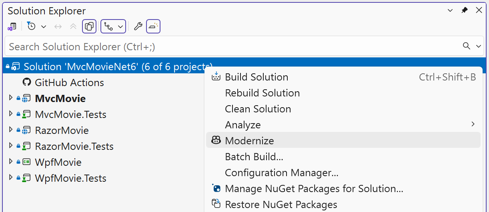

2. Type `I want to generate a custom upgrade instruction` into the chat

    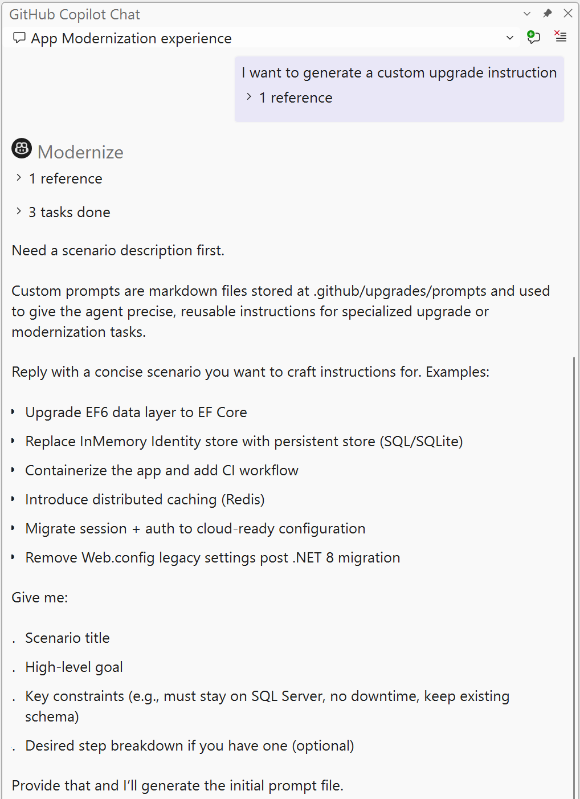

3. The Copilot will produce a new file and ask you if you would like to refine the custom upgrade instruction further.

    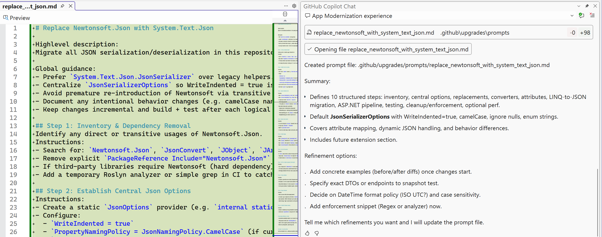

Tips for best outcomes:
1. Custom upgrade instructions work best when Copilot can follow specific instructions. A common pattern follows the "if this, then that" approach to replace or alter code in your solution.
2. If your instructions require multiple steps then we recommend breaking those steps into different files and describing the sequence as a prerequisite in each file.
3. Using Visual Studio helps to generate a well-formed custom upgrade instruction but is not required. You can edit the instructions directly, or create it in VS Code with other tools like #fetch to refine the instructions.
3. The custom upgrade instruction file does not have to be added to the solution file to function properly but adding it can be helpful. It helps create visibility into how this upgrade was executed. It helps you find and edit the file when refining it for best results.
4. Code changing instructions work best when an example is provided. If you can make the change in your code then Copilot can capture that as an example by following these steps with your custom upgrade instruction file still open.
    1. Make the code change you want to automate.
    2. Type `check my git changes and add diffs as examples to my prompt file`
    3. Copilot will update the instructions and add an example diff

    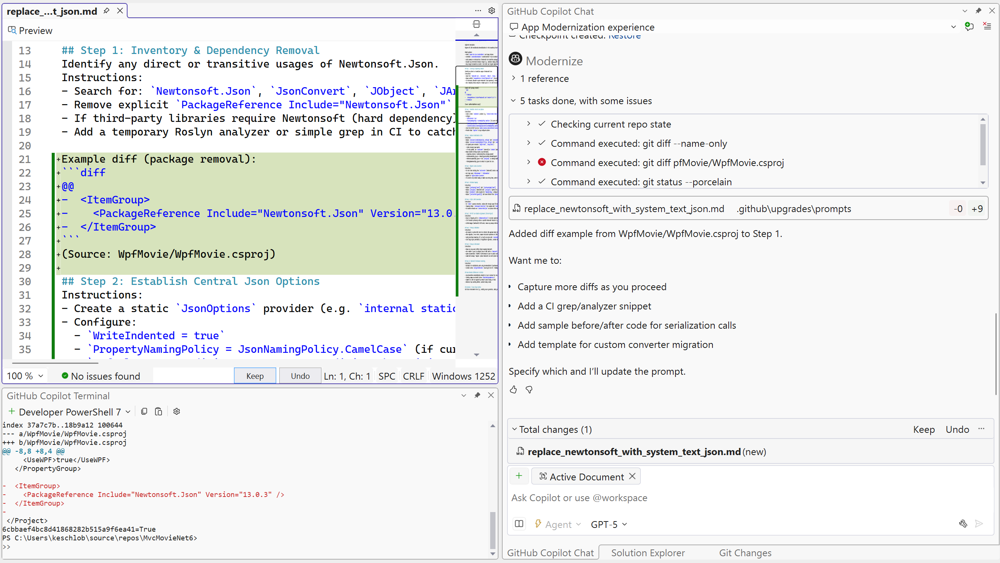
    

## Testing the custom upgrade instruction as a one-time step

Once the custom upgrade instruction is created you can run it directly. This is useful for testing and helping to refine the approach before sharing it with others, or applying it during the upgrade. This approach is also helpful for tasks that need to be completed prior to starting the upgrade as a way to address technical debt in the solution.

> [!NOTE]
> These instructions assume you already have a custom instructions file created from the previous steps. You can follow along with these instructions using the code sample: [MvcMovieNet6](https://github.com/KSchlobohm/MvcMovieNet6)

1. Right-click the solution file and choose **Modernize**

    

2. Type `Replace Newtonsoft with System.Text.Json` into the chat

    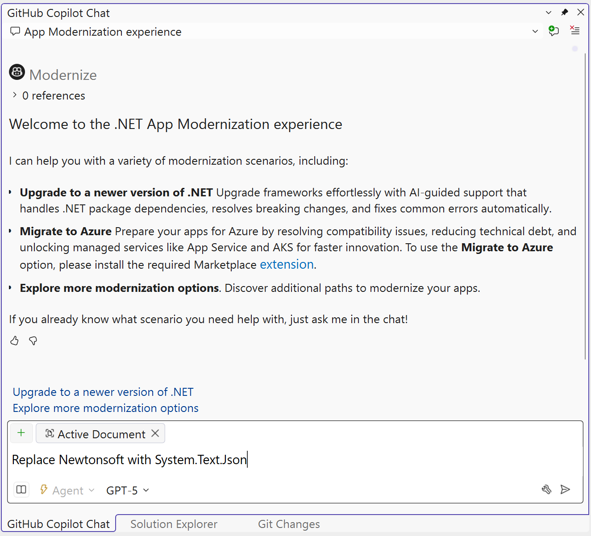

3. The upgrade will read the custom upgrade instructions and apply the change

    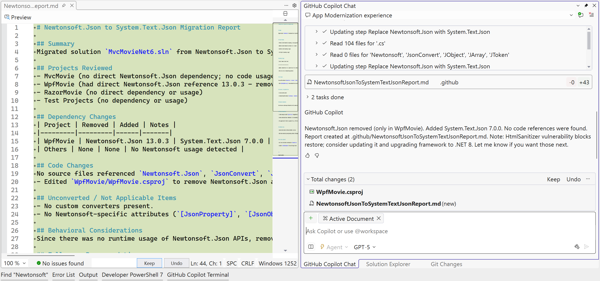

Tips for best outcomes:
1. Try to use words similar to the file name when activating the custom upgrade instruction. In this scenario we used 'Replace Newtonsoft with System.Text.Json' because the file was named `replace_newtonsoft_with_system_text_json.md`. If your file name uses other wording like **update** or **modify** then follow that pattern.
2. You can tell if Copilot understood your instructions by checking the chat to see if it retrieved the file. If this does not appear, then the custom upgrade instruction was not used during the code transformation.

    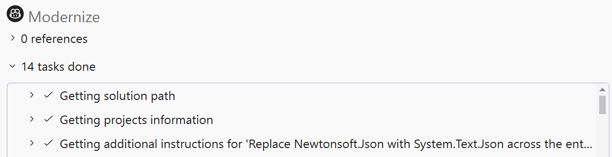

## Running custom upgrade instructions during the upgrade

When you need to repeatedly run a custom upgrade instruction, or need to run it during the upgrade, you can tell Copilot to incorporate the instructions into the plan.

> [!NOTE]
> These instructions assume you already have a custom instructions file created from the previous steps. You can follow along with these instructions using the code sample: [MvcMovieNet6](https://github.com/KSchlobohm/MvcMovieNet6)

1. Right-click the solution file and choose **Modernize**

    

2. Choose **Upgrade to a newer version of .NET** and generate a plan file

    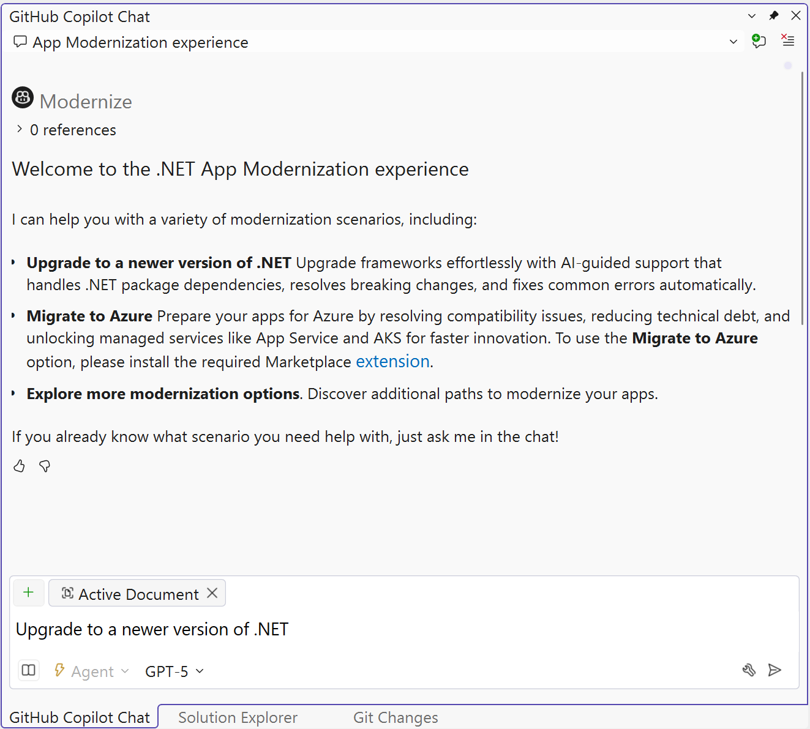

3. Choose **Accept upgrade settings and continue**

    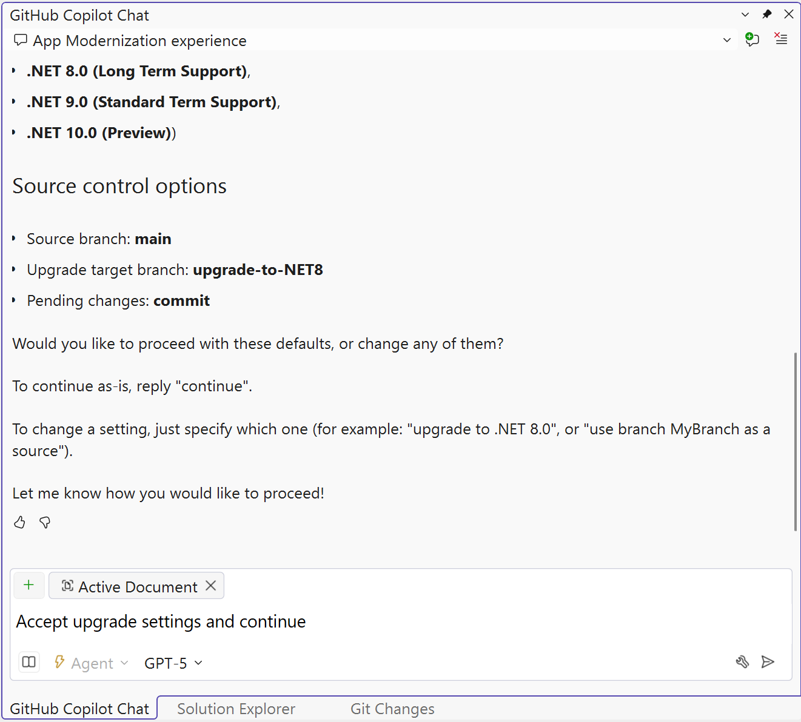

4. Choose **Address security vulnerabilities issues during this upgrade**

    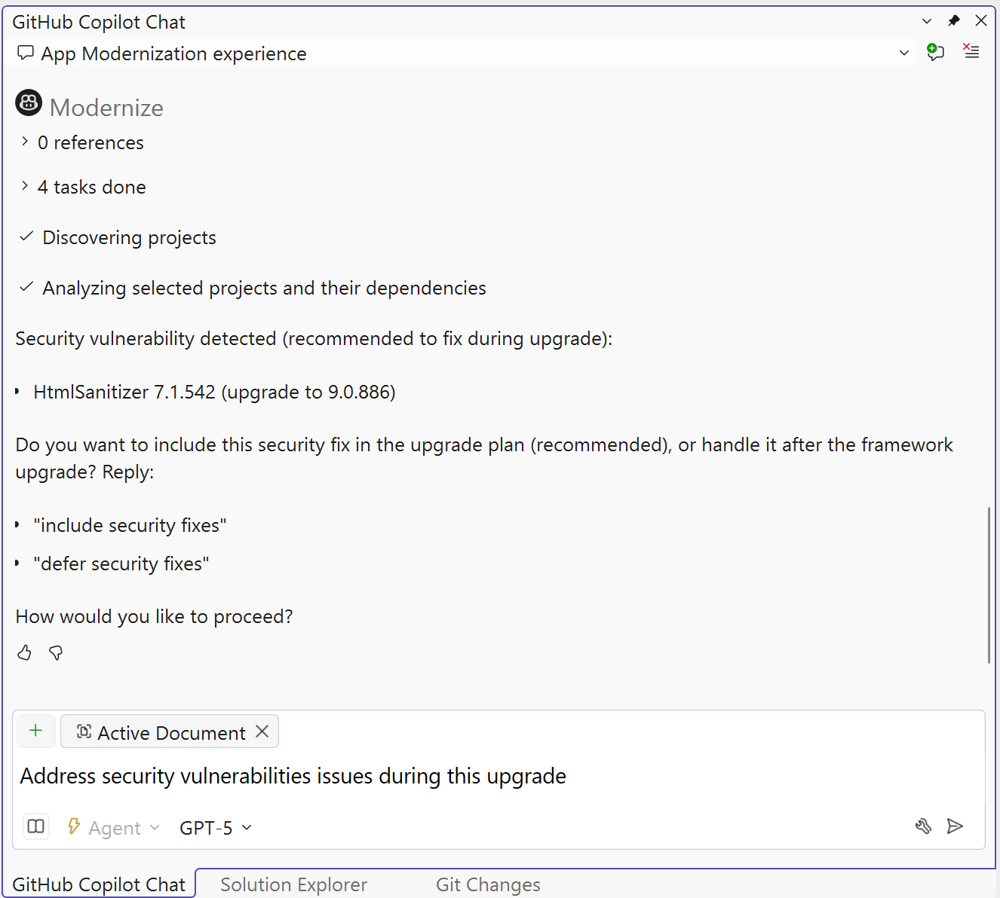

5. Review the plan file to see if your instructions are added. In the following image, we see the custom upgrade instruction is not part of the plan because the plan says Newtonsoft would be upgraded, and not replaced.

    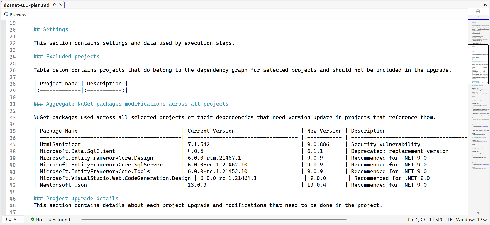

6. To modify the plan type `modify the plan with custom instructions to replace Newtonsoft`

    You should be able to see the effect on the planned package upgrades.

    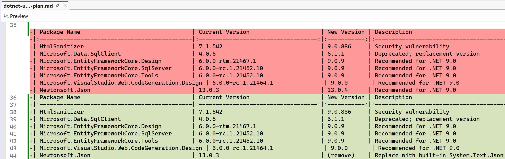

    You should be able to see the effect on the planned project upgrades.

    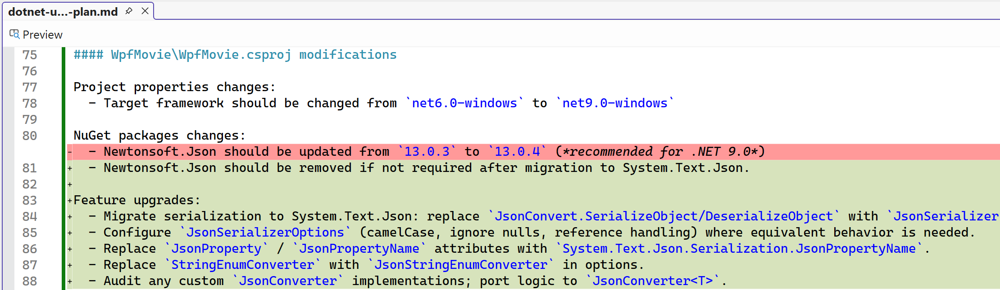

Tips for best outcomes:
1. We recommend asking Copilot to edit the file for your best results. It is convenient and effective to ask Copilot to take responsibility for editing the plan thoroughly and correctly.
2. Avoid action phrases like `upgrade the plan` as some action words can encourage Copilot to start the upgrade without modifying the plan.