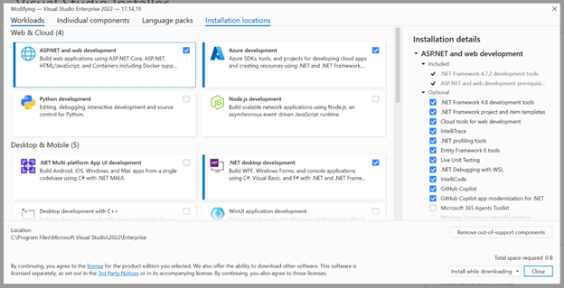
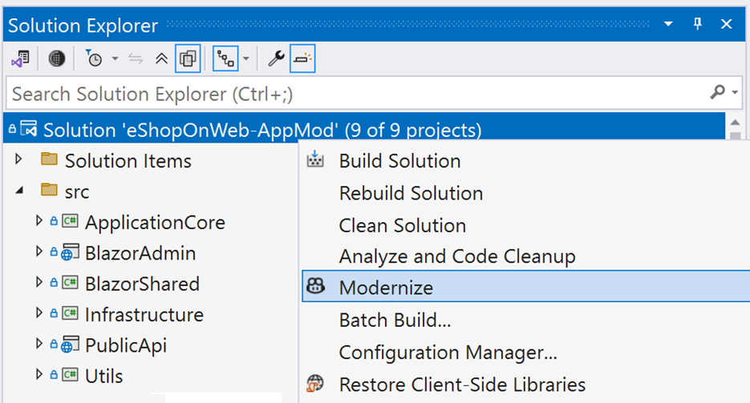
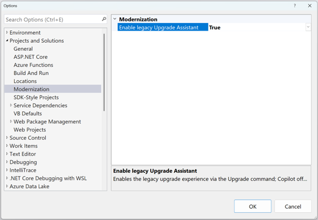
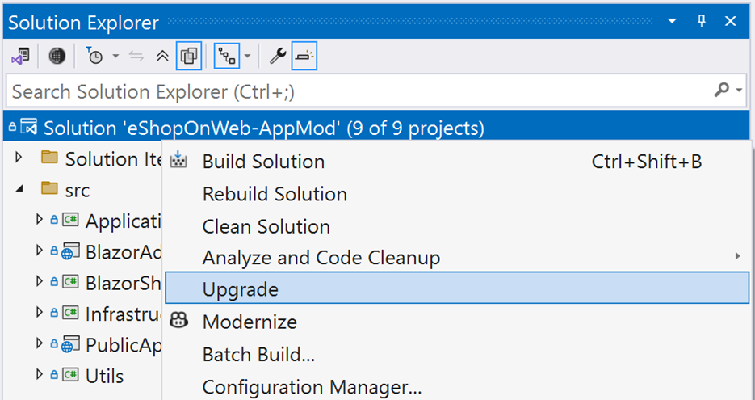

# Install .NET Upgrade Assistant

This article teaches you how to enable .NET Upgrade Assistant in Visual Studio or install the tool using the command-line interface (CLI).

[!INCLUDE [github-copilot-suggestion](includes/github-copilot-suggestion.md)]

## Prerequisites

- Windows Operating System
- [Visual Studio 2022 version 17.14.6 or newer](https://visualstudio.microsoft.com/downloads/).
- [.NET SDK 8 or later](https://dotnet.microsoft.com/download/dotnet/).

> [!IMPORTANT]
> Starting with Visual Studio 2022 17.14.16, the GitHub Copilot app modernization agent is included with Visual Studio. And, the .NET Upgrade Assistant is installed along with that feature. If you're using an older version of Visual Studio 2022, upgrade to the latest release.
>
> If you installed any of the following extensions published by Microsoft, uninstall them before using the version now included in Visual Studio:
>
> - .NET Upgrade Assistant
> - GitHub Copilot App Modernization – Upgrade for .NET
> - Azure Migrate Application and Code Assessment for .NET

## Methods

.NET Upgrade Assistant is available as a feature in Visual Studio and it can be installed as a .NET Global Tool.

The .NET Global Tool is an interactive console application that runs on a solution or project file at or below the current directory.

If you want the streamlined experience of opening a project in Visual Studio and upgrading it, then enable the feature.

## Enable the Visual Studio Feature

The following sections are both required to enable the .NET Upgrade Assistant.

### Enable the GitHub Copilot app modernization for .NET

1.	Open the Visual Studio installer
2.	Click the Modify button next to your Visual Studio instance
3.	On the Workloads tab
  1.	Find the Installation details outline on the right side of the window
  2.	Click the arrow to expand the ASP.NET and web development section
  3.	Click the checkbox to install GitHub Copilot app modernization for .NET



When completed successfully. You can open a .NET solution in Visual Studio and will be able to see the Modernize menu option when you right-click a solution in the Solution Explorer.



### Enable the .NET Upgrade Assistant in Visual Studio

1.	Click on the Tools -> Options menu item to open the Options window
2.	Use the left-side to select Projects and Solutions -> Modernization
3.	Select True to Enable legacy Upgrade Assistant



> [!IMPORTANT]
> You will need to restart Visual Studio for this change to take effect.

When completed successfully. You can open a .NET solution in Visual Studio and will be able to see the Modernize menu option when you right-click a solution in the Solution Explorer.



## .NET Global Tool

The following steps install .NET Upgrade Assistant as a .NET Global Tool. .NET Upgrade Assistant is distributed in the [upgrade-assistant NuGet package](https://www.nuget.org/packages/upgrade-assistant).

01. Open a command prompt that has the `dotnet` command in Path.
01. Run the following command to install the tool:

    ```dotnetcli
    dotnet tool install -g upgrade-assistant
    ```

    > [!IMPORTANT]
    > Installing this tool may fail if you've configured another NuGet feed source. Use the `--ignore-failed-sources` parameter to treat those failures as warnings instead of errors, bypassing those other NuGet feed sources:
    >
    > ```dotnetcli
    > dotnet tool install -g --ignore-failed-sources upgrade-assistant
    > ```

## Validation

The following information helps you determine that .NET Upgrade Assistant is installed.

- **Visual Studio Extension**

  There are two ways to determine if .NET Upgrade Assistant is installed as a Visual Studio extension. The quickest way is to right-click on any .NET or .NET Framework project in the **Solution Explorer** window and check for an **Upgrade** menu item.

  Another way is to select the **Extensions** > **Manage Extensions** menu to open the **Extension Manager** window. Then, select the **Installed** tab and find it in the list of installed extensions.

- **.NET Global Tool**

  Open a command prompt and run the `upgrade-assistant` command. If the command response indicates that the command is unknown, the tool didn't install correctly or isn't in PATH.

## Troubleshoot - .NET Global Tool

If you configured extra NuGet feed sources, the install might fail with an error indicating that the NuGet package isn't available in the feed. Use the `--ignore-failed-sources` parameter to treat those failures as warnings instead of errors, bypassing the other NuGet feed sources:

```dotnetcli
dotnet tool install -g --ignore-failed-sources upgrade-assistant
```
