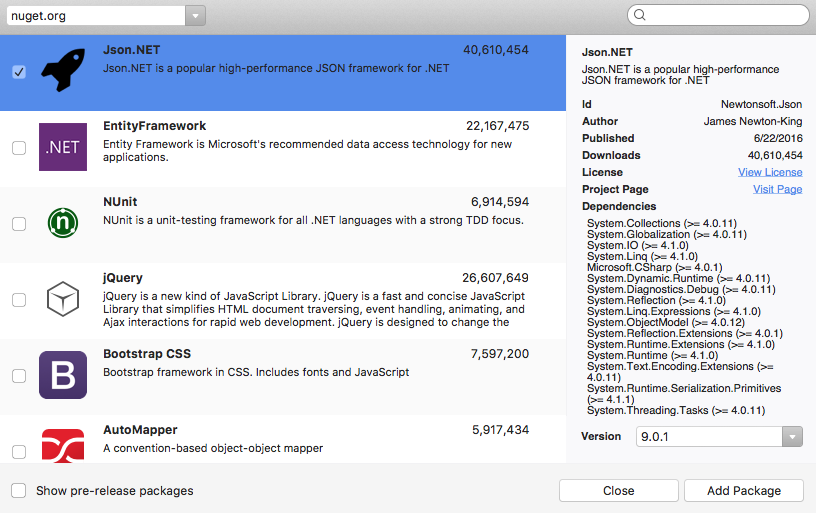
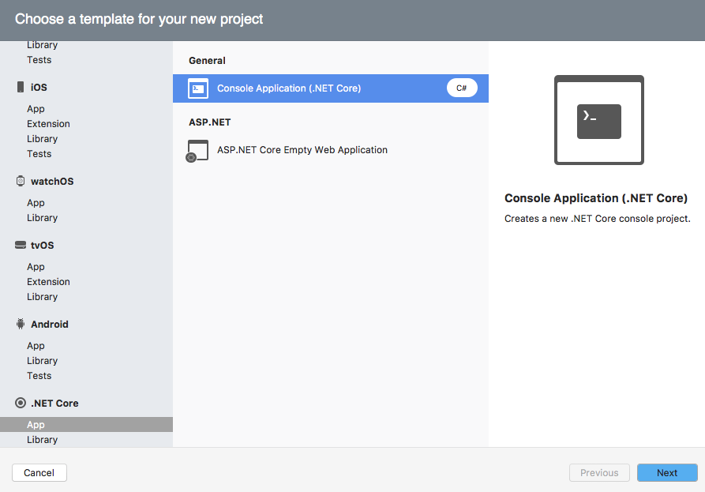
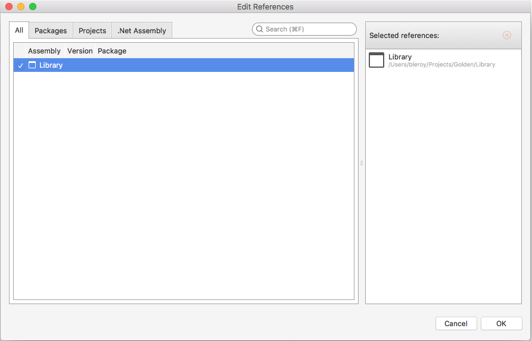
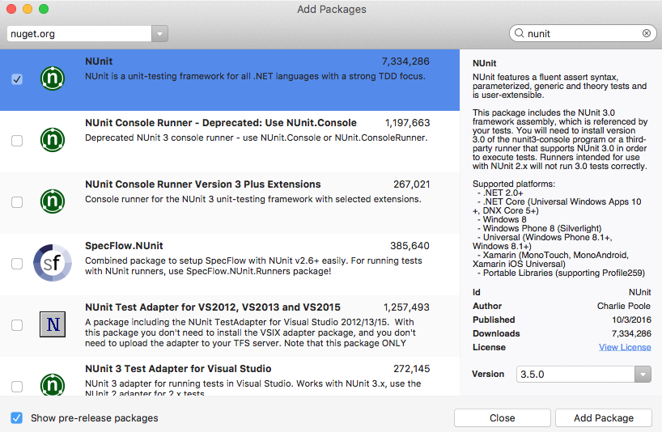

---
title: Building a complete .NET Core solution on macOS, using Visual Studio for Mac
description: Building a complete .NET Core solution on macOS, using Visual Studio for Mac
keywords: .NET, .NET Core, macOS, Mac
author: bleroy
manager: wpickett
ms.date: 11/16/2016
ms.topic: article
ms.prod: .net-core
ms.technology: .net-core-technologies
ms.devlang: dotnet
ms.assetid: d743134a-08a3-4ff6-aab7-49f71f0568c3
---

# Building a complete .NET Core solution on macOS, using Visual Studio for Mac

by [Bertrand Le Roy](https://github.com/bleroy)

Visual Studio for Mac provides a full-featured development environment for developing .NET Core applications. The procedures in this document describe the steps necessary to build a typical .NET Core solution that includes reusable libraries, testing, and using third-party libraries.

> Visual Studio for Mac is preview software

## Prerequisites

Follow the instructions on [our prerequisites page](../macos-prerequisites.md) to update your environment.

# A solution using only .NET Core projects

## Writing the library

1. In Visual Studio, choose **New Project**. In the new project dialog, choose **Library** under **.NET Core**, then select **Class Library (.NET Core)**. Click **Next**.

   

2. Name the project "Library" and the solution "Golden". Leave **Create a project directory within the solution directory** checked. Click **Create**.

   
   
3. By default, the current project template sets the .NET Standard version to 1.4. We'll bump it up to 1.6. Right-click the project and choose **Tools / Edit File**. Change `<TargetFramework>netstandard1.4</TargetFramework>` to `<TargetFramework>netstandard1.6</TargetFramework>`. Save.

4. In the solution explorer, open the context menu for the **Dependencies** node and choose **Add Packages...**.

5. Choose "nuget.org" as the Package source, and check **Json.NET**. Click **Add Package**. The package should now appear under **Dependencies/NuGet** and be automatically restored. [Json.NET](http://www.newtonsoft.com/json) is the recommended library and what our code will use to perform [JSON](http://www.json.org/) serialization and deserialization.

   

6. Rename the `MyClass.cs` file to `Thing.cs`. Also rename the class and constructor `Thing`. Add a method: `public int Get(int number) => Newtonsoft.Json.JsonConvert.DeserializeObject<int>($"{number}");`

7. On the **Build** menu, choose **Build All**.

   The solution should build without error.

### Writing the test project

1. In the solution explorer, open the context menu for the Golden solution node and choose **Add**, **Add New Project...**. In the new project dialog, choose **.NET Core / App** (and not **Library**), and then **Console Application (.NET Core)**. Click **Next**. Name the new project "TestLibrary" and click **Create**.

   

2. In the **TestLibrary** project, open the context menu for the **References** node and choose **Edit References...**. Check the Library project and click **OK**. This adds a reference to your library from the test project.

   

3. The testing framework that we'll use in this tutorial is [xUnit](https://xunit.github.io/). Right-click **Packages** under the solution explorer and choose **Add Packages...**. Search for xunit, check "xUnit.net" and click **Add Package** (the version you see may vary; the latest is usually the best choice).

   
   
   Do the same for `Microsoft.NET.Test.Sdk` and "xunit.runner.visualstudio". Those libraries enable the command-line test runner to work.

4. Rename the `Program.cs` file to `LibraryTests.cs`, then open it and change the code to:

    ```csharp
    using Library;
    using Xunit;
    
    public class LibraryTests
        [Theory]
        [InlineData(42)]
        [InlineData(0)]
        [InlineData(-1)]
        public void ThingGetsObjectValFromNumber(int number)
        {
            Assert.Equal(number, new Thing().Get(number));
        }
    }
    ```

   You should now be able to build the solution.
   
5. At the time of writing, Visual Studio for Mac doesn't integrate NUnit tests to its built-in test runner. We will still be able to run tests, but from the command-line. Right-click the `TestLibrary` project, and choose **Tools / Open in Terminal** from the menu. In the command-line, enter `dotnet test`.
   
   The tests should pass.

> **Work in progress**
   
### Writing the console app

1. In Solution Explorer, open the context menu for the solution, and add a new **Console Application (.NET Core)** project. Name it "App".

2. In the **App** project, open the context menu for the **References** node and choose **Add**,  **Reference**. In the **Reference Manager** dialog, check **Library** under the **Projects**, **Solution** node, and then click **OK**.

3. Open the `Program.cs` file, add a `using Library;` directive to the top of the file, and then add `Console.WriteLine($"The answer is {new Thing().Get(42)}");` to the `Main` method.

8. Set a breakpoint after the line that you just added.

9. Press F5 to run the application..

   The application should build without error, and should hit the breakpoint. You should also be able to check that the application output "The answer is 42.".
