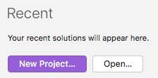
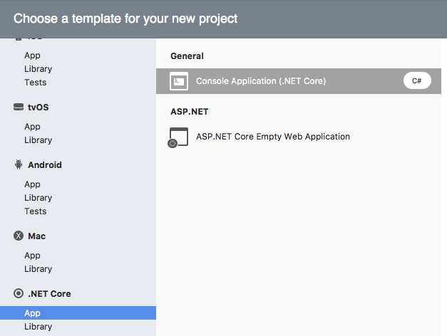
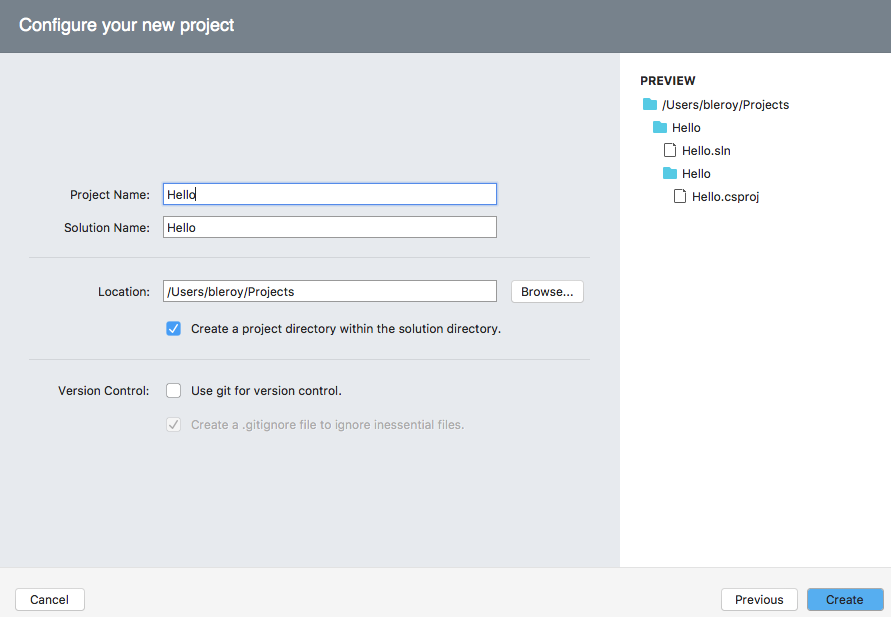
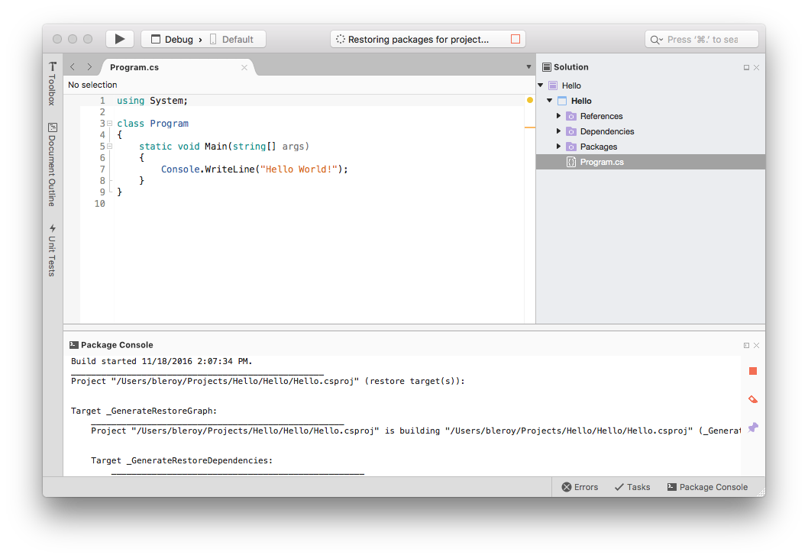
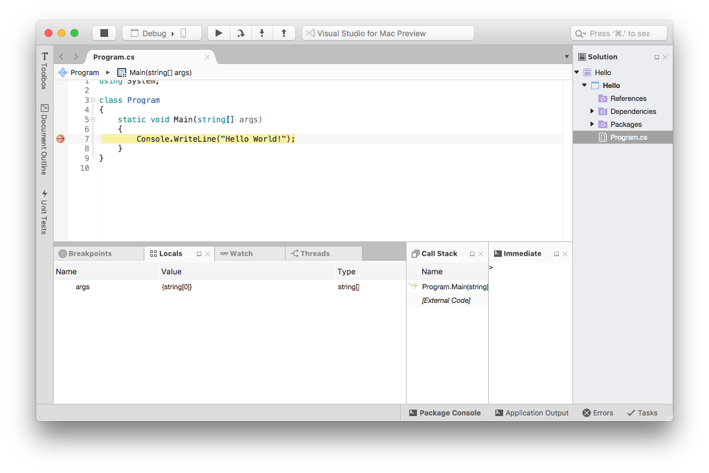
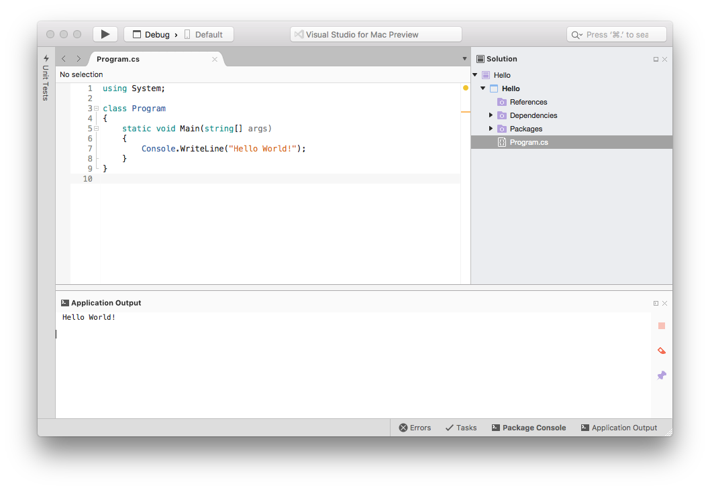

# Getting started with .NET Core on macOS, using Visual Studio for Mac

by [Bertrand Le Roy](https://github.com/bleroy) and [Phillip Carter](https://github.com/cartermp)

Visual Studio for Mac provides a full-featured development environment for developing .NET Core applications. The procedures in this document describe the steps necessary to build a very simple console application, using Visual Studio for Mac and .NET Core.

## Prerequisites

Follow the instructions on [our prerequisites page](../macos-prerequisites.md) to update your environment.

## Getting Started

The following steps will set up Visual Studio for Mac for .NET Core console application development:

1. Open Visual Studio for Mac, then choose **New Project...**.

   

2. In the new project dialog, select **App** under **.NET Core**, then **Console Application (.NET Core)**.

   

   Click **Next**.

3. Give your new project a name. We'll use "Hello" in this tutorial. You may optionally specify a different parent folder for the new project.

   

   Click **Create**.

4. The resulting project has a single C# file that will output "Hello World" to the console. Restoring the dependencies will take a few seconds.

   

You may run this application in debug mode using F5, or in release mode using CTRL+F5. You may also set breakpoints to interrupt execution and inspect variables, or start writing more interesting code.

Happy coding!

## What to do next

After this simple introduction, you're probably wondering how to build more advanced solutions, with reusable libraries and tests. The [Building a complete .NET Core solution on macOS, using Visual Studio for Mac](using-on-mac-vs-full-solution.md) topic will show you how to do that.
