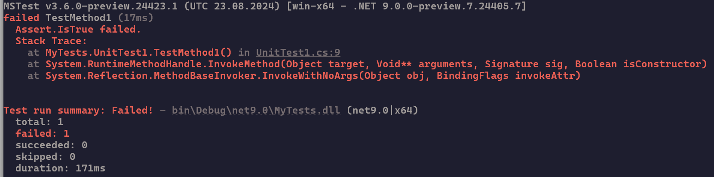
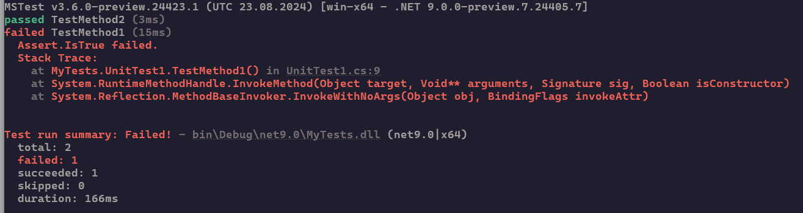
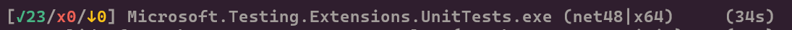

# Output extensions

This article lists and explains all Microsoft.Testing.Platform extensions related to the terminal output.

## Terminal test reporter

Terminal test reporter is the default implementation of status and progress reporting to the terminal (console).

It comes built-in with **Microsoft.Testing.Platform**, and offers ANSI and non-ANSI mode, and progress indicator.

### Output modes

There are two output modes available:

- `Normal`, the output contains the banner, reports full failures of tests, warning messages and writes summary of the run.
  

- `Detailed`, the same as `Normal` but it also reports `Passed` tests.
  

### ANSI

Internally there are 2 different output formatters that are auto-detecting the terminal capability to handle [ANSI escape codes](/windows/console/console-virtual-terminal-sequences).

- The ANSI formatter is used when the terminal is capable of rendering the escape codes.
- The non-ANSI formatter is used when the terminal cannot handle the escape codes, or when `--no-ansi` is used, or when output is redirected.

The default is to auto-detect the capabilities.

### Progress

A progress indicator is written to terminal. The progress indicator, shows the number of passed tests, failed tests, and skipped tests, followed by the name of the tested assembly, its target framework and architecture.

The progress bar is written based on the selected mode:

- ANSI, the progress bar is animated, sticking to the bottom of the screen and is refreshed every 500ms. The progress bar hides once test execution is done.
- non-ANSI, the progress bar is written to screen as is every 3 seconds. The progress remains in the output.

### Options

The available options are as follows:

| Option      | Description                                                                                        |
|-------------|----------------------------------------------------------------------------------------------------|
| no-progress | Disable reporting progress to screen.                                                              |
| no-ansi     | Disable outputting ANSI escape characters to screen.                                               |
| output      | Output verbosity when reporting tests. Valid values are 'Normal', 'Detailed'. Default is 'Normal'. |
