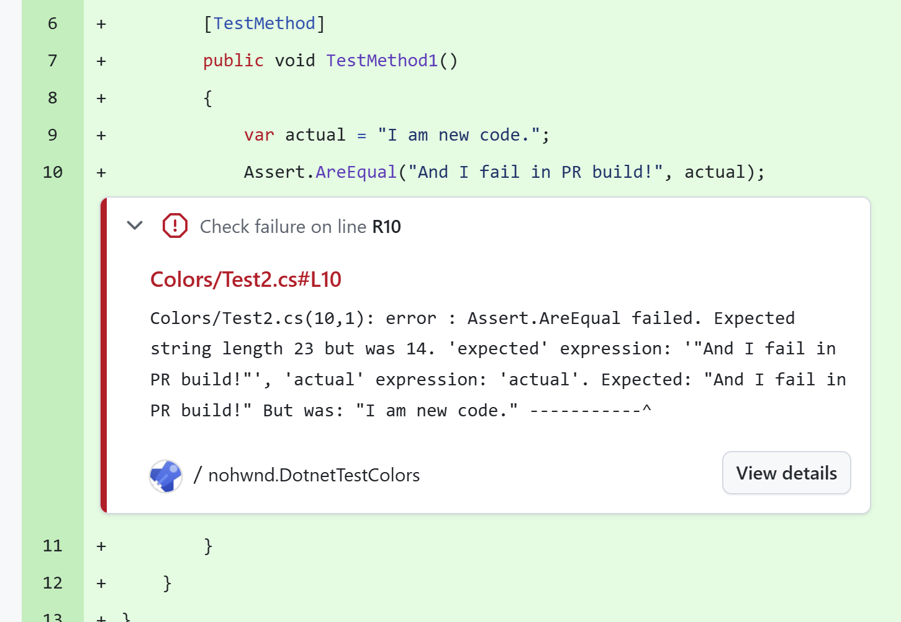

# Test reports extensions

This article lists and explains all Microsoft.Testing.Platform extensions related to the test report capability.

A test report is a file that contains information about the execution and outcome of the tests.

## Visual Studio test reports

The Visual Studio test result file (or TRX) is the default format for publishing test results. This extension is shipped as part of [Microsoft.Testing.Extensions.TrxReport](https://nuget.org/packages/Microsoft.Testing.Extensions.TrxReport) package.

> [!IMPORTANT]
> The package is shipped with Microsoft .NET library closed-source free to use licensing model.

The available options as follows:

| Option | Description |
|--|--|
| `--report-trx` | Generates the TRX report. |
| `--report-trx-filename` | The name of the generated TRX report. The default name matches the following format `<UserName>_<MachineName>_<yyyy-MM-dd HH:mm:ss>.trx`. |

The report is saved inside the default _TestResults_ folder that can be specified through the `--results-directory` command line argument.

## Azure DevOps reports

Azure DevOps report plugin enhances test running for developers that host their code on GitHub, but build on Azure DevOps build agents. It adds additional information to failures to show failure directly in GitHub PR.

The extension is shipped in [Microsoft.Testing.Extensions.AzureDevOpsReport](https://nuget.org/packages/Microsoft.Testing.Extensions.AzureDevOpsReport) package.

The available options as follows:

| Option | Description |
|--|--|
| `--report-azdo` | Enable outputting errors / warnings in CI builds. |
| `--report-azdo-severity` | Severity to use for the reported event. Options are: `error` (default) and `warning`. |

The extension automatically detects that it is running in continuous integration (CI) environment by checking the `TF_BUILD` environment variable.

### Determining the line to report

To highlight the correct line in code where failure occurred, AzureDevOps report plugin searches the error stacktrace for a file that exists in the current repository.

To determine this it:

- finds the repository root, this is done by searching the `.git` directory closest to the location from where the test application is started (as determined by `AppContext.BaseDirectory`)
- finds the first line in stack trace that has file location and line (the library needs to have debug symbols)
- excludes all files that end with `Assert.cs` to avoid showing details of your assertion implementations or wrappers
- excludes all files that don't exist on disk (typically those are lines from external libraries that ship debug symbols e.g. MSTest)

(These are internal details that serve to aid debugging the behavior and might change in the future.)
