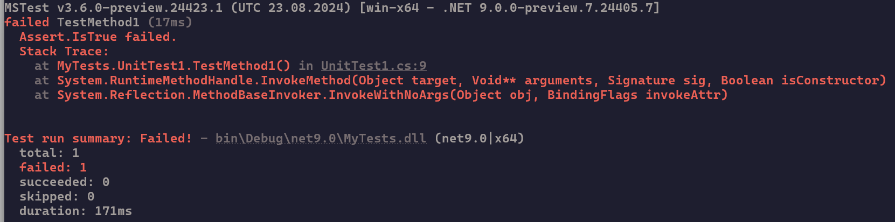

# Microsoft.Testing.Platform extensions

Microsoft.Testing.Platform provides a rich set of extensions that add capabilities to your test projects. This article describes all available extensions, their features, and how to use them.

> [!TIP]
> For a complete reference of all command-line options, environment variables, and configuration files, see [Configuration reference](microsoft-testing-platform-options.md).

## Code coverage

Code coverage helps you determine what proportion of your project's code is being tested. To effectively guard against bugs, your tests should exercise or *cover* a large proportion of your code.

### Microsoft Code Coverage

Microsoft Code Coverage analysis is possible for both managed (CLR) and unmanaged (native) code. Both static and dynamic instrumentation are supported. This extension is shipped as part of [Microsoft.Testing.Extensions.CodeCoverage](https://nuget.org/packages/Microsoft.Testing.Extensions.CodeCoverage) NuGet package.

> [!NOTE]
> Unmanaged (native) code coverage is disabled by default. Use flags `EnableStaticNativeInstrumentation` and `EnableDynamicNativeInstrumentation` to enable it if needed.
> For more information, see [Static and dynamic native instrumentation](/visualstudio/test/customizing-code-coverage-analysis#static-and-dynamic-native-instrumentation).

> [!IMPORTANT]
> The package is shipped with Microsoft .NET library closed-source free to use licensing model.

**Available options:**

| Option                     | Description                                                                   |
|----------------------------|-------------------------------------------------------------------------------|
| `--coverage`               | Collects the code coverage using dotnet-coverage tool.                         |
| `--coverage-output`        | The name or path of the produced coverage file. By default, the file is `TestResults/<guid>.coverage`. |
| `--coverage-output-format` | Output file format. Supported values are: `coverage`, `xml`, and `cobertura`. Default is `coverage`. |
| `--coverage-settings`      | [XML code coverage settings](../additional-tools/dotnet-coverage.md#settings). |

For more information about the available options, see [settings](../additional-tools/dotnet-coverage.md#settings) and [samples](https://github.com/microsoft/codecoverage/tree/main/samples/Algorithms).

> [!NOTE]
> The default value of `IncludeTestAssembly` in Microsoft.Testing.Extensions.CodeCoverage is `false`, while it used to be `true` in VSTest. This means test projects are excluded by default. For more information, see [Code Coverage configuration](https://github.com/microsoft/codecoverage/blob/main/docs/configuration.md).

**Version compatibility:**

The following table shows the compatibility between different versions of Microsoft.Testing.Extensions.CodeCoverage and Microsoft.Testing.Platform:

| Microsoft.Testing.Extensions.CodeCoverage | Microsoft.Testing.Platform |
|------------------------------------------|---------------------------|
| 18.1.x                                  | 2.0.x                     |
| 18.0.x                                  | 1.8.x                     |
| 17.14.x                                  | 1.6.2                     |

> [!NOTE]
> For the best compatibility and latest features, use the latest versions of both packages together.

For more information about Microsoft code coverage, see its [GitHub page](https://github.com/microsoft/codecoverage).

### Coverlet

> [!IMPORTANT]
> The `coverlet.collector` NuGet package is designed specifically for VSTest and cannot be used with Microsoft.Testing.Platform.

There's currently no Coverlet extension, but you can use [Coverlet .NET global tool](https://github.com/coverlet-coverage/coverlet#net-global-tool-guide-suffers-from-possible-known-issue).

Assuming you've already installed the Coverlet global tool, you can run:

```bash
coverlet .\bin\Debug\net8.0\TestProject2.dll --target "dotnet" --targetargs "test .\bin\Debug\net8.0\TestProject2.dll --no-build"
```

## Test reports

Test reports are files that contain information about the execution and outcome of the tests.

### Visual Studio test reports (TRX)

The Visual Studio test result file (or TRX) is the default format for publishing test results. This extension is shipped as part of [Microsoft.Testing.Extensions.TrxReport](https://nuget.org/packages/Microsoft.Testing.Extensions.TrxReport) package.

**Available options:**

| Option | Description |
|--|--|
| `--report-trx` | Generates the TRX report. |
| `--report-trx-filename` | The name of the generated TRX report. The default name matches the following format `<UserName>_<MachineName>_<yyyy-MM-dd HH:mm:ss>.trx`. |

The report is saved inside the default _TestResults_ folder that can be specified through the `--results-directory` command-line argument.

### Azure DevOps reports

Azure DevOps report plugin enhances test running for developers that host their code on GitHub, but build on Azure DevOps build agents. It adds additional information to failures to show failure directly in GitHub PR.


The extension is shipped in [Microsoft.Testing.Extensions.AzureDevOpsReport](https://nuget.org/packages/Microsoft.Testing.Extensions.AzureDevOpsReport) package.

**Available options:**

| Option | Description |
|--|--|
| `--report-azdo` | Enables outputting errors and warnings in CI builds. |
| `--report-azdo-severity` | Severity to use for the reported event. Options are: `error` (default) and `warning`. |

The extension automatically detects that it's running in continuous integration (CI) environment by checking the `TF_BUILD` environment variable.

**Determining the line to report:**

To highlight the correct line in code where failure occurred, AzureDevOps report plugin searches the error stacktrace for a file that exists in the current repository.

To determine this it:

- Finds the repository root, by searching the `.git` directory closest to the location from where the test application is started (as determined by `AppContext.BaseDirectory`).
- Finds the first line in stack trace that has file location and line (the library needs to have debug symbols).
- Excludes all files that end with `Assert.cs` to avoid showing details of your assertion implementations or wrappers.
- Excludes all files that don't exist on disk (typically those are lines from external libraries that ship debug symbols, for example, MSTest).

## Diagnostics

Diagnostics extensions help you troubleshoot test issues by collecting diagnostic logs and memory dumps.

### Built-in diagnostic logging

The following platform options provide useful information for troubleshooting your test apps:

**Command-line options:**

- `--info` - Displays advanced information about the .NET Test Application
- `--diagnostic` - Enables the diagnostic logging
- `--diagnostic-verbosity` - Defines the verbosity level (`Trace`, `Debug`, `Information`, `Warning`, `Error`, or `Critical`)
- `--diagnostic-output-directory` - The output directory of the diagnostic logging
- `--diagnostic-output-fileprefix` - The prefix for the log file name (defaults to `"log_"`)
- `--diagnostic-filelogger-synchronouswrite` - Forces synchronous write logs

**Environment variables:**

| Environment variable name | Description |
|--|--|
| `TESTINGPLATFORM_DIAGNOSTIC` | If set to `1`, enables the diagnostic logging. |
| `TESTINGPLATFORM_DIAGNOSTIC_VERBOSITY` | Defines the verbosity level. The available values are `Trace`, `Debug`, `Information`, `Warning`, `Error`, or `Critical`. |
| `TESTINGPLATFORM_DIAGNOSTIC_OUTPUT_DIRECTORY` | The output directory of the diagnostic logging, if not specified the file is generated in the default _TestResults_ directory. |
| `TESTINGPLATFORM_DIAGNOSTIC_OUTPUT_FILEPREFIX` | The prefix for the log file name. Defaults to `"log_"`. |
| `TESTINGPLATFORM_DIAGNOSTIC_FILELOGGER_SYNCHRONOUSWRITE` | Forces the built-in file logger to synchronously write logs. Useful for scenarios where you don't want to lose any log entries (if the process crashes). This does slow down test execution. |

> [!NOTE]
> Environment variables take precedence over the command-line arguments.

For more information, see [Configuration reference](microsoft-testing-platform-options.md).

### Crash dump

This extension allows you to create a crash dump file if the process crashes. This extension is shipped as part of [Microsoft.Testing.Extensions.CrashDump](https://nuget.org/packages/Microsoft.Testing.Extensions.CrashDump) NuGet package.

**Available options:**

| Option | Description |
|--|--|
| `--crashdump` | Generates a dump file when the test host process crashes. Supported in .NET 6.0 and later. |
| `--crashdump-filename` | Specifies the file name of the dump. |
| `--crashdump-type` | Specifies the type of the dump. Valid values are `Mini`, `Heap`, `Triage`, `Full`. Defaults as `Full`. For more information, see [Types of mini dumps](../diagnostics/collect-dumps-crash.md#types-of-mini-dumps). |

> [!CAUTION]
> The extension isn't compatible with .NET Framework and is silently ignored. For .NET Framework support, enable the postmortem debugging with Sysinternals ProcDump. For more information, see [Enabling Postmortem Debugging: Window Sysinternals ProcDump](/windows-hardware/drivers/debugger/enabling-postmortem-debugging#window-sysinternals-procdump). The postmortem debugging solution also collects process crash information for .NET so you can avoid the use of the extension if you're targeting both .NET and .NET Framework test applications.

### Hang dump

This extension allows you to create a dump file after a given timeout. This extension is shipped as part of [Microsoft.Testing.Extensions.HangDump](https://nuget.org/packages/Microsoft.Testing.Extensions.HangDump) package.

**Available options:**

| Option | Description |
|--|--|
| `--hangdump` | Generates a dump file in case the test host process hangs. |
| `--hangdump-filename` | Specifies the file name of the dump. |
| `--hangdump-timeout` | Specifies the timeout after which the dump is generated. The timeout value is specified in one of the following formats:<br/>`1.5h`, `1.5hour`, `1.5hours`<br/>`90m`, `90min`, `90minute`, `90minutes`<br/>`5400s`, `5400sec`, `5400second`, `5400seconds`. Defaults to `30m` (30 minutes). |
| `--hangdump-type` | Specifies the type of the dump. Valid values are `Mini`, `Heap`, `Triage`, `Full`. Defaults as `Full`. For more information, see [Types of mini dumps](../diagnostics/collect-dumps-crash.md#types-of-mini-dumps). |

## Test retry policy

A .NET test resilience and transient-fault-handling extension.

This extension is intended for integration tests where the test depends heavily on the state of the environment and could experience transient faults.

This extension is shipped as part of [Microsoft.Testing.Extensions.Retry](https://nuget.org/packages/Microsoft.Testing.Extensions.Retry) package.

> [!NOTE]
> The package is shipped with the restrictive Microsoft.Testing.Platform Tools license.
> The full license is available at <https://www.nuget.org/packages/Microsoft.Testing.Extensions.Retry/1.0.0/License>.

**Available options:**

| Option                                | Description                                                                                      |
|---------------------------------------|--------------------------------------------------------------------------------------------------|
| `--retry-failed-tests`                | Reruns any failed tests until they pass or until the maximum number of attempts is reached.      |
| `--retry-failed-tests-max-percentage` | Avoids rerunning tests when the percentage of failed test cases crosses the specified threshold. |
| `--retry-failed-tests-max-tests`      | Avoids rerunning tests when the number of failed test cases crosses the specified limit.         |

## Terminal output

Terminal test reporter is the default implementation of status and progress reporting to the terminal (console). It comes built-in with Microsoft.Testing.Platform, and offers ANSI and non-ANSI mode, and progress indicator.

### Output modes

There are two output modes available:

- **`Normal`** - The output contains the banner, reports full failures of tests, warning messages and writes summary of the run.
  

- **`Detailed`** - The same as `Normal` but it also reports `Passed` tests.
  

### ANSI support

Internally there are two different output formatters that auto-detect the terminal capability to handle [ANSI escape codes](/windows/console/console-virtual-terminal-sequences).

- The ANSI formatter is used when the terminal is capable of rendering the escape codes.
- The non-ANSI formatter is used when the terminal cannot handle the escape codes, or when `--no-ansi` is used, or when output is redirected.

The default is to auto-detect the capabilities.

### Progress indicator

A progress indicator is written to terminal. The progress indicator shows the number of passed tests, failed tests, and skipped tests, followed by the name of the tested assembly, its target framework and architecture.


The progress bar is written based on the selected mode:

- **ANSI** - The progress bar is animated, sticking to the bottom of the screen and is refreshed every 500ms. The progress bar hides once test execution is done.
- **non-ANSI** - The progress bar is written to screen as is every 3 seconds. The progress remains in the output.

**Available options:**

| Option      | Description                                                                                        |
|-------------|----------------------------------------------------------------------------------------------------|
| `--no-progress` | Disables reporting progress to screen.                                                              |
| `--no-ansi`     | Disables outputting ANSI escape characters to screen.                                               |
| `--output`      | Output verbosity when reporting tests. Valid values are `Normal` and `Detailed`. Default is `Normal`. |

## Hot reload

Hot reload lets you modify your app's managed source code while the application is running, without the need to manually pause or hit a breakpoint. Simply make a supported change while the app is running and select the **Apply code changes** button in Visual Studio to apply your edits.

> [!NOTE]
> The current version is limited to supporting hot reload in "console mode" only. There is currently no support for hot reload in Test Explorer for Visual Studio or Visual Studio Code.

This extension is shipped as part of the [Microsoft.Testing.Extensions.HotReload](https://nuget.org/packages/Microsoft.Testing.Extensions.HotReload) package.

> [!NOTE]
> The package is shipped with the restrictive Microsoft.Testing.Platform Tools license.
> The full license is available at <https://www.nuget.org/packages/Microsoft.Testing.Extensions.HotReload/1.0.0/License>.

You can easily enable hot reload support by setting the `TESTINGPLATFORM_HOTRELOAD_ENABLED` environment variable to `"1"`.

For SDK-style projects, you can add `"TESTINGPLATFORM_HOTRELOAD_ENABLED": "1"` in the `environmentVariables` section of the `launchSettings.json` file. The following snippet shows an example file:

```json
{
  "profiles": {
    "Contoso.MyTests": {
      "commandName": "Project",
      "environmentVariables": {
        "TESTINGPLATFORM_HOTRELOAD_ENABLED": "1"
      }
    }
  }
}
```

## Microsoft Fakes

The `Microsoft.Testing.Extensions.Fakes` extension provides support to execute a test project that makes use of `Microsoft Fakes`.

[Microsoft Fakes](/visualstudio/test/isolating-code-under-test-with-microsoft-fakes) allows you to better test your code by either generating `Stub`s (for instance creating a testable implementation of `INotifyPropertyChanged`) or by `Shim`ing methods and static methods (replacing the implementation of `File.Open` with one you can control in your tests).

> [!NOTE]
> This extension requires a Visual Studio Enterprise installation with the minimum version of 17.11 preview 1 to work correctly.

**Upgrade your project to the new extension:**

To use the new extension with an existing project, update the existing `Microsoft.QualityTools.Testing.Fakes` reference with `Microsoft.Testing.Extensions.Fakes`.

```diff
- <Reference Include="Microsoft.QualityTools.Testing.Fakes, Version=12.0.0.0, Culture=Neutral">
-   <SpecificVersion>False</SpecificVersion>
- </Reference>
+ <PackageReference Include="Microsoft.Testing.Extensions.Fakes" Version="17.12.0" />
```

If you are using MSTest.Sdk 3.7 or later, use the `EnableMicrosoftTestingExtensionsFakes` property to enable the extension and don't add the package reference.

## VSTest Bridge

This extension provides a compatibility layer with VSTest allowing the test frameworks depending on it to continue supporting running in VSTest mode (`vstest.console.exe`, usual `dotnet test`, `VSTest task` on AzDo, Test Explorers of Visual Studio and Visual Studio Code). This extension is shipped as part of [Microsoft.Testing.Extensions.VSTestBridge](https://www.nuget.org/packages/Microsoft.Testing.Extensions.VSTestBridge) package.

### Compatibility with VSTest

The main purpose of this extension is to offer an easy and smooth upgrade experience for VSTest users by allowing a dual mode where the new platform is enabled and in parallel a compatibility mode is offered to allow the usual workflows to continue working.

### Runsettings support

This extension allows you to provide a [VSTest *.runsettings* file](/visualstudio/test/configure-unit-tests-by-using-a-dot-runsettings-file), but not all options in this file are picked up by the platform. We describe below the supported and unsupported settings, configuration options and alternatives for the most used VSTest configuration options.

When enabled by the test framework, you can use `--settings <SETTINGS_FILE>` to provide the `.runsettings` file.

**RunConfiguration element:**

The following **RunConfiguration** elements are not supported by Microsoft.Testing.Platform:

| Node | Description | Reason / Workaround |
|------|-------------|---------------------|
| **MaxCpuCount** | This setting controls the level of parallelism on process-level. Use 0 to enable the maximum process-level parallelism.| When Microsoft.Testing.Platform is used with MSBuild, this option is [offloaded to MSBuild](/visualstudio/msbuild/building-multiple-projects-in-parallel-with-msbuild). When a single executable is run, this option has no meaning for Microsoft.Testing.Platform. |
| **ResultsDirectory** | The directory where test results are placed. The path is relative to the directory that contains the *.runsettings* file.| Use the command-line option `--results-directory` to determine the directory where the test results are placed. If the specified directory doesn't exist, it's created. The default is `TestResults` in the directory that contains the test application. |
| **TargetFrameworkVersion** | This setting defines the framework version, or framework family to use to run tests.| This option is ignored. The `<TargetFramework>` or `<TargetFrameworks>` MSBuild properties determine the target framework of the application. The tests are hosted in the final application. |
| **TargetPlatform** | This setting defines the architecture to use to run tests. | `<RuntimeIdentifier>` determines the architecture of the final application that hosts the tests. |
| **TreatTestAdapterErrorsAsWarnings** | Suppresses test adapter errors to become warnings. | Microsoft.Testing.Platform allows only one type of tests to be run from a single assembly, and failure to load the test framework or other parts of infrastructure becomes an un-skippable error, because it signifies that some tests could not be discovered or run. |
| **TestAdaptersPaths** | One or more paths to the directory where the TestAdapters are located| Microsoft.Testing.Platform doesn't use the concept of test adapters and doesn't allow dynamic loading of extensions unless they're part of the build, and are registered in `Program.cs`, either automatically via build targets or manually. |
| **TestCaseFilter** | A filter to limit tests which run. | Starting with v1.6, this runsettings entry is now supported. Before this version, you should use `--filter` command-line option instead. |
| **TestSessionTimeout** | Allows users to terminate a test session when it exceeds a given timeout.| There's no alternative option. |
| **DotnetHostPath** | Specifies a custom path to dotnet host that is used to run the test host. | Microsoft.Testing.Platform doesn't do any additional resolving of dotnet. It depends fully on how dotnet resolves itself, which can be controlled by environment variables such as [`DOTNET_HOST_PATH`](../tools/dotnet-environment-variables.md#dotnet_host_path). |
| **TreatNoTestsAsError** | Exit with non-zero exit code when no tests are discovered. | Microsoft.Testing.Platform errors by default when no tests are discovered or run in a test application. You can set how many tests you expect to find in the assembly by using `--minimum-expected-tests` command-line parameter, which defaults to 1. |

**DataCollectors element:**

Microsoft.Testing.Platform doesn't use data collectors. Instead it has the concept of in-process and out-of-process extensions. Each extension is configured by its respective configuration file or through the command line.

Most importantly [hang](#hang-dump) and [crash](#crash-dump) extensions, and [code coverage](#code-coverage) extension.

**LoggerRunSettings element:**

Loggers in Microsoft.Testing.Platform are configured through command-line parameters or by settings in code.

### VSTest filter support

This extension also offers the ability to use VSTest filtering mechanism to discover or run only the tests that match the filter expression. For more information, see the [Filter option details](../tools/dotnet-test.md#filter-option-details) section or for framework specific details see the [Running selective unit tests](./selective-unit-tests.md) page.

When enabled by the test framework, you can use `--filter <FILTER_EXPRESSION>`.

### TestRun parameters

You can pass parameters to the test run by using the `--test-parameter` command-line option in the format `key=value`. This option can be specified multiple times, one for each parameter to set.

These parameters can then be accessed by the test framework in the test run:

- For MSTest, use <xref:Microsoft.VisualStudio.TestTools.UnitTesting.TestContext.Properties>
- For NUnit, use [TestContext.TestParameters](https://docs.nunit.org/articles/nunit/writing-tests/TestContext.html#testparameters)

## See also

- [Microsoft.Testing.Platform overview](microsoft-testing-platform-intro.md)
- [Configuration reference](microsoft-testing-platform-options.md)
- [Get started with Microsoft.Testing.Platform](microsoft-testing-platform-getting-started.md)
- [Run tests with Microsoft.Testing.Platform](microsoft-testing-platform-run-tests.md)
