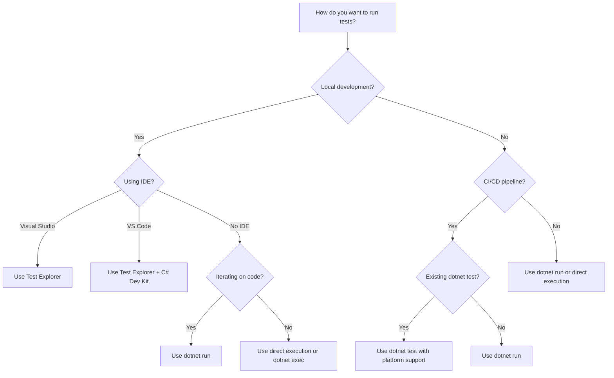

# Run tests with Microsoft.Testing.Platform

Microsoft.Testing.Platform test projects are built as executables that can be run directly or through various tools. This article explains the different execution methods and when to use each.

> [!TIP]
> If you're new to Microsoft.Testing.Platform, start with the [Getting Started guide](microsoft-testing-platform-getting-started.md) to create and run your first test project.

## Execution methods

Microsoft.Testing.Platform supports multiple ways to run tests, each suited for different scenarios:

| Method | Best for | Pros | Cons |
|--------|----------|------|------|
| [Direct execution](#direct-execution) | Production deployments, Native AOT | No dependencies, fastest startup | Requires separate build |
| [`dotnet run`](#dotnet-run) | Local development | Auto-rebuilds, finds project | Slower due to build check |
| [`dotnet exec`](#dotnet-exec) | Scripting, automation | Fast, explicit control | Requires exact path |
| [`dotnet test`](#dotnet-test) | CI/CD, existing workflows | Familiar, works with both platforms | Additional layer |
| [Visual Studio](#visual-studio) | Interactive testing, debugging | Rich UI, test management | IDE required |
| [Visual Studio Code](#visual-studio-code) | Cross-platform development | Lightweight, integrated | Extension required |
| [CI/CD pipelines](#continuous-integration) | Automated testing | Reliable, reproducible | Environment-specific setup |

### Direct execution

Run the test executable directly. This is the most straightforward method and works exactly like any other .NET application.

```bash
# Windows
.\MyTests.exe

# Linux/macOS
./MyTests
```

**When to use:**

- Production-like scenarios
- Native AOT deployments
- When you need complete control over the process
- Debugging specific runtime issues

**Requirements:**

- Project must be built first (`dotnet build` or `dotnet publish`)
- Test project must have `<OutputType>Exe</OutputType>`

For more information about publishing, see [.NET application publishing](../deploying/index.md).

### dotnet run

The `dotnet run` command builds and runs your test project in one step.

```dotnetcli
dotnet run --project MyTests
```

Pass arguments to the test executable using `--`:

```dotnetcli
dotnet run --project MyTests -- --filter "FullyQualifiedName~Calculator"
```

**When to use:**

- Local development and iteration
- When you want automatic rebuilds
- Testing during active code changes

**Benefits:**

- Automatically finds the project in the current directory
- Rebuilds only when needed
- Combines build and run in one command

For more information, see [dotnet run](../tools/dotnet-run.md).

### dotnet exec

The `dotnet exec` command (or just `dotnet`) runs an already-built test assembly.

```dotnetcli
dotnet exec MyTests.dll
```

Or the shorter form:

```dotnetcli
dotnet MyTests.dll
```

Pass arguments directly:

```dotnetcli
dotnet MyTests.dll --filter "FullyQualifiedName~Calculator"
```

**When to use:**

- Tests are already built
- Scripting and automation scenarios
- When you need fast execution without build checks

> [!NOTE]
> Use the `.dll` file, not the `.exe` file. Using the executable results in an error about duplicate assemblies.

For more information, see [dotnet exec](../tools/dotnet.md#options-for-running-an-application-with-the-exec-command).

### dotnet test

The `dotnet test` command provides compatibility with existing testing workflows. It works with both Microsoft.Testing.Platform and VSTest.

```dotnetcli
dotnet test
```

Microsoft.Testing.Platform supports two modes with `dotnet test`:

**For .NET 10 SDK and later (recommended):**

Add to *global.json*:

```json
{
  "test": {
    "runner": "Microsoft.Testing.Platform"
  }
}
```

Then use arguments directly:

```dotnetcli
dotnet test --filter "FullyQualifiedName~Calculator" --report-trx
```

**For .NET 9 SDK and earlier (VSTest mode):**

> [!CAUTION]
> Starting with .NET 10 SDK, it's recommended to not use the VSTest mode of `dotnet test` when running with Microsoft.Testing.Platform.

Set in your project file or *Directory.Build.props*:

```xml
<PropertyGroup>
  <TestingPlatformDotnetTestSupport>true</TestingPlatformDotnetTestSupport>
</PropertyGroup>
```

Use extra `--` to separate platform arguments:

```dotnetcli
dotnet test -- --filter "FullyQualifiedName~Calculator" --report-trx
```

**When to use:**

- Existing CI/CD pipelines using `dotnet test`
- When you need MSBuild integration
- Running multiple test projects in a solution

**VSTest mode configuration options:**

When using VSTest mode (.NET 9 SDK and earlier), you can configure these additional options:

**Show failure per test:**

By default, test failures are summarized into a *.log* file, and a single failure per test project is reported to MSBuild. To show errors per failed test:

```dotnetcli
dotnet test -p:TestingPlatformShowTestsFailure=true
```

Or in *Directory.Build.props*:

```xml
<PropertyGroup>
  <TestingPlatformShowTestsFailure>true</TestingPlatformShowTestsFailure>
</PropertyGroup>
```

**Show complete platform output:**

By default, all console output from the test executable is captured and hidden. To show the banner, version information, and formatted test information:

```dotnetcli
dotnet test -p:TestingPlatformCaptureOutput=false
```

Or in *Directory.Build.props*:

```xml
<PropertyGroup>
  <TestingPlatformCaptureOutput>false</TestingPlatformCaptureOutput>
</PropertyGroup>
```

> [!TIP]
> Set these properties in *Directory.Build.props* instead of individual project files. This ensures consistency across all test projects and avoids mixing VSTest and Microsoft.Testing.Platform projects in the same solution.

For complete information about using `dotnet test` with Microsoft.Testing.Platform, see [Testing with dotnet test](unit-testing-with-dotnet-test.md).

### Visual Studio

Visual Studio provides rich support for running and debugging tests through Test Explorer.

**Using Test Explorer:**

1. Open **Test Explorer** (Test > Test Explorer or <kbd>Ctrl</kbd>+<kbd>E</kbd>, <kbd>T</kbd>)
1. Tests are discovered automatically after building
1. Select tests and click **Run** or **Debug**
1. Use keyboard shortcuts: <kbd>Ctrl</kbd>+<kbd>R</kbd>, <kbd>A</kbd> to run all tests

**Running as startup project:**

1. Right-click the test project in Solution Explorer
1. Select **Set as Startup Project**
1. Press <kbd>F5</kbd> to debug or <kbd>Ctrl</kbd>+<kbd>F5</kbd> to run

**Benefits:**

- Visual test results and history
- Run/debug individual tests or groups
- Live test results while editing code
- Integration with code coverage tools

**Requirements:**

- Visual Studio 2022 version 17.14 or later for full Microsoft.Testing.Platform support

For more information, see [Run unit tests with Test Explorer](/visualstudio/test/run-unit-tests-with-test-explorer).

### Visual Studio Code

Visual Studio Code supports running and debugging tests through the C# Dev Kit extension.

**Setup:**

1. Install the [C# Dev Kit extension](https://marketplace.visualstudio.com/items?itemName=ms-dotnettools.csharp)
1. Open your test project folder
1. Build the project (<kbd>Ctrl</kbd>+<kbd>Shift</kbd>+<kbd>B</kbd>)

**Using Test Explorer:**

1. Open the **Test Explorer** view (Testing icon in the Activity Bar)
1. Tests are discovered after building
1. Select tests and click **Run Test** or **Debug Test**

**Using the integrated terminal:**

```dotnetcli
dotnet run --project MyTests
```

**Benefits:**

- Cross-platform support
- Lightweight compared to Visual Studio
- Integrated terminal for advanced scenarios
- Support for debugging with breakpoints

For more information, see [Testing in Visual Studio Code](https://code.visualstudio.com/docs/csharp/testing).

### Continuous integration

Microsoft.Testing.Platform tests run as regular executables in CI/CD environments. No special test runner or task is required.

**Azure Pipelines:**

```yml
- task: CmdLine@2
  displayName: "Run Tests"
  inputs:
    script: 'dotnet run --project tests/MyTests/MyTests.csproj'
```

**GitHub Actions:**

```yml
- name: Run Tests
  run: dotnet run --project tests/MyTests/MyTests.csproj
```

**GitLab CI:**

```yml
test:
  script:
    - dotnet run --project tests/MyTests/MyTests.csproj
```

**When to use:**

- Automated testing in build pipelines
- Continuous integration workflows
- Deployment validation

**Best practices:**

- Use `dotnet run` or `dotnet exec` for reliability
- Check exit codes to determine test success
- Generate reports for pipeline integration (use `--report-trx`)
- Store test results as artifacts

For more information about exit codes, see [Microsoft.Testing.Platform exit codes](microsoft-testing-platform-exit-codes.md).

## Passing arguments

All execution methods support passing command-line arguments to configure test execution:

**Direct execution:**

```bash
./MyTests.exe --filter "FullyQualifiedName~Calculator" --report-trx
```

**dotnet run:**

```dotnetcli
dotnet run --project MyTests -- --filter "FullyQualifiedName~Calculator"
```

**dotnet exec:**

```dotnetcli
dotnet MyTests.dll --filter "FullyQualifiedName~Calculator"
```

**dotnet test (.NET 10+):**

```dotnetcli
dotnet test --filter "FullyQualifiedName~Calculator" --report-trx
```

For a complete list of available options, see [Configuration reference](microsoft-testing-platform-options.md).

## Debugging tests

All execution methods support debugging:

**Visual Studio:**

- Use Test Explorer's **Debug** option for specific tests
- Set test project as startup project and press <kbd>F5</kbd>
- Attach to running test process

**Visual Studio Code:**

- Use Test Explorer's **Debug Test** option
- Set up launch configuration for test project
- Use <kbd>F5</kbd> with test project

**Command line:**

- Use `dotnet run` and attach debugger to process
- Set `DOTNET_WAIT_FOR_DEBUGGER=1` environment variable to wait for debugger on startup

For more information about debugging, see [Debug unit tests](/visualstudio/test/debug-unit-tests-with-test-explorer).

## Choosing an execution method

Use this decision tree to choose the best execution method:



## See also

- [Get started with Microsoft.Testing.Platform](microsoft-testing-platform-getting-started.md)
- [Configuration reference](microsoft-testing-platform-options.md)
- [Testing with dotnet test](unit-testing-with-dotnet-test.md)
- [Microsoft.Testing.Platform exit codes](microsoft-testing-platform-exit-codes.md)
- [Running selective unit tests](selective-unit-tests.md)
