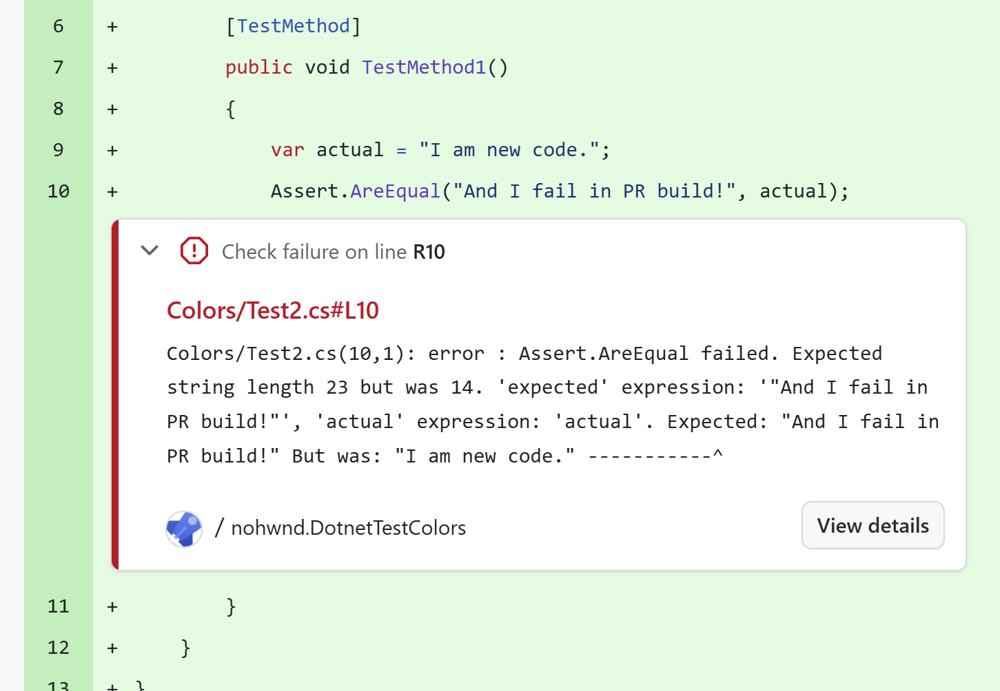

# Test reports

These features require installing additional NuGet packages, as described in each section.

> [!TIP]
> When using [Microsoft.Testing.Platform.MSBuild](https://www.nuget.org/packages/Microsoft.Testing.Platform.MSBuild) (included transitively by MSTest, NUnit, and xUnit runners), these extensions are auto-registered when you install their NuGet packages — no code changes needed. The manual registration specified in this article is only required if you disabled the auto-generated entry point by setting `<GenerateTestingPlatformEntryPoint>false</GenerateTestingPlatformEntryPoint>`.

## Report file names

Every report extension writes its file to the test results directory, which you can set with the [`--results-directory`](microsoft-testing-platform-cli-options.md) option. To override the name, use the matching `--report-*-filename` option. Each report section lists the default name for that report.

A file name can include a relative path that stays within the test results directory, and it can use the following replacement items (placeholders):

| Placeholder | Description |
|---|---|
| `{asm}` | Entry assembly name, or `unknown` when it's unavailable. |
| `{tfm}` | Target framework moniker detected at runtime, such as `net9.0`. |
| `{arch}` | Process architecture, such as `x64`, `x86`, or `arm64`. |
| `{pname}` | Process name. |
| `{pid}` | Process ID. |
| `{time}` | High-precision timestamp. |

For example, `--report-trx-filename "{asm}_{tfm}_{arch}.trx"` reproduces the default TRX name.

> [!NOTE]
> Placeholder names are case-sensitive and use lowercase. Placeholder support for report file names is available in MTP starting with version 2.3.0.

## Visual Studio test reports (TRX)

The Visual Studio test result file (or TRX) is the default format for publishing test results. This extension requires the [Microsoft.Testing.Extensions.TrxReport](https://nuget.org/packages/Microsoft.Testing.Extensions.TrxReport) NuGet package.

### Manual registration

```csharp
var builder = await TestApplication.CreateBuilderAsync(args);
builder.AddTrxReportProvider();
```

> [!NOTE]
> When using manual registration, register the TRX report provider last. The current implementation depends on registration order, so registering it after all other extensions ensures it captures all test data.

> [!NOTE]
> Available in MTP starting with version 1.9.0, the TRX report includes the test `Description` field.

> [!NOTE]
> Available in MTP starting with version 2.3.0, TRX results stream to disk as the run progresses. If the test host crashes, the TRX file keeps the results collected before the crash.

### Options

| Option | Description |
|---|---|
| `--report-trx` | Generates the TRX report. |
| `--report-trx-filename` | The name of the generated TRX report. Starting with MTP 2.3.0, the default is the deterministic `{asm}_{tfm}_{arch}.trx` form; before MTP 2.3.0, the default was `<UserName>_<MachineName>_<yyyy-MM-dd_HH_mm_ss.fffffff>.trx`. To customize the name, see [Report file names](#report-file-names). |

The report is saved inside the default _TestResults_ folder that can be specified through the `--results-directory` command line argument.

## HTML reports

The HTML report creates an interactive, self-contained HTML file for a test session. This extension requires the [Microsoft.Testing.Extensions.HtmlReport](https://nuget.org/packages/Microsoft.Testing.Extensions.HtmlReport) NuGet package.

> [!NOTE]
> Available in MTP starting with version 2.3.0. This extension is experimental, and its options and output format might change in a future version.

### Manual registration

```csharp
var builder = await TestApplication.CreateBuilderAsync(args);
builder.AddHtmlReportProvider();
```

### Options

| Option | Description |
|---|---|
| `--report-html` | Generates the HTML report. |
| `--report-html-filename` | The name of the generated HTML report. The value must end with `.html`. The default is `{asm}_{tfm}_{arch}.html`. To customize the name, see [Report file names](#report-file-names). Requires `--report-html`. |

## JUnit reports

The JUnit report creates a JUnit-compatible XML file for a test session. This extension requires the [Microsoft.Testing.Extensions.JUnitReport](https://nuget.org/packages/Microsoft.Testing.Extensions.JUnitReport) NuGet package.

> [!NOTE]
> Available in MTP starting with version 2.3.0. This extension is experimental, and its options and output format might change in a future version.

### Manual registration

```csharp
var builder = await TestApplication.CreateBuilderAsync(args);
builder.AddJUnitReportProvider();
```

### Options

| Option | Description |
|---|---|
| `--report-junit` | Generates the JUnit XML report. |
| `--report-junit-filename` | The name of the generated JUnit XML report. The value must end with `.xml`. The default is `{asm}_{tfm}_{arch}.xml`. To customize the name, see [Report file names](#report-file-names). Requires `--report-junit`. |

## CTRF reports

The CTRF report creates a JSON file that uses the [Common Test Report Format](https://ctrf.io) for a test session. This extension requires the [Microsoft.Testing.Extensions.CtrfReport](https://nuget.org/packages/Microsoft.Testing.Extensions.CtrfReport) NuGet package.

> [!NOTE]
> Available in MTP starting with version 2.3.0. This extension is experimental, and its options and output format might change in a future version.

### Manual registration

```csharp
var builder = await TestApplication.CreateBuilderAsync(args);
builder.AddCtrfReportProvider();
```

### Options

| Option | Description |
|---|---|
| `--report-ctrf` | Generates the CTRF JSON report. |
| `--report-ctrf-filename` | The name of the generated CTRF JSON report. The value must end with `.json`. The default is `<UserName>_<MachineName>_<assembly>_<tfm>_<timestamp>.ctrf.json`. To customize the name, see [Report file names](#report-file-names). Requires `--report-ctrf`. |

## Azure DevOps reports

Azure DevOps report plugin enhances test running for developers that host their code on GitHub, but build on Azure DevOps build agents. It adds additional information to failures to show failure directly in GitHub PR.



This extension requires the [Microsoft.Testing.Extensions.AzureDevOpsReport](https://nuget.org/packages/Microsoft.Testing.Extensions.AzureDevOpsReport) NuGet package.

### Manual registration

```csharp
var builder = await TestApplication.CreateBuilderAsync(args);
builder.TestHost.AddAzureDevOpsProvider();
```

### Options

| Option | Description |
|---|---|
| `--report-azdo` | Enables the Azure DevOps report generator. Errors and warnings are written to the output in a format that Azure DevOps understands. |
| `--report-azdo-severity` | Severity to use for reported events. Valid values are `error` (default) and `warning`. |
| `--report-azdo-flaky-history` | Queries Azure DevOps test result history for the past N days (1-90) and annotates reported failures with flakiness context. Requires `--report-azdo`. |
| `--report-azdo-demote-known-flaky` | Demotes failures that are flaky enough in the Azure DevOps history window (default threshold is 25%) from errors to warnings. Requires `--report-azdo` and `--report-azdo-flaky-history`. |
| `--report-azdo-quarantine-file` | Path to a text file that lists quarantined test fully qualified names or glob patterns. Matching failures are reported as warnings. Requires `--report-azdo`. |
| `--report-azdo-summary` | Writes a Markdown job summary at the end of the test run and uploads it through `##vso[task.uploadsummary]`. An optional file path argument overrides the default location (`{testResultsDir}/azdo-summary-{tfm}.md`). Requires `--report-azdo`. |
| `--report-azdo-stackframe-filter` | Adds regex patterns, matched against the fully qualified type prefix of each stack frame, that are skipped when the extension locates the user's call site to annotate. The option is repeatable, up to 16 patterns, and each pattern is compiled with a 500-ms match timeout. These patterns are additive to the extension's built-in MSTest assertion-implementation prefixes. Requires `--report-azdo`. |
| `--report-azdo-upload-artifacts` | Uploads test result files and/or adds build tags to Azure DevOps. Valid values are `off` (default), `tags-only`, `files`, and `all`. |
| `--report-azdo-upload-artifact-include` | Includes files in the Azure DevOps artifact upload using glob patterns relative to the test results directory. Defaults to `**/*`. Requires `--report-azdo-upload-artifacts` to be a value other than `off`. |
| `--report-azdo-upload-artifact-exclude` | Excludes files from the Azure DevOps artifact upload using glob patterns relative to the test results directory. Requires `--report-azdo-upload-artifacts` to be a value other than `off`. |
| `--report-azdo-upload-artifact-name` | Overrides the Azure DevOps artifact container name. Defaults to `TestResults_{assemblyName}_{tfm}`. Requires `--report-azdo-upload-artifacts` to be a value other than `off`. |
| `--publish-azdo-test-results` | Publishes test results live to the Azure DevOps **Tests** tab. |
| `--publish-azdo-run-name` | Sets a custom Azure DevOps test run name for live test-result publishing. Requires `--publish-azdo-test-results`. |

> [!NOTE]
> The Azure DevOps extension became stable in MTP 1.9.0 (`--report-azdo` and `--report-azdo-severity`). All other options in the table — `--report-azdo-flaky-history`, `--report-azdo-demote-known-flaky`, `--report-azdo-quarantine-file`, `--report-azdo-summary`, `--report-azdo-stackframe-filter`, `--report-azdo-upload-artifacts`, `--report-azdo-upload-artifact-include`, `--report-azdo-upload-artifact-exclude`, `--report-azdo-upload-artifact-name`, `--publish-azdo-test-results`, and `--publish-azdo-run-name` — are available in MTP starting with version 2.3.0.

The extension automatically detects that it is running in continuous integration (CI) environment by checking the `TF_BUILD` environment variable.

## GitHub Actions reports

The GitHub Actions report emits GitHub Actions-native workflow commands so test runs produce a first-class experience on the runner: per-assembly log groups, failed and skipped test annotations (surfaced in the workflow **Annotations** tab and, when the source location resolves, on the pull request's **Files changed** diff), a Markdown job summary appended to the file referenced by `GITHUB_STEP_SUMMARY`, and slow-test notices.

The extension activates only when the run is on GitHub Actions (the `GITHUB_ACTIONS` environment variable is `true`) and the `--report-gh` switch is set; otherwise it does nothing. When active, each feature is enabled by default and can be turned off individually with its `--report-gh-*` option.

> [!NOTE]
> Available in MTP starting with version 2.3.0. This extension is experimental, and its options and output format might change in a future version.

### Manual registration

```csharp
var builder = await TestApplication.CreateBuilderAsync(args);
builder.AddGitHubActionsProvider();
```

### Options

| Option | MTP version | Description |
|---|---|---|
| `--report-gh` | 2.3.0 | Enables the GitHub Actions report generator so test runs emit workflow commands. Requires the run to be on GitHub Actions. |
| `--report-gh-groups` | 2.3.0 | Enables or disables per-assembly log groups. Valid values are `on` (default) and `off`. Requires `--report-gh`. |
| `--report-gh-annotations` | 2.3.0 | Enables or disables annotations for failed and skipped tests. Valid values are `on` (default) and `off`. Requires `--report-gh`. |
| `--report-gh-step-summary` | 2.3.0 | Enables or disables writing a Markdown job summary to the file referenced by `GITHUB_STEP_SUMMARY`. Valid values are `on` (default) and `off`. Requires `--report-gh`. |
| `--report-gh-slow-test-notices` | 2.3.0 | Enables or disables slow-test notices. Valid values are `on` (default) and `off`. Requires `--report-gh`. |
| `--report-gh-slow-test-threshold` | 2.3.0 | The duration a test can run before a slow-test notice is emitted. Accepts a bare number of seconds or a value with a unit suffix such as `90s`, `2m`, or `1.5h`. The default is `60s`. Requires `--report-gh`. |
