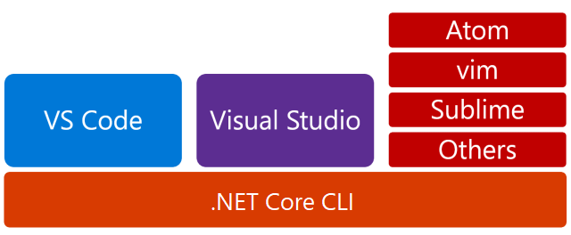
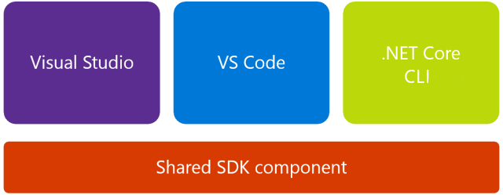

# High-level overview of changes in the .NET Core tools

This document describes the changes associated with moving from *project.json* to MSBuild and the *csproj* project system with information on the changes to the layering of the .NET Core tooling and the implementation of the CLI commands. These changes occurred with the release of .NET Core SDK 1.0 and Visual Studio 2017 on March 7, 2017 (see the [announcement](https://devblogs.microsoft.com/dotnet/announcing-net-core-tools-1-0/)) but were initially implemented with the release of the .NET Core SDK Preview 3.

## Moving away from project.json

The biggest change in the tooling for .NET Core is certainly the [move away from project.json to csproj](https://devblogs.microsoft.com/dotnet/changes-to-project-json/) as the project system. The latest versions of the command-line tools don't support *project.json* files. That means that it cannot be used to build, run, or publish project.json based applications and libraries. To use this version of the tools, migrate your existing projects or start new ones.

As part of this move, the custom build engine that was developed to build project.json projects was replaced with a mature and fully capable build engine called [MSBuild](https://github.com/Microsoft/msbuild). MSBuild is a well-known engine in the .NET community. It has been a key technology since the platform's first release. Because it needs to build .NET Core applications, MSBuild has been ported to .NET Core and can be used on any platform that .NET Core runs on. One of the main promises of .NET Core is that of a cross-platform development stack, and we have made sure that this move does not break that promise.

> [!TIP]
> If you are new to MSBuild and would like to learn more about it, you can start by reading the [MSBuild concepts](/visualstudio/msbuild/msbuild-concepts) article.

## The tooling layers

With the change in build engine and the move away from the existing project system, some questions naturally follow. Do any of these changes change the overall "layering" of the .NET Core tooling ecosystem? Are there new bits and components?

Let's start with a quick refresher on Preview 2 layering as shown in the following picture:



The layering of the tools in Preview 2 is straightforward. At the bottom, the foundation is the .NET Core CLI. All other, higher-level tools, such as Visual Studio or Visual Studio Code, depend and rely on the CLI to build projects, restore dependencies, and so on. For example, if Visual Studio wanted to perform a restore operation, it would call into the `dotnet restore` command in the CLI.

With the move to the new project system, the previous diagram changes:



The main difference is that the CLI is not the foundational layer anymore; this role is now filled by the "shared SDK component". This shared SDK component is a set of targets and associated tasks that are responsible for compiling code, publishing it, packing NuGet packages, and so on. The .NET Core SDK is open-source and is available on GitHub on the [SDK repo](https://github.com/dotnet/sdk).

> [!NOTE]
> A "target" is an MSBuild term that indicates a named operation that MSBuild can invoke. It is usually coupled with one or more tasks that execute some logic that the target is supposed to do. MSBuild supports many ready-made targets such as `Copy` or `Execute`; it also allows users to write their own tasks using managed code and define targets to execute those tasks. For more information, see [MSBuild tasks](/visualstudio/msbuild/msbuild-tasks).

All the toolsets now consume the shared SDK component and its targets, CLI included. For example, Visual Studio 2019 doesn't call into the `dotnet restore` command to restore dependencies for .NET Core projects. Instead, it uses the "Restore" target directly. Since these are MSBuild targets, you can also use raw MSBuild to execute them using the [dotnet msbuild](dotnet-msbuild.md) command.

### CLI commands

The shared SDK component means that the majority of existing CLI commands have been reimplemented as MSBuild tasks and targets. What does this mean for the CLI commands and your usage of the toolset?

From a usage perspective, it doesn't change the way you use the CLI. The CLI still has the core commands that existed in the .NET Core 1.0 Preview 2 release:

- `new`
- `restore`
- `run`
- `build`
- `publish`
- `test`
- `pack`

These commands still do what you expect them to do (new up a project, build it, publish it, pack it, and so on). You can consult either the command's help screen (using `dotnet <command> --help`) or documentation on this site to get familiar with their behavior.

From an execution perspective, the CLI commands take their parameters and construct a call to "raw" MSBuild that sets the needed properties and runs the desired target. To better illustrate this, consider the following command:

   ```dotnetcli
   dotnet publish -o pub -c Release
   ```

This command publishes an application into a `pub` folder using the "Release" configuration. Internally, this command gets translated into the following MSBuild invocation:

   ```dotnetcli
   dotnet msbuild -t:Publish -p:OutputPath=pub -p:Configuration=Release
   ```

Notable exceptions to this rule are the `new` and `run` commands. They have not been implemented as MSBuild targets.

### Implicit restore

[!INCLUDE[DotNet Restore Note](~/includes/dotnet-restore-note.md)]
