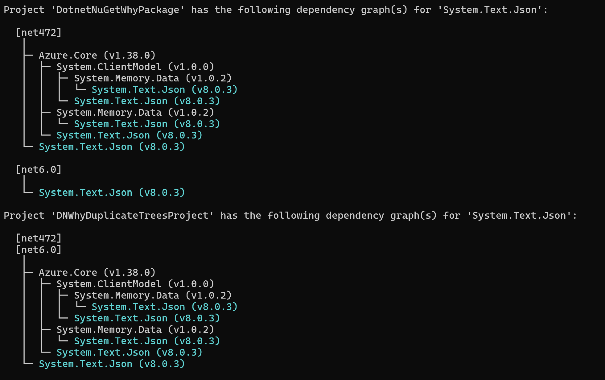

# dotnet nuget why

**This article applies to:** ✔️ .NET 8.0.4xx SDK and later versions

## Name

`dotnet nuget why` - Shows the dependency graph for a particular package.

## Synopsis

```dotnetcli
dotnet nuget why <PROJECT|SOLUTION> <PACKAGE> [-f|--framework <FRAMEWORK>]

dotnet nuget why -h|--help
```

## Description

The `dotnet nuget why` command shows the dependency graph for a particular package for a given project or solution.

Starting from the .NET 9 SDK, it's possible to pass a NuGet assets file in place of the project file, in order to use the command with projects that can't be restored with the .NET SDK.
First, restore the project in Visual Studio, or `msbuild.exe`.
By default the assets file is in the project's `obj\` directory, but you can find the location with `msbuild.exe path\to\project.proj -getProperty:ProjectAssetsFile`.
Finally, run `dotnet nuget why path\to\project.assets.json SomePackage`.

Starting with version 9.0.200, the command introduces support for runtime identifier (RID) specific packages by generating separate dependency trees for each RID and framework combination.
For example, if a project targets `net9.0` with the `win-x64` RID, the command generates trees for `net9.0/win-x64` and `net9.0`.

## Arguments

- **`PROJECT|SOLUTION`**

  The project or solution file to operate on. If a directory is specified, the command searches the directory for a project or solution file. If more than one project or solution is found, an error is thrown.

- **`PACKAGE`**

  The package name to look up in the dependency graph.

## Options

- **`-f|--framework <FRAMEWORK>`**

    The target framework(s) for which dependency graphs are shown. You can pass multiple `--framework` options to see graphs for more than one framework.

[!INCLUDE [help](../../../includes/cli-help.md)]

## Examples

- Show the dependency graph for the package "System.Text.Json" for a given solution:

    ```dotnetcli
    dotnet nuget why .\DotnetNuGetWhyPackage.sln System.Text.Json
    ```

    

- Show the dependency graph for the package "System.Text.Json" for a single project:

    ```dotnetcli
    dotnet nuget why .\DotnetNuGetWhyPackage.csproj System.Text.Json
    ```

- Show the dependency graph for a specific target framework:

    ```dotnetcli
    dotnet nuget why .\DotnetNuGetWhyPackage.csproj System.Text.Json --framework net6.0
    ```
