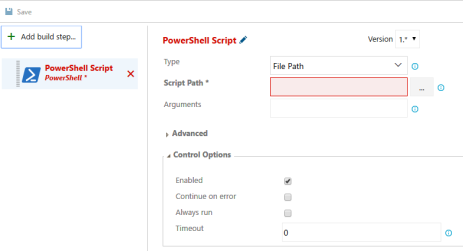

# Using .NET Core SDK and tools in Continuous Integration (CI)

## Overview

This document outlines using the .NET Core SDK and its tools on a build server. The .NET Core toolset works both interactively, where a developer types commands at a command prompt, and automatically, where a Continuous Integration (CI) server runs a build script. The commands, options, inputs, and outputs are the same, and the only things you supply are a way to acquire the tooling and a system to build your app. This document focuses on scenarios of tool acquisition for CI with recommendations on how to design and structure your build scripts.

## Installation options for CI build servers

### Using the native installers

Native installers are available for macOS, Linux, and Windows. The installers require admin (sudo) access to the build server. The advantage of using a native installer is that it installs all of the native dependencies required for the tooling to run. Native installers also provide a system-wide installation of the SDK.

macOS users should use the PKG installers. On Linux, there's a choice of using a feed-based package manager, such as apt-get for Ubuntu or yum for CentOS, or using the packages themselves, DEB or RPM. On Windows, use the MSI installer.

The latest stable binaries are found at [Get Started with .NET Core](https://aka.ms/dotnetcoregs). If you wish to use the latest (and potentially unstable) pre-release tooling, use the links provided at the [dotnet/cli GitHub repository](https://github.com/dotnet/cli#installers-and-binaries). For Linux distributions, `tar.gz` archives (also known as `tarballs`) are available; use the installation scripts within the archives to install .NET Core.

### Using the installer script

Using the installer script allows for non-administrative installation on your build server and easy automation for obtaining the tooling. The script takes care of downloading the tooling and extracting it into a default or specified location for use. You can also specify a version of the tooling that you wish to install and whether you want to install the entire SDK or only the shared runtime.

The installer script is automated to run at the start of the build to fetch and install the desired version of the SDK. The *desired version* is whatever version of the SDK your projects require to build. The script allows you to install the SDK in a local directory on the server, run the tools from the installed location, and then clean up (or let the CI service clean up) after the build. This provides encapsulation and isolation to your entire build process. The installation script reference is found in the [dotnet-install](dotnet-install-script.md) topic.

> [!NOTE]
> When using the installer script, native dependencies aren't installed automatically. You must install the native dependencies if the operating system doesn't have them. See the list of prerequisites in the [.NET Core native prerequisites](https://github.com/dotnet/core/blob/master/Documentation/prereqs.md) topic.

## CI setup examples

This section describes a manual setup using a PowerShell or bash script, along with a description of several software as a service (SaaS) CI solutions. The SaaS CI solutions covered are [Travis CI](https://travis-ci.org/), [AppVeyor](https://www.appveyor.com/), and [Visual Studio Team Services Build](https://docs.microsoft.com/vsts/build-release/index).

### Manual setup

Each SaaS service has its own methods for creating and configuring a build process. If you use different SaaS solution than those listed or require customization beyond the pre-packaged support, you must perform at least some manual configuration.

In general, a manual setup requires you to acquire a version of the tools (or the latest nightly builds of the tools) and run your build script. You can use a PowerShell or bash script to orchestrate the .NET Core commands or use a project file that outlines the build process. The [orchestration section](#orchestrating-the-build) provides more detail on these options.

After you create a script that performs a manual CI build server setup, use it on your dev machine to build your code locally for testing purposes. Once you confirm that the script is running well locally, deploy it to your CI build server. A relatively simple PowerShell script demonstrates how to obtain the .NET Core SDK and install it on a Windows build server:

```powershell
$ErrorActionPreference="Stop"
$ProgressPreference="SilentlyContinue"

# $LocalDotnet is the path to the locally-installed SDK to ensure the 
#   correct version of the tools are executed.
$LocalDotnet=""
# $InstallDir and $CliVersion variables can come from options to the 
#   script.
$InstallDir = "./cli-tools"
$CliVersion = "1.0.1"

# Test the path provided by $InstallDir to confirm it exists. If it 
#   does, it's removed. This is not strictly required, but it's a 
#   good way to reset the environment.
if (Test-Path $InstallDir)
{
    rm -Recurse $InstallDir
}
New-Item -Type "directory" -Path $InstallDir

Write-Host "Downloading the CLI installer..."

# Use the Invoke-WebRequest PowerShell cmdlet to obtain the 
#   installation script and save it into the installation directory.
Invoke-WebRequest `
    -Uri "https://dot.net/v1/dotnet-install.ps1" `
    -OutFile "$InstallDir/dotnet-install.ps1"

Write-Host "Installing the CLI requested version ($CliVersion) ..."

# Install the SDK of the version specified in $CliVersion into the 
#   specified location ($InstallDir).
& $InstallDir/dotnet-install.ps1 -Version $CliVersion `
    -InstallDir $InstallDir

Write-Host "Downloading and installation of the SDK is complete."

# $LocalDotnet holds the path to dotnet.exe for future use by the 
#   script.
$LocalDotnet = "$InstallDir/dotnet"

# Run the build process now. Implement your build script here.
```

You provide the implementation for your build process at the end of the script. The script acquires the tools and then executes your build process. For UNIX machines, the following bash script performs the actions described in the PowerShell script in a similar manner:

```bash
#!/bin/bash
INSTALLDIR="cli-tools"
CLI_VERSION=1.0.1
DOWNLOADER=$(which curl)
if [ -d "$INSTALLDIR" ]
then
    rm -rf "$INSTALLDIR"
fi
mkdir -p "$INSTALLDIR"
echo Downloading the CLI installer.
$DOWNLOADER https://dot.net/v1/dotnet-install.sh > "$INSTALLDIR/dotnet-install.sh"
chmod +x "$INSTALLDIR/dotnet-install.sh"
echo Installing the CLI requested version $CLI_VERSION. Please wait, installation may take a few minutes.
"$INSTALLDIR/dotnet-install.sh" --install-dir "$INSTALLDIR" --version $CLI_VERSION
if [ $? -ne 0 ]
then
    echo Download of $CLI_VERSION version of the CLI failed. Exiting now.
    exit 0
fi
echo The CLI has been installed.
LOCALDOTNET="$INSTALLDIR/dotnet"
# Run the build process now. Implement your build script here.
```

### Travis CI

You can configure [Travis CI](https://travis-ci.org/) to install the .NET Core SDK using the `csharp` language and the `dotnet` key. See the official Travis CI docs on [Building a C#, F#, or Visual Basic Project](https://docs.travis-ci.com/user/languages/csharp/) for more information. Note as you access the Travis CI information that the community-maintained `language: csharp` language identifier works for all .NET languages, including F#, and Mono.

Travis CI runs both macOS (OS X 10.11, OS X 10.12) and Linux (Ubuntu 14.04) jobs in a *build matrix*, where you specify a combination of runtime, environment, and exclusions/inclusions to cover your build combinations for your app. See the [.travis.yml example](https://github.com/dotnet/docs/blob/master/.travis.yml) file and [Customizing the Build](https://docs.travis-ci.com/user/customizing-the-build) in the Travis CI docs for more information. The MSBuild-based tools include the LTS (1.0.x) and Current (1.1.x) runtimes in the package; so by installing the SDK, you receive everything you need to build.

### AppVeyor

[AppVeyor](https://www.appveyor.com/) installs the .NET Core 1.0.1 SDK with the `Visual Studio 2017` build worker image. Other build images with different versions of the .NET Core SDK are available; see the [appveyor.yml example](https://github.com/dotnet/docs/blob/master/appveyor.yml) and the [Build worker images](https://www.appveyor.com/docs/build-environment/#build-worker-images) topic in the AppVeyor docs for more information.

The .NET Core SDK binaries are downloaded and unzipped in a subdirectory using the install script, and then they're added to the `PATH` environment variable. Add a build matrix to run integration tests with multiple versions of the .NET Core SDK:

```yaml
environment:
  matrix:
    - CLI_VERSION: 1.0.1
    - CLI_VERSION: Latest

install:
  # See appveyor.yml example for install script
```

### Visual Studio Team Services (VSTS)

Configure Visual Studio Team Services (VSTS) to build .NET Core projects using one of these approaches:

1. Run the script from the [manual setup step](#manual-setup) using your commands.
1. Create a build composed of several VSTS built-in build tasks that are configured to use .NET Core tools.

Both solutions are valid. Using a manual setup script, you control the version of the tools that you receive, since you download them as part of the build. The build is run from a script that you must create. This topic only covers the manual option. For more information on composing a build with VSTS build tasks, visit the VSTS [Continuous integration and deployment](https://docs.microsoft.com/vsts/build-release/index) topic.

To use a manual setup script in VSTS, create a new build definition and specify the script to run for the build step. This is accomplished using the VSTS user interface:

1. Start by creating a new build definition. Once you reach the screen that provides you an option to define what kind of a build you wish to create, select the **Empty** option.

   

1. After configuring the repository to build, you're directed to the build definitions. Select **Add build step**:

   

1. You're presented with the **Task catalog**. The catalog contains tasks that you use in the build. Since you have a script, select the **Add** button for **PowerShell: Run a PowerShell script**.

   

1. Configure the build step. Add the script from the repository that you're building:

   

## Orchestrating the build

Most of this document describes how to acquire the .NET Core tools and configure various CI services without providing information on how to orchestrate, or *actually build*, your code with .NET Core. The choices on how to structure the build process depend on many factors that cannot be covered in a general way here. Explore the resources and samples provided in the documentation sets of [Travis CI](https://travis-ci.org/), [AppVeyor](https://www.appveyor.com/), and [VSTS](https://docs.microsoft.com/vsts/build-release/index) for more information on orchestrating your builds with each technology.

Two general approaches that you take in structuring the build process for .NET Core code using the .NET Core tools are using MSBuild directly or using the .NET Core command-line commands. Which approach you should take is determined by your comfort level with the approaches and trade-offs in complexity. MSBuild provides you the ability to express your build process as tasks and targets, but it comes with the added complexity of learning MSBuild project file syntax. Using the .NET Core command-line tools is perhaps simpler, but it requires you to write orchestration logic in a scripting language like `bash` or PowerShell.

## See also

[Ubuntu acquisition steps](https://www.microsoft.com/net/core#linuxubuntu)   
