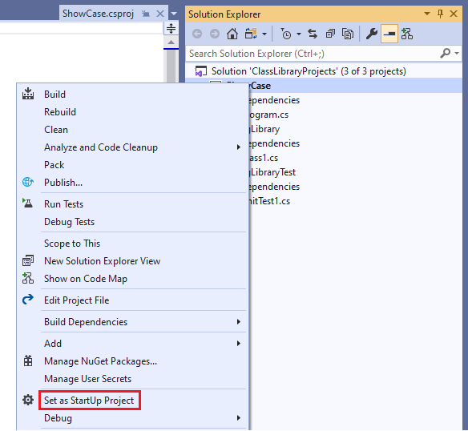
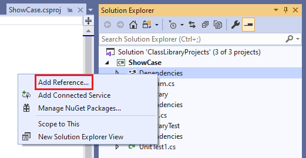
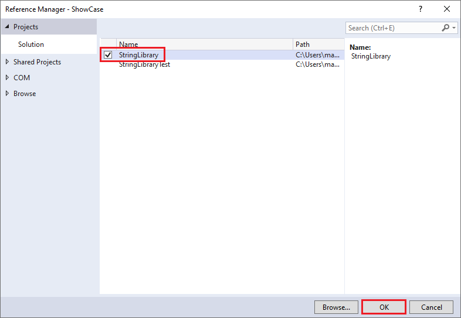

# Consume a .NET Standard library in Visual Studio

Once you've created a .NET Standard class library, tested it, and built a release version of the library, the next step is to make it available to callers. You can do this in two ways:

- If the library will be used by a single solution (for example, if it's a component in a single large application), you can include it as a project in your solution.
- If the library will be publicly available, you can distribute it as a NuGet package.

## Add a console app to your solution

Just as you included unit tests in the same solution as your class library in [Test a .NET Standard library with .NET Core in Visual Studio 2017](testing-library-with-visual-studio.md), you can include your application as part of that solution. For example, you can use your class library in a console application that prompts the user to enter a string and reports whether its first character is uppercase:

## [C#](#tab/csharp)

1. Open the `ClassLibraryProjects` solution you created in the [Build a .NET Standard library in Visual Studio](library-with-visual-studio.md) article.

1. Add a new C# .NET Core console application named "ShowCase" to the solution.

   1. Right-click on the solution in **Solution Explorer** and select **Add** > **New project**.

   1. On the **Add a new project** page, enter **console** in the search box. Choose **C#** from the Language list,  and then choose **All platforms** from the Platform list. Choose the **Console App (.NET Core)** template, and then choose **Next**.

   1. On the **Configure your new project** page, enter **ShowCase** in the **Project name** box. Then, choose **Create**.

1. In **Solution Explorer**, right-click the **ShowCase** project and select **Set as StartUp Project** in the context menu.

   

1. Initially, your project doesn't have access to your class library. To allow it to call methods in your class library, you create a reference to the class library. In **Solution Explorer**, right-click the `ShowCase` project's **Dependencies** node and select **Add Reference**.

   

1. In the **Reference Manager** dialog, select **StringLibrary**, your class library project, and select the **OK** button.

   

1. In the code window for the *Program.cs* file, replace all of the code with the following code:

   [!code-csharp[UsingClassLib#1](~/samples/snippets/csharp/getting_started/with_visual_studio_2017/showcase.cs)]

   The code uses the `row` variable to maintain a count of the number of rows of data written to the console window. Whenever it's greater than or equal to 25, the code clears the console window and displays a message to the user.

   The program prompts the user to enter a string. It indicates whether the string starts with an uppercase character. If the user presses the Enter key without entering a string, the application ends, and the console window closes.

1. If necessary, change the toolbar to compile the **Debug** release of the `ShowCase` project. Compile and run the program by selecting the green arrow on the **ShowCase** button.

   

## [Visual Basic](#tab/vb)

1. Open the `ClassLibraryProjects` solution you created in the [Building a class Library with .NET Standard in Visual Studio](library-with-visual-studio.md) topic. In **Solution Explorer**, right-click the **ClassLibraryProjects** solution and select **Add** > **New Project** from the context menu.

1. In the **Add New Project** dialog, expand the **Visual Basic** node and select the **.NET Core** node followed by the **Console App (.NET Core)** project template. In the **Name** text box, type "ShowCase", and select the **OK** button.

   

1. In **Solution Explorer**, right-click the **ShowCase** project and select **Set as StartUp Project** in the context menu.

   

1. Initially, your project doesn't have access to your class library. To allow it to call methods in your class library, you create a reference to the class library. In **Solution Explorer**, right-click the `ShowCase` project's **Dependencies** node and select **Add Reference**.

   

1. In the **Reference Manager** dialog, select **StringLibrary**, your class library project, and select the **OK** button.

   

1. In the code window for the *Program.vb* file, replace all of the code with the following code:

    [!code-vb[UsingClassLib#1](~/samples/snippets/core/tutorials/vb-library-with-visual-studio/showcase.vb)]

   The code uses the `row` variable to maintain a count of the number of rows of data written to the console window. Whenever it's greater than or equal to 25, the code clears the console window and displays a message to the user.

   The program prompts the user to enter a string. It indicates whether the string starts with an uppercase character. If the user presses the Enter key without entering a string, the application ends, and the console window closes.

1. If necessary, change the toolbar to compile the **Debug** release of the `ShowCase` project. Compile and run the program by selecting the green arrow on the **ShowCase** button.

   

---

You can debug and publish the application that uses this library by following the steps in [Debugging your Hello World application with Visual Studio 2019](debugging-with-visual-studio.md) and [Publishing your Hello World Application with Visual Studio 2019](publishing-with-visual-studio.md).

## Distribute the library in a NuGet package

You can make your class library widely available by publishing it as a NuGet package. Visual Studio doesn't support the creation of NuGet packages. To create one, you use the [`dotnet` command line utility](../tools/dotnet.md):

1. Open a console window.

   For example, enter **Command Prompt** in the search box on the Windows task bar. Select the **Command Prompt** desktop app or press **Enter** if it's already selected in the search results.

1. Navigate to your library's project directory. Unless you've reconfigured the typical file location, it's in the *Documents\Visual Studio 2019\Projects\ClassLibraryProjects\StringLibrary* directory. The directory contains your source code and a project file, *StringLibrary.csproj*.

1. Issue the command `dotnet pack --no-build`. The `dotnet` utility generates a package with a *.nupkg* extension.

   > [!TIP]
   > If the directory that contains *dotnet.exe* is not in your PATH, you can find its location by entering `where dotnet.exe` in the console window.

For more information on creating NuGet packages, see [How to Create a NuGet Package with Cross Platform Tools](../deploying/creating-nuget-packages.md).
