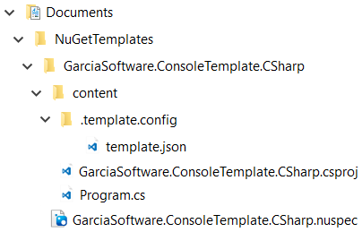
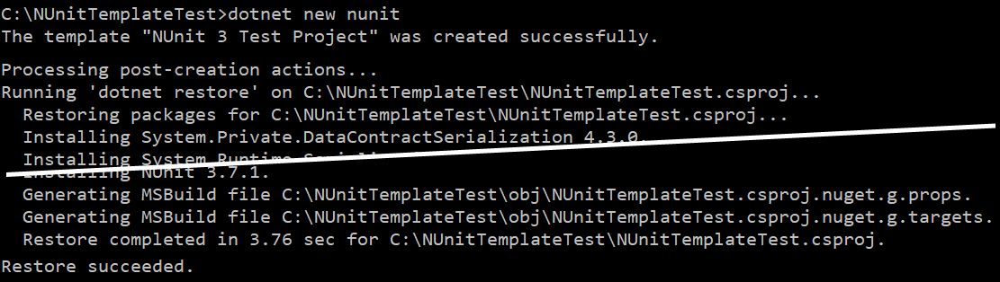

# Create a custom template for dotnet new

With .NET Core, you can create and deploy templates that generate projects, files, even resources. This tutorial teaches you how to build different .NET Core templates. You'll also learn how to create a template pack to easily distribute one or more templates. This tutorial shows you how to:

- Create an item template that generates a code file.
- Create a project template that generates a .NET Core Project.
- Create a _.csporj_ project file used for building a _.nupkg_ template pack.
- Install, test, and uninstall a template pack.

## Prerequisites

- Install the [.NET Core 2.2 SDK](https://www.microsoft.com/net/core) or later versions.
- The "working folder" structure used by this tutorial.

  Create a new working folder to contain your work during this tutorial. This tutorial will refer to that folder as the _working_ folder. This folder should have a single subfolder named _templates_.

  ```console
  working
  └───templates
  ```

  Open a terminal and navigate to the _working\templates_ folder.

- Read the reference article [Custom templates for dotnet new](../tools/custom-templates.md).

  The reference article explains the basics about templates and how they're put together. Some of this information will be reiterated here.

## Create an item template

An item template is a specific type of template that produces one or more files, but doesn't produce a complete project. These types of templates are useful when you want to generate something like a config file, a code file, or a solution file. In this example you'll create a class that adds an extension method to the string type, of which you can deploy through the template system.

Open a terminal and navigate to the _working\templates_ folder and create a new subfolder named _extensions_. Enter the folder.

```console
working
└───templates
    └───extensions
```

Create a new file named _CommonExtensions.cs_ and open it with your favorite text editor. This class will provide an extension method named `Reverse` that reverses the contents of a string. Paste in the following code and save the file:

```csharp
using System;

namespace System
{
    public static class StringExtensions
    {
        public static string Reverse(this string value)
        {
            var tempArray = value.ToCharArray();
            Array.Reverse(tempArray);
            return new string(tempArray);
        }
    }
}
```

Now that you have the content of the template created, you need to create the template config. Because we'll designate the _extensions_ folder as the folder that contains our template, any file or folder inside of this folder will automatically be part of template, except for the _.template.config_ folder.

### Create the template config

Templates are recognized in .NET Core by a special folder and config file that exist at the root of your template. In this example, your template folder is located at _working\templates\extensions_. The _extensions_ folder needs to have this special folder and config file created.

First, create a new subfolder named _.template.config_, enter it. Then, create a new file named _template.json_. Your folder structure should look like this:

```console
working
└───templates
    └───extensions
        └───.template.config
                template.json
```

Open the _template.json_ with your favorite text editor and paste in the following json code and save it:

```json
{
  "$schema": "http://json.schemastore.org/template",
  "author": "Me",
  "classifications": [ "Common", "Code" ],
  "identity": "ExampleTemplate.StringExtensions",
  "name": "Example templates: string extensions",
  "shortName": "stringext",
  "tags": {
    "language": "C#",
    "type": "item"
  }
}
```

This config file contains all of the settings for your template. You can see the basic settings such as `name` and `shortName` but also there is a `tags/type` value that is set to `item`. This designates your template as an item template. There is no restriction on the type of template you create. The `item` and `project` values are common names that .NET Core suggests users filter on if they want to, for example, list all item templates.

The `classifications` item represents the **tags** column you see when you run `dotnet new` and get a list of templates. Users can also search based on classification tags. Don't confuse the `tags` property in the json file with the `classifications` tags list. They are two different things unfortunately named similarly. The full schema for the *template.json* file is found at the [JSON Schema Store](http://json.schemastore.org/template). For more information about the *template.json* file, see the [dotnet templating wiki](https://github.com/dotnet/templating/wiki).

Now that you have a valid _.template.config/template.json_ file, your template is ready to be installed. Open your terminal and from the _extensions_ folder, run `dotnet new -i .\` to install the template located at the current folder. If you're using a Linux or MacOS operating system, use a forward slash: `dotnet new -i ./` 

This command outputs the list of templates installed, which should include yours.

```console
C:\working\templates\extensions> dotnet new -i .\
Usage: new [options]

Options:
  -h, --help          Displays help for this command.
  -l, --list          Lists templates containing the specified name. If no name is specified, lists all templates.

... cut to save space ...

Templates                                         Short Name            Language          Tags
-------------------------------------------------------------------------------------------------------------------------------
Example templates: string extensions              stringext             [C#]              Common/Code
Console Application                               console               [C#], F#, VB      Common/Console
Class library                                     classlib              [C#], F#, VB      Common/Library
WPF Application                                   wpf                   [C#], VB          Common/WPF
Windows Forms (WinForms) Application              winforms              [C#], VB          Common/WinForms
Worker Service                                    worker                [C#]              Common/Worker/Web
```

### Test the item template

Now that you have an item template installed, test it. Navigate to the _working/_ folder and create a new folder named _test_. Enter _test_ and create a new console application with `dotnet new console`. This generates a working project you can easily test with the `dotnet run` command.

```console
C:\working\temp> dotnet new console
The template "Console Application" was created successfully.

Processing post-creation actions...
Running 'dotnet restore' on C:\working\temp\temp.csproj...
  Restore completed in 54.82 ms for C:\working\temp\temp.csproj.

Restore succeeded.
```

```console
C:\working\temp> dotnet run
Hello World!
```

Next, run `dotnet new stringext` to generate the _CommonExtensions.cs_ from your template.

```console
C:\working\temp> dotnet new stringext
The template "Example templates: string extensions" was created successfully.
```

Change the code in _program.cs_ reverse the `"Hello World"` string with the extension method provided by your template.

```csharp
Console.WriteLine("Hello World!".Reverse());
```

Run the program again and you'll see that the result is reversed.

```console
C:\working\temp> dotnet run
!dlroW olleH
```

Congratulations! You just created and deployed an item template with .NET Core. In preparation for the rest of this tutorial, uninstall the template you created and delete the _temp_ folder you just used. This will get you back to a clean state ready for the next major section of this tutorial.

### Uninstall the template

Because you installed the template by using a file path, you must uninstall it with the **absolute** file path. You can see a list of templates installed by running the `dotnet new -u` command. Your template should be listed last. Use the path listed to uninstall your template with the `dotnet new -u <ABSOLUTE PATH TO TEMPLATE DIRECTORY>` command.

```console
C:\working> dotnet new -u
Template Instantiation Commands for .NET Core CLI

Currently installed items:
  Microsoft.DotNet.Common.ItemTemplates
    Templates:
      dotnet gitignore file (gitignore)
      global.json file (globaljson)
      NuGet Config (nugetconfig)
      Solution File (sln)
      Dotnet local tool manifest file (tool-manifest)
      Web Config (webconfig)

... cut to save space ...

  NUnit3.DotNetNew.Template
    Templates:
      NUnit 3 Test Project (nunit) C#
      NUnit 3 Test Item (nunit-test) C#
      NUnit 3 Test Project (nunit) F#
      NUnit 3 Test Item (nunit-test) F#
      NUnit 3 Test Project (nunit) VB
      NUnit 3 Test Item (nunit-test) VB
  C:\working\templates\extensions
    Templates:
      Example templates: string extensions (stringext) C#
```

```console
C:\working> dotnet new -u C:\working\templates\extensions
```

## Create a project template

Project templates produce ready-to-run projects which make it easy for users to start with a working set of code. .NET Core includes a few project templates such as a console application or a class library. In this example, you'll create a new console project that enables C# 8.0 and produces an `async main` entry point.

Starting in the `working\templates\` folder you created in the [prerequisites](#prerequisites) section, create a new folder named `consoleasync` and enter it. Create a new console project with `dotnet new console`.

Open a terminal and navigate to the _working\templates_ folder and create a new subfolder named _consoleasync_. Enter the subfolder and run `dotnet new console` to generate the standard console application. You'll be editing the files produced by this template to create a new template. .NET Core also created an _obj_ folder, delete that folder, you do not need it.

```console
working
└───templates
    └───consoleasync
            consoleasync.csproj
            Program.cs
```

### Edit Program.cs

Open up the _program.cs_ file. The console project doesn't use an asynchronous entry point, so let's add that. Change your code to the following and save the file:

```csharp
using System;
using System.Threading.Tasks;

namespace consoleasync
{
    class Program
    {
        static async Task Main(string[] args)
        {
            await Console.Out.WriteAsync("Hello World with C# 8.0!");
        }
    }
}
```

### Edit consoleasync.csproj

Let's update the C# language version the project uses to version 8.0. Edit the _consoleasync.csproj_ file and add the `<LangVersion>` setting to a `<PropertyGroup>` node.

```xml
<Project Sdk="Microsoft.NET.Sdk">

  <PropertyGroup>
    <OutputType>Exe</OutputType>
    <TargetFramework>netcoreapp2.2</TargetFramework>

    <LangVersion>8.0</LangVersion>

  </PropertyGroup>
  
</Project>
```

### Test the project

Before you finalize a project template, you should test it to make sure it compiles and runs without issue. In your terminal, run the `dotnet run` command and you should see the the new output:

```console
C:\working\templates\consoleasync>dotnet run
Hello World with C# 8.0!
```

### Create the template config

Templates are recognized in .NET Core by a special folder and config file that exist at the root of your template. In this example, your template folder is located at _working\templates\consoleasync_. The _consoleasync_ folder needs to have this special folder and config file created.

First, create a new subfolder named _.template.config_, enter it. Then, create a new file named _template.json_. Your folder structure should look like this:

```console
working
└───templates
    └───consoleasync
        └───.template.config
                template.json
```

> [!NOTE]
> If you followed along in the [Create an item template](#create-an-item-template) section, you can copy and paste the _.template.config_ folder from the _extensions_ folder to the _consoleasync_ folder. But remember to change the _.template.config_ file.

Open the _template.json_ with your favorite text editor and paste in the following json code and save it:

```json
{
  "$schema": "http://json.schemastore.org/template",
  "author": "Me",
  "classifications": [ "Common", "Console", "C#8" ],
  "identity": "ExampleTemplate.AsyncProject",
  "name": "Example templates: async project",
  "shortName": "consoleasync",
  "tags": {
    "language": "C#",
    "type": "project"
  }
}
```

This config file contains all of the settings for your template. You can see the basic settings such as `name` and `shortName` but also there is a `tags/type` value that is set to `project`. This designates your template as a project template. There is no restriction on the type of template you create. The `item` and `project` values are common names that .NET Core suggests users filter on if they want to, for example, list all item templates.

The `classifications` item represents the **tags** column you see when you run `dotnet new` and get a list of templates. Users can also search based on classification tags. Don't confuse the `tags` property in the json file with the `classifications` tags list. They are two different things unfortunately named similarly. The full schema for the *template.json* file is found at the [JSON Schema Store](http://json.schemastore.org/template). For more information about the *template.json* file, see the [dotnet templating wiki](https://github.com/dotnet/templating/wiki).

Now that you have a valid _.template.config/template.json_ file, your template is ready to be installed. Prior to installing, make sure that you delete any extra files folders and files you do not want included in your template, such as the _bin_ and _obj_ folders. Open your terminal and from the _consoleasync_ folder, run `dotnet new -i .\` to install the template located at the current folder. If you're using a Linux or MacOS operating system, use a forward slash: `dotnet new -i ./` 

This command outputs the list of templates installed, which should include yours.

```console
C:\working\templates\consoleasync> dotnet new -i .\
Usage: new [options]

Options:
  -h, --help          Displays help for this command.
  -l, --list          Lists templates containing the specified name. If no name is specified, lists all templates.

... cut to save space ...

Templates                                         Short Name            Language          Tags
-------------------------------------------------------------------------------------------------------------------------------
Console Application                               console               [C#], F#, VB      Common/Console
Example templates: async project                  consoleasync          [C#]              Common/Console/C#8
Class library                                     classlib              [C#], F#, VB      Common/Library
WPF Application                                   wpf                   [C#], VB          Common/WPF
Windows Forms (WinForms) Application              winforms              [C#], VB          Common/WinForms
Worker Service                                    worker                [C#]              Common/Worker/Web
```

### Test the item template

Now that you have an item template installed, test it. Navigate to the _working/_ folder and create a new folder named _test_. Enter _test_ and create a new console application with `dotnet new console`. This generates a working project you can easily test with the `dotnet run` command.

```console
C:\working\temp> dotnet new consoleasync
The template "Example templates: async project" was created successfully.
```

```console
C:\working\temp> dotnet run
Hello World with C# 8.0!
```

Congratulations! You just created and deployed a project template with .NET Core. In preparation for the rest of this tutorial, uninstall the template you created and delete the _temp_ folder you just used. This will get you back to a clean state ready for the next major section of this tutorial.

### Uninstall the template

Because you installed the template by using a file path, you must uninstall it with the **absolute** file path. You can see a list of templates installed by running the `dotnet new -u` command. Your template should be listed last. Use the path listed to uninstall your template with the `dotnet new -u <ABSOLUTE PATH TO TEMPLATE DIRECTORY>` command.

```console
C:\working> dotnet new -u
Template Instantiation Commands for .NET Core CLI

Currently installed items:
  Microsoft.DotNet.Common.ItemTemplates
    Templates:
      dotnet gitignore file (gitignore)
      global.json file (globaljson)
      NuGet Config (nugetconfig)
      Solution File (sln)
      Dotnet local tool manifest file (tool-manifest)
      Web Config (webconfig)

... cut to save space ...

  NUnit3.DotNetNew.Template
    Templates:
      NUnit 3 Test Project (nunit) C#
      NUnit 3 Test Item (nunit-test) C#
      NUnit 3 Test Project (nunit) F#
      NUnit 3 Test Item (nunit-test) F#
      NUnit 3 Test Project (nunit) VB
      NUnit 3 Test Item (nunit-test) VB
  C:\working\templates\consoleasync
    Templates:
      Example templates: async project (consoleasync) C#
```

```console
C:\working> dotnet new -u C:\working\templates\consoleasync
```

## Template packs

A template pack is a group of templates that can be installed at the same time. When you uninstall the pack, all templates are removed. The previous sections of this tutorial only installed individual templates. Sharing a template through a directory is also troublesome. Template packs 


## Create a template from a project

Use an existing project that you've confirmed compiles and runs, or create a new console app project in a folder on your hard drive. This tutorial assumes that the name of the project folder is *GarciaSoftware.ConsoleTemplate.CSharp* stored at *Documents\Templates* in the user's profile. The tutorial project template name is in the format *\<Company Name>.\<Template Type>.\<Programming Language>*, but you're free to name your project and template anything you wish.

1. Add a folder to the root of the project named *.template.config*.
1. Inside the *.template.config* folder, create a *template.json* file to configure your template. For more information and member definitions for the *template.json* file, see the [Custom templates for dotnet new](../tools/custom-templates.md#templatejson) topic and the [*template.json* schema at the JSON Schema Store](http://json.schemastore.org/template).

```json
{
    "$schema": "http://json.schemastore.org/template",
    "author": "Catalina Garcia",
    "classifications": [ "Common", "Console" ],
    "identity": "GarciaSoftware.ConsoleTemplate.CSharp",
    "name": "Garcia Software Console Application",
    "shortName": "garciaconsole"
}
```

The template is finished. At this point, you have two options for template distribution. To continue this tutorial, choose one path or the other:

1. [NuGet distribution](#use-nuget-distribution): install the template from NuGet or from the local *nupkg* file, and use the installed template.
2. [File system distribution](#use-file-system-distribution).

## Use NuGet Distribution

### Pack the template into a NuGet package

1. Create a folder for the NuGet package. For the tutorial, the folder name *GarciaSoftware.ConsoleTemplate.CSharp* is used, and the folder is created inside a *Documents\NuGetTemplates* folder in the user's profile. Create a folder named *content* inside of the new template folder to hold the project files.
1. Copy the contents of your project folder, together with its *.template.config/template.json* file, into the *content* folder you created.
1. Next to the *content* folder, add a [*nuspec* file](/nuget/create-packages/creating-a-package). The nuspec file is an XML manifest file that describes a package's contents and drives the process of creating the NuGet package.

   

1. Inside of a **\<packageTypes>** element in the *nuspec* file, include a **\<packageType>** element with a `name` attribute value of `Template`. Both the *content* folder and the *nuspec* file should reside in the same directory. The table shows the minimum *nuspec* file elements required to produce a template as a NuGet package.

   | Element            | Type   | Description |
   | ------------------ | ------ | ----------- |
   | **\<authors>**     | string | A comma-separated list of packages authors, matching the profile names on nuget.org. Authors are displayed in the NuGet Gallery on nuget.org and are used to cross-reference packages by the same authors. |
   | **\<description>** | string | A long description of the package for UI display. |
   | **\<id>**          | string | The case-insensitive package identifier, which must be unique across nuget.org or whatever gallery the package will reside in. IDs may not contain spaces or characters that are not valid for a URL and generally follow .NET namespace rules. See [Choosing a unique package identifier and setting the version number](/nuget/create-packages/creating-a-package#choosing-a-unique-package-identifier-and-setting-the-version-number) for guidance. |
   | **\<packageType>** | string | Place this element inside a **\<packageTypes>** element among the **\<metadata>** elements. Set the `name` attribute of the **\<packageType>** element to `Template`. |
   | **\<version>**     | string | The version of the package, following the major.minor.patch pattern. Version numbers may include a pre-release suffix as described in [Pre-release versions](/nuget/create-packages/prerelease-packages#semantic-versioning). |

   See the [.nuspec reference](/nuget/schema/nuspec) for the complete *nuspec* file schema.

   The *nuspec* file for the tutorial is named *GarciaSoftware.ConsoleTemplate.CSharp.nuspec* and contains the following content:

   ```xml
   <?xml version="1.0" encoding="utf-8"?>
   <package xmlns="http://schemas.microsoft.com/packaging/2012/06/nuspec.xsd">
     <metadata>
       <id>GarciaSoftware.ConsoleTemplate.CSharp</id>
       <version>1.0.0</version>
       <description>
         Creates the Garcia Software console app.
       </description>
       <authors>Catalina Garcia</authors>
       <packageTypes>
         <packageType name="Template" />
       </packageTypes>
     </metadata>
   </package>
   ```

1. [Create the package](/nuget/create-packages/creating-a-package#creating-the-package) using the `nuget pack <PATH_TO_NUSPEC_FILE>` command. The following command assumes that the folder that holds the NuGet assets is at *C:\Users\\\<USER>\Documents\Templates\GarciaSoftware.ConsoleTemplate.CSharp*. But wherever you place the folder on your system, the `nuget pack` command accepts the path to the *nuspec* file:

   ```console
   nuget pack C:\Users\<USER>\Documents\NuGetTemplates\GarciaSoftware.ConsoleTemplate.CSharp\GarciaSoftware.ConsoleTemplate.CSharp.nuspec
   ```

### Publishing the package to nuget.org

To publish a NuGet package, follow the instructions in the [Create and publish a package](/nuget/quickstart/create-and-publish-a-package#publish-the-package) topic. However, we recommend that you don't publish the tutorial template to NuGet as it can never be deleted once published, only delisted. Now that you have the NuGet package in the form of a *nupkg* file, we suggest that you follow the instructions below to install the template directly from the local *nupkg* file.

### Install the template from a NuGet package

#### Install the template from the local *nupkg* file

To install the template from the *nupkg* file that you produced, use the `dotnet new` command with the `-i|--install` option and provide the path to the *nupkg* file:

```console
dotnet new -i C:\Users\<USER>\GarciaSoftware.ConsoleTemplate.CSharp.1.0.0.nupkg
```

#### Install the template from a NuGet package stored at nuget.org

If you wish to install a template from a NuGet package stored at nuget.org, use the `dotnet new` command with the `-i|--install` option and supply the name of the NuGet package:

```console
dotnet new -i GarciaSoftware.ConsoleTemplate.CSharp
```

> [!NOTE]
> The example is for demonstration purposes only. There isn't a `GarciaSoftware.ConsoleTemplate.CSharp` NuGet package at nuget.org, and we don't recommend that you publish and consume test templates from NuGet. If you run the command, no template is installed. However, you can install a template that hasn't been published to nuget.org by referencing the *nupkg* file directly on your local file system as shown in the previous section [Install the template from the local nupkg file](#install-the-template-from-the-local-nupkg-file).

If you'd like a live example of how to install a template from a package at nuget.org, you can use the [NUnit 3 template for dotnet-new](https://www.nuget.org/packages/NUnit3.DotNetNew.Template/). This template sets up a project to use NUnit unit testing. Use the following command to install it:

```console
dotnet new -i NUnit3.DotNetNew.Template
```

When you list the templates with `dotnet new -l`, you see the *NUnit 3 Test Project* with a short name of *nunit* in the template list. You're ready to use the template in the next section.


### Create a project from the template

After the template is installed from NuGet, use the template by executing the `dotnet new <TEMPLATE>` command from the directory where you want to the template engine's output placed (unless you're using the `-o|--output` option to specify a specific directory). For more information, see [`dotnet new` Options](~/docs/core/tools/dotnet-new.md#options). Supply the template's short name directly to the `dotnet new` command. To create a project from the NUnit template, run the following command:

```console
dotnet new nunit
```

The console shows that the project is created and that the project's packages are restored. After the command is run, the project is ready for use.



### To uninstall a template from a NuGet package stored at nuget.org

```console
dotnet new -u GarciaSoftware.ConsoleTemplate.CSharp
```

> [!NOTE]
> The example is for demonstration purposes only. There isn't a `GarciaSoftware.ConsoleTemplate.CSharp` NuGet package at nuget.org or installed with the .NET Core SDK. If you run the command, no package/template is uninstalled and you receive the following exception:
>
> > Could not find something to uninstall called 'GarciaSoftware.ConsoleTemplate.CSharp'.

If you installed the [NUnit 3 template for dotnet-new](https://www.nuget.org/packages/NUnit3.DotNetNew.Template/) and wish to uninstall it, use the following command:

```console
dotnet new -u NUnit3.DotNetNew.Template
```

### Uninstall the template from a local nupkg file

When you wish to uninstall the template, don't attempt to use the path to the *nupkg* file. *Attempting to uninstall a template using `dotnet new -u <PATH_TO_NUPKG_FILE>` fails.* Reference the package by its `id`:

```console
dotnet new -u GarciaSoftware.ConsoleTemplate.CSharp.1.0.0
```

## Use file system distribution

To distribute the template, place the project template folder in a location accessible to users on your network. Use the `dotnet new` command with the `-i|--install` option and specify the path to the template folder (the project folder containing the project and the *.template.config* folder).

The tutorial assumes the project template is stored in the *Documents/Templates* folder of the user's profile. From that location, install the template with the following command replacing \<USER> with the user's profile name:

```console
dotnet new -i C:\Users\<USER>\Documents\Templates\GarciaSoftware.ConsoleTemplate.CSharp
```

### Create a project from the template

After the template is installed from the file system, use the template by executing the `dotnet new <TEMPLATE>` command from the directory where you want to the template engine's output placed (unless you're using the `-o|--output` option to specify a specific directory). For more information, see [`dotnet new` Options](~/docs/core/tools/dotnet-new.md#options). Supply the template's short name directly to the `dotnet new` command.

From a new project folder created at *C:\Users\\\<USER>\Documents\Projects\MyConsoleApp*, create a project from the `garciaconsole` template:

```console
dotnet new garciaconsole
```

### Uninstall the template

If you created the template on your local file system at *C:\Users\\\<USER>\Documents\Templates\GarciaSoftware.ConsoleTemplate.CSharp*, uninstall it with the `-u|--uninstall` switch and the path to the template folder:

```console
dotnet new -u C:\Users\<USER>\Documents\Templates\GarciaSoftware.ConsoleTemplate.CSharp
```

> [!NOTE]
> To uninstall the template from your local file system, you need to fully qualify the path. For example, *C:\Users\\\<USER>\Documents\Templates\GarciaSoftware.ConsoleTemplate.CSharp* will work, but *./GarciaSoftware.ConsoleTemplate.CSharp* from the containing folder will not.
> Additionally, do not include a final terminating directory slash on your template path.

## See also

- [dotnet/templating GitHub repo Wiki](https://github.com/dotnet/templating/wiki)
- [dotnet/dotnet-template-samples GitHub repo](https://github.com/dotnet/dotnet-template-samples)
- [How to create your own templates for dotnet new](https://devblogs.microsoft.com/dotnet/how-to-create-your-own-templates-for-dotnet-new/)
- [*template.json* schema at the JSON Schema Store](http://json.schemastore.org/template)
