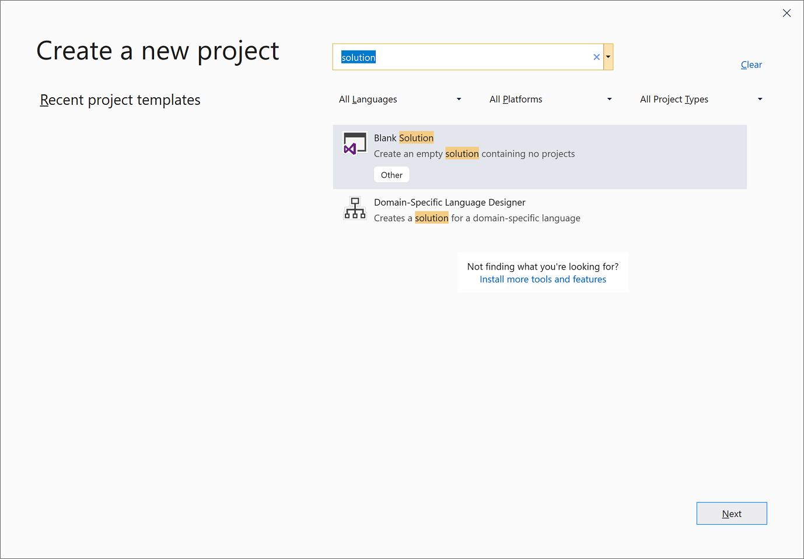

# Build a .NET Standard library in Visual Studio

A *class library* defines types and methods that are called by an application. A class library that targets .NET Standard 2.0 allows your library to be called by any .NET implementation that supports that version of .NET Standard. When you finish your class library, you can decide whether you want to distribute it as a third-party component or whether you want to include it as a bundled component with one or more applications.

> [!NOTE]
> For a list of .NET Standard versions and the platforms they support, see [.NET Standard](../../standard/net-standard.md).

In this topic, you'll create a simple utility library that contains a single string-handling method. You'll implement it as an [extension method](../../csharp/programming-guide/classes-and-structs/extension-methods.md) so that you can call it as if it were a member of the <xref:System.String> class.

## Create a Visual Studio solution

Start by creating a blank solution to put the class library project in. A Visual Studio solution serves as a container for one or more projects. You'll add additional, related projects to the same solution if you continue on with the tutorial series.

To create the blank solution:

1. Open Visual Studio.

2. On the start window, choose **Create a new project**.

3. On the **Create a new project** page, enter **solution** in the search box. Choose the **Blank Solution** template, and then choose **Next**.

   

4. On the **Configure your new project** page, enter **ClassLibraryProjects** in the **Project name** box. Then, choose **Create**.

> [!TIP]
> You can also skip this step and let Visual Studio create the solution for you when you create the project in the next step. Look for the solution options on the **Configure your new project** page.

## Create a class library project

<!-- markdownlint-disable MD025 -->

# [C#](#tab/csharp)

1. Add a new C# .NET Standard class library project named "StringLibrary" to the solution.

   1. Right-click on the solution in **Solution Explorer** and select **Add** > **New project**.

   1. On the **Add a new project** page, enter **library** in the search box. Choose **C#** from the Language list, and then choose **All platforms** from the Platform list. Choose the **Class Library (.NET Standard)** template, and then choose **Next**.

   1. On the **Configure your new project** page, enter **StringLibrary** in the **Project name** box. Then, choose **Create**.

1. Check to make sure that the library targets the correct version of .NET Standard. Right-click on the library project in **Solution Explorer**, and then select **Properties**. The **Target Framework** text box shows that the project targets .NET Standard 2.0.

   

1. Replace the code in the code window with the following code and save the file:

   [!CODE-csharp[ClassLib#1](../../../samples/snippets/csharp/getting_started/with_visual_studio_2017/classlib.cs)]

   The class library, `UtilityLibraries.StringLibrary`, contains a method named `StartsWithUpper`. This method returns a <xref:System.Boolean> value that indicates whether the current string instance begins with an uppercase character. The Unicode standard distinguishes uppercase characters from lowercase characters. The <xref:System.Char.IsUpper(System.Char)?displayProperty=nameWithType> method returns `true` if a character is uppercase.

1. On the menu bar, select **Build** > **Build Solution**.

# [Visual Basic](#tab/vb)

1. Add a new Visual Basic .NET Standard class library project named "StringLibrary" to the solution.

   1. Right-click on the solution in **Solution Explorer** and select **Add** > **New project**.

   1. On the **Add a new project** page, enter **library** in the search box. Choose **Visual Basic** from the Language list, and then choose **All platforms** from the Platform list. Choose the **Class Library (.NET Standard)** template, and then choose **Next**.

   1. On the **Configure your new project** page, enter **StringLibrary** in the **Project name** box. Then, choose **Create**.

1. Check to make sure that the library targets the correct version of .NET Standard. Right-click on the library project in **Solution Explorer**, and then select **Properties**. The **Target Framework** text box shows that the project targets .NET Standard 2.0.

   

1. In the **Properties** dialog, clear the text in the **Root namespace** text box. For each project, Visual Basic automatically creates a namespace that corresponds to the project name. In this tutorial, you define a top-level namespace by using the [`namespace`](../../visual-basic/language-reference/statements/namespace-statement.md) keyword in the code file.

1. Replace the code in the code window with the following code and save the file:

   [!CODE-vb[ClassLib#1](../../../samples/snippets/core/tutorials/vb-library-with-visual-studio/stringlibrary.vb)]

   The class library, `UtilityLibraries.StringLibrary`, contains a method named `StartsWithUpper`. This method returns a <xref:System.Boolean> value that indicates whether the current string instance begins with an uppercase character. The Unicode standard distinguishes uppercase characters from lowercase characters. The <xref:System.Char.IsUpper(System.Char)?displayProperty=nameWithType> method returns `true` if a character is uppercase.

1. On the menu bar, select **Build** > **Build Solution**.

---

   The project should compile without error.

## Next steps

You've successfully built the library. Because you haven't called any of its methods, you don't know whether it works as expected. The next step in developing your library is to test it.

> [!div class="nextstepaction"]
> [Create a unit test project](testing-library-with-visual-studio.md)
