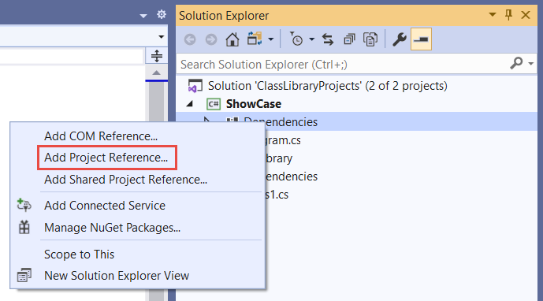
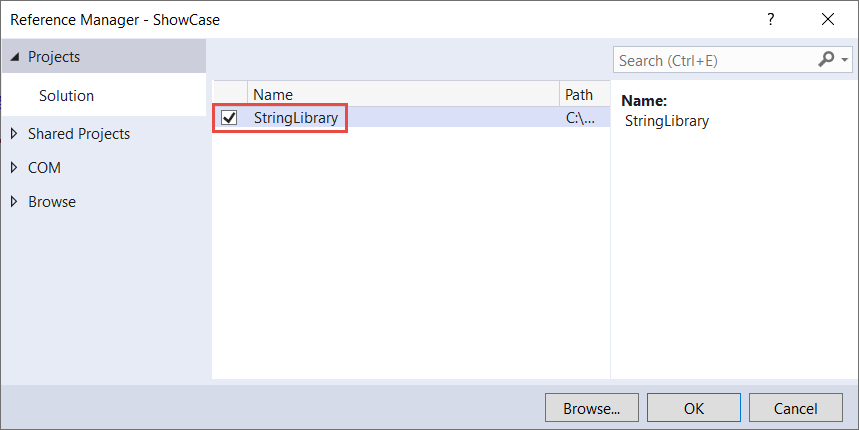
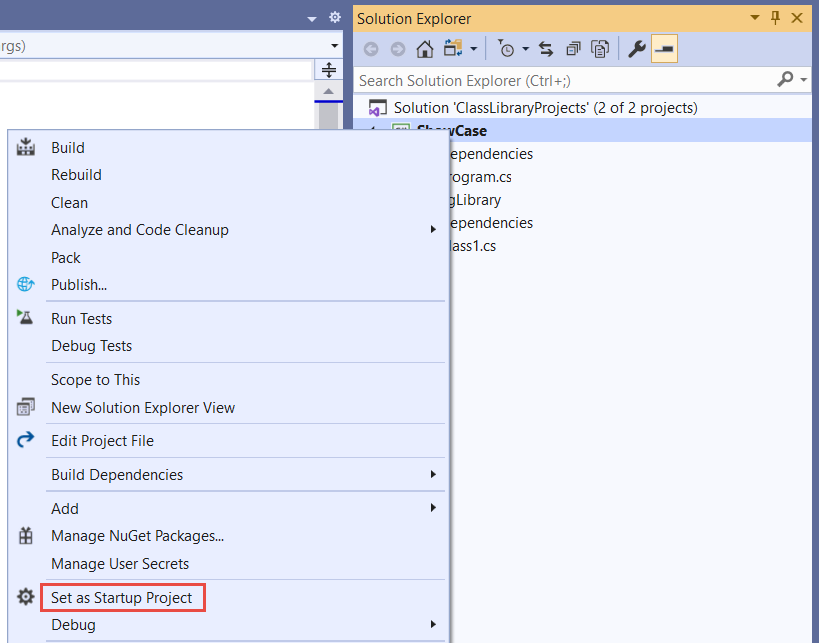

# Tutorial: Create a .NET Standard library using Visual Studio

In this tutorial, you create a simple class library that contains a single string-handling method.

A *class library* defines types and methods that are called by an application. A class library that targets .NET Standard 2.0 allows your library to be called by any .NET implementation that supports that version of .NET Standard.

When you finish your class library, you can distribute it as a NuGet package or as a component bundled with the application that uses it.

## Prerequisites

- [Visual Studio 2019 version 16.6 or a later version](https://visualstudio.microsoft.com/downloads/?utm_medium=microsoft&utm_source=docs.microsoft.com&utm_campaign=inline+link&utm_content=download+vs2019) with the **.NET Core cross-platform development** workload installed. .NET Core 3.1 SDK is automatically installed when you select this workload.

## Create a solution

Start by creating a blank solution to put the class library project in. A Visual Studio solution serves as a container for one or more projects. You'll add additional, related projects to the same solution.

To create the blank solution:

1. Start Visual Studio.

2. On the start window, choose **Create a new project**.

3. On the **Create a new project** page, enter **solution** in the search box. Choose the **Blank Solution** template, and then choose **Next**.

   

4. On the **Configure your new project** page, enter **ClassLibraryProjects** in the **Project name** box. Then choose **Create**.

## Create a class library project

1. Add a new .NET Standard class library project named "StringLibrary" to the solution.

   1. Right-click on the solution in **Solution Explorer** and select **Add** > **New Project**.

   1. On the **Add a new project** page, enter **library** in the search box. Choose **C#** or **Visual Basic** from the Language list, and then choose **All platforms** from the Platform list. Choose the **Class Library (.NET Standard)** template, and then choose **Next**.

   1. On the **Configure your new project** page, enter **StringLibrary** in the **Project name** box. Then, choose **Create**.

1. Check to make sure that the library targets the correct version of .NET Standard. Right-click on the library project in **Solution Explorer**, and then select **Properties**. The **Target Framework** text box shows that the project targets .NET Standard 2.0.

   

1. If you're using Visual Basic, clear the text in the **Root namespace** text box.

   

   For each project, Visual Basic automatically creates a namespace that corresponds to the project name. In this tutorial, you define a top-level namespace by using the [`namespace`](../../visual-basic/language-reference/statements/namespace-statement.md) keyword in the code file.

1. Replace the code in the code window for *Class1.cs*  or *Class1.vb* with the following code, and save the file. If the language you want to use is not shown, change the language selector at the top of the page.

   :::code language="csharp" source="./snippets/library-with-visual-studio/csharp/StringLibrary/Class1.cs":::
   :::code language="vb" source="./snippets/library-with-visual-studio/vb/StringLibrary/Class1.vb":::

   The class library, `UtilityLibraries.StringLibrary`, contains a method named `StartsWithUpper`. This method returns a <xref:System.Boolean> value that indicates whether the current string instance begins with an uppercase character. The Unicode standard distinguishes uppercase characters from lowercase characters. The <xref:System.Char.IsUpper(System.Char)?displayProperty=nameWithType> method returns `true` if a character is uppercase.

   `StartsWithUpper` is implemented as an [extension method](../../csharp/programming-guide/classes-and-structs/extension-methods.md) so that you can call it as if it were a member of the <xref:System.String> class.

1. On the menu bar, select **Build** > **Build Solution** or press <kbd>Ctrl</kbd>+<kbd>Shift</kbd>+<kbd>B</kbd> to verify that the project compiles without error.

## Add a console app to the solution

Add a console application that uses the class library. The app will prompt the user to enter a string and report whether the string begins with an uppercase character.

1. Add a new .NET Core console application named "ShowCase" to the solution.

   1. Right-click on the solution in **Solution Explorer** and select **Add** > **New project**.

   1. On the **Add a new project** page, enter **console** in the search box. Choose **C#** or **Visual Basic** from the Language list, and then choose **All platforms** from the Platform list.

   1. Choose the **Console App (.NET Core)** template, and then choose **Next**.

   1. On the **Configure your new project** page, enter **ShowCase** in the **Project name** box. Then choose **Create**.

1. In the code window for the *Program.cs* or *Program.vb* file, replace all of the code with the following code.

   :::code language="csharp" source="./snippets/library-with-visual-studio/csharp/ShowCase/Program.cs":::
   :::code language="vb" source="./snippets/library-with-visual-studio/vb/ShowCase/Program.vb":::

   The code uses the `row` variable to maintain a count of the number of rows of data written to the console window. Whenever it's greater than or equal to 25, the code clears the console window and displays a message to the user.

   The program prompts the user to enter a string. It indicates whether the string starts with an uppercase character. If the user presses the <kbd>Enter</kbd> key without entering a string, the application ends, and the console window closes.

## Add a project reference

Initially, the new console app project doesn't have access to the class library. To allow it to call methods in the class library, create a project reference to the class library project.

1. In **Solution Explorer**, right-click the `ShowCase` project's **Dependencies** node, and select **Add Project Reference**.

   

1. In the **Reference Manager** dialog, select the **StringLibrary** project, and select **OK**.

   

## Run the app

1. In **Solution Explorer**, right-click the **ShowCase** project and select **Set as StartUp Project** in the context menu.

   

1. Press <kbd>Ctrl</kbd>+<kbd>F5</kbd> to compile and run the program without debugging.

   

1. Try out the program by entering strings and pressing <kbd>Enter</kbd>, then press <kbd>Enter</kbd> to exit.

   :::image type="content" source="media/library-with-visual-studio/run-showcase.png" alt-text="Console window with ShowCase running":::

## Additional resources

* [Develop libraries with the .NET Core CLI](libraries.md)
* [.NET Standard versions and the platforms they support](../../standard/net-standard.md).

## Next steps

In this tutorial, you created a class library. In the next tutorial, you learn how to unit test the class library.

> [!div class="nextstepaction"]
> [Unit test a .NET Standard library using Visual Studio](testing-library-with-visual-studio.md)

Or you can skip automated unit testing and learn how to share the library by creating a NuGet package:

> [!div class="nextstepaction"]
> [Create and publish a package using Visual Studio](/nuget/quickstart/create-and-publish-a-package-using-visual-studio)

Or learn how to publish a console app. If you publish the console app from the solution you created in this tutorial, the class library goes with it as a *.dll* file.

> [!div class="nextstepaction"]
> [Publish a .NET Core console application using Visual Studio](publishing-with-visual-studio.md)
