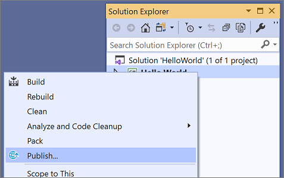
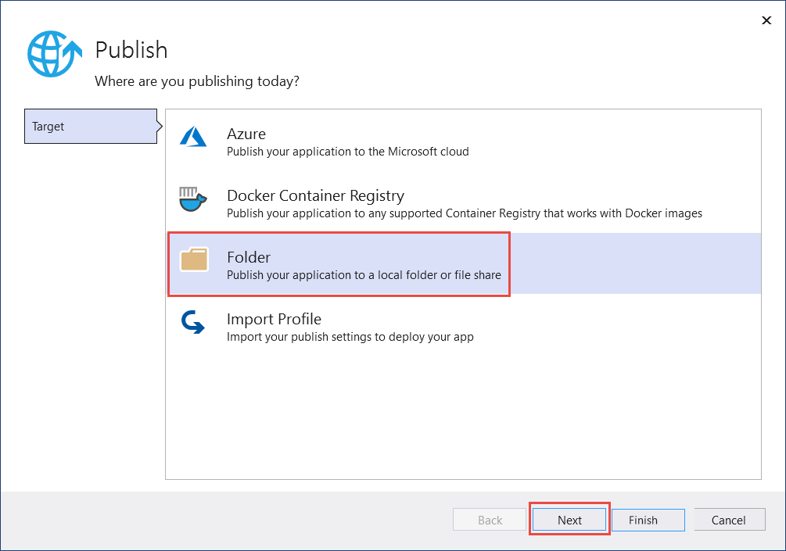

# Publish your .NET Core Hello World application with Visual Studio

In [Create a Hello World application with .NET Core in Visual Studio](with-visual-studio.md), you built a Hello World console application. In [Debug your Hello World application with Visual Studio](debugging-with-visual-studio.md), you tested it using the Visual Studio debugger. Now that you're sure that it works as expected, you can publish it so that other users can run it. Publishing creates the set of files that are needed to run your application. To deploy the files, copy them to the target machine.

## Publish the app

1. Make sure that Visual Studio is building the Release version of your application. If necessary, change the build configuration setting on the toolbar from **Debug** to **Release**.

   

1. Right-click on the **HelloWorld** project (not the HelloWorld solution) and select **Publish** from the menu. (You can also select **Publish HelloWorld** from the main **Build** menu.)

   
   
1. On the **Pick a publish target** page, select **Folder**, and then select **Create Profile**.

   
   
1. On the **Publish** page, select **Publish**.

   
   
## Inspect the files

The publishing process creates a framework-dependent deployment, which is a type of deployment where the published application runs on any platform supported by .NET Core with .NET Core installed on the system. Users can run the published app by double-clicking the executable or issuing the `dotnet HelloWorld.dll` command from a command prompt.

In the following steps, you'll look at the files created by the publish process.

1. Open a command prompt.

   One way to open a command prompt is to enter **Command Prompt** (or **cmd** for short) in the search box on the Windows taskbar. Select the **Command Prompt** desktop app, or press **Enter** if it's already selected in the search results.

1. Navigate to the published application in the *bin\Release\netcoreapp3.1\publish* subdirectory of the application's project directory.

   

   As the image shows, the published output includes the following files:

      * *HelloWorld.deps.json*

         This is the application's runtime dependencies file. It defines the .NET Core components and the libraries (including the dynamic link library that contains your application) needed to run the app. For more information, see [Runtime configuration files](https://github.com/dotnet/cli/blob/85ca206d84633d658d7363894c4ea9d59e515c1a/Documentation/specs/runtime-configuration-file.md).

      * *HelloWorld.dll*

         This is the [framework-dependent deployment](../deploying/deploy-with-cli.md#framework-dependent-deployment) version of the application. To execute this dynamic link library, enter `dotnet HelloWorld.dll` at a command prompt.

      * *HelloWorld.exe*
      
         This is the [framework-dependent executable](../deploying/deploy-with-cli.md#framework-dependent-executable) version of the application. To run it, enter `HelloWorld.exe` at a command prompt.

      * *HelloWorld.pdb* (optional for deployment)

         This is the debug symbols file. You aren't required to deploy this file along with your application, although you should save it in the event that you need to debug the published version of your application.

      * *HelloWorld.runtimeconfig.json*

         This is the application's runtime configuration file. It identifies the version of .NET Core that your application was built to run on. For more information, see [Runtime configuration files](https://github.com/dotnet/cli/blob/85ca206d84633d658d7363894c4ea9d59e515c1a/Documentation/specs/runtime-configuration-file.md).

## Additional resources

- [.NET Core application deployment](../deploying/index.md)
