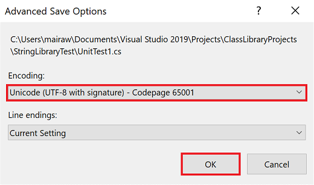
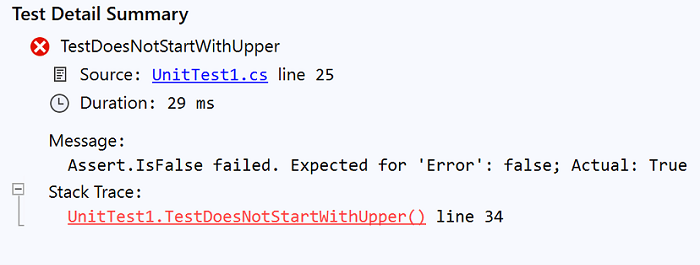
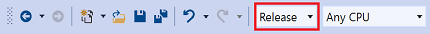

# Test a .NET Standard library with .NET Core in Visual Studio

In [Build a .NET Standard library in Visual Studio](library-with-visual-studio.md), you created a simple class library that adds an extension method to the <xref:System.String> class. Now, you'll create a unit test to make sure that it works as expected. You'll add your unit test project to the solution you created in the previous article.

## Create a unit test project

To create the unit test project, do the following:

1. Open the `ClassLibraryProjects` solution you created in the [Build a .NET Standard library in Visual Studio](library-with-visual-studio.md) article.

1. Add a new unit test project named "StringLibraryTest" to the solution.

   1. Right-click on the solution in **Solution Explorer** and select **Add** > **New project**.

   1. On the **Add a new project** page, enter **mstest** in the search box. Choose **C#** or **Visual Basic** from the Language list, and then choose **All platforms** from the Platform list. Choose the **MsTest Test Project (.NET Core)** template, and then choose **Next**.

   1. On the **Configure your new project** page, enter **StringLibraryTest** in the **Project name** box. Then choose **Create**.

   > [!NOTE]
   > In addition to an MSTest, you can also create xUnit and nUnit test projects for .NET Core in Visual Studio.

1. Visual Studio creates the project and opens the class file in the code window with the following code:

   ```csharp
   using Microsoft.VisualStudio.TestTools.UnitTesting;

    namespace StringLibraryTest
    {
        [TestClass]
        public class UnitTest1
        {
            [TestMethod]
            public void TestMethod1()
            {
            }
        }
    }
    ```

    ```vb
    Imports Microsoft.VisualStudio.TestTools.UnitTesting
    
    Namespace StringLibraryTest
        <TestClass>
        Public Class UnitTest1
            <TestMethod>
            Sub TestSub()
    
            End Sub
        End Class
    End Namespace
    ```

   The source code created by the unit test template does the following:

   - It imports the <xref:Microsoft.VisualStudio.TestTools.UnitTesting?displayProperty=nameWithType> namespace, which contains the types used for unit testing.

   - It applies the [TestClass](xref:Microsoft.VisualStudio.TestTools.UnitTesting.TestClassAttribute) attribute to the `UnitTest1` class. Each test method in a test class tagged with the [TestMethod](xref:Microsoft.VisualStudio.TestTools.UnitTesting.TestMethodAttribute) attribute is executed automatically when the unit test is run.

   - It applies the [TestMethod](xref:Microsoft.VisualStudio.TestTools.UnitTesting.TestMethodAttribute) attribute to define `TestMethod1` in C# or `TestSub` in Visual Basic as a test method for automatic execution when the unit test is run.

1. In **Solution Explorer**, right-click the **Dependencies** node of the **StringLibraryTest** project and select **Add Reference** from the context menu.

   > [!div class="mx-imgBorder"]
   > 

1. In the **Reference Manager** dialog, expand the **Projects** node and check the box next to **StringLibrary**. Adding a reference to the `StringLibrary` assembly allows the compiler to find **StringLibrary** methods. Select the **OK** button. A reference is added to your class library project, `StringLibrary`.

   

## Add and run unit test methods

When Visual Studio runs a unit test, it executes each method that is marked with the <xref:Microsoft.VisualStudio.TestTools.UnitTesting.TestMethodAttribute> attribute in a unit test class, the class to which the  <xref:Microsoft.VisualStudio.TestTools.UnitTesting.TestClassAttribute> attribute is applied. A test method ends when the first failure is found or when all tests contained in the method have succeeded.

The most common tests call members of the <xref:Microsoft.VisualStudio.TestTools.UnitTesting.Assert> class. Many assert methods include at least two parameters, one of which is the expected test result and the other of which is the actual test result. Some of the `Assert` class's most frequently called methods are shown in the following table:

| Assert methods     | Function |
| ------------------ | -------- |
| `Assert.AreEqual`  | Verifies that two values or objects are equal. The assert fails if the values or objects aren't equal. |
| `Assert.AreSame`   | Verifies that two object variables refer to the same object. The assert fails if the variables refer to different objects. |
| `Assert.IsFalse`   | Verifies that a condition is `false`. The assert fails if the condition is `true`. |
| `Assert.IsNotNull` | Verifies that an object isn't `null`. The assert fails if the object is `null`. |

You can also use the <xref:Microsoft.VisualStudio.TestTools.UnitTesting.Assert.ThrowsException%2A> method in a test method to indicate the type of exception it's expected to throw. The test fails if the specified exception isn't thrown.

In testing the `StringLibrary.StartsWithUpper` method, you want to provide a number of strings that begin with an uppercase character. You expect the method to return `true` in these cases, so you can call the <xref:Microsoft.VisualStudio.TestTools.UnitTesting.Assert.IsTrue%2A> method. Similarly, you want to provide a number of strings that begin with something other than an uppercase character. You expect the method to return `false` in these cases, so you can call the <xref:Microsoft.VisualStudio.TestTools.UnitTesting.Assert.IsFalse%2A> method.

Since your library method handles strings, you also want to make sure that it successfully handles an [empty string (`String.Empty`)](xref:System.String.Empty), a valid string that has no characters and whose <xref:System.String.Length> is 0, and a `null` string that hasn't been initialized. If `StartsWithUpper` is called as an extension method on a <xref:System.String> instance, it can't be passed a `null` string. However, you can also call it directly as a static method and pass a single <xref:System.String> argument.

You'll define three methods, each of which calls an <xref:Microsoft.VisualStudio.TestTools.UnitTesting.Assert> method repeatedly for each element in a string array. Because the test method fails as soon as it finds the first failure, you'll call a method overload that allows you to pass a string that indicates the string value used in the method call.

To create the test methods:

1. In the *UnitTest1.cs* or *UnitTest1.vb* code window, replace the code with the following code:

   [!code-csharp[Test#1](~/samples/snippets/csharp/getting_started/with_visual_studio_2017/testlib1.cs)]
   [!code-vb[Test#1](~/samples/snippets/core/tutorials/vb-library-with-visual-studio/testlib.vb)]

   The test of uppercase characters in the `TestStartsWithUpper` method includes the Greek capital letter alpha (U+0391) and the Cyrillic capital letter EM (U+041C). The test of lowercase characters in the `TestDoesNotStartWithUpper` method includes the Greek small letter alpha (U+03B1) and the Cyrillic small letter Ghe (U+0433).

1. On the menu bar, select **File** > **Save UnitTest1.cs As** or **File** > **Save UnitTest1.vb As**. In the **Save File As** dialog, select the arrow beside the **Save** button, and select **Save with Encoding**.

   > [!div class="mx-imgBorder"]
   > 

1. In the **Confirm Save As** dialog, select the **Yes** button to save the file.

1. In the **Advanced Save Options** dialog, select **Unicode (UTF-8 with signature) - Codepage 65001** from the **Encoding** drop-down list and select **OK**.

   > [!div class="mx-imgBorder"]
   > 

   If you fail to save your source code as a UTF8-encoded file, Visual Studio may save it as an ASCII file. When that happens, the runtime doesn't accurately decode the UTF8 characters outside of the ASCII range, and the test results won't be correct.

1. On the menu bar, select **Test** > **Run** > **All Tests**. The **Test Explorer** window opens and shows that the tests ran successfully. The three tests are listed in the **Passed Tests** section, and the **Summary** section reports the result of the test run.

   > [!div class="mx-imgBorder"]
   > 

## Handle test failures

Your test run had no failures, but change it slightly so that one of the test methods fails:

1. Modify the `words` array in the `TestDoesNotStartWithUpper` method to include the string "Error". You don't need to save the file because Visual Studio automatically saves open files when a solution is built to run tests.

   ```csharp
   string[] words = { "alphabet", "Error", "zebra", "abc", "αυτοκινητοβιομηχανία", "государство",
                      "1234", ".", ";", " " };
   ```

   ```vb
   Dim words() As String = { "alphabet", "Error", "zebra", "abc", "αυτοκινητοβιομηχανία", "государство",
                      "1234", ".", ";", " " }

   ```

1. Run the test by selecting **Test** > **Run** > **All Tests** from the menu bar. The **Test Explorer** window indicates that two tests succeeded and one failed.

   > [!div class="mx-imgBorder"]
   > 

1. Select the failed test, `TestDoesNotStartWith`. The **Test Explorer** window displays the message produced by the assert: "Assert.IsFalse failed. Expected for 'Error': false; actual: True". Because of the failure, all strings in the array after "Error" weren't tested.

   > [!div class="mx-imgBorder"]
   > 

1. Undo the modification you did in step 1 and remove the string "Error". Rerun the test and the tests will pass.

## Test the Release version of the library

You've been running your tests against the Debug version of the library. Now that your tests have all passed and you've adequately tested your library, you should run the tests an additional time against the Release build of the library. A number of factors, including compiler optimizations, can sometimes produce different behavior between Debug and Release builds.

To test the Release build:

1. In the Visual Studio toolbar, change the build configuration from **Debug** to **Release**.

   > [!div class="mx-imgBorder"]
   > 

1. In **Solution Explorer**, right-click the **StringLibrary** project and select **Build** from the context menu to recompile the library.

   > [!div class="mx-imgBorder"]
   > 

1. Run the unit tests by choosing **Test** > **Run** > **All Tests** from the menu bar. The tests pass.

Now that you've finished testing your library, the next step is to make it available to callers. You can bundle it with one or more applications, or you can distribute it as a NuGet package. For more information, see [Consuming a .NET Standard Class Library](consuming-library-with-visual-studio.md).

## See also

- [Unit test basics - Visual Studio](/visualstudio/test/unit-test-basics)
