# Building a complete .NET Core solution on macOS using Visual Studio for Mac

Visual Studio for Mac provides a full-featured Integrated Development Environment (IDE) for developing .NET Core applications. This topic walks you through building a .NET Core solution that includes a reusable library and unit testing.

This tutorial shows you how to create an application that accepts a search word and a string of text from the user, counts the number of times the search word appears in the string using a method in a class library, and returns the result to the user. The solution also includes unit testing for the class library as an introduction to unit testing concepts. If you prefer to proceed through the tutorial with a complete sample, download the [sample solution](https://github.com/dotnet/samples/blob/master/core/tutorials/using-on-mac-vs-full-solution/WordCounter). For download instructions, see [Samples and Tutorials](../../samples-and-tutorials/index.md#viewing-and-downloading-samples).

> [!NOTE]
> Your feedback is highly valued. There are two ways you can provide feedback to the development team on Visual Studio for Mac:
>
> - In Visual Studio for Mac, select **Help** > **Report a Problem** from the menu or **Report a Problem** from the Welcome screen, which opens a window for filing a bug report. You can track your feedback in the [Developer Community](https://developercommunity.visualstudio.com/spaces/41/index.html) portal.
> - To make a suggestion, select **Help** > **Provide a Suggestion** from the menu or **Provide a Suggestion** from the Welcome screen, which takes you to the [Visual Studio for Mac Developer Community webpage](https://developercommunity.visualstudio.com/content/idea/post.html?space=41).

## Prerequisites

- OpenSSL (if running .NET Core 1.1): See the [Prerequisites for .NET Core on Mac](../macos-prerequisites.md) topic.
- [.NET Core SDK 1.1 or later](https://www.microsoft.com/net/core#macos)
- [Visual Studio 2017 for Mac](https://visualstudio.microsoft.com/vs/mac/?utm_medium=microsoft&utm_source=docs.microsoft.com&utm_campaign=inline+link)

For more information on prerequisites, see the [Prerequisites for .NET Core on Mac](../macos-prerequisites.md). For the full system requirements of Visual Studio 2017 for Mac, see [Visual Studio 2017 for Mac Product Family System Requirements](/visualstudio/productinfo/vs2017-system-requirements-mac).

## Building a library

1. On the Welcome screen, select **New Project**. In the **New Project** dialog under the **.NET Core** node, select the **.NET Standard Library** template. This creates a .NET Standard library that targets .NET Core as well as any other .NET implementation that supports version 2.0 of the [.NET Standard](../../standard/net-standard.md). Select **Next**.

   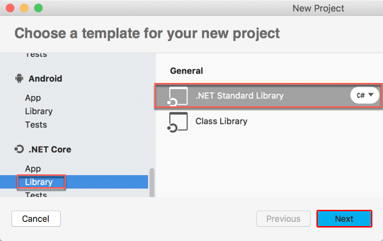

1. Name the project "TextUtils" (a short name for "Text Utilities") and the solution "WordCounter". Leave **Create a project directory within the solution directory** checked. Select **Create**.

   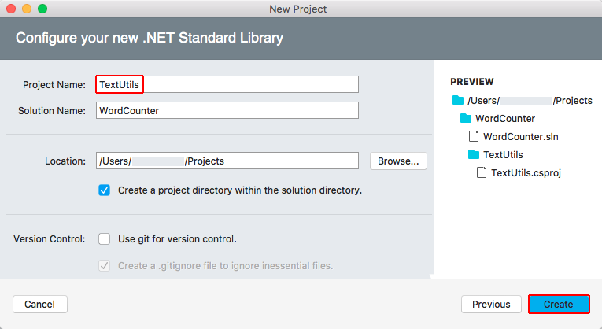

1. In the **Solution** sidebar, expand the `TextUtils` node to reveal the class file provided by the template, *Class1.cs*. Right-click the file, select **Rename** from the context menu, and rename the file to *WordCount.cs*. Open the file and replace the contents with the following code:

   [!code-csharp[Main](../../../samples/core/tutorials/using-on-mac-vs-full-solution/WordCounter/TextUtils/WordCount.cs)]

1. Save the file by using any of three different methods: use the keyboard shortcut <kbd>&#8984;</kbd>+<kbd>s</kbd>, select **File** > **Save** from the menu, or right-click on the file's tab and select **Save** from the contextual menu. The following image shows the IDE window:

   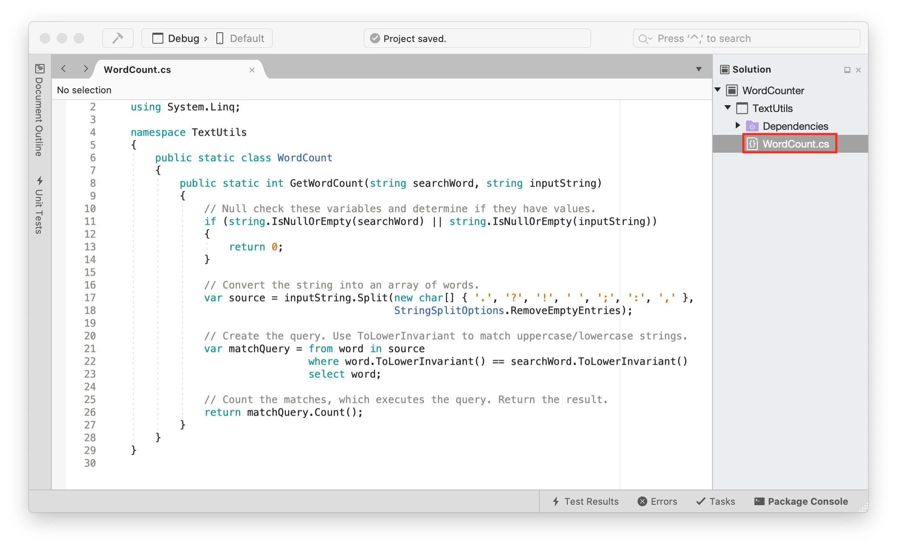

1. Select **Errors** in the margin at the bottom of the IDE window to open the **Errors** panel. Select the **Build Output** button.

   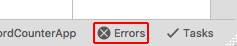

1. Select **Build** > **Build All** from the menu.

   The solution builds. The build output panel shows that the build is successful.

   

## Creating a test project

Unit tests provide automated software testing during your development and publishing. The testing framework that you use in this tutorial is [xUnit (version 2.2.0 or later)](https://xunit.github.io/), which is installed automatically when the xUnit test project is added to the solution in the following steps:

1. In the **Solution** sidebar, right-click the `WordCounter` solution and select **Add** > **Add New Project**.

1. In the **New Project** dialog, select **Tests** from the **.NET Core** node. Select the **xUnit Test Project** followed by **Next**.

   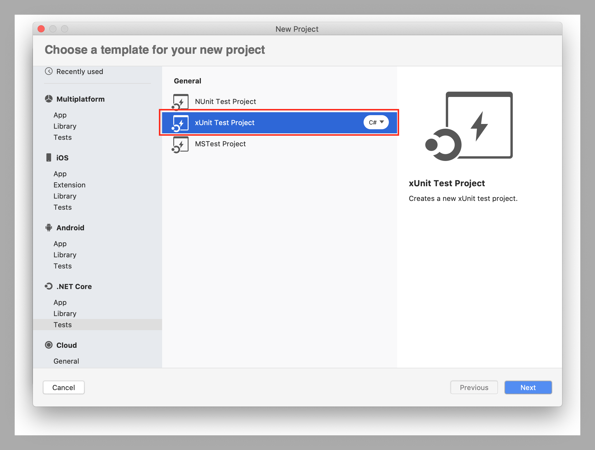

1. Name the new project "TestLibrary" and select **Create**.

   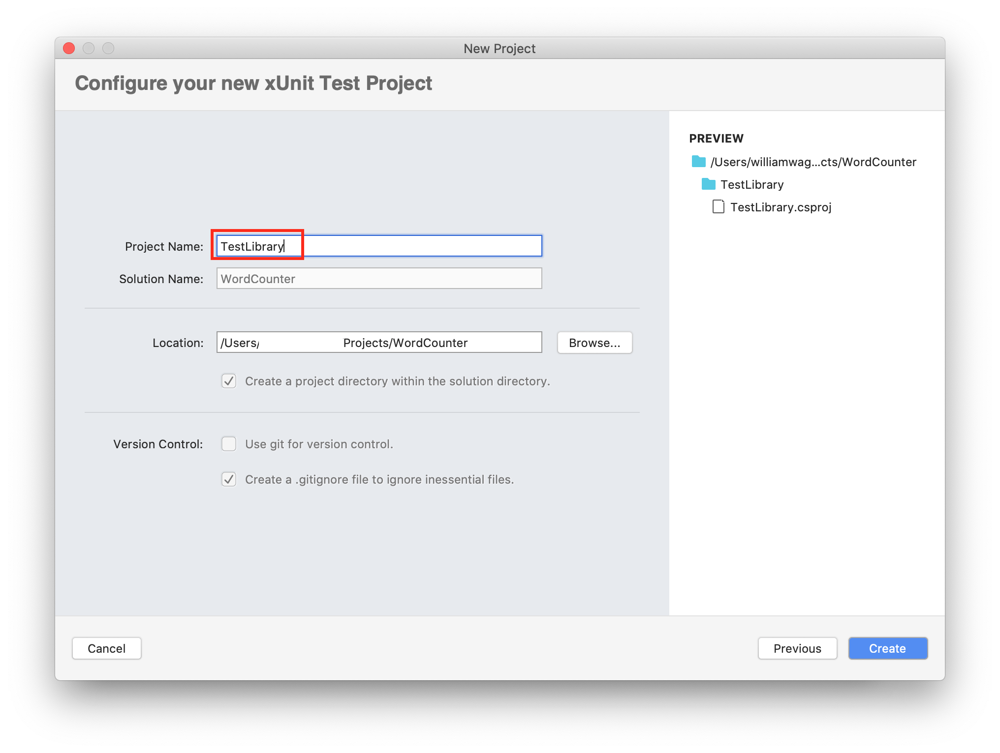

1. In order for the test library to work with the `WordCount` class, add a reference to the `TextUtils` project. In the **Solution** sidebar, right-click **Dependencies** under **TestLibrary**. Select **Edit References** from the context menu.

1. In the **Edit References** dialog, select the **TextUtils** project on the **Projects** tab. Select **OK**.

   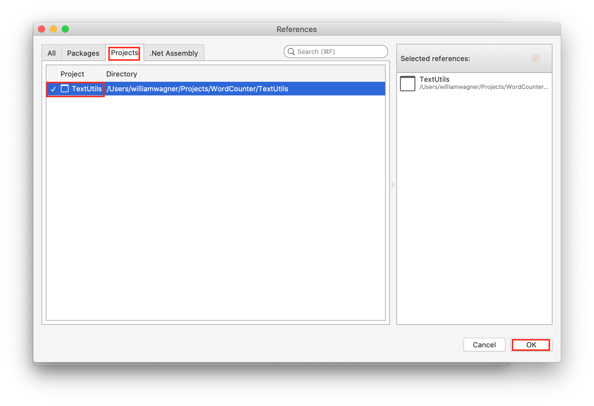

1. In the **TestLibrary** project, rename the *UnitTest1.cs* file to *TextUtilsTests.cs*.

1. Open the file and replace the code with the following:

   ```csharp
   using Xunit;
   using TextUtils;
   using System.Diagnostics;

   namespace TestLibrary
   {
       public class TextUtils_GetWordCountShould
       {
           [Fact]
           public void IgnoreCasing()
           {
               var wordCount = WordCount.GetWordCount("Jack", "Jack jack");

               Assert.NotEqual(2, wordCount);
           }
       }
   }
   ```

   The following image shows the IDE with the unit test code in place. Pay attention to the `Assert.NotEqual` statement.

   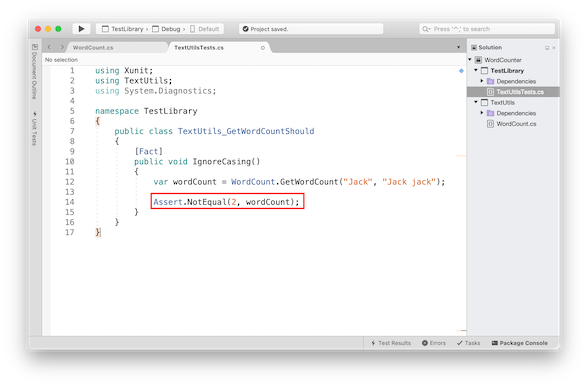

   It's important to make a new test fail once to confirm its testing logic is correct. The method passes in the name "Jack" (uppercase) and a string with "Jack" and "jack" (uppercase and lowercase). If the `GetWordCount` method is working properly, it returns a count of two instances of the search word. In order to fail this test on purpose, you first implement the test asserting that two instances of the search word "Jack" aren't returned by the `GetWordCount` method. Continue to the next step to fail the test on purpose.

1. Open the **Unit Tests** panel on the right side of the screen.

   

1. Click the **Dock** icon to keep the panel open.

   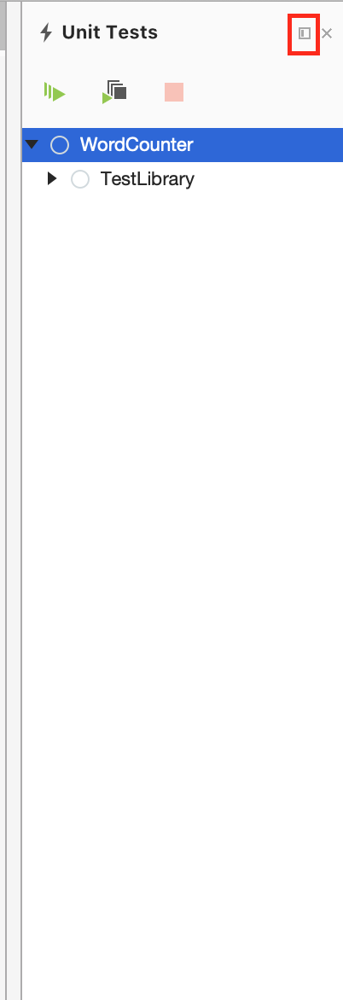

1. Click the **Run All** button.

   The test fails, which is the correct result. The test method asserts that two instances of the `inputString`, "Jack," aren't returned from the string "Jack jack" provided to the `GetWordCount` method. Since word casing was factored out in the `GetWordCount` method, two instances are returned. The assertion that 2 *is not equal to* 2 fails. This is the correct outcome, and the logic of our test is good.

   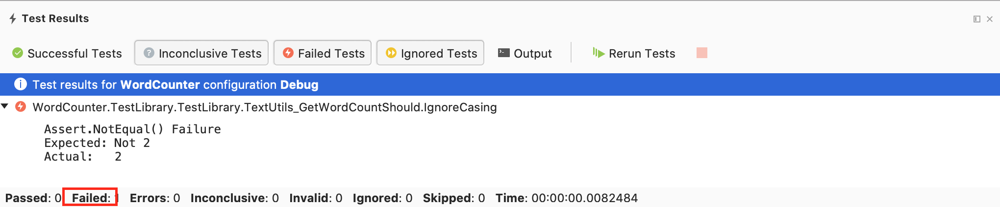

1. Modify the `IgnoreCasing` test method by changing `Assert.NotEqual` to `Assert.Equal`. Save the file by using the keyboard shortcut <kbd>&#8984;</kbd>+<kbd>s</kbd>, **File** > **Save** from the menu, or right-clicking on the file's tab and selecting **Save** from the context menu.

   You expect that the `searchWord` "Jack" returns two instances with `inputString` "Jack jack" passed into `GetWordCount`. Run the test again by clicking the **Run Tests** button in the **Unit Tests** panel or the **Rerun Tests** button in the **Test Results** panel at the bottom of the screen. The test passes. There are two instances of "Jack" in the string "Jack jack" (ignoring casing), and the test assertion is `true`.

   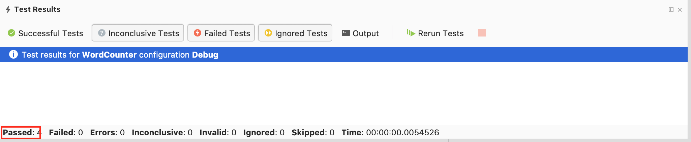

1. Testing individual return values with a `Fact` is only the beginning of what you can do with unit testing. Another powerful technique allows you to test several values at once using a `Theory`. Add the following method to your `TextUtils_GetWordCountShould` class. You have two methods in the class after you add this method:

   ```csharp
   [Theory]
   [InlineData(0, "Ting", "Does not appear in the string.")]
   [InlineData(1, "Ting", "Ting appears once.")]
   [InlineData(2, "Ting", "Ting appears twice with Ting.")]
   public void CountInstancesCorrectly(int count,
                                       string searchWord,
                                       string inputString)
   {
       Assert.NotEqual(count, WordCount.GetWordCount(searchWord,
                                                  inputString));
   }
   ```

   The `CountInstancesCorrectly` checks that the `GetWordCount` method counts correctly. The `InlineData` provides a count, a search word, and an input string to check. The test method runs once for each line of data. Note once again that you're asserting a failure first by using `Assert.NotEqual`, even when you know that the counts in the data are correct and that the values match the counts returned by the `GetWordCount` method. Performing the step of failing the test on purpose might seem like a waste of time at first, but checking the logic of the test by failing it first is an important check on the logic of your tests. When you come across a test method that passes when you expect it to fail, you've found a bug in the logic of the test. It's worth the effort to take this step every time you create a test method.

1. Save the file and run the tests again. The casing test passes but the three count tests fail. This is exactly what you expect to happen.

   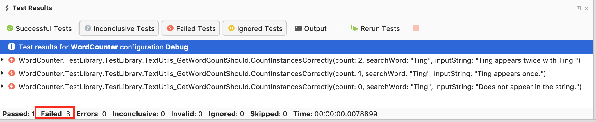

1. Modify the `CountInstancesCorrectly` test method by changing `Assert.NotEqual` to `Assert.Equal`. Save the file. Run the tests again. All tests pass.

   

## Adding a console app

1. In the **Solution** sidebar, right-click the `WordCounter` solution. Add a new **Console Application** project by selecting the template from the **.NET Core** > **App** templates. Select **Next**. Name the project **WordCounterApp**. Select **Create** to create the project in the solution.

1. In the **Solutions** sidebar, right-click the **Dependencies** node of the new **WordCounterApp** project. In the **Edit References** dialog, check **TextUtils** and select **OK**.

1. Open the *Program.cs* file. Replace the code with the following:

   [!code-csharp[Main](../../../samples/core/tutorials/using-on-mac-vs-full-solution/WordCounter/WordCounterApp/Program.cs)]

1. To run the app in a console window instead of the IDE, right-click the `WordCounterApp` project, select **Options**, and open the **Default** node under **Configurations**. Check the box for **Run on external console**. Leave the **Pause console output** option checked. This setting causes the app to spawn in a console window so that you can type input for the `Console.ReadLine` statements. If you leave the app to run in the IDE, you can only see the output of `Console.WriteLine` statements. `Console.ReadLine` statements do not work in the IDE's **Application Output** panel.

   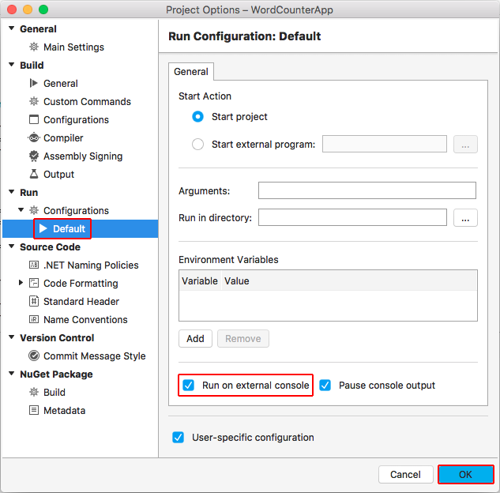

1. Because the current version of Visual Studio for Mac cannot run the tests when the solution is run, you run the console app directly. Right-click on the `WordCounterApp` project and select **Run item** from the context menu. If you attempt to run the app with the Play button, the test runner and app fail to run. For more information on the status of the work on this issue, see [xunit/xamarinstudio.xunit (#60)](https://github.com/xunit/xamarinstudio.xunit/issues/60). When you run the app, provide values for the search word and input string at the prompts in the console window. The app indicates the number of times the search word appears in the string.

   

1. The last feature to explore is debugging with Visual Studio for Mac. Set a breakpoint on the `Console.WriteLine` statement: Select in the left margin of line 23, and you see a red circle appear next to the line of code. Alternatively, select anywhere on the line of code and select **Run** > **Toggle Breakpoint** from the menu.

   

1. Right-click the `WordCounterApp` project. Select **Start Debugging item** from the context menu. When the app runs, enter the search word "cat" and "The dog chased the cat, but the cat escaped." for the string to search. When the `Console.WriteLine` statement is reached, program execution halts before the statement is executed. In the **Locals** tab, you can see the `searchWord`, `inputString`, `wordCount`, and `pluralChar` values.

   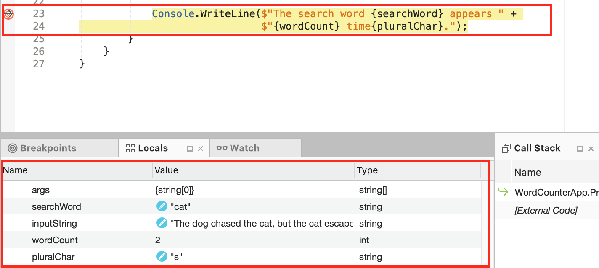

1. In the **Immediate** pane, type "wordCount = 999;" and press Enter. This assigns a nonsense value of 999 to the `wordCount` variable showing that you can replace variable values while debugging.

   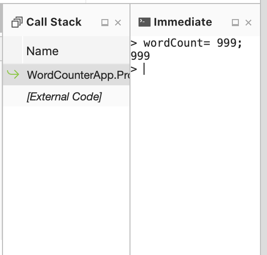

1. In the toolbar, click the *continue* arrow. Look at the output in the console window. It reports the incorrect value of 999 that you set when you were debugging the app.

   

   

## See also

- [Visual Studio 2017 for Mac Release Notes](/visualstudio/releasenotes/vs2017-mac-relnotes)
