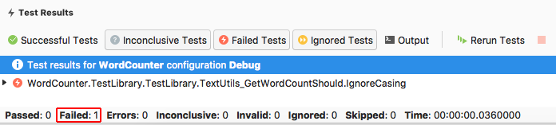
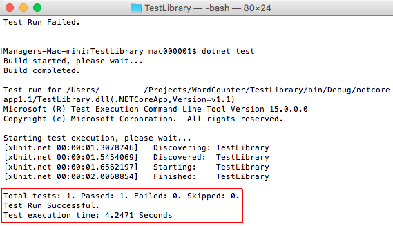
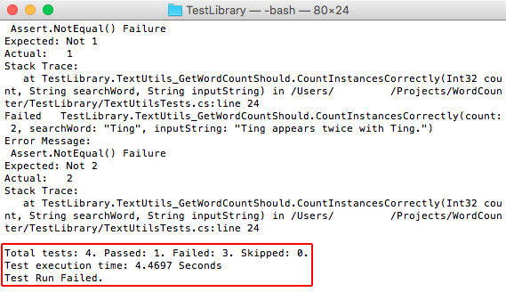
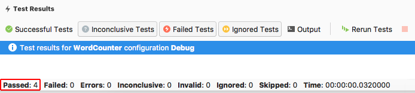

---
title: Building a complete .NET Core solution on macOS using Visual Studio for Mac | Microsoft Docs
description: This topic walks you through building a .NET Core solution that includes reusable libraries, unit testing, and third-party libraries.
keywords: .NET, .NET Core, macOS, Mac
author: guardrex
ms.author: mairaw
ms.date: 03/16/2017
ms.topic: article
ms.prod: .net-core
ms.devlang: dotnet
ms.assetid: 6945bedf-5bf3-4955-8588-83fb87511b79
---

# Building a complete .NET Core solution on macOS using Visual Studio for Mac

Visual Studio for Mac provides a full-featured Integrated Development Environment (IDE) for developing .NET Core applications. This topic walks you through building a .NET Core solution that includes a reusable library and unit testing with a third-party library.

This tutorial shows you how to create an application that accepts a string of text from the user, counts the number of times each word appears in the string in a class library, and returns the result to the user. The solution also contains a unit test for the class library to show you how to use test-driven development (TDD) concepts. If you prefer to proceed through the tutorial with a complete sample, download the [sample solution](https://github.com/dotnet/docs/blob/master/samples/core/tutorials/using-on-mac-vs-full-solution/WordCounter) before proceeding.

> [!NOTE]
> Visual Studio for Mac is preview software. As with all preview versions of Microsoft products, your feedback is highly valued. There are a number of ways you can provide feedback to the development team on Visual Studio for Mac:
> * Select **Help > Report a Problem** from the menu or **Report a Problem** from the Welcome page, which opens a window for filing a bug report.
> * To make a suggestion, select **Help > Provide a Suggestion** from the menu or **Provide a Suggestion** from the Welcome page, which takes you to the [Visual Studio for Mac UserVoice webpage](https://visualstudio.uservoice.com/forums/563332-visual-studio-for-mac).

## Prerequisites

[.NET Core and OpenSSL](https://www.microsoft.com/net/core#macos)

For more information on prerequisites, see the [Prerequisites for .NET Core on Mac](../core/macos-prerequisites.md).

## Getting started

If you've already installed the prerequisites and Visual Studio for Mac, skip this section and proceed to [Building a library](#building-a-library). Follow these steps to install the prerequisites and Visual Studio for Mac:

1. Download and install [.NET Core and OpenSSL](https://www.microsoft.com/net/core#macos).

1. Download the [Visual Studio for Mac installer](https://www.visualstudio.com/vs/visual-studio-mac/). Double-click the icon to run the installer. Read and accept the license agreement. During the install, you're provided the opportunity to install Xamarin, a cross-platform mobile app development technology. Installing Xamarin and its related components is optional for .NET Core development. For a walk-through of the Visual Studio for Mac install process, see [Introducing Visual Studio for Mac](https://developer.xamarin.com/guides/cross-platform/visual-studio-mac/). When the install is complete, start the Visual Studio for Mac IDE.

## Building a library

1. On the Welcome screen, select **New Project**. In the **New Project** dialog, under the **Multiplatform** node, select the **.NET Standard Library** template. Select **Next**.

   

1. Name the project "TextUtils" (a short name for "Text Utilities") and the solution "WordCounter". Leave **Create a project directory within the solution directory** checked. Select **Create**.

   

1. In the **Solution** sidebar, expand the `TextUtils` node to reveal the class file provided by the template, *Class1.cs*. Right-click the file, select **Rename** from the menu, and rename it to *WordCount.cs*. Double-click the file to open it. Replace the contents of the file with the code below:

[!code-csharp[Main](../../../samples/core/tutorials/using-on-mac-vs-full-solution/WordCounter/TextUtils/WordCount.cs)]

1. Save the file by using the keyboard shortcut <kbd>&#8984;</kbd>+<kbd>s</kbd>, **File > Save** from the menu, or right-clicking on the file's tab and selecting **Save** from the menu. The IDE screen is shown below.

   

1. Select **Build > Build All** from the menu.

   The solution should build without error. Select **Errors** at the bottom of the window to open the **Errors** panel. Select the **Build Output** button and scroll the output to the bottom, where it shows that the build was successful.

    

## Creating a test project

Unit tests include automated software testing during your development and publishing. The testing framework that you use in this tutorial is [xUnit](https://xunit.github.io/).

1. In the **Solution** sidebar, right-click the `WordCounter` solution and select **Add > Add New Project**. In the **New Project** dialog, select **Tests** from the **.NET Core** node. Select the **xUnit Test Project** and **Next**.

   

1.  Name the new project "TestLibrary" and select **Create**.

   

1. In order for the test library to work with the `WordCount` class, add a reference to the `TextUtils` project. Right-click **Dependencies** under **TestLibrary** in the **Solution** sidebar. Select **Edit References** from the menu. In the **Edit References** dialog, select the **TextUtils** project checkbox on the **Projects** tab. Select **OK**.

   

1. In the **TestLibrary** project, rename the *UnitTest1.cs* file to *TextUtilsTests.cs*. Double-click the file to open it in the main window. Replace the code with the following:

```cs
using Xunit;
using TextUtils;
using System.Diagnostics;

namespace TestLibrary
{
    public class TextUtils_GetWordCountShould
    {
        [Fact]
        public void IgnoreCasing()
        {
			var wordCount = WordCount.GetWordCount("Jack", "Jack jack");

			Assert.Equal(2, wordCount);
        }
    }
}
```

   

   Note that the test asserts a failure first. In TDD design, it's important to make the test fail once first to confirm its testing logic is correct. The method passes in the name "Jack" (uppercase) and a string with "Jack" and "jack" (uppercase and lowercase). If the `GetWordCount` method is working properly, it returns a count of two instances of the search word. In order to fail this test on purpose, start by asserting that two instances aren't returned by the `GetWordCount` method. Continue to the next step to fail the test on purpose.

1. Currently, Visual Studio for Mac doesn't integrate xUnit tests into its built-in test runner, so run xUnit tests in the Terminal. Right-click the `TestLibrary` project, and choose **Tools > Open in Terminal** from the menu. At the command prompt, execute `dotnet test`.
   
   The test fails, which is the correct result. The test method asserts that two instances of the `inputString` aren't returned from the string "Jack jack" provided in the method. Since the casing was factored out in the `GetWordCount` method, two instances are returned. The assertion that 2 != 2 fails. This is the correct outcome, and the logic of our test is good. Leave the Terminal window open, as you prepare to modify the test for its final format in the next step.

   

1. Modify the `IgnoreCasing` test method by changing `Assert.NotEqual(2, wordCount)` to `Assert.Equal(2, wordCount)`. Save the file by using the keyboard shortcut <kbd>&#8984;</kbd>+<kbd>s</kbd>, **File > Save** from the menu, or right-clicking on the file's tab and selecting **Save** from the menu.

   You expect that with the `searchWord` and `inputString` provided that "Jack" returns two instances with "Jack jack" passed into `GetWordCount`. In the Terminal window, execute `dotnet test` again.

   

1. Testing individual return values with a `Fact` is only the beginning of what you can do with unit testing. Another powerful technique allows you to test several values at once using a `Theory`. Add the following method to your `TextUtils_GetWordCountShould` class. You have two methods in the class when you add this method:

```cs
[Theory]
[InlineData(0, "Ting", "Does not appear in the string.")]
[InlineData(1, "Ting", "Ting appears once.")]
[InlineData(2, "Ting", "Ting appears twice with Ting.")]
public void CountInstancesCorrectly(int count, 
                                    string searchWord, 
                                    string inputString)
{
    Assert.Equal(count,
                    WordCount.GetWordCount(searchWord,
                                            inputString));
}
```

   The `CountInstancesCorrectly` checks that the `GetWordCount` method counts correctly. The `InlineData` provides a count, a search word, and an input string to check. The test method runs once for each line of data. Note once again that you're asserting a failure first by using `Assert.NotEqual`, when you know that the counts in the data are correct and that the values matchs the counts returned by the `GetWordCount` method. Going through the step of failing the test on purpose might seem like a waste of time, but checking the logic of the test by failing it first is an important check on the logic of your tests that you should take the time to perform. Save the file and execute `dotnet test` in the Terminal window. Sure enough, the casing test passes but the three count tests fail. This is exactly what you expect to happen.

   

1. Modify the `CountInstancesCorrectly` test method by changing `Assert.NotEqual` to `Assert.Equal`. Save the file. Execute `dotnet test` again in the Terminal window. All tests pass.

   

## Adding a console app

1. In the **Solution** sidebar, right-click the `WordCounter` solution. Add a new **Console Application** project by selecting the template from the **.NET Core > App** templates. Select **Next**. Name the project **WordCounterApp**. Select **Create** to create the project in the solution.

1. In the **Solutions** sidebar, right-click the **Dependencies** node of the new **WordCounterApp** project. In the **Edit References** dialog, check **TextUtils** and select **OK**.

1. Open the *Program.cs* file by double-clicking it under **WordCounterApp** in the sidebar. Replace the code of the file with the following:

[!code-csharp[Main](../../../samples/core/tutorials/using-on-mac-vs-full-solution/WordCounter/WordCounterApp/Program.cs)]

1. To run the app in a terminal window, right-click the `WordCounterApp` project, select **Options**, and open the **Default** node under **Configurations**. Check the box for **Run on external console**. Leave the **Pause console output** option checked. This setting causes the app to spawn in a terminal window so that you can type input for the `Console.ReadLine` statements.

   

1. Because the preview of Visual Studio for Mac cannot currently run the tests, run the console app by right-clicking on the `WordCounterApp` project and selecting **Run item** from the menu. If you attempt to run the app with the Play button, the test runner and app fail run. For more information on the status of the work on this issue, see [xunit/xamarinstudio.xunit (#60)](https://github.com/xunit/xamarinstudio.xunit/issues/60). When you run the app, enter values for the search word and input string. The app indicates the number of times the search word appears in the string.

   

1. The last feature for you to explore is debugging with Visual Studio for Mac. Set a breakpoint on the `Console.WriteLine` statement by clicking in the left margin of line 23 or clicking anywhere on the line of code and selecting **Run > Toggle Breakpoint** from the menu.

   

1. Right-click the `WordCounterApp` project. Select **Start Debugging item** from the menu. When the app runs, enter the search word "cat" and "The dog chased the cat, but the cat escaped." for the string to search. When the `Console.WriteLine` statement is reached, program execution halts before the statement is executed. In the **Locals** tab, you can see the `searchWord`, the `inputString`, the `wordCount`, and the `pluralChar` values.

   

1. In the **Immediate** pane, type "wordCount = 999;" and press Enter. This assigns a nonsense value of 999 to the `wordCount` variable.

   

1. In the toolbar, click the *continue* arrow. Look at the output in the terminal window. It reports the incorrect value of 999 that you set when you were debugging the app.

   

## Next steps


