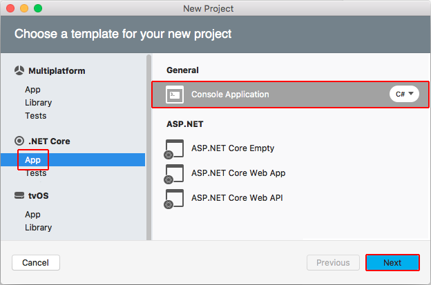
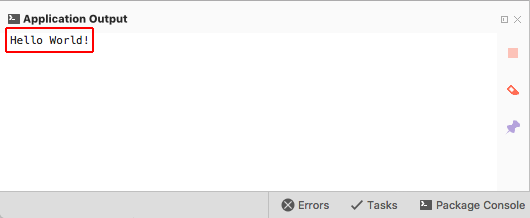

# Getting started with .NET Core on macOS using Visual Studio for Mac

Visual Studio for Mac provides a full-featured Integrated Development Environment (IDE) for developing .NET Core applications. This topic walks you through building a simple console application using Visual Studio for Mac and .NET Core.

> [!NOTE]
> Your feedback is highly valued. There are a two ways you can provide feedback to the development team on Visual Studio for Mac:
> * In Visual Studio for Mac, select **Help** > **Report a Problem** from the menu or **Report a Problem** from the Welcome screen, which will open a window for filing a bug report. You can track your feedback in the [Developer Community](https://developercommunity.visualstudio.com/spaces/8/index.html) portal.
> * To make a suggestion, select **Help** > **Provide a Suggestion** from the menu or **Provide a Suggestion** from the Welcome screen, which will take you to the [Visual Studio for Mac UserVoice webpage](https://visualstudio.uservoice.com/forums/563332-visual-studio-for-mac).

## Prerequisites

See the [Prerequisites for .NET Core on Mac](../../core/macos-prerequisites.md) topic.

## Getting started

If you've already installed the prerequisites and Visual Studio for Mac, skip this section and proceed to [Creating a project](#creating-a-project). Follow these steps to install the prerequisites and Visual Studio for Mac:

Download the [Visual Studio for Mac installer](https://www.visualstudio.com/vs/visual-studio-mac/). Run the installer. Read and accept the license agreement. During the install, you're provided the opportunity to install Xamarin, a cross-platform mobile app development technology. Installing Xamarin and its related components is optional for .NET Core development. For a walk-through of the Visual Studio for Mac install process, see [Introducing Visual Studio for Mac](https://developer.xamarin.com/guides/cross-platform/visual-studio-mac/). When the install is complete, start the Visual Studio for Mac IDE.

## Creating a project

1. Select **New Project** on the Welcome screen.

   

1. In the **New Project** dialog, select **App** under the **.NET Core** node. Select the **Console Application** template followed by **Next**.

   

1. Type "HelloWorld" for the **Project Name**. Select **Create**.

   

1. Wait while the project's dependencies are restored. The project has a single C# file, *Program.cs*, containing a `Program` class with a `Main` method. The `Console.WriteLine` statement will output "Hello World!" to the console when the app is run.

   

## Run the application

Run the app in Debug mode using <kbd>F5</kbd> or in Release mode using <kbd>CTRL</kbd>+<kbd>F5</kbd>.

## Next step

The [Building a complete .NET Core solution on macOS using Visual Studio for Mac](using-on-mac-vs-full-solution.md) topic shows you how to build a complete .NET Core solution that includes a reusable library and unit testing.
