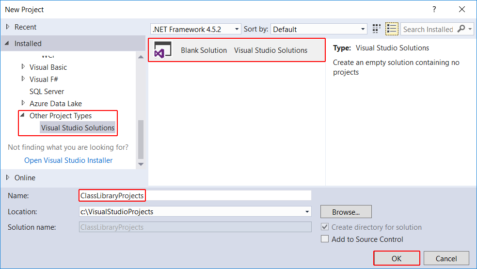
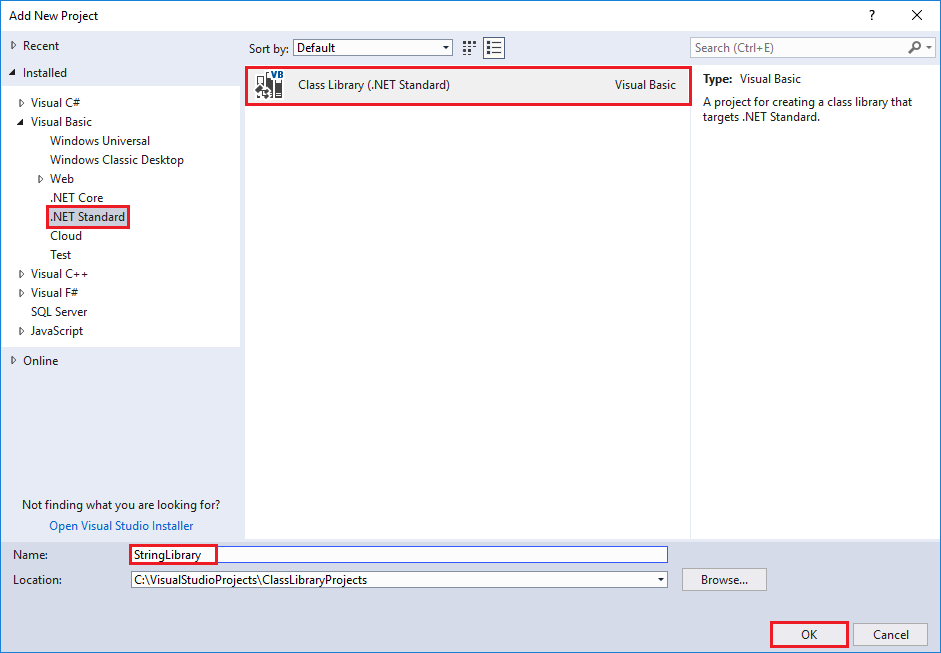
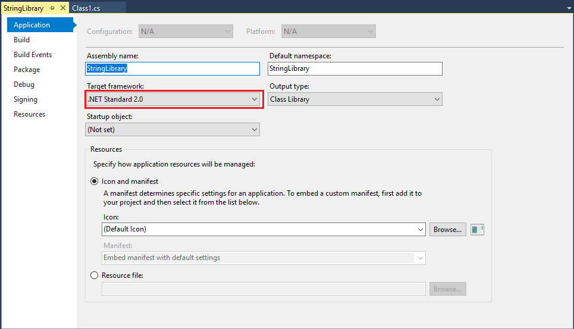
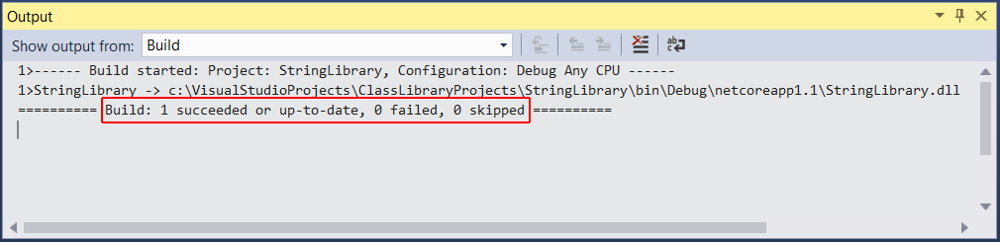

# Building a class library with Visual Basic and .NET Core in Visual Studio 2017

A *class library* defines types and methods that are called by an application. A class library that targets the .NET Standard 2.0 allows your library to be called by any .NET implementation that supports that version of the .NET Standard. When you finish your class library, you can decide whether you want to distribute it as a third-party component or whether you want to include it as a bundled component with one or more applications.

> [!NOTE]
> For a list of the .NET Standard versions and the platforms they support, see [.NET Standard](../../standard/net-standard.md).

In this topic, you'll create a simple utility library that contains a single string-handling method. You'll implement it as an [extension method](../../visual-basic/programming-guide/language-features/procedures/extension-methods.md) so that you can call it as if it were a member of the <xref:System.String> class.

## Creating a class library solution

Start by creating a solution for your class library project and its related projects. A Visual Studio Solution just serves as a container for one or more projects. To create the solution:

1. On the Visual Studio menu bar, choose **File** > **New** > **Project**.

1. In the **New Project** dialog, expand the **Other Project Types** node, and select **Visual Studio Solutions**. Name the solution "ClassLibraryProjects" and select the **OK** button.

   

## Creating the class library project

Create your class library project:

1. In **Solution Explorer**, right-click on the **ClassLibraryProjects** solution file and from the context menu, select **Add** > **New Project**.

1. In the **Add New Project** dialog, expand the **Visual Basic** node, then select the **.NET Standard** node followed by the **Class Library (.NET Standard)** project template. In the **Name** text box, enter "StringLibrary" as the name of the project. Select **OK** to create the class library project.

   

   The code window then opens in the Visual Studio development environment. 
 
   

1. Check to make sure that the library targets the correct version of the .NET Standard. Right-click on the library project in the **Solution Explorer** windows, then select **Properties**. The **Target Framework** text box shows that we're targeting .NET Standard 2.0.

   

1. Also in the **Properties** dialog, clear the text in the **Root namespace** text box. For each project, Visual Basic automatically creates a namespace that corresponds to the project name, and any namespaces defined in source code files are parents of that namespace. We want to define a top-level namespace by using the [`namespace`](../../visual-basic/language-reference/statements/namespace-statement.md) keyword.
  
1. Replace the code in the code window with the following code and save the file:

  [!CODE-vb[ClassLib#1](../../../samples/snippets/core/tutorials/vb-library-with-visual-studio/stringlibrary.vb)]

   The class library, `UtilityLibraries.StringLibrary`, contains a method named `StartsWithUpper`, which returns a <xref:System.Boolean> value that indicates whether the current string instance begins with an uppercase character. The Unicode standard distinguishes uppercase characters from lowercase characters. The <xref:System.Char.IsUpper(System.Char)?displayProperty=nameWithType> method returns `true` if a character is uppercase.

1. On the menu bar, select **Build** > **Build Solution**. The project should compile without error.

   

## Next step

You've successfully built the library. Because you haven't called any of its methods, you don't know whether it works as expected. The next step in developing your library is to test it by using a [Unit Test Project](testing-library-with-visual-studio.md).
