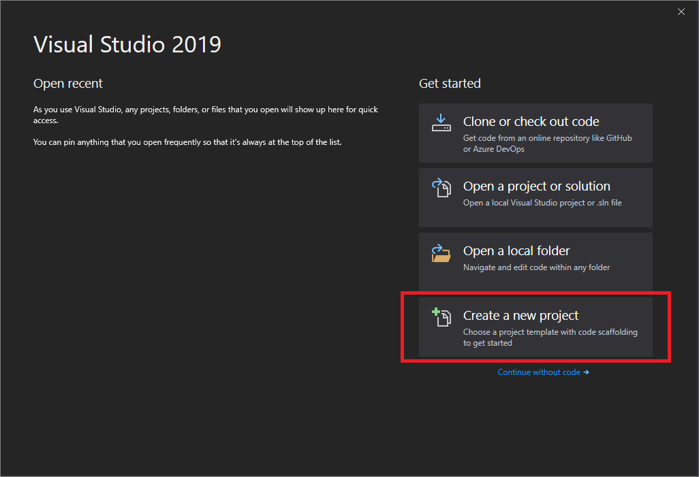
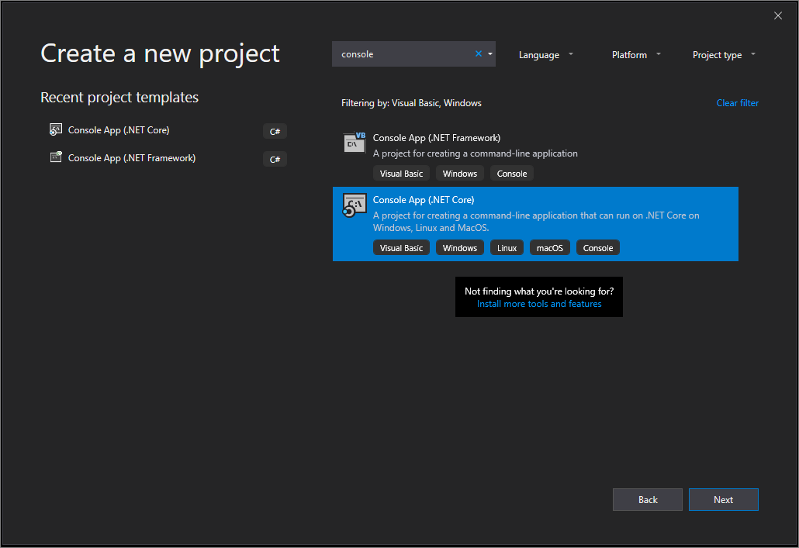
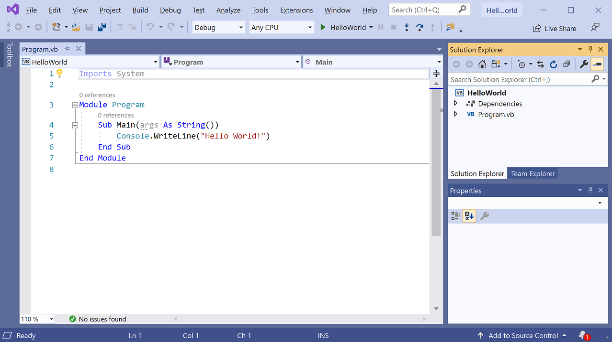
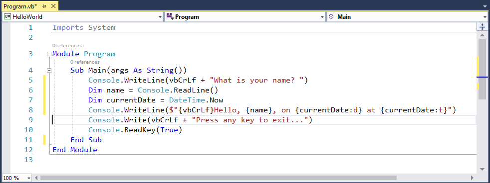

# Build a Visual Basic Hello World application with the .NET Core SDK in Visual Studio

This topic provides a step-by-step introduction to building, debugging, and publishing a simple .NET Core console application using Visual Basic in Visual Studio. Visual Studio provides a full-featured development environment for building .NET Core applications. As long as the application doesn't have platform-specific dependencies, the application can run on any platform that .NET Core targets and on any system that has .NET Core installed.

## Prerequisites

- [Visual Studio](https://visualstudio.microsoft.com/vs/?utm_medium=microsoft&utm_source=docs.microsoft.com&utm_campaign=inline+link) with the **.NET Core cross-platform development** workload installed. For more information, see [Install Visual Studio](/visualstudio/install/install-visual-studio).
- .NET Core 2.1 or a later version.

For more information, see [.NET Core dependencies and requirements](../install/dependencies.md?tabs=netcore30&pivots=os-windows).

## Create the app

Begin by creating a simple "Hello World" console application. Follow these steps:

1. Open Visual Studio.

1. Create a new Visual Basic .NET Core console app project named "HelloWorld".

   If you're using Visual Studio 2019:

   1. On the start window, choose **Create a new project**.

      

   1. On the **Create a new project** page, enter **console** in the search box. Next, choose **Visual Basic** from the Language list, and then choose **Windows** from the Platform list. Choose the **Console App (.NET Core)** template, and then choose **Next**.

      

   1. On the **Configure your new project** page,  enter **HelloWorld** in the **Project name** box. Then, choose **Create**.

   If you're using Visual Studio 2017:

   Select **File** > **New** > **Project** from the menu bar. In the *New Project** dialog, select the **Visual Basic** node followed by the **.NET Core** node. Then select the **Console App (.NET Core)** project template. In the **Name** text box, enter **HelloWorld**. Select **OK**.

1. Visual Studio uses the template to create your project. The console app template for .NET Core automatically defines a class, `Program`, with a single method, `Main`, that takes a <xref:System.String> array as an argument. `Main` is the application entry point, the method that's called automatically by the runtime when it launches the application. Any command-line arguments supplied when the application is launched are available in the `args` parameter.

   

   The template creates a simple "Hello World" application. It calls the <xref:System.Console.WriteLine(System.String)?displayProperty=nameWithType> method to display the literal string "Hello World!" in the console window.

1. Run the program by selecting the **HelloWorld** button with the green arrow on the toolbar.

   

1. Press any key to close the console window.

## Enhance the app

Enhance your application to prompt the user for their name and to display it along with the date and time. To modify and test the program, do the following:

1. Enter the following Visual Basic code in the code window immediately after the opening bracket that follows the `Sub Main(args As String())` line and before the first closing bracket:

   [!code-vb[GettingStarted#1](../../../samples/snippets/core/tutorials/vb-with-visual-studio/helloworld.vb#1)]

   This code replaces the contents of the `Main` method.

   

   This code displays "What is your name?" in the console window and waits until the user enters a string followed by the Enter key. It stores this string into a variable named `name`. It also retrieves the value of the <xref:System.DateTime.Now?displayProperty=nameWithType> property, which contains the current local time, and assigns it to a variable named `currentDate`. Finally, it uses an [interpolated string](../../visual-basic/programming-guide/language-features/strings/interpolated-strings.md) to display these values in the console window.

1. Compile the program by choosing **Build** > **Build Solution**.

1. Run the program in Debug mode in Visual Studio by selecting the green arrow on the toolbar, pressing **F5**, or choosing **Debug** > **Start Debugging**. Respond to the prompt by entering a name and pressing the **Enter** key.

   

1. Press any key to close the console window.

You've created and run your application. To develop a professional application, take some additional steps to make your application ready for release:

- To debug your application, see [Debug your .NET Core Hello World application using Visual Studio](debugging-with-visual-studio.md).

- To publish a distributable version of your application, see [Publish your .NET Core Hello World application with Visual Studio](publishing-with-visual-studio.md).

## Related topics

Instead of a console application, you can also build a .NET Standard class library with Visual Basic, .NET Core, and Visual Studio. For a step-by-step introduction, see [Build a .NET Standard library with .NET Core SDK in Visual Studio](library-with-visual-studio.md).
