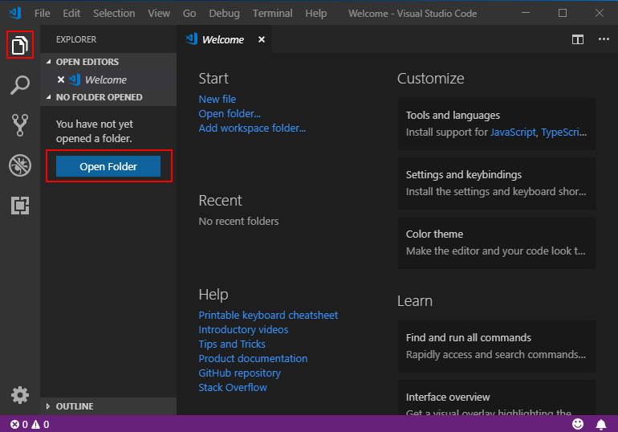
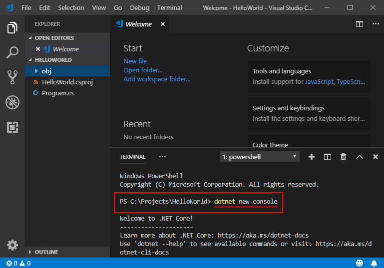
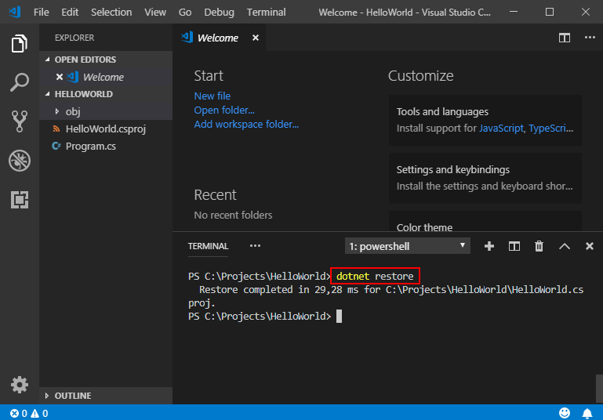
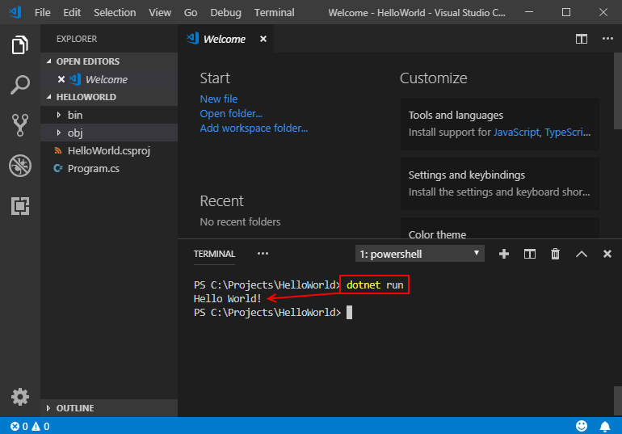
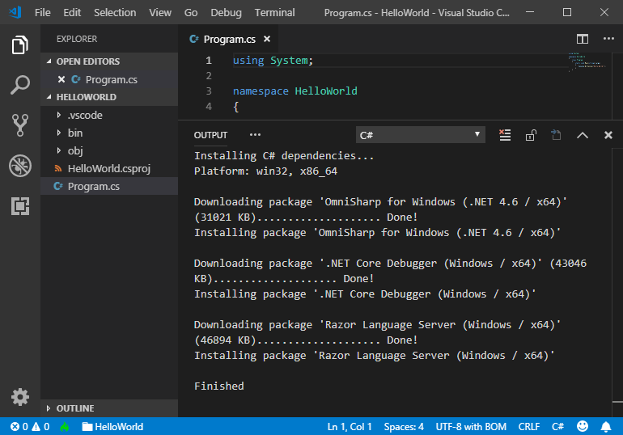
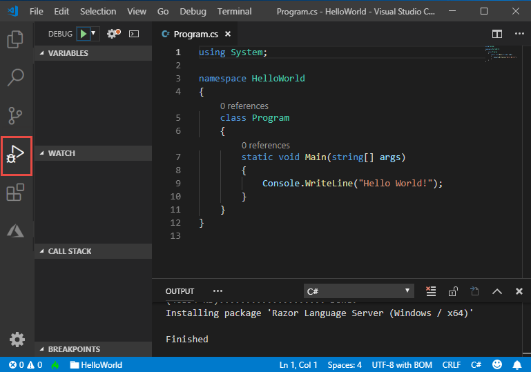
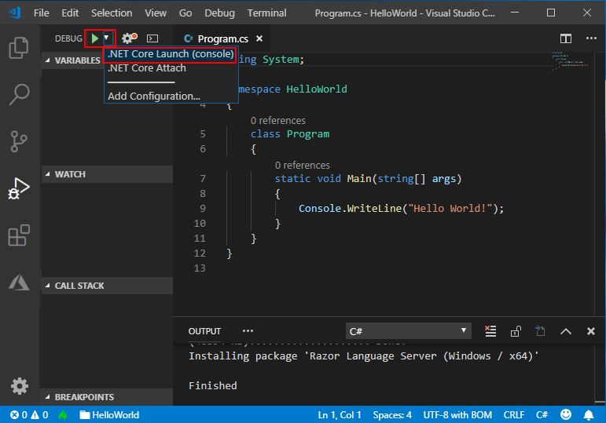
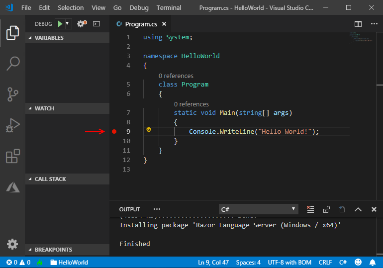
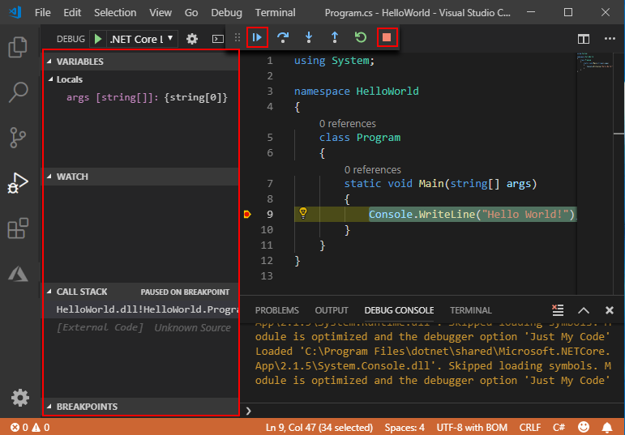

# Get started with C# and Visual Studio Code

.NET Core gives you a fast and modular platform for creating applications that run on Windows, Linux, and macOS. Use Visual Studio Code with the C# extension to get a powerful editing experience with full support for C# IntelliSense (smart code completion) and debugging.

## Prerequisites

1. Install [Visual Studio Code](https://code.visualstudio.com/).
2. Install the [.NET Core SDK](https://dotnet.microsoft.com/download).
3. Install the [C# extension](https://marketplace.visualstudio.com/items?itemName=ms-vscode.csharp) for Visual Studio Code. For more information about how to install extensions on Visual Studio Code, see [VS Code Extension Marketplace](https://code.visualstudio.com/docs/editor/extension-gallery).

## Hello World

Let's get started with a simple "Hello World" program on .NET Core:

1. Open a project:

    - Open Visual Studio Code.
    - Click on the Explorer icon on the left menu and then click **Open Folder**.
    - Select **File** > **Open Folder** from the main menu to open the folder you want your C# project to be in and click **Select Folder**. For our example, we're creating a folder for our project named *HelloWorld*.

      

2. Initialize a C# project:
    - Open the Integrated Terminal from Visual Studio Code by selecting **View** > **Integrated Terminal** from the main menu.
    - In the terminal window, type `dotnet new console`.
    - This command creates a `Program.cs` file in your folder with a simple "Hello World" program already written, along with a C# project file named `HelloWorld.csproj`.

      

3. Resolve the build assets:

    - For **.NET Core 1.x**, type `dotnet restore`. Running `dotnet restore` gives you access to the  required .NET Core packages that are needed to build your project.

      

      [!INCLUDE[DotNet Restore Note](~/includes/dotnet-restore-note.md)]

4. Run the "Hello World" program:

    - Type `dotnet run`.

      

You can also watch a short video tutorial for further setup help on [Windows](https://channel9.msdn.com/Blogs/dotnet/Get-started-with-VS-Code-using-CSharp-and-NET-Core), [macOS](https://channel9.msdn.com/Blogs/dotnet/Get-started-with-VS-Code-using-CSharp-and-NET-Core-on-MacOS), or [Linux](https://channel9.msdn.com/Blogs/dotnet/Get-started-with-VS-Code-Csharp-dotnet-Core-Ubuntu).

## Debug

1. Open *Program.cs* by clicking on it. The first time you open a C# file in Visual Studio Code, [OmniSharp](https://www.omnisharp.net/) loads in the editor.

    

2. Visual Studio Code should prompt you to add the missing assets to build and debug your app. Select **Yes**.

    

3. To open the Debug view, click on the Debugging icon on the left side menu.

    

4. Locate the green arrow at the top of the pane. Make sure the drop-down next to it has `.NET Core Launch (console)` selected.

    

5. Add a breakpoint to your project by clicking on the **editor margin**, which is the space on the left of the line numbers in the editor, next to line 9, or move the text cursor onto line 9 in the editor and  press <kbd>F9</kbd>.

    

6. To start debugging, select <kbd>F5</kbd> or the green arrow. The debugger stops execution of your program when it reaches the breakpoint you set in the previous step.
    - While debugging, you can view your local variables in the top left pane or use the debug console.

7. Select the blue arrow at the top to continue debugging, or select the red square at the top to stop.

    

> [!TIP]
> For more information and troubleshooting tips on .NET Core debugging with OmniSharp in Visual Studio Code, see [Instructions for setting up the .NET Core debugger](https://github.com/OmniSharp/omnisharp-vscode/blob/master/debugger.md).

## Add a class

1. To add a new class right-click in the VSCode Explorer and select **New File**. This adds a new file to the folder you have open in VSCode.
2. Name your file `MyClass.cs`. You must save it with a `.cs` extension at the end for it to be recognized as a csharp file.
3. Add the code below to create your first class. Make sure to include the correct namespace so you can reference it from your `Program.cs` file.

    ``` csharp
    using System;

    namespace HelloWorld
    {
        public class MyClass
        {
            public string ReturnMessage()
            {
                return "Happy coding!";
            }
        }
    }
    ```

4. Call your new class from your main method in `Program.cs` by adding the code below.

    ```csharp
    using System;
    
    namespace HelloWorld
    {
        class Program
        {
            static void Main(string[] args)
            {
                MyClass c1 = new MyClass();
                Console.WriteLine($"Hello World! {c1.ReturnMessage()}");
            }
        }
    }
    ```

5. Save your changes and run your program again. The new message should appear with the appended string.

    ```console
    > dotnet run
    Hello World! Happy coding!
    ```

## FAQ

### I'm missing required assets to build and debug C# in Visual Studio Code. My debugger says "No Configuration."

The Visual Studio Code C# extension can generate assets to build and debug for you. Visual Studio Code prompts you to generate these assets when you first open a C# project. If you didn't generate assets then, you can still run this command by opening the Command Palette (**View > Command Palette**) and typing ">.NET: Generate Assets for Build and Debug". Selecting this generates the .vscode, launch.json, and tasks.json configuration files that you need.

## See also

- [Setting up Visual Studio Code](https://code.visualstudio.com/docs/setup/setup-overview)
- [Debugging in Visual Studio Code](https://code.visualstudio.com/Docs/editor/debugging)
