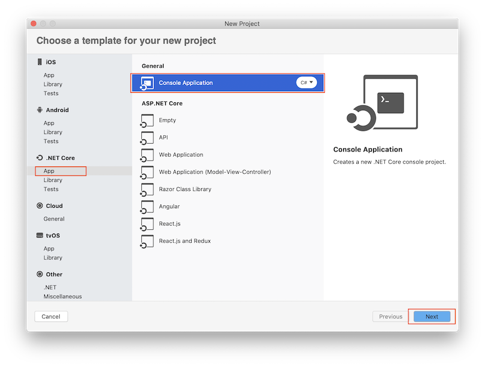
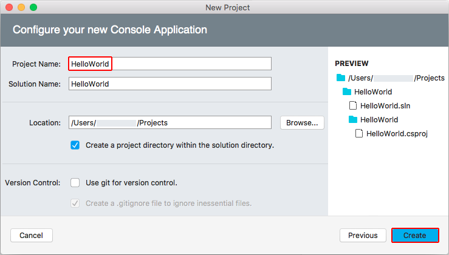
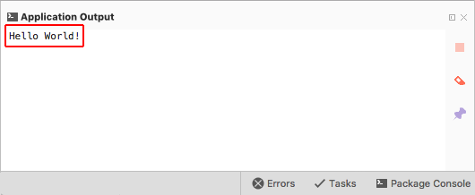

# Create a console application with .NET Core in Visual Studio for Mac

Visual Studio for Mac provides a full-featured Integrated Development Environment (IDE) for developing .NET Core applications. This tutorial walks you through building a simple console application using Visual Studio for Mac and .NET Core.

> [!NOTE]
> Your feedback is highly valued. There are two ways you can provide feedback to the development team on Visual Studio for Mac:
>
> * In Visual Studio for Mac, select **Help** > **Report a Problem** from the menu or **Report a Problem** from the Welcome screen, which will open a window for filing a bug report. You can track your feedback in the [Developer Community](https://developercommunity.visualstudio.com/spaces/8/index.html) portal.
> * To make a suggestion, select **Help** > **Provide a Suggestion** from the menu or **Provide a Suggestion** from the Welcome screen, which will take you to the [Visual Studio for Mac Developer Community webpage](https://developercommunity.visualstudio.com/content/idea/post.html?space=41).

## Prerequisites

* [Visual Studio for Mac](https://visualstudio.microsoft.com/vs/mac/?utm_medium=microsoft&utm_source=docs.microsoft.com&utm_campaign=inline+link). Select the option to install .NET Core. Installing Xamarin is optional for .NET Core development. For more information, see the following resources:

  * [Tutorial: Install Visual Studio for Mac](/visualstudio/mac/installation).
  * [Supported macOS versions](../install/dependencies.md?pivots=os-macos).
  * [.NET Core versions supported by Visual Studio for Mac](/visualstudio/mac/net-core-support).

## Create the app

1. Start Visual Studio for Mac.

1. Select **New** on the start window.

   

1. In the **New Project** dialog, select **App** under the **.NET Core** node.

1. Select the **Console Application** template, and select **Next**.

   

1. If you have more than one version of .NET Core installed, select the target framework for your project.

1. Type "HelloWorld" for the **Project Name**, and select **Create**.

   

   The Console Application template for .NET Core defines a class, `Program`, with a single method, `Main`, that takes a <xref:System.String> array as an argument. `Main` is the application entry point, the method that's called automatically by the runtime when it launches the application. Any command-line arguments supplied when the application is launched are available in the *args* array.

   ```csharp
   using System;

   namespace HelloWorld
   {
       class Program
       {
           static void Main(string[] args)
           {
               Console.WriteLine("Hello World!");
           }
       }
   }
   ```

## Run the app

1. Press ⌥ ⌘ ↵ (<kbd>option</kbd>+<kbd>command</kbd>+<kbd>enter</kbd>) to run the app.

   

1. Close the **Application Ouput** window.

## Enhance the app

Enhance the application to prompt the user for their name and display it along with the date and time. The following instructions modify the app and run it again:

1. In *Program.cs*, replace the contents of the `Main` method, which is currently just the line that calls `Console.WriteLine`, with the following code:

   :::code language="csharp" source="./snippets/with-visual-studio/csharp/Program.cs" id="Snippet1":::

   This code displays "What is your name?" in the console window and waits until the user enters a string followed by the <kbd>Enter</kbd> key. It stores this string in a variable named `name`. It also retrieves the value of the <xref:System.DateTime.Now?displayProperty=nameWithType> property, which contains the current local time, and assigns it to a variable named `date`. Finally, it displays these values in the console window.

   The `\n` represents a newline character.

   The dollar sign (`$`) in front of a string lets you put expressions such as variable names in curly braces in the string. The expression value is inserted into the string in place of the expression. This syntax is referred to as [interpolated strings](../../csharp/language-reference/tokens/interpolated.md).

1. Press ⌥ ⌘ ↵ (<kbd>option</kbd>+<kbd>command</kbd>+<kbd>enter</kbd>) to run the app.

1. Respond to the prompt by entering a name and pressing <kbd>Enter</kbd>.

   

1. Close the terminal.

## Next steps

In this tutorial, you created a .NET Core application. In the next tutorial, you debug the app.

> [!div class="nextstepaction"]
> [Debug a .NET Core console application in Visual Studio](debugging-with-visual-studio-mac.md)
