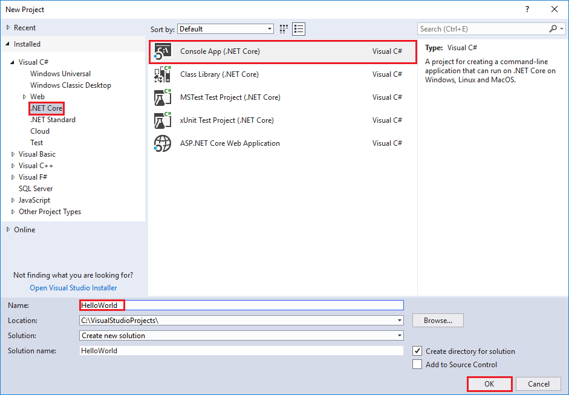

# Build a C# Hello World application with .NET Core in Visual Studio 2017

This topic provides a step-by-step introduction to building, debugging, and publishing a simple .NET Core console application using C# in Visual Studio 2017. Visual Studio 2017 provides a full-featured development environment for building .NET Core applications. As long as the application doesn't have platform-specific dependencies, the application can run on any platform that .NET Core targets and on any system that has .NET Core installed.

## Prerequisites

[Visual Studio 2017](https://aka.ms/vsdownload?utm_source=mscom&utm_campaign=msdocs) with the ".NET Core cross-platform development" workload installed. You can develop your app with either .NET Core 1.1 or .NET Core 2.0.

For more information, see the [Prerequisites for .NET Core on Windows](../../core/windows-prerequisites.md) topic.

## A simple Hello World application

Begin by creating a simple "Hello World" console application. Follow these steps:

1. Launch Visual Studio 2017. Select **File** > **New** > **Project** from the menu bar. In the *New Project** dialog, select the **Visual C#** node followed by the **.NET Core** node. Then select the **Console App (.NET Core)** project template. In the **Name** text box, type "HelloWorld". Select the **OK** button.

   
   
1. Visual Studio uses the template to create your project. The C# Console Application template for .NET Core automatically defines a class, `Program`, with a single method, `Main`, that takes a <xref:System.String> array as an argument. `Main` is the application entry point, the method that's called automatically by the runtime when it launches the application. Any command-line arguments supplied when the application is launched are available in the *args* array.

   

   The template creates a simple "Hello World" application. It calls the <xref:System.Console.WriteLine(System.String)?displayProperty=nameWithType> method to display the literal string "Hello World!" in the console window. By selecting the **HelloWorld** button with the green arrow on the toolbar, you can run the program in Debug mode. If you do, the console window is visible for only a brief time interval before it closes. This occurs because the `Main` method terminates and the application ends as soon as the single statement in the `Main` method executes.

1. To cause the application to pause before it closes the console window, add the following code immediately after the call to the <xref:System.Console.WriteLine(System.String)?displayProperty=nameWithType> method:

   ```csharp
   Console.Write("Press any key to continue...");
   Console.ReadKey(true);
   ```
   This code prompts the user to press any key and then pauses the program until a key is pressed.

1. On the menu bar, select **Build** > **Build Solution**. This compiles your program into an intermediate language (IL) that's converted into binary code by a just-in-time (JIT) compiler.

1. Run the program by selecting the **HelloWorld** button with the green arrow on the toolbar.

   

1. Press any key to close the console window.

## Enhancing the Hello World application

Enhance your application to prompt the user for their name and display it along with the date and time. To modify and test the program, do the following:

1. Enter the following C# code in the code window immediately after the opening bracket that follows the `static void Main(string[] args)` line and before the first closing bracket:

   [!code-csharp[GettingStarted#1](../../../samples/snippets/csharp/getting_started/with_visual_studio/helloworld.cs#1)]

   This code replaces the existing <xref:System.Console.WriteLine%2A?displayProperty=nameWithType>, <xref:System.Console.Write%2A?displayProperty=nameWithType>, and <xref:System.Console.ReadKey%2A?displayProperty=nameWithType> statements.

   

   This code displays "What is your name?" in the console window and waits until the user enters a string followed by the Enter key. It stores this string into a variable named `name`. It also retrieves the value of the <xref:System.DateTime.Now?displayProperty=nameWithType> property, which contains the current local time, and assigns it to a variable named `date`. Finally, it uses an [interpolated string](../../csharp/language-reference/tokens/interpolated.md) to display these values in the console window.

1. Compile the program by choosing **Build** > **Build Solution**.

1. Run the program in Debug mode in Visual Studio by selecting the green arrow on the toolbar, pressing F5, or choosing the **Debug** > **Start Debugging** menu item. Respond to the prompt by entering a name and pressing the Enter key.

   

1. Press any key to close the console window.

You've created and run your application. To develop a professional application, take some additional steps to make your application ready for release:

- For information on debugging your application, see [Debugging your C# Hello World application with Visual Studio 2017](debugging-with-visual-studio.md).

- For information on developing and publishing a distributable version of your application, see [Publishing your C# Hello World application with Visual Studio 2017](publishing-with-visual-studio.md).

## Related topics

Instead of a console application, you can also build a class library with .NET Core and Visual Studio 2017. For a step-by-step introduction, see [Building a class library with C# and .NET Core in Visual Studio 2017](library-with-visual-studio.md).

You can also develop a .NET Core console app on Mac, Linux, and Windows by using [Visual Studio Code](https://code.visualstudio.com/), a downloadable code editor. For a step-by-step tutorial, see [Getting Started with Visual Studio Code](with-visual-studio-code.md).
