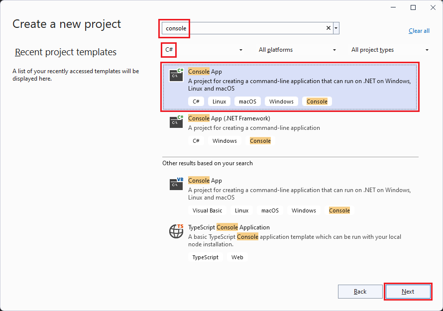

# Tutorial: Create a .NET Core console application using Visual Studio

This tutorial shows how to create and run a .NET Core console application in Visual Studio 2019.

## Prerequisites

- [Visual Studio 2019 version 16.6 or a later version](https://visualstudio.microsoft.com/downloads/?utm_medium=microsoft&utm_source=docs.microsoft.com&utm_campaign=inline+link&utm_content=download+vs2019) with the **.NET Core cross-platform development** workload installed. The .NET Core 3.1 SDK is automatically installed when you select this workload.

  For more information, see [Install the .NET Core SDK with Visual Studio](../install/sdk.md?pivots=os-windows#install-with-visual-studio).

## Create the app

Create a .NET Core console app project named "HelloWorld".

1. Start Visual Studio 2019.

1. On the start page, choose **Create a new project**.

   

1. On the **Create a new project** page, enter **console** in the search box. Next, choose **C#** or **Visual Basic** from the language list, and then choose **All platforms** from the platform list. Choose the **Console App (.NET Core)** template, and then choose **Next**.

   

   > [!TIP]
   > If you don't see the .NET Core templates, you're probably missing the required workload. Under the **Not finding what you're looking for?** message, choose the **Install more tools and features** link. The Visual Studio Installer opens. Make sure you have the **.NET Core cross-platform development** workload installed.

1. In the **Configure your new project** dialog,  enter **HelloWorld** in the **Project name** box. Then choose **Create**.

   

The template creates a simple "Hello World" application. It calls the <xref:System.Console.WriteLine(System.String)?displayProperty=nameWithType> method to display "Hello World!" in the console window.

The template code defines a class, `Program`, with a single method, `Main`, that takes a <xref:System.String> array as an argument:

```csharp
using System;

namespace HelloWorld
{
    class Program
    {
        static void Main(string[] args)
        {
            Console.WriteLine("Hello World!");
        }
    }
}
```

```vb
Imports System

Module Program
    Sub Main(args As String())
        Console.WriteLine("Hello World!")
    End Sub
End Module
```

`Main` is the application entry point, the method that's called automatically by the runtime when it launches the application. Any command-line arguments supplied when the application is launched are available in the *args* array.

If the language you want to use is not shown, change the language selector at the top of the page.

## Run the app

1. Press <kbd>Ctrl</kbd>+<kbd>F5</kbd> to run the program without debugging.

   A console window opens with the text "Hello World!" printed on the screen and some Visual Studio debug information.

   

1. Press any key to close the console window.

## Enhance the app

Enhance the application to prompt the user for their name and display it along with the date and time.

1. In *Program.cs* or *Program.vb*, replace the contents of the `Main` method, which is the line that calls `Console.WriteLine`, with the following code:

   :::code language="csharp" source="./snippets/with-visual-studio/csharp/Program.cs" id="MainMethod":::
   :::code language="vb" source="./snippets/with-visual-studio/vb/Program.vb" id="MainMethod":::

   This code displays a prompt in the console window and waits until the user enters a string followed by the <kbd>Enter</kbd> key. It stores this string in a variable named `name`. It also retrieves the value of the <xref:System.DateTime.Now?displayProperty=nameWithType> property, which contains the current local time, and assigns it to a variable named `date` (`currentDate` in Visual Basic). And it displays these values in the console window. Finally, it displays a prompt in the console window and calls the <xref:System.Console.ReadKey(System.Boolean)?displayProperty=nameWithType> method to wait for user input.

   The `\n` (`vbCrLf` in Visual Basic) represents a newline character.

   The dollar sign (`$`) in front of a string lets you put expressions such as variable names in curly braces in the string. The expression value is inserted into the string in place of the expression. This syntax is referred to as [interpolated strings](../../csharp/language-reference/tokens/interpolated.md).

1. Press <kbd>Ctrl</kbd>+<kbd>F5</kbd> to run the program without debugging.

1. Respond to the prompt by entering a name and pressing the <kbd>Enter</kbd> key.

   

1. Press any key to close the console window.

## Next steps

In this tutorial, you created a .NET Core console application. In the next tutorial, you debug the app.

> [!div class="nextstepaction"]
> [Debug a .NET Core console application using Visual Studio](debugging-with-visual-studio.md)
