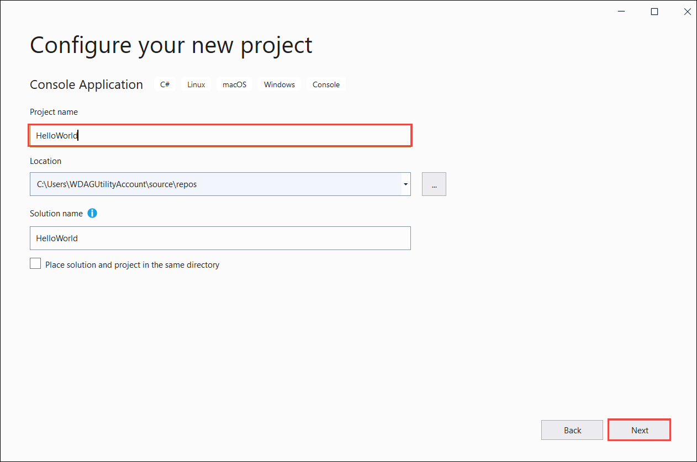

# Tutorial: Create your first .NET Core console application in Visual Studio 2019

This article provides a step-by-step introduction to create and run a Hello World .NET Core console application in Visual Studio 2019. A Hello World application is traditionally used to introduce beginners to a new programming language. This program simply displays the phrase "Hello World!" on the screen.

## Prerequisites

- [Visual Studio 2019 version 16.4 or a later version](https://visualstudio.microsoft.com/downloads/?utm_medium=microsoft&utm_source=docs.microsoft.com&utm_campaign=inline+link&utm_content=download+vs2019) with the **.NET Core cross-platform development** workload installed. .NET Core 3.1 SDK is automatically installed when you select this workload.

For more information, see the [Install with Visual Studio](../install/sdk.md?pivots=os-windows#install-with-visual-studio) section on the [Install the .NET Core SDK](../install/sdk.md?pivots=os-windows) article.

## Create the app

The following instructions create a simple Hello World console application:

<!-- markdownlint-disable MD025 -->

# [C#](#tab/csharp)

1. Open Visual Studio 2019.

1. Create a new C# .NET Core console app project named "HelloWorld".

   1. On the start window, choose **Create a new project**.

      

   1. On the **Create a new project** page, enter **console** in the search box. Next, choose **C#** from the Language list, and then choose **All platforms** from the Platform list. Choose the **Console App (.NET Core)** template, and then choose **Next**.

      

      > [!TIP]
      > If you don't see the .NET Core templates, you're probably missing the required workload installed. Under the **Not finding what you're looking for?** message, choose the **Install more tools and features** link. The Visual Studio Installer opens. Make sure you have the **.NET Core cross-platform development** workload installed.

   1. On the **Configure your new project** page,  enter **HelloWorld** in the **Project name** box. Then, choose **Create**.

      

   The C# Console Application template for .NET Core automatically defines a class, `Program`, with a single method, `Main`, that takes a <xref:System.String> array as an argument. `Main` is the application entry point, the method that's called automatically by the runtime when it launches the application. Any command-line arguments supplied when the application is launched are available in the *args* array.

   

# [Visual Basic](#tab/vb)

1. Open Visual Studio 2019.

1. Create a new Visual Basic .NET Core console app project named "HelloWorld".

   1. On the start window, choose **Create a new project**.

      

   1. On the **Create a new project** page, enter **console** in the search box. Next, choose **Visual Basic** from the Language list, and then choose **All platforms** from the Platform list. Choose the **Console App (.NET Core)** template, and then choose **Next**.

      

      > [!TIP]
      > If you don't see the .NET Core templates, you're probably missing the required workload installed. Under the **Not finding what you're looking for?** message, choose the **Install more tools and features** link. The Visual Studio Installer opens. Make sure you have the **.NET Core cross-platform development** workload installed.

   1. On the **Configure your new project** page,  enter **HelloWorld** in the **Project name** box. Then, choose **Create**.

   The console app template for .NET Core automatically defines a class, `Program`, with a single method, `Main`, that takes a <xref:System.String> array as an argument. `Main` is the application entry point, the method that's called automatically by the runtime when it launches the application. Any command-line arguments supplied when the application is launched are available in the `args` parameter.

   

---

   The template creates a simple "Hello World" application. It calls the <xref:System.Console.WriteLine(System.String)?displayProperty=nameWithType> method to display the literal string "Hello World!" in the console window.

## Run the app

1. To run the program, choose **HelloWorld** on the toolbar, or press **F5**.

   

   A console window opens with the text "Hello World!" printed on the screen and some Visual Studio debug information.

   

1. Press any key to close the console window.

## Enhance the app

Enhance your application to prompt the user for their name and display it along with the date and time. The following instructions modify and run the app again:

# [C#](#tab/csharp)

1. Replace the contents of the `Main` method, which is currently just the line that calls `Console.WriteLine`, with the following code:

   [!code-csharp[GettingStarted#1](~/samples/snippets/csharp/getting_started/with_visual_studio/helloworld.cs#1)]

   This code displays "What is your name?" in the console window and waits until the user enters a string followed by the Enter key. It stores this string into a variable named `name`. It also retrieves the value of the <xref:System.DateTime.Now?displayProperty=nameWithType> property, which contains the current local time, and assigns it to a variable named `date`. Finally, it uses an [interpolated string](../../csharp/language-reference/tokens/interpolated.md) to display these values in the console window.

1. Compile the program by choosing **Build** > **Build Solution**.

1. To run the program, choose **HelloWorld** on the toolbar, or press **F5**.

1. Respond to the prompt by entering a name and pressing the **Enter** key.

   

1. Press any key to close the console window.

# [Visual Basic](#tab/vb)

1. Replace the contents of the `Main` method, which is currently just the line that calls `Console.WriteLine`, with the following code:

   [!code-vb[GettingStarted#1](~/samples/snippets/core/tutorials/vb-with-visual-studio/helloworld.vb#1)]

   This code displays "What is your name?" in the console window and waits until the user enters a string followed by the Enter key. It stores this string into a variable named `name`. It also retrieves the value of the <xref:System.DateTime.Now?displayProperty=nameWithType> property, which contains the current local time, and assigns it to a variable named `date`. Finally, it uses an [interpolated string](../../visual-basic/programming-guide/language-features/strings/interpolated-strings.md) to display these values in the console window.

1. Compile the program by choosing **Build** > **Build Solution**.

1. To run the program, choose **HelloWorld** on the toolbar, or press **F5**.

1. Respond to the prompt by entering a name and pressing the **Enter** key.

   

1. Press any key to close the console window.

---

## Next steps

In this article, you've created and run your first .NET Core application. In the next step, you debug your app.

> [!div class="nextstepaction"]
> [Debug a .NET Core Hello World application in Visual Studio](debugging-with-visual-studio.md)
