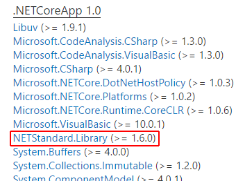
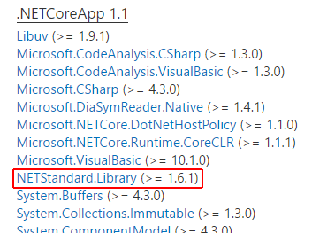

# .NET Core versioning

.NET Core is a platform of [NuGet-packaged](../packages.md) frameworks and distributed as a unit. Platform layers are versioned separately for product agility. The versioning scheme also accurately describes product changes because segments of the version number represent specific types of change. While there is significant versioning flexibility, we have a desire to version the platform as a unit to make the product easier to understand.

In some respects, .NET Core is unique in the way it's described and delivered as packages via a package manager, [NuGet](../packages.md). While you typically install .NET Core as a standalone SDK, the SDK is largely a convenience experience for installing NuGet packages and therefore not distinct from packages. As a result, versioning is first and foremost in terms of packages, and other versioning experiences follow from there.

## Semantic Versioning

.NET Core closely follows [Semantic Versioning (SemVer)](http://semver.org/), adopting the use of MAJOR.MINOR.PATCH versioning. The parts of the version number describe the degree and kind of change across versions.

### Versioning template

The following versioning template is generally applied to .NET Core. There are cases where it has been adapted to fit with prior versioning schemes. These cases are described later in this document. For example, frameworks are only intended to represent platform and API capabilities, which aligns with MAJOR.MINOR versioning (no PATCH versioning). When determining the version when there are multiple changes, we choose the highest kind of change.

MAJOR.MINOR.PATCH[-PRERELEASE-BUILDNUMBER]

### Decision tree

**MAJOR** increments when:

- Dropping support for a platform.
- Adopting a newer major version of an existing dependency.
- Disabling a compatibility quirk by default.

**MINOR** increments when:

- Adding public API surface area.
- Adding new behavior.
- Adopting a newer minor version of an existing dependency.
- Introducing a new dependency.
  
**PATCH** increments when:

- Making bug fixes.
- Adding support for a newer platform.
- Adopting a newer patch version of an existing dependency.
- Making any other change not otherwise listed.

## Versioning scheme

.NET Core is defined and versioned as:

- A runtime and framework implementation, distributed as packages. Each package is versioned independently, particularly for patch versioning.
- A set of metapackages that reference fine-grained packages as a versioned unit. Metapackages are versioned separately from packages.
- A set of frameworks (for example, `netstandard`) that represent a progressively larger API set, described in a set of versioned snapshots.

### Packages

Library packages evolve and version independently. Packages that overlap with .NET Framework `System.*` assemblies typically use 4.x versions, aligning with the .NET Framework 4.x versioning (a historical choice). Packages that do not overlap with the .NET Framework libraries (for example, [`System.Reflection.Metadata`](https://www.nuget.org/packages/System.Reflection.Metadata)) typically start at 1.0 and increment from there.

The packages described by [`NETStandard.Library`](https://www.nuget.org/packages/NETStandard.Library) receive special treatment due to their position at the base of the platform:

- `NETStandard.Library` packages typically version as a set, since they have implementation-level dependencies among them.
- APIs are only added to `NETStandard.Library` packages as part of major or minor .NET Core releases, since doing so would require adding a new `netstandard` version. This is in addition to SemVer requirements.

### Metapackages

Versioning for .NET Core metapackages is based on the framework that they map to. The metapackages adopt the highest version number of the framework (for example, `netstandard1.6`) it maps to in its package closure.

The patch version for the metapackage is used to represent updates to the metapackage, which occur when any of its packages are updated. Patch versions never include an updated framework version. As a result, the metapackages aren't strictly SemVer compliant because their versioning scheme doesn't represent the degree of change in the underlying packages but instead primarily the degree of change at the API level.

There are two primary metapackages for .NET Core:

**NETStandard.Library**

- v1.6.1 as of .NET Core 1.1 (these versions don't typically or intentionally match).
- Maps to the `netstandard` framework.
- Describes the packages that are considered required for modern app development and that .NET platforms must implement to be considered a [.NET Standard](../../standard/library.md) platform.

**Microsoft.NETCore.App**

- v1.1.2 as of .NET Core 1.1 (the MAJOR.MINOR version always match).
- Maps to the `netcoreapp` framework.
- Describes the packages in the .NET Core distribution.

Note that [`Microsoft.NETCore.Portable.Compatibility`](https://www.nuget.org/packages/Microsoft.NETCore.Portable.Compatibility) is another .NET Core metapackage. It doesn't map to a particular framework, so it versions like a package.

### Frameworks

Framework versions are updated when new APIs are added. They have no concept of patch version, since they represent API shape and not implementation concerns. MAJOR.MINOR versioning follows the SemVer rules specified earlier.

The `netcoreapp` framework is tied to the .NET Core distribution. It follows the version numbers used by .NET Core. When .NET Core 2.0 is released, it will target `netcoreapp2.0`. The `netstandard` framework doesn't match the versioning scheme of any .NET runtime, given that it's equally applicable to all of them.

## Versioning in practice

On a daily basis, there are commits and PRs in the .NET Core GitHub repos resulting in a constant stream of new builds of many libraries. It isn't practical to create new public versions of .NET Core for every change. Instead, changes are aggregated over some loosely-defined period of time (for example, weeks or months) before making a new public stable .NET Core version.

A new version of .NET Core could mean several things:

- New versions of packages and metapackages
- New versions of various frameworks, assuming the addition of new APIs
- New version of the .NET Core distribution

### Shipping a patch release

Patch-level changes (no new APIs) are made to .NET Core libraries to fix bugs and improve performance and reliability. The various metapackages are updated to reference the updated .NET Core library packages. The metapackages are versioned as patch updates (x.y.z). Frameworks are not updated. A new .NET Core distribution is released with a matching version number to the `Microsoft.NETCore.App` metapackage.

Between the release of the `Microsoft.NETCore.App` metapackage for versions 1.0 and 1.1, the `NETStandard.Library` metapackage received a patch update from version 1.6.0 to 1.6.1:





### Shipping a minor release

New APIs are added to .NET Core libraries to enable new scenarios. The various metapackages are updated to reference the updated .NET Core library packages. The metapackages are versioned as patch updates (x.y) to match the higher framework version. The various frameworks are updated to describe the new APIs. A new .NET Core distribution is released with a matching version number to the `Microsoft.NETCore.App` metapackage.

You can see a minor release demonstrated in the following project file (1.1):

```xml
<Project Sdk="Microsoft.NET.Sdk">
  <PropertyGroup>
    <TargetFramework>netcoreapp1.1</TargetFramework>
    <OutputType>exe</OutputType>
  </PropertyGroup>
</Project>
```

### Shipping a major release

New APIs are added to .NET Core libraries to enable major new scenarios. Sometimes, support for an API is dropped for a platform. The various metapackages are updated to reference the updated .NET Core library packages.

The `Microsoft.NETCore.App` metapackage and the `netcore` framework are versioned as a major update (x.). A new .NET Core distribution is released with a matching version number to the `Microsoft.NETCore.App` metapackage. The `NETStandard.Library` metapackage is usually versioned as a minor update (x.y), since it applies to multiple .NET implementations. 

You can see a major update demonstrated in the following project file (2.0\*):

```xml
<Project Sdk="Microsoft.NET.Sdk">
  <PropertyGroup>
    <TargetFramework>netcoreapp2.0</TargetFramework>
    <OutputType>exe</OutputType>
  </PropertyGroup>
</Project>
```

\* `netcoreapp2.0` is in preview and has not been released.
