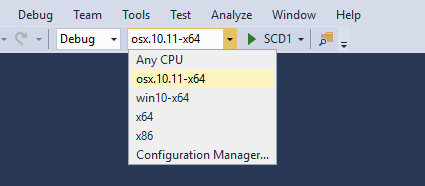

# What's new in .NET Core

.NET Core 2.0 includes enhancements and new features in the following areas:

- [Tooling](#tooling)
- [Language support](#language-support)
- [Platform improvements](#platform-improvements)
- [API changes](#api-changes-and-library-support)
- [Visual Studio integration](#visual-studio-integration)
- [Documentation improvements](#documentation-improvements)

## Tooling

### dotnet restore runs implicitly

In previous versions of .NET Core, you had to run the [dotnet restore](../tools/dotnet-restore.md) command to download dependencies immediately after you created a new project with the [dotnet new](../tools/dotnet-new.md) command, as well as whenever you added a new dependency to your project.

[!INCLUDE[DotNet Restore Note](~/includes/dotnet-restore-note.md)]

You can also disable the automatic invocation of `dotnet restore` by passing the `--no-restore` switch to the `new`, `run`, `build`, `publish`, `pack`, and `test` commands. 

### Retargeting to .NET Core 2.0

If the .NET Core 2.0 SDK is installed, projects that target .NET Core 1.x can be retargeted to .NET Core 2.0.

To retarget to .NET Core 2.0, edit your project file by changing the value of the `<TargetFramework>` element (or the `<TargetFrameworks>` element if you have more than one target in your project file) from 1.x to 2.0:

```xml
<PropertyGroup>
    <TargetFramework>netcoreapp2.0</TargetFramework>
 </PropertyGroup>
```

You can also retarget .NET Standard libraries to .NET Standard 2.0 the same way:

```xml
<PropertyGroup>
    <TargetFramework>netstandard2.0</TargetFramework>
 </PropertyGroup>
```

For more information about migrating your project to .NET Core 2.0, see [Migrating from ASP.NET Core 1.x to ASP.NET Core 2.0](/aspnet/core/migration/1x-to-2x/index).

## Language support

In addition to supporting C# and F#, .NET Core 2.0 also supports Visual Basic.

### Visual Basic

With version 2.0, .NET Core now supports Visual Basic 2017. You can use Visual Basic to create the following project types:

- .NET Core console apps
- .NET Core class libraries
- .NET Standard class libraries
- .NET Core unit test projects
- .NET Core xUnit test projects

For example, to create a Visual Basic "Hello World" application, do the following steps from the command line:

1. Open a console window, create a directory for your project, and make it the current directory.

1. Enter the command `dotnet new console -lang vb`.

   The command creates a project file with a `.vbproj` file extension, along with a Visual Basic source code file named *Program.vb*. This file contains the source code to write the string "Hello World!" to the console window.

1.  Enter the command `dotnet run`. The [.NET Core CLI tools](../tools/index.md) automatically compile and execute the application, which displays the message "Hello World!" in the console window.

### Support for C# 7.1

.NET Core 2.0 supports C# 7.1, which adds a number of new features, including:

- The `Main` method, the application entry point, can be marked with the [async](../../csharp/language-reference/keywords/async.md) keyword.
- Inferred tuple names.
- Default expressions.

<!-- For more information see [link to C# what's new](url). -->

## Platform improvements

.NET Core 2.0 includes a number of features that make it easier to install .NET Core and to use it on supported operating systems.

### .NET Core for Linux is a single implementation

.NET Core 2.0 offers a single Linux implementation that works on multiple Linux distributions. .NET Core 1.x required that you download a distribution-specific Linux implementation.

You can also develop apps that target Linux as a single operating system. .NET Core 1.x required that you target each Linux distribution separately.

### Support for the Apple cryptographic libraries

.NET Core 1.x on macOS required the OpenSSL toolkit's cryptographic library. .NET Core 2.0 uses the Apple cryptographic libraries and doesn't require OpenSSL, so you no longer need to install it.

## API changes and library support

### Support for .NET Standard 2.0

The .NET Standard defines a versioned set of APIs that must be available on .NET implementations that comply with that version of the standard. The .NET Standard is targeted at library developers. It aims to guarantee the functionality that is available to a library that targets a version of the .NET Standard on each .NET implementation. .NET Core 1.x supports the .NET Standard version 1.6; .NET Core 2.0 supports the latest version, .NET Standard 2.0. For more information, see [.NET Standard](../../standard/net-standard.md).

.NET Standard 2.0 includes over 20,000 more APIs than were available in the .NET Standard 1.6. Much of this expanded surface area results from incorporating APIs that are common to the .NET Framework and Xamarin into .NET Standard.

.NET Standard 2.0 class libraries can also reference .NET Framework class libraries, provided that they call APIs that are present in the .NET Standard 2.0. No recompilation of the .NET Framework libraries is required.

For a list of the APIs that have been added to the .NET Standard since its last version, the .NET Standard 1.6, see [.NET Standard 2.0 vs. 1.6](https://raw.githubusercontent.com/dotnet/standard/master/docs/versions/netstandard2.0_diff.md).

### Expanded surface area

The total number of APIs available on .NET Core 2.0 has more than doubled in comparison with .NET Core 1.1.

And with the [Windows Compatibility Pack](../porting/windows-compat-pack.md) porting from .NET Framework has also become much simpler.

### Support for .NET Framework libraries

.NET Core code can reference existing .NET Framework libraries, including existing NuGet packages. Note that the libraries must use APIs that are found in .NET Standard.

## Visual Studio integration

Visual Studio 2017 version 15.3 and in some cases Visual Studio for Mac offer a number of significant enhancements for .NET Core developers.

### Retargeting .NET Core apps and .NET Standard libraries

If the .NET Core 2.0 SDK is installed, you can retarget .NET Core 1.x projects to .NET Core 2.0 and .NET Standard 1.x libraries to .NET Standard 2.0.

To retarget your project in Visual Studio, you open the **Application** tab of the project's properties dialog and change the **Target framework** value to **.NET Core 2.0** or **.NET Standard 2.0**. You can also change it by right-clicking on the project and selecting the **Edit \*.csproj file** option. For more information, see the [Tooling](#tooling) section earlier in this topic.

### Live Unit Testing support for .NET Core

Whenever you modify your code, Live Unit Testing automatically runs any affected unit tests in the background and displays the results and code coverage live in the Visual Studio environment. .NET Core 2.0 now supports Live Unit Testing. Previously, Live Unit Testing was available only for .NET Framework applications.

For more information, see [Live Unit Testing with Visual Studio 2017](/visualstudio/test/live-unit-testing) and the [Live Unit Testing FAQ](/visualstudio/test/live-unit-testing-faq).

### Better support for multiple target frameworks

If you're building a project for multiple target frameworks, you can now select the target platform from the top-level menu. In the following figure, a project named SCD1 targets 64-bit Mac OS X 10.11 (`osx.10.11-x64`) and 64-bit Windows 10/Windows Server 2016 (`win10-x64`). You can select the target framework before selecting the project button, in this case to run a debug build.



### Side-by-side support for .NET Core SDKs

You can now install the .NET Core SDK independently of Visual Studio. This makes it possible for a single version of Visual Studio to build projects that target different versions of .NET Core. Previously, Visual Studio and the .NET Core SDK were tightly coupled; a particular version of the SDK accompanied a particular version of Visual Studio.

## Documentation improvements

### .NET Application Architecture

[.NET Application Architecture](https://www.microsoft.com/net/learn/architecture) gives you access to a set of e-books that provide guidance, best practices, and sample applications when using .NET to build:

- Microservices and Docker containers.
- Web applications with ASP.NET.
- Mobile applications with Xamarin.
- Applications that are deployed to the Cloud with Azure.

## See also
 [What's new in ASP.NET Core 2.0](/aspnet/core/aspnetcore-2.0)
