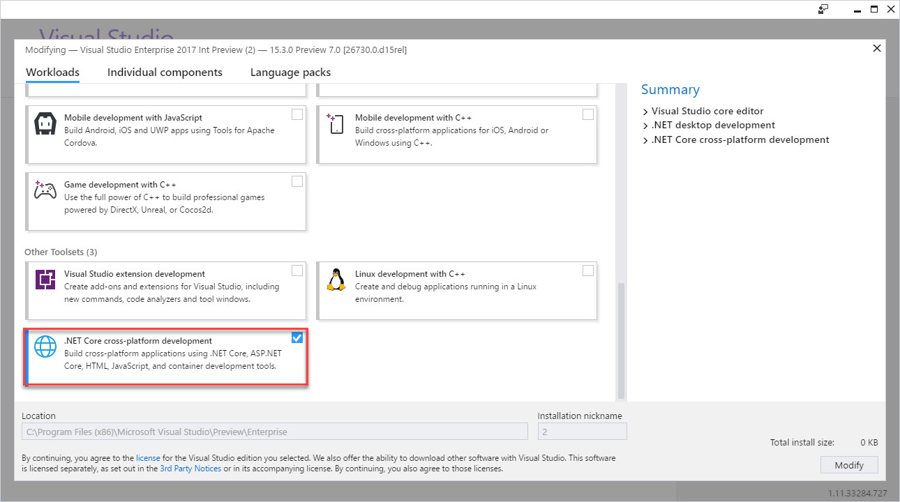
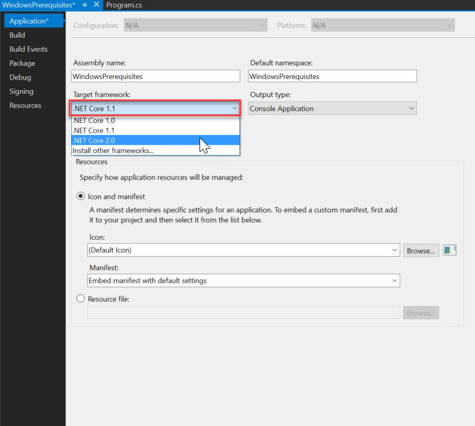

# Prerequisites for .NET Core on Windows

This article shows the dependencies needed to develop .NET Core applications on Windows. The supported OS versions and dependencies that follow apply to the three ways of developing .NET Core apps on Windows:

* [Command line](tutorials/using-with-xplat-cli.md)
* [Visual Studio 2017](https://aka.ms/vsdownload?utm_source=mscom&utm_campaign=msdocs)
* [Visual Studio Code](https://code.visualstudio.com/)

## .NET Core supported Windows versions

.NET Core is supported on the following versions of:

* Windows 7 SP1
* Windows 8.1
* Windows 10 Anniversary Update (version 1607) or later versions
* Windows Server 2008 R2 SP1 (Full Server or Server Core)
* Windows Server 2012 SP1 (Full Server or Server Core)
* Windows Server 2012 R2 (Full Server or Server Core)
* Windows Server 2016 (Full Server, Server Core, or Nano Server)

See [.NET Core 2.x - Supported OS Versions](https://github.com/dotnet/core/blob/master/release-notes/2.0/2.0-supported-os.md) for the complete list of .NET Core 2.x supported operating systems.

See [.NET Core 1.x Supported OS Versions](https://github.com/dotnet/core/blob/master/release-notes/1.0/1.0-supported-os.md) for the complete list of .NET Core 1.x supported operating systems.

## .NET Core dependencies

.NET Core 1.1 and earlier versions require the Visual C++ Redistributable when running on Windows versions earlier than Windows 10 and Windows Server 2016. This dependency is automatically installed by the .NET Core installer.

[Microsoft Visual C++ 2015 Redistributable Update 3](https://www.microsoft.com/download/details.aspx?id=52685) must be manually installed when:

* Installing .NET Core with the [installer script](./tools/dotnet-install-script.md).
* Deploying a self-contained .NET Core application.
* Building the product from source.
* Installing .NET Core via a *.zip* file. This can include build/CI/CD servers.

> [!NOTE]
> *For Windows 7 and Windows Server 2008 machines only:*
> Make sure that your Windows installation is up-to-date and includes hotfix [KB2533623](https://support.microsoft.com/help/2533623) installed through Windows Update.

## Prerequisites with Visual Studio 2017

You can use any editor to develop .NET Core applications using the .NET Core SDK. [Visual Studio 2017](#visual-studio-2017) provides an integrated development environment for .NET Core apps on Windows.

You can read more about the changes in Visual Studio 2017 in the [release notes](/visualstudio/releasenotes/vs2017-relnotes).

# [.NET Core 2.x](#tab/netcore2x)

To develop .NET Core 2.x apps in Visual Studio 2017:

 1. [Download and install Visual Studio 2017 version 15.3.0 or higher](/visualstudio/install/install-visual-studio) with the **.NET Core cross-platform development** workload (in the **Other Toolsets** section) selected.

After the **.NET Core cross-platform development** toolset is installed, Visual Studio 2017 uses .NET Core 1.x by default. Install the .NET Core 2.x SDK to get .NET Core 2.x support in Visual Studio 2017.

 2. Install the [.NET Core 2.x SDK](https://www.microsoft.com/net/download/core).
 3. Retarget existing or new .NET Core 1.x projects to .NET Core 2.x using the following instructions:
    * On the **Project** menu, Choose **Properties**.
    * In the **Target framework** selection menu, set the value to **.NET Core 2.0**.

Once the .NET Core 2.x SDK is installed, Visual Studio 2017 uses the .NET Core SDK 2.x by default, and supports the following actions:

* Open, build, and run existing .NET Core 1.x projects.
* Retarget .NET Core 1.x projects to .NET Core 2.x, build, and run.
* Create new .NET Core 2.x projects.

# [.NET Core 1.x](#tab/netcore1x)

To develop .NET Core 1.x apps in Visual Studio, [download and install Visual Studio 2017 RTM (version 15.0.26228.4) or higher](/visualstudio/install/install-visual-studio) with the **".NET Core cross-platform development"** workload (in the **Other Toolsets** section) selected.

> [!IMPORTANT]
> It's possible to use Visual Studio 2015 for .NET Core 1.x development, but it's not recommended for the following reasons:
  > * The .NET Core tooling is a preview version, which is not supported.
  > * The projects are project.json-based, which is deprecated.
>
> For more information about the project format changes, see [High-level overview of changes](./tools/cli-msbuild-architecture.md).
---

> [!TIP]
> To verify your Visual Studio 2017 version:
>
> * On the **Help** menu, choose **About Microsoft Visual Studio**.
> * In the **About Microsoft Visual Studio** dialog, verify the version number.
>   * For .NET Core 2.1 Preview 1 apps, Visual Studio 2017 version 15.6 Preview 6 or higher.
>   * For .NET Core 2.0 apps, Visual Studio 2017 version 15.3 or higher.
>   * For .NET Core 1.x apps, Visual Studio 2017 version 15.0 or higher.
