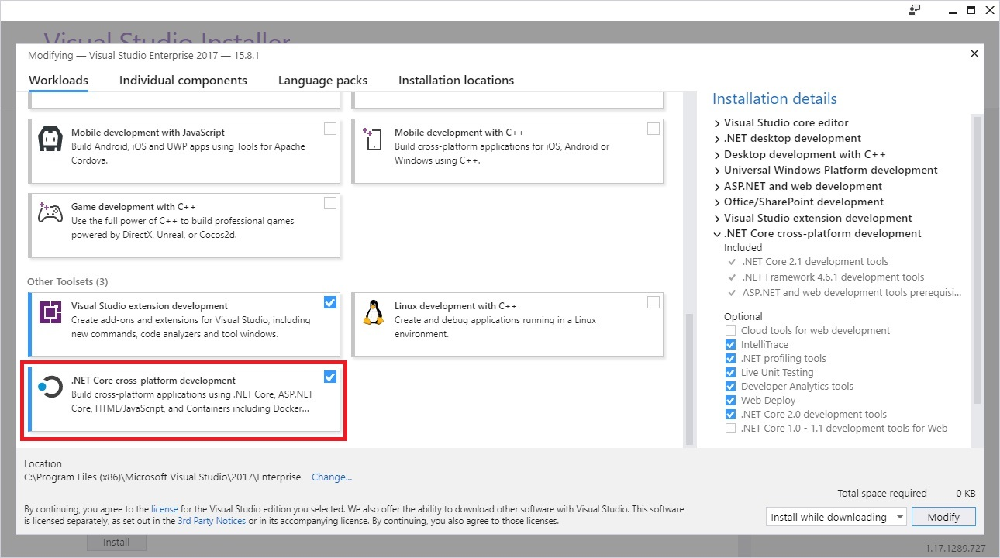

# Prerequisites for .NET Core on Windows

This article shows the dependencies needed to develop .NET Core applications on Windows. The supported OS versions and dependencies that follow apply to the three ways of developing .NET Core apps on Windows:

* [Command line](tutorials/using-with-xplat-cli.md)
* [Visual Studio 2017](https://aka.ms/vsdownload?utm_source=mscom&utm_campaign=msdocs)
* [Visual Studio Code](https://code.visualstudio.com/)

## .NET Core supported Windows versions

.NET Core is supported on the following versions of:

* Windows 7 SP1
* Windows 8.1
* Windows 10 Anniversary Update (version 1607) or later versions
* Windows Server 2008 R2 SP1 (Full Server or Server Core)
* Windows Server 2012 SP1 (Full Server or Server Core)
* Windows Server 2012 R2 (Full Server or Server Core)
* Windows Server 2016 or later versions (Full Server, Server Core, or Nano Server)

## .NET Core supported operating systems

The following articles have a complete list of .NET Core supported operating systems per version:

* [.NET Core 2.1 - Supported OS Versions](https://github.com/dotnet/core/blob/master/release-notes/2.1/2.1-supported-os.md)
* [.NET Core 1.x - Supported OS Versions](https://github.com/dotnet/core/blob/master/release-notes/1.0/1.0-supported-os.md)

For download links and more information, see [.NET Core 2.2 downloads](https://www.microsoft.com/net/download/dotnet-core/2.2), [.NET Core 2.1 downloads](https://www.microsoft.com/net/download/dotnet-core/2.1), [.NET Core 1.1 downloads](https://www.microsoft.com/net/download/dotnet-core/1.1), or [.NET Core 1.0 downloads](https://www.microsoft.com/net/download/dotnet-core/1.0).

## .NET Core dependencies

.NET Core 1.1 and earlier versions require the Visual C++ Redistributable when running on Windows versions earlier than Windows 10 and Windows Server 2016. This dependency is automatically installed by the .NET Core installer.

[Microsoft Visual C++ 2015 Redistributable Update 3](https://www.microsoft.com/download/details.aspx?id=52685) must be manually installed when:

* Installing .NET Core with the [installer script](./tools/dotnet-install-script.md).
* Deploying a self-contained .NET Core application.
* Building the product from source.
* Installing .NET Core via a *.zip* file. This can include build/CI/CD servers.

> [!NOTE]
> **For Windows 8.1 and earlier versions, or Windows Server 2012 R2 and earlier versions:**
>
> Make sure that your Windows installation is up-to-date and includes [KB2999226](https://support.microsoft.com/en-us/help/2999226/update-for-universal-c-runtime-in-windows), which can be installed through Windows Update. If you don't have this update installed, you'll see an error like the following when you launch a .NET Core application: `The program can't start because api-ms-win-crt-runtime-1-1-0.dll is missing from your computer. Try reinstalling the program to fix this problem.`
>
> **For Windows 7 or Windows Server 2008 R2:**
>
> In addition to KB2999226, make sure you also have [KB2533623](https://support.microsoft.com/en-us/help/2533623/microsoft-security-advisory-insecure-library-loading-could-allow-remot) installed. If you don't have this update installed, you'll see an error similar to the following when you launch a .NET Core application: `The library hostfxr.dll was found, but loading it from C:\<path_to_app>\hostfxr.dll failed`.

## Prerequisites with Visual Studio 2017

You can use any editor to develop .NET Core applications using the .NET Core SDK. Visual Studio 2017 provides an integrated development environment for .NET Core apps on Windows.

You can read more about the changes in Visual Studio 2017 in the [release notes](/visualstudio/releasenotes/vs2017-relnotes).

# [.NET Core 2.1](#tab/netcore21)

To develop .NET Core 2.1 apps in Visual Studio 2017:

 1. [Download and install Visual Studio 2017 version 15.7.0 or higher](/visualstudio/install/install-visual-studio) with the **.NET Core cross-platform development** workload (in the **Other Toolsets** section) selected.

After the **.NET Core cross-platform development** toolset is installed, by default, Visual Studio 2017 15.7 uses .NET Core 2.0 SDK and Visual Studio 2017 15.8 uses 2.1 SDK.

 2. If you're using Visual Studio 2017 15.7, install the [.NET Core 2.1 SDK](https://www.microsoft.com/net/download/core) or upgrade to Visual Studio 2017 15.8.

 3. Retarget existing or new .NET Core projects to .NET Core 2.1 using the following instructions:
    * On the **Project** menu, Choose **Properties**.
    * In the **Target framework** selection menu, set the value to **.NET Core 2.1**.

Once you have Visual Studio configured with .NET Core 2.1 SDK, you can do the following actions:

* Open, build, and run existing .NET Core 1.x and 2.x projects.
* Retarget .NET Core 1.x and 2.0 projects to .NET Core 2.1, build, and run.
* Create new .NET Core 2.1 projects.

# [.NET Core 1.x](#tab/netcore1x)

To develop .NET Core 1.x apps in Visual Studio, [download and install Visual Studio 2017](/visualstudio/install/install-visual-studio) with the **".NET Core cross-platform development"** workload (in the **Other Toolsets** section) selected.

> [!IMPORTANT]
> It's possible to use Visual Studio 2015 for .NET Core 1.x development, but it's not recommended for the following reasons:
  > * The .NET Core tooling is a preview version, which is not supported.
  > * The projects are project.json-based, which is deprecated.
>
> For more information about the project format changes, see [High-level overview of changes](./tools/cli-msbuild-architecture.md).
---

> [!TIP]
> To verify your Visual Studio 2017 version:
>
> * On the **Help** menu, choose **About Microsoft Visual Studio**.
> * In the **About Microsoft Visual Studio** dialog, verify the version number.
>   * For .NET Core 2.2 Preview 1 apps, Visual Studio 2017 version 15.9 (currently in Preview) or higher.
>   * For .NET Core 2.1 apps, Visual Studio 2017 version 15.7 or higher.
>   * For .NET Core 1.x apps, Visual Studio 2017 version 15.0 or higher.
