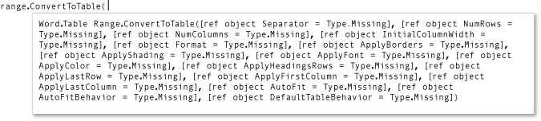

# How to use named and optional arguments in Office programming

Named arguments and optional arguments enhance convenience, flexibility, and readability in C# programming. In addition, these features greatly facilitate access to COM interfaces such as the Microsoft Office automation APIs.

> [!IMPORTANT]
> VSTO relies on the [.NET Framework](/dotnet/framework/get-started/overview). COM add-ins can also be written with the .NET Framework. Office Add-ins cannot be created with [.NET Core and .NET 5+](/dotnet/core/dotnet-five), the latest versions of .NET. This is because .NET Core/.NET 5+ cannot work together with .NET Framework in the same process and may lead to add-in load failures. You can continue to use .NET Framework to write VSTO and COM add-ins for Office. Microsoft will not be updating VSTO or the COM add-in platform to use .NET Core or .NET 5+. You can take advantage of .NET Core and .NET 5+, including ASP.NET Core, to create the server side of [Office Web Add-ins](/office/dev/add-ins/overview/office-add-ins).

In the following example, method [ConvertToTable](<xref:Microsoft.Office.Interop.Word.Range.ConvertToTable%2A>) has 16 parameters that represent characteristics of a table, such as number of columns and rows, formatting, borders, fonts, and colors. All 16 parameters are optional, because most of the time you don't want to specify particular values for all of them. However, without named and optional arguments, you must provide a value or a placeholder value. With named and optional arguments, you specify values only for the parameters required for your project.

You must have Microsoft Office Word installed on your computer to complete these procedures.

[!INCLUDE[note_settings_general](~/includes/note-settings-general-md.md)]

## Create a new console application

Start Visual Studio. On the **File** menu, point to **New**, and then select **Project**. In the **Templates Categories** pane, expand **C#**, and then select **Windows**. Look in the top of the **Templates** pane to make sure that **.NET Framework 4** appears in the **Target Framework** box. In the **Templates** pane, select **Console Application**. Type a name for your project in the **Name** field. Select **OK**. The new project appears in **Solution Explorer**.

## Add a reference

In **Solution Explorer**, right-click your project's name and then select **Add Reference**. The **Add Reference** dialog box appears. On the **.NET** page, select **Microsoft.Office.Interop.Word** in the **Component Name** list. Select **OK**.

## Add necessary using directives

In **Solution Explorer**, right-click the *Program.cs* file and then select **View Code**. Add the following `using` directives to the top of the code file:

:::code language="csharp" source="./snippets/NamedAndOptional/wordprogram.cs" id="Snippet4":::

## Display text in a Word document

In the `Program` class in *Program.cs*, add the following method to create a Word application and a Word document. The [Add](<xref:Microsoft.Office.Interop.Word.Documents.Add%2A>) method has four optional parameters. This example uses their default values. Therefore, no arguments are necessary in the calling statement.

:::code language="csharp" source="./snippets/NamedAndOptional/wordprogram.cs" id="Snippet6":::

Add the following code at the end of the method to define where to display text in the document, and what text to display:

:::code language="csharp" source="./snippets/NamedAndOptional/wordprogram.cs" id="Snippet7":::

## Run the application

Add the following statement to Main:

:::code language="csharp" source="./snippets/NamedAndOptional/wordprogram.cs" id="Snippet8":::

Press <kbd>CTRL</kbd>+<kbd>F5</kbd> to run the project. A Word document appears that contains the specified text.

## Change the text to a table
  
Use the `ConvertToTable` method to enclose the text in a table. The method has 16 optional parameters. IntelliSense encloses optional parameters in brackets, as shown in the following illustration.

Named and optional arguments enable you to specify values for only the parameters that you want to change. Add the following code to the end of method `DisplayInWord` to create a table. The argument specifies that the commas in the text string in `range` separate the cells of the table.

:::code language="csharp" source="./snippets/NamedAndOptional/wordprogram.cs" id="Snippet9":::

Press <kbd>CTRL</kbd>+<kbd>F5</kbd> to run the project.

## Experiment with other parameters

Change the table so that it has one column and three rows, replace the last line in `DisplayInWord` with the following statement and then type <kbd>CTRL</kbd>+<kbd>F5</kbd>.  

:::code language="csharp" source="./snippets/NamedAndOptional/wordprogram.cs" id="Snippet10":::

Specify a predefined format for the table, replace the last line in `DisplayInWord` with the following statement and then type <kbd>CTRL</kbd>+<kbd>F5</kbd>. The format can be any of the [WdTableFormat](<xref:Microsoft.Office.Interop.Word.WdTableFormat>) constants.

:::code language="csharp" source="./snippets/NamedAndOptional/wordprogram.cs" id="Snippet11":::

## Example

The following code includes the full example:

:::code language="csharp" source="./snippets/NamedAndOptional/wordprogram.cs" id="Snippet12":::
