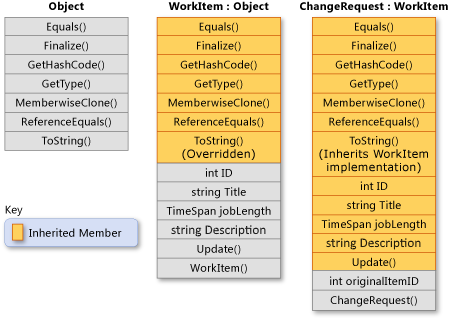

# Inheritance - derive types to create more specialized behavior

Inheritance, together with encapsulation and polymorphism, is one of the three primary characteristics of object-oriented programming. Inheritance enables you to create new classes that reuse, extend, and modify the behavior defined in other classes. The class whose members are inherited is called the *base class*, and the class that inherits those members is called the *derived class*. A derived class can have only one direct base class. However, inheritance is transitive. If `ClassC` is derived from `ClassB`, and `ClassB` is derived from `ClassA`, `ClassC` inherits the members declared in `ClassB` and `ClassA`.

> [!NOTE]
> Structs do not support inheritance, but they can implement interfaces.

Conceptually, a derived class is a specialization of the base class. For example, if you have a base class `Animal`, you might have one derived class that is named `Mammal` and another derived class that is named `Reptile`. A `Mammal` is an `Animal`, and a `Reptile` is an `Animal`, but each derived class represents different specializations of the base class.

Interface declarations may define a default implementation for its members. These implementations are inherited by derived interfaces, and by classes that implement those interfaces. For more information on default interface methods, see the article on [interfaces](../types/interfaces.md).

When you define a class to derive from another class, the derived class implicitly gains all the members of the base class, except for its constructors and finalizers. The derived class reuses the code in the base class without having to reimplement it. You can add more members in the derived class. The derived class extends the functionality of the base class.

The following illustration shows a class `WorkItem` that represents an item of work in some business process. Like all classes, it derives from <xref:System.Object?displayProperty=nameWithType> and inherits all its methods. `WorkItem` adds five members of its own. These members include a constructor, because constructors aren't inherited. Class `ChangeRequest` inherits from `WorkItem` and represents a particular kind of work item. `ChangeRequest` adds two more members to the members that it inherits from `WorkItem` and from <xref:System.Object>. It must add its own constructor, and it also adds `originalItemID`. Property `originalItemID` enables the `ChangeRequest` instance to be associated with the original `WorkItem` to which the change request applies.

The following example shows how the class relationships demonstrated in the previous illustration are expressed in C#. The example also shows how `WorkItem` overrides the virtual method <xref:System.Object.ToString%2A?displayProperty=nameWithType>, and how the `ChangeRequest` class inherits the `WorkItem` implementation of the method. The first block defines the classes:

:::code language="csharp" source="./snippets/inheritance/Inheritance.cs" ID="SnippetClasses":::

This next block shows how to use the base and derived classes:

:::code language="csharp" source="./snippets/inheritance/Program.cs" ID="SnippetUseClasses":::

## Abstract and virtual methods

When a base class declares a method as [`virtual`](../../language-reference/keywords/virtual.md), a derived class can [`override`](../../language-reference/keywords/override.md) the method with its own implementation. If a base class declares a member as [`abstract`](../../language-reference/keywords/abstract.md), that method must be overridden in any non-abstract class that directly inherits from that class. If a derived class is itself abstract, it inherits abstract members without implementing them. Abstract and virtual members are the basis for polymorphism, which is the second primary characteristic of object-oriented programming. For more information, see [Polymorphism](./polymorphism.md).

## Abstract base classes

You can declare a class as [abstract](../../language-reference/keywords/abstract.md) if you want to prevent direct instantiation by using the [new](../../language-reference/operators/new-operator.md) operator. An abstract class can be used only if a new class is derived from it. An abstract class can contain one or more method signatures that themselves are declared as abstract. These signatures specify the parameters and return value but have no implementation (method body). An abstract class doesn't have to contain abstract members; however, if a class does contain an abstract member, the class itself must be declared as abstract. Derived classes that aren't abstract themselves must provide the implementation for any abstract methods from an abstract base class.

## Interfaces

An *interface* is a reference type that defines a set of members. All classes and structs that implement that interface must implement that set of members. An interface may define a default implementation for any or all of these members. A class can implement multiple interfaces even though it can derive from only a single direct base class.

Interfaces are used to define specific capabilities for classes that don't necessarily have an "is a" relationship. For example, the <xref:System.IEquatable%601?displayProperty=nameWithType> interface can be implemented by any class or struct to determine whether two objects of the type are equivalent (however the type defines equivalence). <xref:System.IEquatable%601> doesn't imply the same kind of "is a" relationship that exists between a base class and a derived class (for example, a `Mammal` is an `Animal`). For more information, see [Interfaces](../types/interfaces.md).

## Preventing further derivation  

A class can prevent other classes from inheriting from it, or from any of its members, by declaring itself or the member as [`sealed`](../../language-reference/keywords/sealed.md).

## Derived class hiding of base class members  

A derived class can hide base class members by declaring members with the same name and signature. The [`new`](../../language-reference/keywords/new-modifier.md) modifier can be used to explicitly indicate that the member isn't intended to be an override of the base member. The use of [`new`](../../language-reference/keywords/new-modifier.md) isn't required, but a compiler warning will be generated if [`new`](../../language-reference/keywords/new-modifier.md) isn't used. For more information, see [Versioning with the Override and New Keywords](../../programming-guide/classes-and-structs/versioning-with-the-override-and-new-keywords.md) and [Knowing When to Use Override and New Keywords](../../programming-guide/classes-and-structs//knowing-when-to-use-override-and-new-keywords.md).
