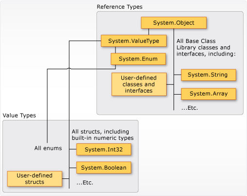

# The C# type system

C# is a strongly typed language. Every variable and constant has a type, as does every expression that evaluates to a value. Every method declaration specifies a name, the type and kind (value, reference, or output) for each input parameter and for the return value. The .NET class library defines built-in numeric types and complex types that represent a wide variety of constructs. These include the file system, network connections, collections and arrays of objects, and dates. A typical C# program uses types from the class library and user-defined types that model the concepts that are specific to the program's problem domain.

The information stored in a type can include the following items:

- The storage space that a variable of the type requires.
- The maximum and minimum values that it can represent.
- The members (methods, fields, events, and so on) that it contains.
- The base type it inherits from.
- The interface(s) it implements.
- The kinds of operations that are permitted.

The compiler uses type information to make sure all operations that are performed in your code are *type safe*. For example, if you declare a variable of type [`int`](../../language-reference/builtin-types/integral-numeric-types.md), the compiler allows you to use the variable in addition and subtraction operations. If you try to perform those same operations on a variable of type [`bool`](../../language-reference/builtin-types/bool.md), the compiler generates an error, as shown in the following example:

:::code language="csharp" source="../../programming-guide/types/snippets/index/Program.cs" ID="TypeSafeExample":::

> [!NOTE]
> C and C++ developers, notice that in C#, `bool` is not convertible to `int`.

The compiler embeds the type information into the executable file as metadata. The common language runtime (CLR) uses that metadata at run time to further guarantee type safety when it allocates and reclaims memory.

## Specifying types in variable declarations

When you declare a variable or constant in a program, you must either specify its type or use the [`var`](../../language-reference/keywords/var.md) keyword to let the compiler infer the type. The following example shows some variable declarations that use both built-in numeric types and complex user-defined types:

:::code language="csharp" source="../../programming-guide/types/snippets/index/Program.cs" ID="Declarations":::

The types of method parameters and return values are specified in the method declaration. The following signature shows a method that requires an `int` as an input argument and returns a string:

:::code language="csharp" source="../../programming-guide/types/snippets/index/Program.cs" ID="GetName":::

After you declare a variable, you can't redeclare it with a new type, and you can't assign a value not compatible with its declared type. For example, you can't declare an `int` and then assign it a Boolean value of `true`. However, values can be converted to other types, for example when they're assigned to new variables or passed as method arguments. A *type conversion* that doesn't cause data loss is performed automatically by the compiler. A conversion that might cause data loss requires a *cast* in the source code.

For more information, see [Casting and Type Conversions](../../programming-guide/types/casting-and-type-conversions.md).

## Built-in types

C# provides a standard set of built-in types. These represent integers, floating point values, Boolean expressions, text characters, decimal values, and other types of data. There are also built-in `string` and `object` types. These types are available for you to use in any C# program. For the complete list of the built-in types, see [Built-in types](../../language-reference/builtin-types/built-in-types.md).

## Custom types

You use the [`struct`](../../language-reference/builtin-types/struct.md), [`class`](../../language-reference/keywords/class.md), [`interface`](../../language-reference/keywords/interface.md), [`enum`](../../language-reference/builtin-types/enum.md), and [`record`](../../language-reference/builtin-types/record.md) constructs to create your own custom types. The .NET class library itself is a collection of custom types that you can use in your own applications. By default, the most frequently used types in the class library are available in any C# program. Others become available only when you explicitly add a project reference to the assembly that defines them. After the compiler has a reference to the assembly, you can declare variables (and constants) of the types declared in that assembly in source code. For more information, see [.NET Class Library](../../../standard/class-library-overview.md).

## The common type system

It's important to understand two fundamental points about the type system in .NET:

- It supports the principle of inheritance. Types can derive from other types, called *base types*. The derived type inherits (with some restrictions) the methods, properties, and other members of the base type. The base type can in turn derive from some other type, in which case the derived type inherits the members of both base types in its inheritance hierarchy. All types, including built-in numeric types such as <xref:System.Int32?displayProperty=nameWithType> (C# keyword: `int`), derive ultimately from a single base type, which is <xref:System.Object?displayProperty=nameWithType> (C# keyword: [`object`](../../language-reference/builtin-types/reference-types.md)). This unified type hierarchy is called the [Common Type System](../../../standard/base-types/common-type-system.md) (CTS). For more information about inheritance in C#, see [Inheritance](../object-oriented/inheritance.md).
- Each type in the CTS is defined as either a *value type* or a *reference type*. These types include all custom types in the .NET class library and also your own user-defined types. Types that you define by using the `struct` keyword are value types; all the built-in numeric types are `structs`. Types that you define by using the `class` or `record` keyword are reference types. Reference types and value types have different compile-time rules, and different run-time behavior.

The following illustration shows the relationship between value types and reference types in the CTS.

> [!NOTE]
> You can see that the most commonly used types are all organized in the <xref:System> namespace. However, the namespace in which a type is contained has no relation to whether it is a value type or reference type.

Classes and structs are two of the basic constructs of the common type system in .NET. C# 9 adds records, which are a kind of class. Each is essentially a data structure that encapsulates a set of data and behaviors that belong together as a logical unit. The data and behaviors are the *members* of the class, struct, or record. The members include its methods, properties, events, and so on, as listed later in this article.

A class, struct, or record declaration is like a blueprint that is used to create instances or objects at run time. If you define a class, struct, or record named `Person`, `Person` is the name of the type. If you declare and initialize a variable `p` of type `Person`, `p` is said to be an object or instance of `Person`. Multiple instances of the same `Person` type can be created, and each instance can have different values in its properties and fields.  
  
A class is a reference type. When an object of the type is created, the variable to which the object is assigned holds only a reference to that memory. When the object reference is assigned to a new variable, the new variable refers to the original object. Changes made through one variable are reflected in the other variable because they both refer to the same data.
  
A struct is a value type. When a struct is created, the variable to which the struct is assigned holds the struct's actual data. When the struct is assigned to a new variable, it's copied. The new variable and the original variable therefore contain two separate copies of the same data. Changes made to one copy don't affect the other copy.

Record types may be either reference types (`record class`) or value types (`record struct`).
  
In general, classes are used to model more complex behavior. Classes typically store data that is intended to be modified after a class object is created. Structs are best suited for small data structures. Structs typically store data that isn't intended to be modified after the struct is created. Record types are data structures with additional compiler synthesized members. Records typically store data that isn't intended to be modified after the object is created.

### Value types

Value types derive from <xref:System.ValueType?displayProperty=nameWithType>, which derives from <xref:System.Object?displayProperty=nameWithType>. Types that derive from <xref:System.ValueType?displayProperty=nameWithType> have special behavior in the CLR. Value type variables directly contain their values. The memory for a struct is allocated inline in whatever context the variable is declared. There's no separate heap allocation or garbage collection overhead for value-type variables. You can declare `record struct` types that are value types and include the synthesized members for [records](../../language-reference/builtin-types/record.md).

There are two categories of value types: `struct` and `enum`.

The built-in numeric types are structs, and they have fields and methods that you can access:

:::code language="csharp" source="../../programming-guide/types/snippets/index/Program.cs" ID="ConstantByte":::

But you declare and assign values to them as if they're simple non-aggregate types:

:::code language="csharp" source="../../programming-guide/types/snippets/index/Program.cs" ID="NonAggregateTypes":::

Value types are *sealed*. You can't derive a type from any value type, for example <xref:System.Int32?displayProperty=nameWithType>. You can't define a struct to inherit from any user-defined class or struct because a struct can only inherit from <xref:System.ValueType?displayProperty=nameWithType>. However, a struct can implement one or more interfaces. You can cast a struct type to any interface type that it implements. This cast causes a *boxing* operation to wrap the struct inside a reference type object on the managed heap. Boxing operations occur when you pass a value type to a method that takes a <xref:System.Object?displayProperty=nameWithType> or any interface type as an input parameter. For more information, see [Boxing and Unboxing](../../programming-guide/types/boxing-and-unboxing.md).

You use the [struct](../../language-reference/builtin-types/struct.md) keyword to create your own custom value types. Typically, a struct is used as a container for a small set of related variables, as shown in the following example:

:::code language="csharp" source="../../programming-guide/types/snippets/index/Program.cs" ID="Coords":::

For more information about structs, see [Structure types](../../language-reference/builtin-types/struct.md). For more information about value types, see [Value types](../../language-reference/builtin-types/value-types.md).

The other category of value types is `enum`. An enum defines a set of named integral constants. For example, the <xref:System.IO.FileMode?displayProperty=nameWithType> enumeration in the .NET class library contains a set of named constant integers that specify how a file should be opened. It's defined as shown in the following example:

:::code language="csharp" source="../../programming-guide/types/snippets/index/Program.cs" ID="EnumFileMode":::

The <xref:System.IO.FileMode.Create?displayProperty=fullName>  constant has a value of 2. However, the name is much more meaningful for humans reading the source code, and for that reason it's better to use enumerations instead of constant literal numbers. For more information, see <xref:System.IO.FileMode?displayProperty=nameWithType>.

All enums inherit from <xref:System.Enum?displayProperty=nameWithType>, which inherits from <xref:System.ValueType?displayProperty=nameWithType>. All the rules that apply to structs also apply to enums. For more information about enums, see [Enumeration types](../../language-reference/builtin-types/enum.md).

### Reference types

A type that is defined as a `class`, `record`, [`delegate`](../../language-reference/builtin-types/reference-types.md), array, or [`interface`](../../language-reference/keywords/interface.md) is a [`reference type`](../../language-reference/keywords/reference-types.md).

When declaring a variable of a [`reference type`](../../language-reference/keywords/reference-types.md), it contains the value [`null`](../../language-reference/keywords/null.md) until you assign it with an instance of that type or create one using the [`new`](../../language-reference/operators/new-operator.md) operator. Creation and assignment of a class are demonstrated in the following example:

:::code language="csharp" source="../../programming-guide/types/snippets/index/Program.cs" ID="DeclarationAndAssignment":::

An [`interface`](../../language-reference/keywords/interface.md) cannot be directly instantiated using the [`new`](../../language-reference/operators/new-operator.md) operator. Instead, create and assign an instance of a class that implements the interface. Consider the following example:

:::code language="csharp" source="../../programming-guide/types/snippets/index/Program.cs" ID="InterfaceDeclaration":::

When the object is created, the memory is allocated on the managed heap. The variable holds only a reference to the location of the object. Types on the managed heap require overhead both when they're allocated and when they're reclaimed. *Garbage collection* is the automatic memory management functionality of the CLR, which performs the reclamation. However, garbage collection is also highly optimized, and in most scenarios it doesn't create a performance issue. For more information about garbage collection, see [Automatic Memory Management](../../../standard/automatic-memory-management.md).

All arrays are reference types, even if their elements are value types. Arrays implicitly derive from the <xref:System.Array?displayProperty=nameWithType> class. You declare and use them with the simplified syntax that is provided by C#, as shown in the following example:

:::code language="csharp" source="../../programming-guide/types/snippets/index/Program.cs" ID="ArrayDeclaration":::

Reference types fully support inheritance. When you create a class, you can inherit from any other interface or class that isn't defined as [sealed](../../language-reference/keywords/sealed.md). Other classes can inherit from your class and override your virtual methods. For more information about how to create your own classes, see [Classes, structs, and records](../types/index.md). For more information about inheritance and virtual methods, see [Inheritance](../object-oriented/inheritance.md).

## Types of literal values

In C#, literal values receive a type from the compiler. You can specify how a numeric literal should be typed by appending a letter to the end of the number. For example, to specify that the value `4.56` should be treated as a `float`, append an "f" or "F" after the number: `4.56f`. If no letter is appended, the compiler will infer a type for the literal. For more information about which types can be specified with letter suffixes, see [Integral numeric types](../../language-reference/builtin-types/integral-numeric-types.md) and [Floating-point numeric types](../../language-reference/builtin-types/floating-point-numeric-types.md).

Because literals are typed, and all types derive ultimately from <xref:System.Object?displayProperty=nameWithType>, you can write and compile code such as the following code:

:::code language="csharp" source="../../programming-guide/types/snippets/index/Program.cs" ID="ConvertTypes":::

## Generic types

A type can be declared with one or more *type parameters* that serve as a placeholder for the actual type (the *concrete type*). Client code provides the concrete type when it creates an instance of the type. Such types are called *generic types*. For example, the .NET type <xref:System.Collections.Generic.List%601?displayProperty=nameWithType> has one type parameter that by convention is given the name `T`. When you create an instance of the type, you specify the type of the objects that the list will contain, for example, `string`:

:::code language="csharp" source="../../programming-guide/types/snippets/index/Program.cs" ID="GenericType":::

The use of the type parameter makes it possible to reuse the same class to hold any type of element, without having to convert each element to [object](../../language-reference/builtin-types/reference-types.md). Generic collection classes are called *strongly typed collections* because the compiler knows the specific type of the collection's elements and can raise an error at compile time if, for example, you try to add an integer to the `stringList` object in the previous example. For more information, see [Generics](generics.md).

## Implicit types, anonymous types, and nullable value types

You can implicitly type a local variable (but not class members) by using the [`var`](../../language-reference/keywords/var.md) keyword. The variable still receives a type at compile time, but the type is provided by the compiler. For more information, see [Implicitly Typed Local Variables](../../programming-guide/classes-and-structs/implicitly-typed-local-variables.md).

It can be inconvenient to create a named type for simple sets of related values that you don't intend to store or pass outside method boundaries. You can create *anonymous types* for this purpose. For more information, see [Anonymous Types](anonymous-types.md).

Ordinary value types can't have a value of [`null`](../../language-reference/keywords/null.md). However, you can create *nullable value types* by appending a `?` after the type. For example, `int?` is an `int` type that can also have the value [`null`](../../language-reference/keywords/null.md). Nullable value types are instances of the generic struct type <xref:System.Nullable%601?displayProperty=nameWithType>. Nullable value types are especially useful when you're passing data to and from databases in which numeric values might be `null`. For more information, see [Nullable value types](../../language-reference/builtin-types/nullable-value-types.md).

## Compile-time type and run-time type

A variable can have different compile-time and run-time types. The *compile-time type* is the declared or inferred type of the variable in the source code. The *run-time type* is the type of the instance referred to by that variable. Often those two types are the same, as in the following example:

:::code language="csharp" source="../../programming-guide/types/snippets/index/Program.cs" ID="CompileTimeType":::

In other cases, the compile-time type is different, as shown in the following two examples:

:::code language="csharp" source="../../programming-guide/types/snippets/index/Program.cs" ID="RuntimeTypes":::

In both of the preceding examples, the run-time type is a `string`. The compile-time type is `object` in the first line, and `IEnumerable<char>` in the second.

If the two types are different for a variable, it's important to understand when the compile-time type and the run-time type apply. The compile-time type determines all the actions taken by the compiler. These compiler actions include method call resolution, overload resolution, and available implicit and explicit casts. The run-time type determines all actions that are resolved at run time. These run-time actions include dispatching virtual method calls, evaluating `is` and `switch` expressions, and other type testing APIs. To better understand how your code interacts with types, recognize which action applies to which type.

## Related sections

For more information, see the following articles:

- [Builtin types](../../language-reference/builtin-types/built-in-types.md)
- [Value Types](../../language-reference/builtin-types/value-types.md)
- [Reference Types](../../language-reference/keywords/reference-types.md)

## C# language specification

[!INCLUDE[CSharplangspec](~/includes/csharplangspec-md.md)]
