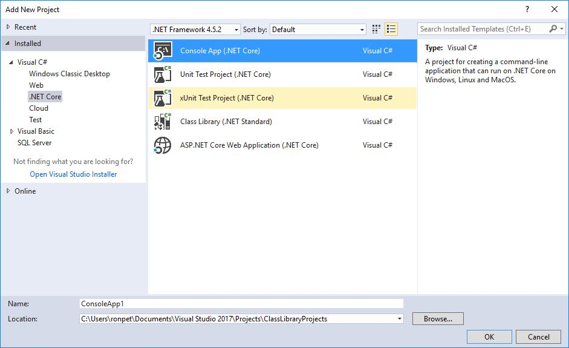
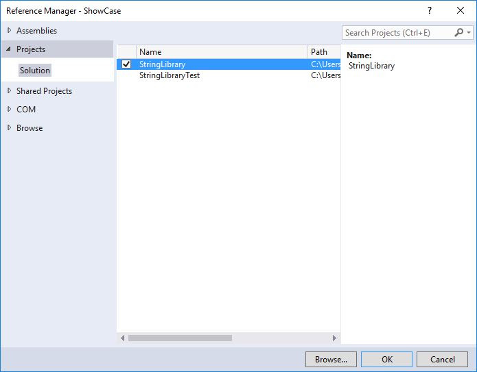

# Consuming a class library with .NET Core in Visual Studio 2017 #

Once you've followed the steps in [Building a C# class library with .NET Core in Visual Studio 2017](./library-with-visual-studio-2017.md) and [Testing a class library with .NET Core in Visual Studio 2017](testing-library-with-visual-studio.md) to build and test your class library, and you've built a Release version of the library, the next step is to make it available to callers. You can do this in two ways:

- If the library will be used by a single solution (for example, if it is a component in a single large application), you can simply include it as a project in your solution.

- If the library will be generally accessible, you can distribute it as a NuGet package.

## Including a library as a project in a solution ##

Just as we included unit tests in the same solution as our class library, we can include our application as part of that solution. For example, let's use our class library in a console application that prompts the user to enter a string and reports whether its first character is uppercase:

1. Open the `ClassLibraryProjects` solution created in the [Building a C# Class Library with .NET Core in Visual Studio 2017](./library-with-visual-studio-2017.md) topic, and in Solution Explorer, open the context menu for the **ClassLibraryProjects** node and choose **Add**, **New Project**.

1. In the **Add New Project** dialog, expand the **Visual C#** and **.NET Core** nodes, and choose the **Console App (.NET Core)** project template, as the following figure shows.

   

1. In the **Name** text box, enter `ShowCase`, and then choose the **OK** button.

1. In Solution Explorer, open the context menu for the **ShowCase** project node and choose **Set as StartUp Project**.

1. Initially our project doesn't have access to our class library. To allow it to call methods in our class library, in **Solution Explorer**, open the context menu for the **Dependencies** node in the **ShowCase** project  and choose **Add Reference**.

1. In the **Reference Manager** dialog, choose **StringLibrary**, our class library project, as the following figure shows, and then choose the **OK** button.

   

1. In the code window for the 'program.cs' file, replace all of the code with the following code:

 [!CODE-csharp[UsingClassLib#1](../../../samples/snippets/csharp/getting_started/with_visual_studio_2017/showcase.cs#1)]

   The code uses the [Console.WindowHeight](xref:System.Console.WindowHeight) property to determine how many rows the console window has. Whenever the [Console.CursorTop](xref:System.Console.CursorTop) property is greater than or equal to the total number of rows in the console window, the code clears the console window and redisplays a message to the user.

   The program itself just prompts the user to enter a string. It then indicates whether the string starts with an uppercase character. If the user presses the **Enter** key without entering a string, the console window closes and the application terminates.

1. If necessary, change the toolbar to compile the **Debug** release of the `ShowCase` project, as the following figure shows.

   

1. Compile and run the program by clicking the green arrow on the **ShowCase** button.

The application that uses this library can then be debugged and eventually published by following the steps listed in [Debugging your C# Hello World Application with Visual Studio 2017](debugging-with-visual-studio-2017.md) and [Publishing your Hello World Application with Visual Studio 2017](publishing-with-visual-studio-2017.md).

## Distributing the library in a NuGet package ##

You can make your class library more widely available by publishing it as a NuGet package. Visual Studio does not support the creation of NuGet packages. To create one, you use the [`dotnet.exe` command line utility](../../core/tools/dotnet.md) as follows:

1. Open a console window. For example, in the **Ask me anything** text box in the Windows taskbar, enter `Command Prompt`, and then choose the **Command Prompt** desktop app to open the console window.

1. Navigate to your library's project directory. Typically, unless you've reconfigured the file location, it is in the `Documents\Visual Studio 2017\Projects\ClassLibraryProjects\StringLibrary` directory. The directory contains your source code and a project file, `StringLibrary.csproj`.

1. Issue the command `dotnet.exe pack --no-build`. The `dotnet.exe` utility generates a package with a .nupkg extension.

   > [!TIP]
   > If the directory that contains `dotnet.exe` is not in your path, you can find its location by entering `where dotnet.exe` in the console window.

For more information on creating NuGet packages, see [How to Create a NuGet Package with Cross Platform Tools](../../core/deploying/creating-nuget-packages.md).