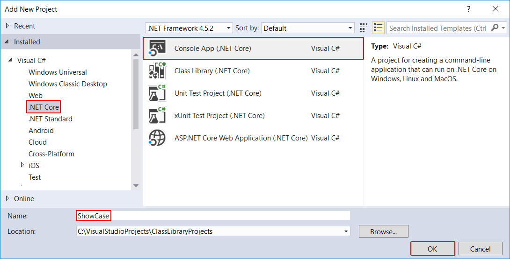

# Consuming a class library with .NET Core in Visual Studio 2017

Once you've followed the steps in [Building a C# class library with .NET Core in Visual Studio 2017](./library-with-visual-studio.md) and [Testing a class library with .NET Core in Visual Studio 2017](testing-library-with-visual-studio.md) to build and test your class library and you've built a Release version of the library, the next step is to make it available to callers. You can do this in two ways:

* If the library will be used by a single solution (for example, if it's a component in a single large application), you can include it as a project in your solution.

* If the library will be generally accessible, you can distribute it as a NuGet package.

## Including a library as a project in a solution

Just as you included unit tests in the same solution as your class library, you can include your application as part of that solution. For example, you can use your class library in a console application that prompts the user to enter a string and reports whether its first character is uppercase:

1. Open the `ClassLibraryProjects` solution you created in the [Building a C# Class Library with .NET Core in Visual Studio 2017](./library-with-visual-studio.md) topic. In **Solution Explorer**, right-click the **ClassLibraryProjects** solution and select **Add** > **New Project** from the context menu.

1. In the **Add New Project** dialog, select the **.NET Core** node followed by the **Console App (.NET Core)** project template. In the **Name** text box, type "ShowCase", and select the **OK** button.

   

1. In **Solution Explorer**, right-click the **ShowCase** project and select **Set as StartUp Project** in the context menu.

   

1. Initially, your project doesn't have access to your class library. To allow it to call methods in your class library, you create a reference to the class library. In **Solution Explorer**, right-click the `ShowCase` project's **Dependencies** node and select **Add Reference**.

   

1. In the **Reference Manager** dialog, select **StringLibrary**, your class library project, and select the **OK** button.

   

1. In the code window for the *Program.cs* file, replace all of the code with the following code:

 [!CODE-csharp[UsingClassLib#1](../../../samples/snippets/csharp/getting_started/with_visual_studio_2017/showcase.cs#1)]

   The code uses the [Console.WindowHeight](xref:System.Console.WindowHeight) property to determine the number of rows in the console window. Whenever the [Console.CursorTop](xref:System.Console.CursorTop) property is greater than or equal to the number of rows in the console window, the code clears the console window and displays a message to the user.

   The program prompts the user to enter a string. It indicates whether the string starts with an uppercase character. If the user presses the Enter key without entering a string, the application terminates, and the console window closes.

1. If necessary, change the toolbar to compile the **Debug** release of the `ShowCase` project. Compile and run the program by selecting the green arrow on the **ShowCase** button.

   

You can debug and publish the application that uses this library by following the steps in [Debugging your C# Hello World application with Visual Studio 2017](debugging-with-visual-studio.md) and [Publishing your Hello World Application with Visual Studio 2017](publishing-with-visual-studio.md).

## Distributing the library in a NuGet package

You can make your class library widely available by publishing it as a NuGet package. Visual Studio does not support the creation of NuGet packages. To create one, you use the [`dotnet` command line utility](../../core/tools/dotnet.md):

1. Open a console window. For example in the **Ask me anything** text box in the Windows taskbar, enter `Command Prompt` (or `cmd` for short), and open a console window by either selecting the **Command Prompt** desktop app or pressing Enter if it's selected in the search results.

1. Navigate to your library's project directory. Unless you've reconfigured the typical file location, it's in the *Documents\Visual Studio 2017\Projects\ClassLibraryProjects\StringLibrary* directory. The directory contains your source code and a project file, *StringLibrary.csproj*.

1. Issue the command `dotnet pack --no-build`. The `dotnet` utility generates a package with a *.nupkg* extension.

   > [!TIP]
   > If the directory that contains *dotnet.exe* is not in your PATH, you can find its location by entering `where dotnet.exe` in the console window.

For more information on creating NuGet packages, see [How to Create a NuGet Package with Cross Platform Tools](../../core/deploying/creating-nuget-packages.md).
