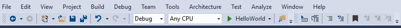
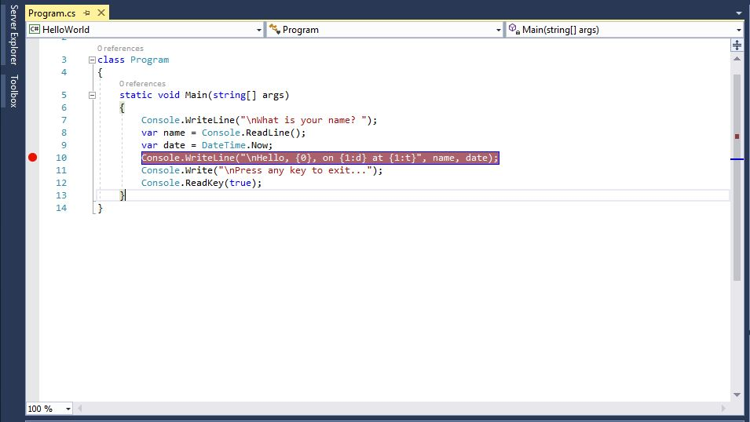
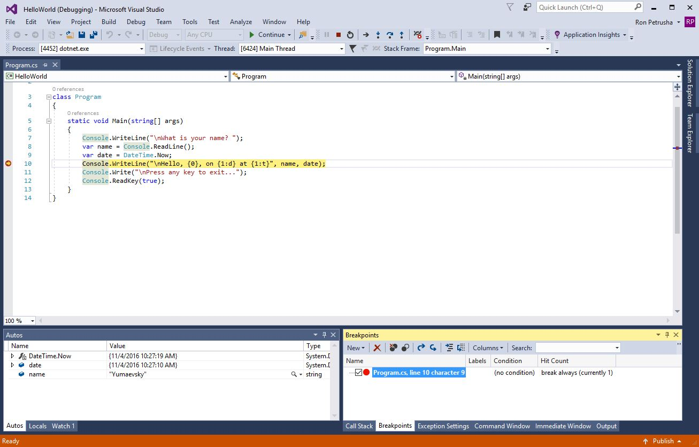
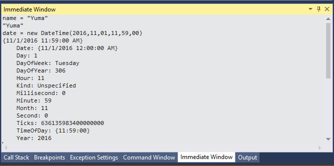
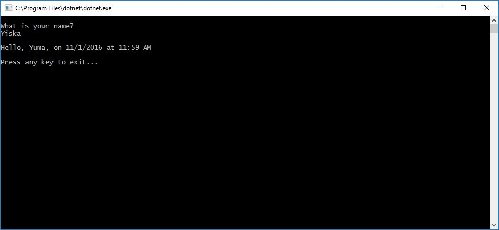
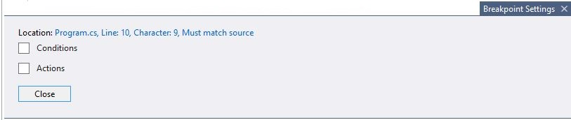
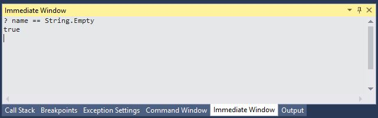
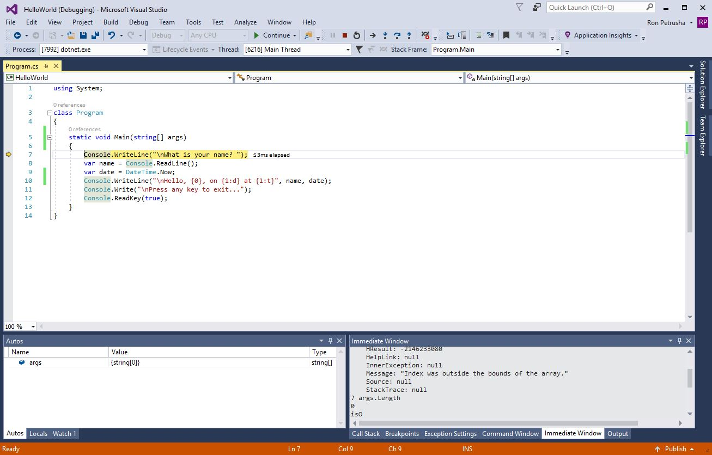
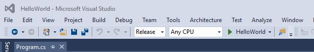

# Debugging your C# Hello World application with Visual Studio 2017 #

So far, you've followed the steps in [Building a c# Hello World Application with .NET Core in Visual Studio 2017](.\with-visual-studio-2017.md) to create and run a simple console application. Once you've written and compiled an application, you can begin testing it. Visual Studio includes a comprehensive set of debugging tools that you can use when testing and troubleshooting your application. Let's look at a few of them as we debug our application.

## Debugging in Debug mode ##

Debug mode is one of Visual Studio's two default build configurations. (The other is Release mode.) The current build configuration is shown on the toolbar. The following figure shows that our application will be compiled in Debug mode.

   

You should always start out by testing your program in Debug mode. Debug mode turns off most compiler optimizations and provides richer information in the symbol database file (.pdb file) output by the build process.

## Setting a breakpoint ##

Let's run our program in Debug mode and try a few debugging features:

1. Set a breakpoint by positioning the cursor on the line that reads `Console.WriteLine("\nHello, {0}, on {1:d} at {1:t}", name, date);` and clicking in the left margin of the code window or by choosing the **Debug**, **Toggle Breakpoint** menu item. (A breakpoint temporarily interrupts the execution of the application *before* the line with the breakpoint is executed.) As the following figure shows, Visual Studio indicates the line on which the breakpoint is set by highlighting it and displaying a red circle in its left margin.

   

1. Run the program in Debug mode by selecting the the "HelloWorld" button with the green arrow on the toolbar, pressing F5, or choosing **Debug**, **Start Debugging**.

1. Enter a string in the console window when the program prompts for a name and press Enter.

1. Program execution stops when it reaches the breakpoint and before the `Console.WriteLine` method executes. Visual Studio should look something like the following figure. Note that the **Autos** window displays the values of variables that are used around the current line. (The **Locals** window displays the values of variables that are defined in the method that is currently executing.)

   

1. Let's try to change the value of the variables to see how this affects our program. If the **Immediate window** is not visible, display it by choosing the **Debug**, **Windows**, **Immediate** menu item. The **Immediate window** lets you interact with the application you're debugging.

1. You can interactively change the values of variables. Enter `name = "Yuma"` in the immediate window and press the Enter key.

1. Enter `date = new DateTime(2016,11,01,11,59,00)` in the immediate window and press the Enter key.

   The following image shows the **Immediate  window**:

   

   Note that the window displays the value of the string variable and the properties of the @System.DateTime value. In addition, the value of the variables is updated in the **Autos** and **Locals** windows.

1. Continue program execution by selecting the **Continue** button in the toolbar, or by choosing the **Debug**, **Continue** menu item. The resulting console window should resemble the following image. Note that the values displayed in the console window also correspond to the changes we made in the **Immediate window**.

   

1. Press any key to exit the application and end Debug mode.

## Setting a conditional breakpoint ##

We now know that our program will correctly display the string that the user enters. But what happens if the user doesn't enter anything? We can test this and in the process use another debugging feature, the ability to set a conditional breakpoint.

To set a conditional breakpoint and test what happens when the user fails to enter a string, do the following:

1. Right-click on the red dot that represents the breakpoint. On the context menu, select **Conditions...**  to open the **Breakpoint Settings** dialog shown in the following figure.

   

1. In the text box that reads "e.g. x == 5", enter the following:

   ```cs
   String.IsNullOrEmpty(name)
   ```

   Here, we're testing for a code condition. We can also specify a hit count, which interrupts program execution before a statement is executed a specified number of times, or a filter condition, which interrupts program execution based on such attributes as thread identifier, process name, and thread name.

1. Choose the **Close** button to close the dialog.

1. Run the program in Debug mode.

1. In the console window, press the Enter key when prompted to enter your name.

1. Because the condition we specified has been satisfied -- `name` is either `null` or [String.Empty](xref:System.String.Empty) -- program execution stops when it reaches the breakpoint and before the `Console.WriteLine` method executes.

1. Choose the **Locals** window, which shows the values of variables that are local to the method that is currently executing, in this case the `Main` method.

1. Note that the value of the `name` variable is "", or [String.Empty](xref:System.String.Empty). Confirm this by entering the following statement in the **Immediate window**:

   ```cs
   ? name == String.Empty
   ```

   The following figure shows the result.

   

1. Choose the **Continue** button on the toolbar to continue program execution.

1. Press any key to close the console window and exit Debug mode.

1. Clear the breakpoint by clicking on the dot in the left margin of the code window, or by choosing the **Debug**, **Toggle Breakpoint** menu item.

## Stepping through a program ##

Visual Studio also allows us to step line by line through a program and monitor its execution. Ordinarily, you'd set a breakpoint and use this feature to follow program flow though a small part of your program code. Since our program is small, though, let's step through the entire program by doing the following:

1. On the menu bar, choose **Debug**, **Step Into**, or press the F11 key. Visual Studio highlights and displays an arrow beside the line of that will be executed next, as the following figure shows.

   

   At this point, the **Autos** window shows that our program has defined only one variable, `args`. Because we haven't passed any command line arguments to the program, its value is an empty string array. In addition, Visual Studio has opened a blank console window.

1. Choose **Debug**, **Step Into**, or press the F11 key. Visual Studio now highlights the next line to be execute. As the figure shows, it has taken 3 milliseconds to execute the code between the last statement and this one. `args` remains the only declared variable, and the console window is still blank.

   

1. Choose **Debug**, **Step Into**, or press the F11 key. Visual Studio hightlights the statement that includes the `name` variable assignment. The **Autos** window shows that `name` is `null`, and the console window displays the string "What is your name?".

1. Respond to the prompt by entering a string in the console window and pressing Enter. The console will be unresponsive, and the string you enter won't be displayed in the console window, but the [Console.ReadLine](xref:System.Console.ReadLine) method will nevertheless capture your input.

1. Choose **Debug**, **Step Into**, or press the F11 key. Visual Studio highlights the statement that includes the `date` variable assignment. The **Autos** window shows the [DateTime.Now](xref:System.DateTime.Now) property value and the value returned by the call to the [Console.ReadLine](xref:System.Console.ReadLine) method. The console window also displays the string entered when the console prompted for input.

1. Choose **Debug**, **Step Into**, or press the F11 key. The **Autos** window now shows the value of the `date` variable after the assignment from the [DateTime.Now](xref:System.DateTime.Now) property. The console window is unchanged.

1. Choose **Debug**, **Step Into**, or press the F11 key. Visual Studio calls the [Console.WriteLine](xref:System.Console.WriteLine(System.String,System.Object,System.Object)) method. The values of the `date` and `name` variables appear in the **Autos** window, and the console window displays the formatted string.

1. Choose **Debug**, **Step Out**, or press Shift and the F11 key. This stops step-by-step execution. The console window displays a message and waits for us to press a key.

1. Press any key to close the console window and exit Debug mode.

## Building a release version ##

Once you've tested the debug build of your application, you should also compile and test the release version. The release version incorporates compiler optimizations that can sometimes affect the behavior of an application. For example, compiler optimizations that are designed to improve performance can create race conditions in asynchronous or multithreaded applications.

To build and test the release version of your console application, change the build configuration on the toolbar from **Debug** to **Release**, as shown in the following figure.



When you press F5 or choose **Build Solution** from the **Build** menu, Visual Studio compiles the release version of your console application for you to test. You can then run and test it as you did the debug verison of the application.

Once you've finished debugging your application, the next step is to publish a distributable version of your application. For information about how to do this, see [Publishing the C# Hello World application with Visual Studio 2017](./publishing-with-visual-studio-2017.md).
