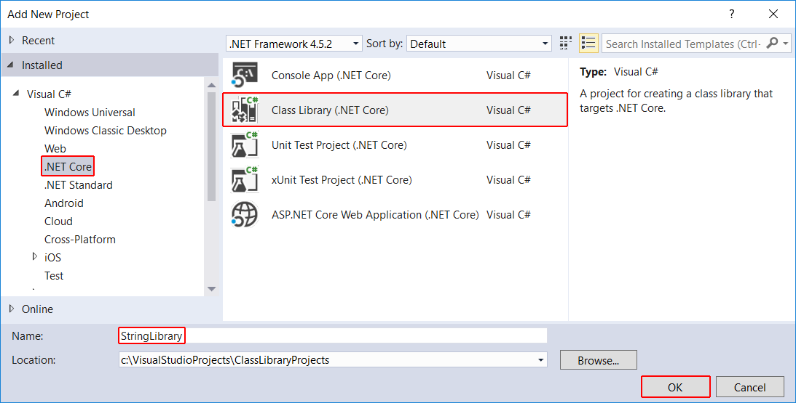

# Building a class library with C# and .NET Core in Visual Studio 2017

A *class library* defines types and methods that are called by an application. A class library developed using .NET Core supports the .NET Standard Library, which allows your library to be called by any .NET platform that supports that version of the .NET Standard Library. When you finish your class library, you can decide whether you want to distribute it as a third-party component or whether you want to include it as a bundled component with one or more applications.

> [!NOTE]
> For a list of the .NET Standard versions and the platforms they support, see [.NET Standard Library](../../standard/library.md).

In this topic, you'll create a simple utility library that contains a single string-handling method. You'll implement it as an [extension method](../../csharp/programming-guide/classes-and-structs/extension-methods.md) so that you can call it as if it were a member of the @System.String class.

## Creating a class library solution

Start by creating a solution for your class library project and its related projects. A Visual Studio Solution just serves as a container for one or more projects. To create the solution:

1. On the Visual Studio menu bar, choose **File** > **New** > **Project**.

1. In the **New Project** dialog, expand the **Other Project Types** node, and select **Visual Studio Solutions**. Name the solution "ClassLibraryProjects" and select the **OK** button.

   

## Creating the class library project

Create your class library project:

1. In **Solution Explorer**, right-click on the **ClassLibraryProjects** solution file and from the context menu, select **Add** > **New Project**.

1. In the **Add New Project** dialog, select the **.NET Core** node followed by the **Class Library (.NET Core)** project template. In the **Name** text box, enter "StringLibrary" as the name of the project. Select **OK** to create the class library project.

   

   

1. Replace the code in the code window with the following code and save the file:

   [!CODE-csharp[ClassLib#1](../../../samples/snippets/csharp/getting_started/with_visual_studio_2017/classlib.cs#1)]

   The class library, `UtilityLibraries.StringLibrary`, contains a method named `StartsWithUpper`, which returns a @System.Boolean value that indicates whether the current string instance begins with an uppercase character. The Unicode standard distinguishes uppercase characters from lowercase characters. In .NET Core, the [`Char.IsUpper`](xref:System.Char.IsUpper(System.Char)) method returns `true` if a character is uppercase.

1. On the menu bar, select **Build** > **Build Solution**. The project should compile without error.

   

## Next step

You've successfully built the library. Because you haven't called any of its methods, you don't know whether it works as expected. The next step in developing your library is to test it by using a [C# Unit Test Project](testing-library-with-visual-studio.md).
