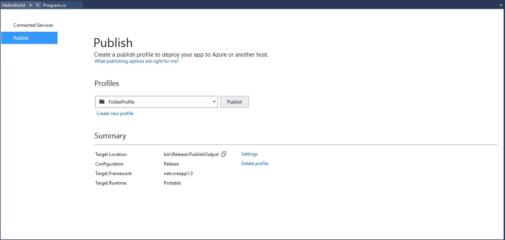
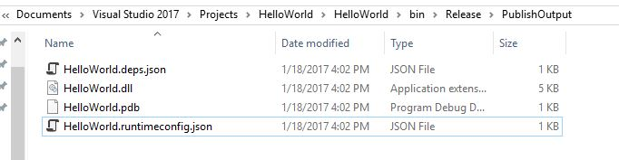

# Publishing your Hello World application with Visual Studio 2017

In [Building a C# Hello World application with .NET Core in Visual Studio 2017](with-visual-studio-2017.md), you built your Hello World console application, and in [Debugging your C# Hello World application with Visual Studio 2017](debugging-with-visual-studio-2017.md), you tested it using the Visual Studio debugger. Now that you're sure that it works as expected, you can publish it so that other users can run it. Publishing creates the set of files that are needed to run your application; you can deploy them by copying them to a target machine.

To publish and run your application: 

1. Make sure that Visual Studio is building the release version of your application. If necessary, change the build configuration setting on the toolbar from **Debug** to **Release**, as shown in the following figure.

   

1. Open a console window. For example, in the **Ask me anything** text box in the Windows taskbar, enter `Command Prompt`, and then choose the **Command Prompt** desktop app to open the console window.

1. Right-click on the HelloWorld project (not the HelloWorld solution) and select **Publish** from the menu. You can also select **Publish HelloWorld** from the main Visual Studio **Build** menu.

1. When the **Publish** dialog box shown in the following figure appears, create a new publising profile by selecting **Create new profile.**

1. In the **Pick a publishing target** dialog shown in the following figure, select the **OK** button to publish your application to your local file system. It will be found in the bin\release\PublishOutput subdirectory of your application's project directory.

1. Now that you've created a publishing profile, select the **Publish** button in the **Publish** dialog box, which is shown in the following figure.

   

1. As the following figure shows, the published output includes the following three files that form your application and that you can deploy by copying them to a target system:

      - HelloWorld.dll
   
      - HelloWorld.deps.json

      - HelloWorld.runtimeconfig.json

   A fourth file, HelloWorld.pdb, contains debug symbols. You do not have to distribute the file along with your application, although you should save it in the event that you need to debug the published version of your application.

   

The publishing process creates a framework-dependent deployment; the published application will run on any platform supported by .NET Core, as long as .NET Core is installed on the system. Users can run your application by issuing the `dotnet.exe HelloWorld.dll` command from a console window.

For more information on publishing and deploying .NET Core applications, see [.NET Core Application Deployment](../../core/deploying/index.md).
