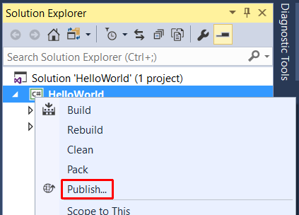

# Publishing your Hello World application with Visual Studio 2017

In [Building a C# Hello World application with .NET Core in Visual Studio 2017](with-visual-studio.md), you built a Hello World console application. In [Debugging your C# Hello World application with Visual Studio 2017](debugging-with-visual-studio.md), you tested it using the Visual Studio debugger. Now that you're sure that it works as expected, you can publish it so that other users can run it. Publishing creates the set of files that are needed to run your application, and you can deploy the files by copying them to a target machine.

To publish and run your application: 

1. Make sure that Visual Studio is building the Release version of your application. If necessary, change the build configuration setting on the toolbar from **Debug** to **Release**.

   

1. Right-click on the **HelloWorld** project (not the HelloWorld solution) and select **Publish** from the menu. You can also select **Publish HelloWorld** from the main Visual Studio **Build** menu.

   

1. In the **HelloWorld** publish window, the default publish output folder is supplied for you in the **Choose a folder** text box. Select the **Publish** button.

   

1. Open a console window. For example in the **Ask me anything** text box in the Windows taskbar, enter `Command Prompt` (or `cmd` for short), and open a console window by either selecting the **Command Prompt** desktop app or pressing Enter if it's selected in the search results.

1. Navigate to the published application in the `bin\release\PublishOutput` subdirectory of your application's project directory. As the following figure shows, the published output includes the following four files:

      * *HelloWorld.deps.json*
      * *HelloWorld.dll*
      * *HelloWorld.pdb* (optional for deployment)
      * *HelloWorld.runtimeconfig.json*

   The *HelloWorld.pdb* file contains debug symbols. You aren't required to deploy this file along with your application, although you should save it in the event that you need to debug the published version of your application.

   

The publishing process creates a framework-dependent deployment, which is a type of deployment where the published application will run on any platform supported by .NET Core with .NET Core installed on the system. Users can run your application by issuing the `dotnet HelloWorld.dll` command from a console window.

For more information on publishing and deploying .NET Core applications, see [.NET Core Application Deployment](../../core/deploying/index.md).