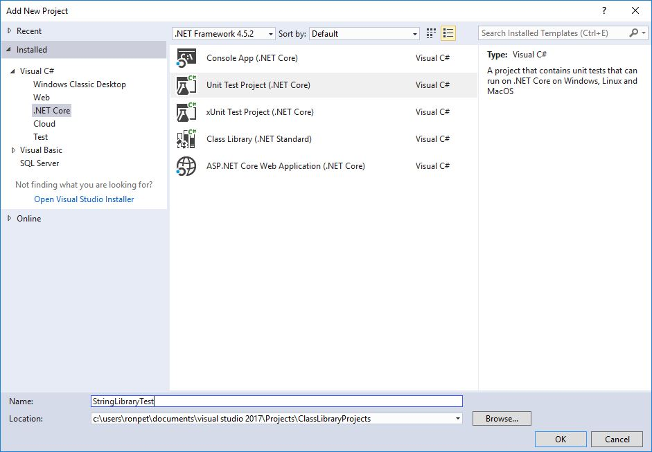
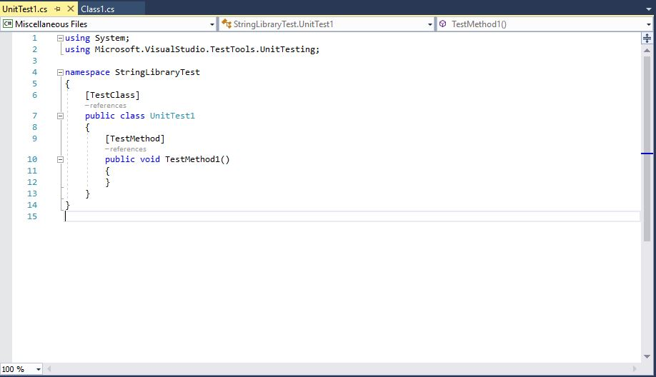
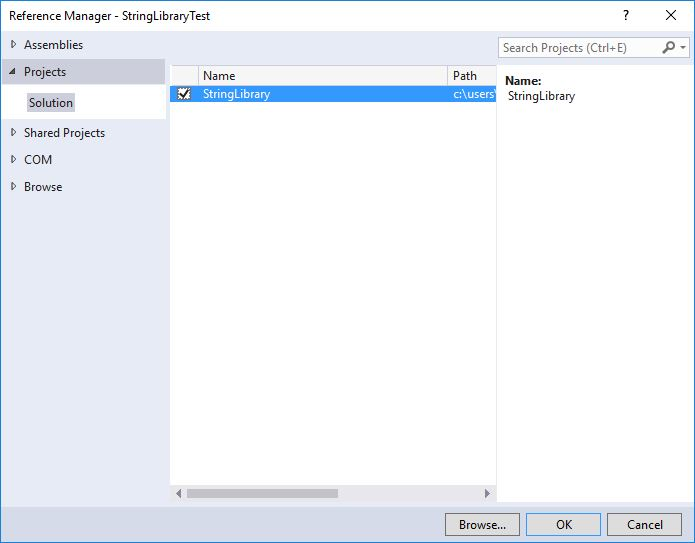
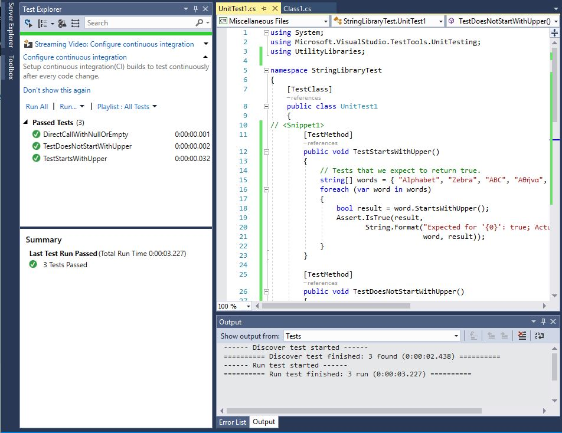
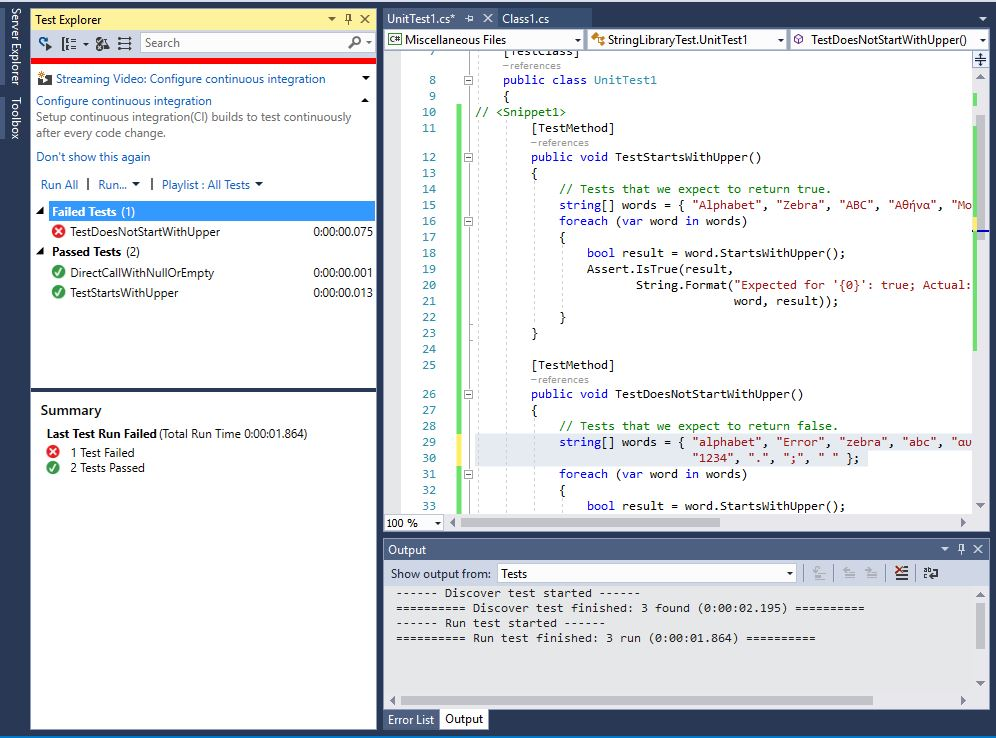
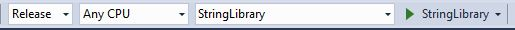

# Testing a class library with .NET Core in Visual Studio 2017 #

In [Building a class library with C# and .NET Core in Visual Studio 2017](library-with-visual-studio-2017.md), we created a simple class library that adds an extension method to the @System.String class. Now, we'll create a unit test to make sure that it works as expected. We'll add our unit test project to the solution we created in the previous topic.

## Creating a unit test project ##

To create the unit test project, do the following:

1. In Solution Explorer, open the context menu for the **ClassLibraryProject** solution node, and choose **Add**, **New Project**.

   <!-- Need a VS 2017 version  [!NOTE] In addition to a Unit Test project, you can also use Visual Studio to create an XUnit test project for .NET Core. For a walkthrough that includes an XUnit test project, see [Getting started with .NET Core on Windows, using Visual Studio 2015](../../core/tutorials/using-on-windows.md). --> 

1. In the **Add New Project** dialog box, expand the **Visual C#** node and the **.NET Core** node, then choose the **Unit Test Project (.NET Core)** project template and name it `StringLibraryTest`, as the following figure shows.

   

1. Choose the **OK** button to create the project. Visual Studio creates the project and opens the `UnitTest1.cs` file in the code window, as the following figure shows.

   

   The source code created by the unit test template does the following:

   - It imports the [Microsoft.VisualStudio.TestTools.UnitTesting](https://msdn.microsoft.com/library/microsoft.visualstudio.testtools.unittesting.aspx) namespace, which contains the types used for unit testing.

   - It applies the [\[TestClass\]](https://msdn.microsoft.com/library/microsoft.visualstudio.testtools.unittesting.testclassattribute.aspx) attribute to the `UnitTest1` class. Each test method in a test class tagged with the \[TestMethod\] attribute will be executed automatically when the unit test is run.

   - It applies the [\[TestMethod\]](https://msdn.microsoft.com/library/microsoft.visualstudio.testtools.unittesting.testmethodattribute.aspx) attribute to define `TestMethod1` as a test method to be automatically executed when the unit test is run.

1. In Solution Explorer, open the context menu for the **Dependencies** node of the **StringLibraryTest** project and choose **Add Reference**. This adds a reference to our class library project, `StringLibrary`. 

1. In the **Reference Manager** dialog, expand the **Projects** node and choose **Solution**, and then check the box next to **StringLibrary**, as the following figure shows. Adding a reference to the `StringLibrary` assembly allows the compiler to resolve calls to **StringLibrary** methods.

   

1. Click the **OK** button to close the **Reference Manager** dialog.

## Adding and running unit test methods ##

When Visual Studio runs a unit test, it executes each method marked with the [\[TestMethod\]](https://msdn.microsoft.com/library/microsoft.visualstudio.testtools.unittesting.testmethodattribute.aspx) attribute in a unit test class (the class to which the  [\[TestClass\]](https://msdn.microsoft.com/library/microsoft.visualstudio.testtools.unittesting.testclassattribute.aspx) attribute is applied. A test method ends when the first failure is encountered, or when all tests contained in the method have succeeded.

The most common tests call members of the [Assert](https://msdn.microsoft.com/library/microsoft.visualstudio.testtools.unittesting.assert.aspx) class. Many assert methods include at least two parameters, one of which is the expected test result and the other of which is the actual test result. Some of its most frequently called methods include:

- `Assert.AreEqual`, which verifies that two values or objects are equal. The assert fails if the values or objects are not equal.

- `Assert.AreSame`, which verifies that two object variables refer to the same object. The assert fails if the variables refer to different objects.

- `Assert.IsFalse`, which verifies that a condition is False. The assert fails if the condition is True.

- `Assert.IsNotNull`, which verifies that an object is not `null`. The assert fails if the object is `null`.

In addition, the [\[ExpectedException\]](https://msdn.microsoft.com/library/microsoft.visualstudio.testtools.unittesting.expectedexceptionattribute.aspx) attribute can be used to indicate the type of exception a test method is expected to throw. You use it to test conditions that should result in an exception. The test fails if the specified exception is not thrown.

In testing the `StringLibrary.StartsWithUpper` method, we want to provide a number of strings that begin with an uppercase character. We expect the method to return `True` in these cases, so we can call the [Assert.IsTrue(Boolean, String)](https://msdn.microsoft.com/library/ms243754.aspx) method. Similarly, we want to provide a number of strings that begin with something other than an uppercase character. We expect the method to return False in these cases, so we can call the [Assert.IsFalse(Boolean, String)](https://msdn.microsoft.com/library/ms243805.aspx) method.

Since our library method handles strings, we also want to make sure that it successfully handles an [empty string](xref:System.String.Empty) (a valid string that has no characters and whose @System.String.Length is 0) and a `null` string (a string that has not been initialized). If `StartsWithUpper` is called as an extension method on a @System.String instance, it cannot be passed a `null` string. However, it can also be called directly as a static method and passed a single @System.String argument.

We'll define three methods, each of which calls its [Assert](https://msdn.microsoft.com/library/microsoft.visualstudio.testtools.unittesting.assert.aspx) method repeatedly for each element in a string array. Because the test method fails as soon as it encounters the first failure, we'll call a method overload that allows us to pass a string that indicates the string value used in the method call.

To create the the test methods:

1. Replace the code in the code window with the following code:

   [!CODE-csharp[Test#1](../../../samples/snippets/csharp/getting_started/with_visual_studio_2017/testlib1.cs#1)]

   Note that our test of uppercase characters in the `TestStartsWithUpper` method includes the Greek capital letter alpha (U+0391) and the Cyrillic capital letter EM (U+041C), and the test of lowercase characters in the `TestDoesNotStartWithUpper` method includes the Greek small letter alpha (U+03B1) and the Cyrillic small letter Ghe (U+0433).

1. On the menu bar, choose **File**, **Save UnitTest1.cs As...**. In the **File Save As** dialog, choose the arrow beside the **Save** button, and then choose **Save with Encoding...***.

1. In the Confirm Save As dialog, choose the **Yes** button to save the file.

1. From the **Encoding** drop-down list of the **Advanced Save Options** dialog, choose **Unicode (UTF-8 with signature) - Codepage 65001**, and then choose **OK**.

   If you fail to save your source code in a UTF8-encoded file, Visual Studio may save it as an ASCII file. In that case, the runtime will not accurately decode characters outside the ASCII range, and the test results will not be accurate.

1. On the menu bar, choose **Test**, **Run**, **All Tests**. The **Test Explorer** window should open and show that both tests have run successfully, as the following figure shows. Note that the three tests are listed in the **Passed Tests** section, and the **Summary** section reports the result of the test run.

   

## Handling test failures ##

Our test run had no failures, so let's change it slightly so that one of the test methods fails:

1. Modify the `words` array in the `TestDoesNotStartWithUpper` method to include the string "Error", so that the statement reads as follows:

   ```cs
   string[] words = { "alphabet", "Error", "zebra", "abc", "αυτοκινητοβιομηχανία", "государство",
                      "1234", ".", ";", " " };
   ```

1. Run the test by choosing **Test**, **Run**, **All Tests**. The **Test Explorer** window now indicates that two tests have succeeded and one failed, as the following figure shows.

   

1. Choose the failed test, `TestDoesNotStartWith`, in the **Failed Tests** section. The lower pane of the **Test Explorer** displays the message produced by the assert: "Assert.IsFalse failed. Expected for 'Error': false; actual: True", as the following figure of **Test Explorer** shows. Because of the failure, all strings in the array after "Error" were not tested.

   

1. Remove the code that was added (`"Error", `) and rerun the test. It should now pass.

## Testing the Release version of the library ##

We've been running our tests against the Debug version of the library. Now that our tests have all passed and we've adequately tested our library, we should run the tests an additional time against the Release build of the library. A number of factors, including compiler optimizations, can sometimes produce different behavior between Debug and Release builds.

To test the Release build:

1. In the Visual Studio toolbar, change the build configuration from **Debug** to **Release**. The following figure shows a portion of the toolbar.

   

1. In **Solution Explorer**, open the context menu for the **StringLibrary** project node and choose **Build** to recompile the library.

1. Re-run the unit tests by choosing **Test**, **Run**, **All Tests** from the Visual Studio menu. The tests should all pass.

Now that you've finished testing your library, the next step is to make it available to callers. You can bundle it with one or more applications, or you can distribute it as a NuGet package. For information about how to do this, see [Consuming a .NET Standard Class Library](./consuming-library-with-visual-studio-2017.md).
