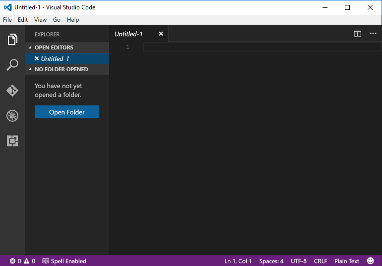
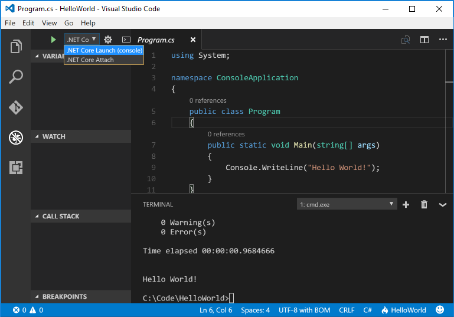

# Getting Started with Visual Studio Code

.NET Core gives you a fast and modular platform for creating server applications that run on Windows, Linux and macOS. Use Visual Studio Code with the C# extension to get a powerful editing experience with full support for C# IntelliSense (smart code completion) and debugging.

## Getting Started

1. Install [Visual Studio Code](https://code.visualstudio.com/).
2. Install [.NET Core](https://microsoft.com/net/core).
3. Install the [C# extension](https://marketplace.visualstudio.com/items?itemName=ms-vscode.csharp) from the VS Code Marketplace.

## Hello World

If you'd like to get started with a simple "Hello World" program on .NET Core, follow the steps below:

1. Open a project:

    * Open VS Code.
    * Go to the File Explorer Tab on the left.
    * Open the folder you want your C# project to be in.

  

2. Initialize a C# project:
    * Open the command prompt (or terminal). You can open the terminal from VS Code by typing <kbd>CTRL</kbd>+<kbd>`</kbd> (Back Tick)
    * Type `dotnet new`
    * This creates a `Program.cs` file in your folder with a simple "Hello World" program already written.

  

3. Resolve the build assets by typing `dotnet restore`

    * Running `restore` pulls down the required packages declared in the `project.json` file.
    * You'll see a new `project.lock.json` file in your project folder.
    * This file contains information about your project's dependencies to make subsequent restores quicker.

> Tip: If you are using the MSBuild-based .NET Core Tools a .csproj will be created instead of a project.json, but the `dotnet` commands remain the same. [Read more](https://blogs.msdn.microsoft.com/dotnet/2016/11/16/announcing-net-core-tools-msbuild-alpha/).

  

4. Run the "Hello World" program by typing `dotnet run`

  

You can also watch a short video tutorial for further setup help on [Windows](https://channel9.msdn.com/Blogs/dotnet/Get-started-with-VS-Code-using-CSharp-and-NET-Core), [macOS](https://channel9.msdn.com/Blogs/dotnet/Get-started-with-VS-Code-using-CSharp-and-NET-Core-on-MacOS), or [Linux](https://channel9.msdn.com/Blogs/dotnet/Get-started-with-VS-Code-Csharp-dotnet-Core-Ubuntu).

## Debug
1. Open Program.cs by clicking on it. The first time you open a C# file in VS Code omnisharp will load in the editor.

  
2. Open the Debug tab on the left side. The icon is a bug with a cancel line through it.
    * You can also open the Debug tab by selecting View > Debug

  
2. Locate the green arrow at the top of the pane. Make sure the drop down next to it has `.NET Core Launch (console)` selected.

  
3. Add a breakpoint to your project by clicking in the space left of the line numbers in the editor.

  
4. Hit F5 or the green arrow to start debugging. The debugger stops execution of your program when it reaches the breakpoint you set in (3) above.
    * While debugging you can view your local variables in the top left pane or use the debug console.

  
6. Hit the green arrow at the top to continue debugging or press the red square to stop.

